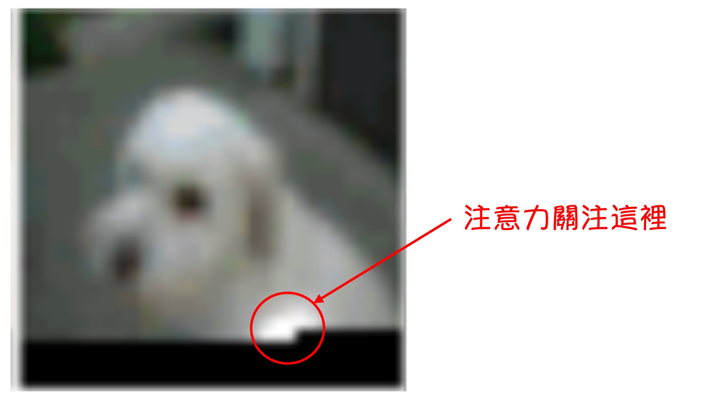

## 疎な注意機構

[**Generating Long Sequences with Sparse Transformers**](https://arxiv.org/abs/1904.10509)

---

Transformer の自己注意機構の計算複雑度は$O(n^2)$です。

このような計算複雑度が発生すると、そのアルゴリズムには非常に多くの最適化の余地があることを意味します。

OpenAI は基礎研究において多大な努力をしており、その一つが本論文で提案された Sparse Transformer です。

## 問題の定義

元々の Transformer モデルが実際のシナリオでどのように注意機構を運用しているのかを研究するため、研究者は最初に画像生成モデルを作成しました。

このモデルは Decoder-Only の Transformer アーキテクチャを基にしており、画像を Patch に分割し、これらの Patch を入力シーケンスとして、Transformer を通じて画像を生成します。

モデルは 128 層で、CIFAR-10 データセットでトレーニングされ、実験結果は上図の通りです。この図は本研究において非常に重要で、研究の出発点となるものです。

---

上図では、白い光の斑点が見られます。これは著者がモデルの注意図を可視化した結果です。黒い部分はまだデコードされていない部分で、黒い境界線が「現在デコード中の Token」を示しており、白い光の斑点はその「デコード中の Token」が注目している範囲です。

ここではいくつかの部分に分けて分析します：

### 最前面の数層

最前面の数層では、モデルの注意範囲が「デコード中の Token」の周囲に集中しています。これは畳み込みニューラルネットワーク（CNN）の受容野に似ています。

:::tip
画像の解像度が低いわけではなく、CIFAR-10 の画像解像度自体が 32x32 です。
:::

### 19〜20 層

第 19 層と第 20 層では、ネットワークが注意を行と列に分散させる方法を学習し、これにより全体的な注意計算を効果的に分解しています。

### 特定されない層

いくつかの層では、注意範囲が非常に広いことがわかります。これはこれらの層が全体的な視野を持っていることを意味します。

### 64〜128 層

ここではモデルの半分の層が占められています。後半部分において、これらの層の注意は非常に疎で、ほとんどがアクティブになっていません。

:::info
OpenAI は動的な画像展示も提供しています：

- [**Sparse Transformer - OpenAI Blog**](https://openai.com/index/sparse-transformer/)
  :::

---

この実験結果が示唆することは以下の通りです：

- **Transformer において、注意機構はすべての Token がすべての Token に注目する必要はなく、グローバルな注意を重ねることは非常に無駄である。**

## 解決問題

解決すべき問題のアプローチは次のようになります：モデルがすべての Token ではなく、特定の Token に選択的に注目できるメカニズムが必要です。

上図 (a) は元の Transformer を示しており、(b) と (c) は著者が試みた Sparse Transformer のアーキテクチャです。上の小さい図は図中の注意の分布を示しており、大きい図はこれらの注意を N x N の行列に展開したものです。

おそらく、上三角部分が空白であることに気づくでしょう。これは Decoder-Only モデルであるため、各 Token は自分以前の Token のみを注目する必要があるからです。

### 解法アプローチ 1: 固定ステップサイズ

これは上図 (b) のアーキテクチャに相当し、このアーキテクチャは先ほど言及した実験結果に基づいています：

- 注目するべきは前のいくつかの Token、つまり行部分です。
- 注目するべきは最初の$a \times N$個の Token、つまり列部分です（例えば前の 6, 18, 24,...個の Token など）。

### 解法アプローチ 2: 特定のインデックスの Token を固定

これは上図 (c) のアーキテクチャに対応しており、「固定ステップサイズ」アプローチは「画像」のように固定された 2 次元構造を持つデータには有効ですが、テキストや音声のようなデータには適用できません。そのため、著者は「特定のインデックスの Token」を固定するアプローチを提案しました。

このアプローチの目的は、特定のインデックスの Token を「アンカー」として使用し、モデルがこれらの「アンカー」に情報を集約した後、層を重ねる過程でほぼ全体的な注意の効果を達成することです。

### 修正された注意機構

上記の設計理念を理解した後、論文で言及されている数式は非常に直感的になります：

1. **注意 (Attention)**

   - $ \text{Attend}(X, S) = a(x_i, S_i), i \in \{1, \ldots, n\} $

2. **注意重み関数 (Attention weight function)**

   - $ a(x_i, S_i) = \text{softmax} \left( \frac{(W_q x_i) (K_S)^T}{\sqrt{d}} \right) V_S $

3. **キーとバリュー (Key and Value)**

   - $ K_S = W_k x_j, j \in S_i $
   - $ V_S = W_v x_j, j \in S_i $

ここで、$W_q$, $W_k$, $W_v$はそれぞれクエリ (Query)、キー (Key)、バリュー (Value) の重み行列です。

簡単に言うと、元々の注意機構から特定の Token を選び出して、そこから注意重みを計算します。

### その他の最適化

上記の注意機構の最適化に加え、論文ではいくつかの他の最適化方法についても言及されています：

1. **チェックポイント技術の導入**

   チェックポイント技術の基本的な原理は、順伝播の過程で中間活性化値をすべて保存するのではなく、重要な活性化値だけを保存するというものです。逆伝播時に保存された活性化値を基に、廃棄された中間活性化値を再計算します。これにより、メモリ使用量が減少しますが、再計算が必要になるため計算量は増加します。

   この技術は次の論文に基づいています：

   - [**Training deep nets with sublinear memory cost (2016.04)**](https://arxiv.org/abs/1604.06174)

   この技術の目的は、モデルのメモリ使用量を削減し、より深いネットワークを訓練できるようにすることです。

2. **位置埋め込み (Position Embedding) の重要性**

   著者は、データ構造の注意パターンをエンコードする位置埋め込みがモデルのパフォーマンスに非常に重要であることを発見しました。

   - **画像データの場合**

     著者は$d_{\text{data}} = 3$を使用し、これにより各入力 Token の行、列、チャンネルの位置が対応します。

   - **テキストと音声データの場合**

     著者は$d_{\text{attn}} = 2$を使用し、インデックスは行と列のインデックスに対応します。

   この埋め込み方法により、モデルは異なるデータタイプの空間的または構造的情報を効果的にキャプチャでき、全体的な性能が向上しました。

3. **混合精度 (Mixed Precision)**

   著者はネットワークの重みを単精度浮動小数点で保存し、ネットワークの活性化と勾配計算を半精度で行っています。勾配計算中に動的損失スケーリングを使用して数値のオーバーフローを減少させ、複数の GPU で平均を取る際に半精度の勾配を伝送します。サンプリング時には、クエリとキーを単精度に変換します。なぜなら、クエリとキーの積は半精度の最大値を超えることがあるからです。

### 訓練設定

- Adam 最適化器を使用。
- 5000 回のイテレーションで線形ウォームアップを行う。
- 勾配クリッピングは 1.0 を使用。
- 重み減衰ペナルティは 0.01。
- 学習率は余弦減衰に基づいてスケジュール。
- 訓練は 8 つの V100 GPU で実行。
- コンテンツ埋め込み$W_e$は$\mathcal{N}(0, \sqrt{0.125/d})$で初期化。
- 位置埋め込みは$\mathcal{N}(0, \sqrt{0.125 / (d \cdot n_{\text{emb}} )})$で初期化。
- 注意機構と FFN コンポーネント内のすべてのバイアスは 0 で初期化。
- すべての重みは$\mathcal{N}(0, \sqrt{0.125/d_{\text{in}}})$で初期化。
- 出力 logits の重み行列は 0 で初期化。

## 討論

### CIFAR-10

テストセットで 2.80 Bits per byte を達成し、従来の最先端の 2.85 を超えました。

- **モデル構成**：
  - ヘッド数：2
  - 層数：128
  - 埋め込み次元$d = 256$
  - 半サイズの前処理ネットワークとクエリ・キーのプロジェクション
- **トレーニングパラメータ**：
  - 学習率：0.00035
  - ドロップアウト率：0.25
  - 120 エポックのトレーニング、検証誤差が減少しなくなるまで
- **データ分割**：
  - トレーニングセット：48,000 サンプル
  - 検証セット：2,000 サンプル

### EnWik8

モデルは 0.99 Bits per byte を達成し、同じサイズの Transformer-XL の最先端 0.03 を超え、2 倍以上のパラメータを使って訓練されたモデルと同じ 0.99 を達成しました。

- **モデル構成**：
  - 30 層（固定）
  - ヘッド数：8
  - 埋め込み次元$d = 512$
  - ドロップアウト率：0.40
- **トレーニングパラメータ**：
  - 80 エポックのトレーニング、検証損失が減少しなくなるまで
  - コンテキスト長：12,288
  - ステップサイズ：128
- **データ分割**：
  - トレーニングセット：最初の 9,000 万 Token
  - 検証セットとテストセット：最後の 1,000 万 Token

### ImageNet 64x64

モデルが長期依存関係を学習し、大規模データセットに拡張できるかをテストするため、著者は ImageNet のサンプルバージョンで訓練し、検証セットで評価しました。

モデルは検証セットで 3.44 Bits per byte を達成し、従来の 3.52 より向上しました。

視覚的な評価では、著者はほとんどの画像で長期的な構造の証拠を確認しました。

- **モデル構成**：
  - 48 層（ストライド付き）
  - ヘッド数：16
  - 埋め込み次元$d = 512$
  - 総パラメータ数：1.52 億
- **トレーニングパラメータ**：
  - ステップサイズ：128
  - ドロップアウト率：0.01
  - 70 エポックのトレーニング
  - 64 の V100 GPU を使用、トレーニング時間は 7 日間

## 結論

Sparse Transformer は、自然画像、テキスト、そして生の音声を含むさまざまなデータタイプで適用効果を示し、その結果、モデルは従来の Transformer と同等またはそれ以上のパフォーマンスを達成し、計算操作を大幅に削減しました。

この研究成果は後続の研究でより広く適用され、発展しました。後で再びこの論文に出会うことになるでしょう。
