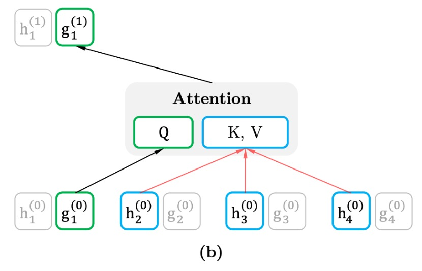
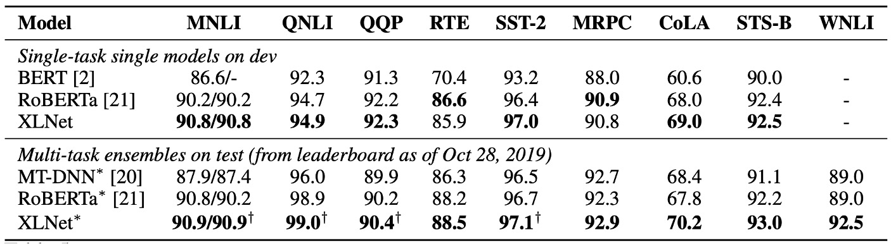

## 双流注意機構

[**XLNet: Generalized Autoregressive Pretraining for Language Understanding**](https://arxiv.org/abs/1906.08237)

---

BERT の成功は、後続の研究者たちに多くの研究の余地を提供しました。

以前、論文の著者たちは **Transformer-XL** を発表し、長距離依存関係を捉える新しい Transformer アーキテクチャを提案しました。

- [**[19.01] Transformer-XL: より長いコンテキスト**](../1901-transformer-xl/index.md)

しかし、著者たちはこれでは不十分だと考えたようです。なぜなら、Transformer-XL はすべてのコンテキストを同時に考慮することができなかったからです。

## 問題の定義

言語モデルには主に二つのアプローチがあります：自己回帰（autoregressive）と自己符号化（autoencoding）です。

自己符号化の代表的なものは BERT、自己回帰の代表的なものは GPT です。それぞれに利点と欠点があります。

- **自己回帰モデル**

  自己回帰の自己教師ありトレーニングは、シーケンス内の次の単語を予測することで成り立っています。これはいわゆる文字のリレー（文字接続）です。

  文字シーケンス $x = [x_1, \dots, x_T]$ が与えられると、自己回帰言語モデルは前方の自己回帰分解を通じて、尤度関数を最大化します：

  $$
  \max_{\theta} \log p_{\theta}(x) =
  $$

  $$
  \sum_{t=1}^{T} \log p_{\theta}(x_t | x_{<t}) =
  $$

  $$
  \sum_{t=1}^{T} \log \frac{\exp(h_{\theta}(x_{1:t-1})^T e(x_t))}{\sum_{x'} \exp(h_{\theta}(x_{1:t-1})^T e(x'))}
  $$

  ここで、$h_{\theta}(x_{1:t-1})$ はニューラルネットワークが生成するコンテキスト表現で、$e(x)$ は単語の埋め込みです。

  このトレーニング方法には欠点があります。それは、すべてのコンテキストを同時に考慮できない点です。もし「言語理解」のタスクに遭遇すると、効果が減少します。なぜなら、理解タスクでは正しい判断を下すためにすべてのコンテキストを同時に考慮する必要があるからです。

- **自己符号化モデル**

  自己符号化の自己教師ありトレーニング方法はマスク言語モデル（Masked Language Model, MLM）で、BERT が提案した最も有名な方法です。トレーニング中にランダムに `[MASK]` を使って隠された単語を予測します。そして、この隠されたシーケンス $\hat{x}$ を元に隠された文字 $\bar{x}$ を再構築します。目標関数は次のようになります：

  $$
  \max_{\theta} \log p_{\theta}(\bar{x}|\hat{x}) \approx \sum_{t=1}^{T} m_t \log p_{\theta}(x_t | \hat{x}) =
  $$

  $$
  \sum_{t=1}^{T} m_t \log \frac{\exp(H_{\theta}(\hat{x})^T_t e(x_t))}{\sum_{x'} \exp(H_{\theta}(\hat{x})^T_t e(x'))}
  $$

  ここで、$m_t = 1$ は $x_t$ がマスクされていることを意味し、$H_{\theta}$ は Transformer ネットワークが生成した隠れベクトルシーケンス $H_{\theta}(x) = [H_{\theta}(x)_1, H_{\theta}(x)_2, \dots, H_{\theta}(x)_T]$ です。

  このトレーニング方法ではすべてのコンテキストを同時に考慮できますが、一つ問題が生じます。それは、予測時に `[MASK]` が存在しないため、トレーニングと予測で不整合が生じることです。さらに、BERT の設計では、モデルが AR（自己回帰）モデルのように、積の法則を用いて結合確率をモデル化することができません。

このような背景から、著者は「自己回帰」言語モデルでありながら、すべてのコンテキストを同時に考慮できる方法を模索しました。

**これが XLNet のアプローチです！**

## 解決問題

### 置換語言建模

置換語言建模（Permutation Language Modeling）は、著者が提案した新しいトレーニング目標です。

その目的は、自己回帰モデルの利点（シーケンスのコンテキストに基づいて単語予測を行う）を維持しつつ、BERT のように双方向のコンテキスト（任意の方向からテキストを理解できる）を捉えることです。

例えば、長さ$T$のシーケンス（例えば「The cat sat on the mat」が 6 つの単語を持つ場合）について、$T!$通りの異なる並び替えを行って自己回帰分解を行うことができます。

```
並べ替え1: "sat the on mat cat The"
並べ替え2: "on The mat the cat sat"
並べ替え3: ...
```

このプロセスでは、モデルに並べ替え$z$を導入し、この並べ替えはモデルがトレーニング時に選択する順序を表します。モデルは毎回ランダムに並べ替えを選択し、その並べ替えに従って次の単語を予測します。

$Z_T$が長さ$T$のすべてのインデックスシーケンスの置換集合を表すとき、置換語言建模の目標は次のように表現できます：

$$
\max_{\theta} \mathbb{E}_{z \sim Z_T} \left[ \sum_{t=1}^{T} \log p_{\theta}(x_{z_t} | x_{z_{<t}}) \right]
$$

### 双流自注意機構


置換語言建模を効果的に実現するために、著者は特に**「分解順序」だけを並べ替え、文中の単語の順序は変更しない**と強調しています。これは、トレーニング中に文の自然な順序はそのままで、単語の出現順序を「マスキング機構」によって並べ替えるという意味です。

モデルのトレーニング時、ランダムに一つの分解順序が選ばれます。例えば、シーケンス$x = [x_1, x_2, x_3, x_4]$が与えられた場合、選ばれる順序は$x_3 → x_2 → x_4 → x_1$かもしれません。

モデルはこの順序に従って、逐次的に各単語の確率を予測し、そのシーケンスの尤度関数を最大化します。

この置換モデルを実現するためには、「双流自注意機構（Two-Stream Self-Attention）」が必要です。

ここで言う「双流」は、異なる二種類の隠れ表現を指します：

- **内容流（Content Stream）**

    <div align="center">
    <figure style={{"width": "60%"}}>
  
  </figure>
  </div>

  内容流の表現$h_{\theta}(x_{z \leq t})$は、シーケンス全体のコンテキスト情報を含み、目標単語$x_{z_t}$の情報も含まれます。つまり、予測を行う際、モデルはすでにシーケンス全体を見ており（現在予測している位置の単語も含む）、そのため完全なコンテキスト表現を形成することができます。

  各層の内容流の表現更新方法は、標準の Transformer 自注意機構と同じで、クエリ($Q$)、キー($K$)、値($V$)の計算にシーケンス内のすべての単語の情報を使用します。これにより、モデルはシーケンス全体のコンテキストに基づいて情報を集約し、予測を行います。

  例えば、「A, B, C, D」の中で「C」を予測する場合、内容流は文全体を見ることができ、「C」を含む他の単語の表現を得ることができます。

- **クエリ流（Query Stream）**

    <div align="center">
    <figure style={{"width": "60%"}}>
  
  </figure>
  </div>

  クエリ流の主な目的は、**目標位置に関連する表現を生成すること**ですが、目標位置の内容を直接見ることはできません。つまり、上下文に基づいて推測を行うことが求められ、目標単語の位置を「見てはいけない」となります。これにより、モデルは予測の過程で目標単語の情報を事前に得ることなく、上下文に依存して予測を行うことが強制されます。

  クエリ流の表現$g_{\theta}(x_{z < t}, z_t)$は、上下文$x_{z<t}$と目標位置$z_t$を考慮しますが、**目標位置の単語$x_{z_t}$は含みません**。これにより、クエリ流は位置依存の情報に焦点を当て、目標単語を推測するために上下文に依存する必要があります。

実際のトレーニングでは、各並べ替えに対して完全な予測を行うと、モデルの収束が遅くなる可能性があります。そのため、著者は**部分的予測戦略**を使用し、モデルは毎回並べ替え内のすべての単語を予測するのではなく、並べ替え内の「最後のいくつかの単語」だけを予測します。これにより、最長のコンテキスト情報を活用して予測を行うことができます。

:::tip
BERT も同様に部分的予測戦略を使用しており、15%の単語のみを予測します。
:::

### 再訪部分預測機制

部分予測とは、モデルがトレーニング中に文中の一部の単語のみを予測することで、文のすべての単語を予測するわけではありません。

これは BERT にとって必要な手法です。なぜなら、文中のすべての単語がマスクされると、モデルには有意義な予測を行うための十分なコンテキストが与えられないからです。XLNet も部分予測を使用していますが、その主な目的は最適化の難易度を低減すること、つまりモデルが十分なコンテキストがある単語だけを予測することです。

例えば、文「New York is a city」がある場合、文中の一部の単語、例えば「New」と「York」を予測することにします。

- **BERT の問題：独立仮定**

  BERT は予測時に「独立仮定」に基づいています。つまり、各目標単語を予測する際、これらの単語は独立していると見なして、直接的な依存関係を考慮しません。

  この例では、BERT は「New」と「York」を独立した単語として予測します。その目標は次のようになります：

  $$
      \mathcal{J}_{\text{BERT}} = \log p(\text{New} | \text{is a city}) + \log p(\text{York} | \text{is a city})
  $$

  これは、BERT が「New」と「York」を予測する際、依存するコンテキストが「is a city」のみであることを意味し、「New」と「York」の間の依存関係は無視されます。

- **XLNet の利点：依存関係を捉える**

  一方、XLNet は単語間の依存関係を捉えることができます。これは、XLNet が自己回帰方式で並べ替え順序を予測し、すでに予測した単語をコンテキストとして利用できるためです。

  この例では、XLNet は並べ替え順序「is → a → city → New → York」を選択する可能性があります。このようにして、「York」を予測する際、モデルはすでに「New」を知っているため、「New」と「York」の依存関係を考慮することができます。

  XLNet の目標は次のように表現できます：

  $$
  \mathcal{J}_{\text{XLNet}} = \log p(\text{New} | \text{is a city}) + \log p(\text{York} | \text{New, is a city})
  $$

  これは、XLNet が「York」を予測する際、単に「is a city」だけでなく、すでに予測された「New」にも依存することを意味します。したがって、XLNet は「New」と「York」の依存関係を学習でき、BERT が無視した部分をカバーできます。

XLNet は単語間の依存関係をより多く学習できるため、より「密な」トレーニング信号を生成します。

言い換えれば、XLNet はトレーニング過程で各単語からより多くの有用な情報を抽出でき、BERT が単独で学習する単語とコンテキストの関係にとどまるのとは異なり、単語間の依存関係や意味情報をより多く学習します。これにより、XLNet は同じ目標単語に対して、BERT よりも多くの依存関係と意味的情報を学習できるのです。

## 討論

### 和 BERT 的公平比較


ここでは、著者が BERT と XLNet の性能を公平に比較し、より多くのデータを使用することと、BERT から XLNet への改善がもたらす影響を分離することを目的としています。

上の表では、BERT の 3 つの異なるバリアントの最良性能と、同じデータとハイパーパラメータで訓練された XLNet を比較しています。同じデータとほぼ同じ訓練設定で、XLNet はすべてのデータセットで BERT を大きく上回りました。

### 和 RoBERTa 比較

<figure>

<figcaption align="center">読解理解と文書分類</figcaption>
</figure>

<figure>

<figcaption align="center">質問応答システム</figcaption>
</figure>

<figure>

<figcaption align="center">テキスト分類</figcaption>
</figure>

<figure>

<figcaption align="center">自然言語理解</figcaption>
</figure>

---

この論文の発表後、RoBERTa や ALBERT のような他の事前学習モデルが登場しました。

- [**[19.07] RoBERTa: 訓練 BERT の説明書**](../1907-roberta/index.md)
- [**[19.09] ALBERT: アインシュタイン**](../1909-albert/index.md)

RoBERTa との公平な比較のために、この実験は完全なデータを用いて行い、RoBERTa のハイパーパラメータ設定を再利用しました。結果は、読解理解、文書分類、質問応答システム、テキスト分類、自然言語理解の各タスクで、XLNet が BERT と RoBERTa を超えたことを示しています。

さらに、著者は次の 2 つの興味深い観察結果を挙げています：

1. **長いコンテキストを要するタスク（SQuAD や RACE など）では、XLNet の性能向上がより顕著である**。長いコンテキストの処理における優位性は、XLNet が使用する Transformer-XL アーキテクチャによる可能性があります。
2. **MNLI（39 万件以上）、Yelp（56 万件以上）、Amazon（300 万件以上）のように、すでに多くの監督データを持つ分類タスクでも、XLNet は依然として性能向上を示した**。

:::info
ALBERT では、モデルの隠れ層のサイズを 1024 から 2048/4096 に拡大することで計算量（FLOPs）が大幅に増加し、著者はこのため ALBERT を除外しました。科学的結論を得るのが難しいためです。
:::

### 消融実験


著者は、XLNet の各設計選択がモデルの性能にどのように影響するかを評価し、これらの選択がどの程度重要かを検証するために実験を行いました。

上の表では、XLNet-Base の 6 つの異なる実装のバリアント（3 行目から 8 行目）と、元の BERT-Base モデル（1 行目）、および BERT のデノイジング自己符号化目標を使用し、双方向の入力パイプラインを採用した Transformer-XL に基づいたモデル（2 行目）を比較しています。

公平に比較するため、すべてのモデルは 12 層のアーキテクチャに基づき、BERT-Base と同じハイパーパラメータを使用し、Wikipedia と BooksCorpus でトレーニングされ、すべての結果は 5 回の実行の中央値です。

- **置換語言建模と Transformer-XL の利点**（1 行目から 4 行目）：

  BERT-Base（1 行目）と比較して、Transformer-XL と置換語言建模目標を使用した XLNet-Base モデルは、すべてのデータセットで BERT を大きく上回りました。これにより、Transformer-XL と置換語言建模の 2 つの設計選択が、XLNet が BERT を上回るパフォーマンスに大きく貢献していることが示されました。

- **記憶機構の重要性**（5 行目）：

  記憶キャッシュ機構を削除すると、特に RACE タスクでモデルの性能が顕著に低下しました。このタスクは最も長いコンテキストを扱います。これは、記憶機構が長いコンテキストを処理する上で重要であることを示しています。

- **セグメントベースの予測と双方向入力パイプラインの役割**（6 行目と 7 行目）：

  セグメントベースの予測と双方向入力パイプラインを削除すると、モデルの性能が低下しました。これは、これらの設計が XLNet の有効性に重要な貢献をしていることを示しています。

- **次文予測の影響**（8 行目）：

  意外なことに、BERT で提案された次文予測目標（next-sentence prediction）は XLNet の設定では顕著な性能向上をもたらしませんでした。したがって、著者は最終的な XLNet の設計からこの目標を除外しました。

## 結論

XLNet は Transformer-XL の利点を引き継ぎ、置換語言建模目標を導入することで、自己回帰モデルと自己符号化モデルの両方の利点を同時に維持します。公平な設定で、XLNet はさまざまな自然言語処理タスクにおいて BERT や RoBERTa を超え、特に長いコンテキストが必要なタスクで優れたパフォーマンスを示しました。

XLNet の革新は、複数の自然言語処理タスクにおいて強力な選択肢となり、言語モデルの発展に新たな視点を提供しています。

2019 年を振り返ると、XLNet は最強の LM アーキテクチャであると言えるでしょう。
