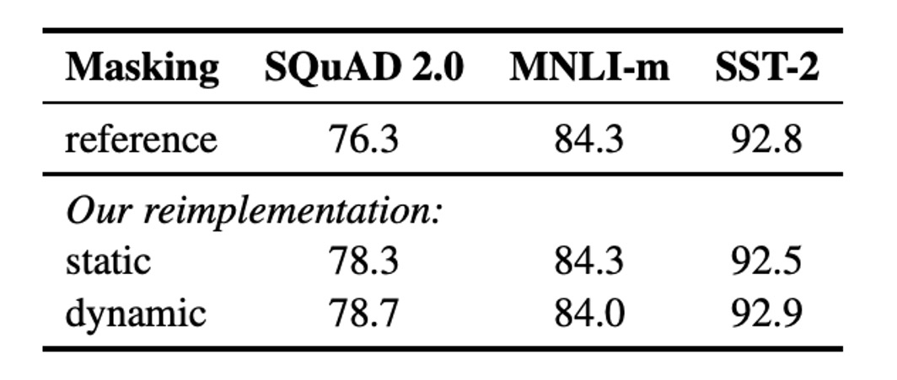

# [19.07] RoBERTa

## BERT のトレーニングの説明書

[**RoBERTa: A Robustly Optimized BERT Pretraining Approach**](https://arxiv.org/abs/1907.11692)

---

BERT の成功は、その後の研究者に多大な影響を与えました。

著者はこの段階で BERT の設計を振り返り、多くの実験を行い、BERT にはまだ多くの改善の余地があることを発見しました。

## 問題の定義

まずは BERT の設計を復習しましょう：

BERT の事前学習プロセスは主に 2 つの目標から成り立っています：マスク言語モデル（Masked Language Modeling, MLM）と次文予測（Next Sentence Prediction, NSP）です。

BERT はまず大規模な未ラベルのテキストで事前学習を行い、その後ラベル付きデータを使って微調整を行います。

BERT は Transformer アーキテクチャを採用し、これを基に改良を加えています。モデルは L 層の Transformer で構成され、各層には A 個の自己注意ヘッド（self-attention heads）があり、隠れ層の次元は H です。

事前学習の目標は主に 2 つの部分に分かれます：

- **マスク言語モデル（MLM）**：

  - 入力シーケンスの中でランダムに 15% の単語を置き換え、マスクされた単語を予測することを主な目標とします。選ばれた単語は 80% が特殊トークン `[MASK]` に置き換えられ、10% はそのまま、残りの 10% はランダムな単語に置き換えられます。

- **次文予測（NSP）**：
  - NSP は 2 クラス分類タスクで、2 つの段落が元のテキストで連続しているかどうかを予測します。正例は連続する文から、負例は異なる文書の文から選ばれます。正例と負例はそれぞれ半分ずつです。

BERT は Adam オプティマイザを使用し、具体的なパラメータは以下の通りです：

- $\beta_1 = 0.9$、$\beta_2 = 0.999$、L2 正則化パラメータの weight decay は 0.01 に設定。
- 学習率は最初の 10,000 ステップで 1e-4 のピークに達し、その後は線形に減少します。
- ドロップアウト率は 0.1 で、すべての層と注意重みには GELU 活性化関数を適用します。
- モデルの事前学習は 1,000,000 回の更新を行い、各ミニバッチには 256 本のシーケンスが含まれ、シーケンスの最大長は 512 です。

BERT のトレーニングデータは、BOOKCORPUS と英語版 WIKIPEDIA の組み合わせから来ており、合計 16GB の未圧縮テキストです。

---

本論文の著者は、上記の設計はすべて最適化すべきであり、改良すべきだと考えています。

## 解決問題

### 最適化実装の詳細

ほとんどのハイパーパラメータは元の BERT の最適化設定に従いますが、学習率のピークとウォームアップのステップ数は、設定に応じて調整されます。

著者は、トレーニングが Adam オプティマイザの epsilon 値に非常に敏感であることを発見し、調整することで性能や安定性が向上する可能性があることを示しました。また、バッチサイズが大きい場合には、$\beta_2 = 0.98$ に設定することで安定性が増すこともあります。

事前学習時、シーケンスの長さは最大で 512 トークンまでであり、これまでの文献とは異なり、短いシーケンスをランダムに挿入したり、最初の 90% の更新でシーケンス長を減少させたりすることはありません。完全な長さのシーケンスのみを使用してトレーニングが行われます。

著者は混合精度浮動小数点演算を使用してトレーニングを行い、DGX-1 マシンを使用しました。各マシンには 8 × 32GB の Nvidia V100 GPU が搭載されています。

### 最適化トレーニングデータ

BERT の事前学習は大規模なテキストデータに非常に依存しており、過去の研究では、データ量を増やすことで最終的なタスクの性能が向上することが示されています。

多くの研究では、元の BERT よりも大規模かつ多様なデータセットが使用されていますが、これらの追加データセットはすべて公開されているわけではありません。著者はここで、比較する際に適切なデータ品質と量を達成できるよう、できる限り大量のデータを収集して実験を行いました。

最終的に、著者は 5 つの異なるサイズと分野の英語コーパスを使用し、合計で 160GB 以上の未圧縮テキストを使用しました：

1. **BOOKCORPUS** と **WIKIPEDIA**：これは元の BERT トレーニングで使用されたデータセットです。（16GB）
2. **CC-NEWS**：CommonCrawl News データセットから収集された英語部分で、2016 年 9 月から 2019 年 2 月までの 6300 万件の英語ニュース記事を含みます。（フィルタリング後、76GB）

3. **OPENWEBTEXT**：これは Radford ら（2019）によって記述された WebText データセットのオープンソース再構築版で、Reddit から得られた、少なくとも 3 回の「いいね」を受け取った URL から抽出されたウェブページコンテンツを含みます。（38GB）

4. **STORIES**：Trinh と Le（2018）によって導入されたデータセットで、CommonCrawl から Winograd schema ストーリースタイルに一致するテキストがフィルタリングされて含まれています。（31GB）

:::tip
私は多くの努力をして、10 倍のデータ量で、最終的により良いモデルを得ることができました！

これは私たち内部の冗談ですが、実際、著者は後で、データ量を増やさなくても、トレーニング戦略を変更するだけでより良いモデルが得られることを証明しています。
:::

## 討論

論文中、著者は主要な調整部分をいくつかの観点に分けて議論しています：

### 静的マスキング vs. 動的マスキング

<figure style={{ "width": "60%"}}>

</figure>

元の BERT 実装では静的マスキングが使用され、前処理時にマスクが一度適用され、各エポックで同じマスキングパターンが繰り返し使用されます。同じマスキングを各訓練インスタンスで使用しないように、データは 10 回繰り返し使用され、各シーケンスは 40 エポックの訓練で 10 通りの方法でマスクされ、各シーケンスは同じマスクを 4 回繰り返し見ることになります。

動的マスキングでは、シーケンスをモデルに入力するたびに新しいマスキングパターンが生成され、特に訓練ステップが多い場合や大規模なデータセットを使用する事前学習プロセスで重要です。

結果として、動的マスキングは性能面で静的マスキングと同等、あるいはわずかに優れた結果を示し、そのため後の実験では動的マスキングが採用されました。

### 次文予測（NSP）

元の BERT では、入力は 2 つの段落から成り、これらの段落は同じファイルまたは異なるファイルから来る可能性があり、モデルはそれらが同じファイルから来るかどうかを学習します。この補助タスク NSP はその有効性について疑問を呈する研究もあり、NSP を削除しても性能に悪影響を与えない可能性があると指摘されています。

NSP の有効性を検証するため、著者は以下の異なる入力フォーマットを比較しました：

- **SEGMENT-PAIR+NSP**：元の BERT と同様、NSP 損失を保持し、2 つの段落を入力とします。
- **SENTENCE-PAIR+NSP**：2 つの自然な文を入力し、NSP 損失を保持しますが、各入力は明らかに 512 トークンより短いです。
- **FULL-SENTENCES**：完全な文を入力し、NSP 損失を削除し、シーケンスがファイルの境界を越えている場合もあります。
- **DOC-SENTENCES**：FULL-SENTENCES と似ていますが、ファイルの境界を越えないようにし、NSP 損失を削除します。

結果として、NSP 損失を削除することで、下流タスクの性能が一致し、またはわずかに向上することが示されました。

### 大バッチ訓練

<figure style={{ "width": "60%"}}>

</figure>

大バッチ訓練を使用すると、最適化速度と最終タスクの性能を向上させることができます。BERTBASE の元々の訓練では 256 シーケンスのバッチサイズを使用し、100 万ステップの訓練が行われました。

結果として、バッチサイズを大きくすることでマスク言語モデルの困惑度（perplexity）と下流タスクの精度が改善され、大バッチ訓練は分散データ並列訓練を容易にすることも分かりました。したがって、著者は後続の実験で 8000 シーケンスのバッチサイズを使用しました。

### テキストエンコーディング

Byte-Pair Encoding (BPE) を使用すると、自然言語の大規模な語彙を処理できます。BPE はサブワード単位を基本単位として使用します。

元の BERT では 30K の文字単位の BPE 語彙を使用していましたが、本論文では 50K のバイト単位の BPE 語彙を使用し、入力の前処理や分割は行いませんでした。

初期実験では、両者の性能差はあまりなく、バイト単位の BPE はいくつかのタスクでわずかに劣っていましたが、その汎用性を考慮して、著者は後続の実験でバイト単位の BPE を使用しました。

### 訓練データ規模

著者はまず、$BERT_{\text{LARGE}}$ と同じアーキテクチャ（L = 24、H = 1024、A = 16、355M パラメータ）を採用し、元の BERT と同じ BOOKCORPUS と WIKIPEDIA データセットで 100K ステップの事前学習を行いました。

1024 台の V100 GPU を使用し、訓練は約 1 日続きました。

結果として、RoBERTa は訓練データをコントロールした場合、元の $BERT_{\text{LARGE}}$ よりも顕著に改善され、ここでは設計選択の重要性が強調されています。

:::tip
1024 台の V100 GPU。（？？？）
:::

## 結論

本文で述べた改善方向をまとめると：

1. モデルの訓練時間を延長する。
2. より大きなバッチサイズを使用し、さらに多くのデータで訓練する。
3. 「NSP」目標を削除する。
4. より長い入力シーケンスで訓練を行う。
5. 訓練データに適用するマスキングパターンを動的に調整する。

RoBERTa は、GLUE、RACE、SQuAD のベンチマークで最先端の結果を達成し、GLUE ではマルチタスク微調整を必要とせず、SQuAD も追加のデータ支援なしで性能を発揮しました。これらの結果は、これまで見過ごされていた設計選択の重要性を示しています。

同様のアプローチは他のモデルアーキテクチャにも適用でき、優れたモデル訓練アーキテクチャがより良いモデル性能をもたらすという概念は、すべての領域に共通して適用可能です。
