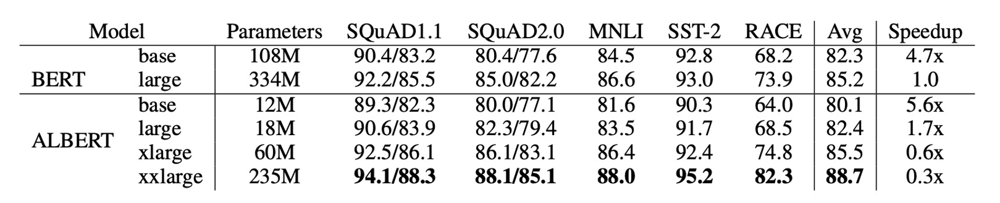
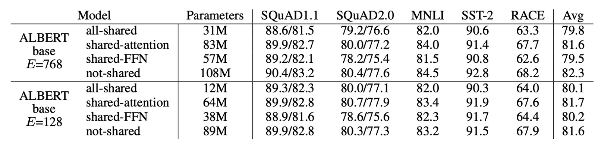
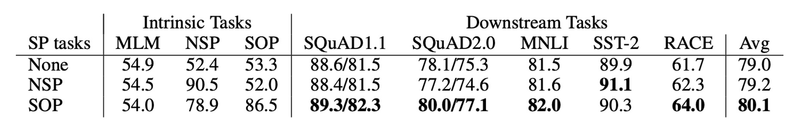

## アインシュタイン

[**ALBERT: A Lite BERT for Self-supervised Learning of Language Representations**](https://arxiv.org/abs/1909.11942)

---

BERT の後、やっぱり BERT です。

## 問題の定義

一つの BERT モデルは約 340M のパラメータを持ち、トレーニングが非常に難しく、時間がかかります。BERT を基準にして比較することで、後続の研究はモデルの規模を拡大し、モデルのパラメータはますます増えていきました。

0.1B ➔ 0.3B ➔ 0.5B ➔ 1.0B ➔ 1.5B ➔ ？？？

この論文の著者は言います：もう無理だ、これ以上大きくできない、トレーニングができなくなってきた！

- **私たちは小さな BERT が必要です！**

## 解決問題

ALBERT の基盤は BERT と同じですが、以下のいくつかの改良が行われています：

### 分解された埋め込みパラメータ化

BERT およびその後の改良モデル（XLNet や RoBERTa など）では、WordPiece 埋め込みのサイズ $E$ と隠れ層のサイズ $H$ が結びついています、すなわち $E ≡ H$ です。

この設計にはモデルと実用性の観点で二つの欠点があります：

- **モデルの観点から**：WordPiece 埋め込みは主に文脈に依存しない表現を学習し、隠れ層の埋め込みは文脈に依存する表現に焦点を当てています。$E$ と $H$ を分離することで、モデルは必要に応じてパラメータをより効率的に割り当てることができ、隠れ層はより大きな容量を持つべきです（つまり、$H > E$）。

- **実用的な観点から**：自然言語処理では、語彙のサイズ $V$ は通常非常に大きいです。$E ≡ H$ の場合、$H$ を増やすと埋め込み行列のサイズが大きくなり、そのサイズは $V \times E$ となります。これにより、モデルのパラメータ数は数十億に達し、ほとんどのパラメータは訓練中にわずかな更新しかされません。

そのため、ALBERT は埋め込みパラメータを分解し、二つの小さな行列に分けました：

- まず one-hot ベクトルを低次元の埋め込み空間に投影し、そのサイズは $E$ です。
- 次にそれを隠れ層空間に投影します。

この分解により、埋め込みパラメータの数は $O(V \times H)$ から $O(V \times E + E \times H)$ に減少します。

$H > E$ の場合、パラメータ数は大幅に削減されます！

:::tip
**例を挙げてみましょう！**

語彙のサイズ $V$ が 30,000、隠れ層のサイズ $H$ が 1,024 の場合、BERT では $E ≡ H$ なので、埋め込み行列のサイズは $V \times H = 30,000 \times 1,024 = 30,720,000$ のパラメータになります。

しかし、ALBERT では埋め込み次元 $E$ を小さな 128 に設定した場合、埋め込み行列のサイズは次のように分解されます：

- 最初の部分は $V \times E = 30,000 \times 128 = 3,840,000$ のパラメータ
- 次の部分は $E \times H = 128 \times 1,024 = 131,072$ のパラメータ

そのため、ALBERT の総埋め込みパラメータ数は $3,840,000 + 131,072 = 3,971,072$ となり、BERT の $30,720,000$ のパラメータよりも大幅に削減されます。

これにより、メモリの要求が減少し、計算効率が向上します。
:::

### 層間パラメータ共有

これまで多くの研究は、モデルのパラメータ効率を向上させることに焦点を当ててきました：

- **Dehghani ら（2018）の Universal Transformer (UT)**：

  - [**[18.07] Universal transformers**](https://arxiv.org/abs/1807.03819)

  彼らは Universal Transformer を提案し、このモデルが標準的な Transformer よりも性能で優れていることを発見しました。Universal Transformer は Transformer の改良版で、複数層の Transformer のパラメータを共有することにより（ALBERT の方法に似ています）、モデルの学習能力を強化し、特に異なる層での時間ステップに対する処理能力が向上し、性能を改善しました。

- **Bai ら（2019）の Deep Equilibrium Models (DQE)**：

  - [**[19.09] Deep equilibrium models**](https://arxiv.org/abs/1909.01377)

  彼らの研究では、Deep Equilibrium Models (DQE) が「平衡点」に達することができ、この平衡点では、ある層の入力と出力の埋め込みが同一になることが示されました。これにより、その層のモデル表現はもはや変化しないことになります。つまり、モデルの表現能力はこの平衡点に達すると安定し、顕著な変化はなくなります。

これら二つの研究を除き、パラメータを共有する概念には多くの実現方法があります：

- 層間でフィードフォワードネットワーク（FFN）のパラメータのみを共有
- 注意機構のパラメータのみを共有

ALBERT のデフォルト設計では**すべての層間で全てのパラメータを共有**しており、特に明記されていない限り、すべての実験はこの設計に基づいて行われました。下図のように、著者は L2 距離とコサイン類似度の測定を使用して分析を行い、その結果 ALBERT の埋め込みは**振動状態**を示し、DQE モデルのように収束することはありませんでした。

ALBERT の埋め込みパラメータは DQE のように安定した平衡点には達せず、動的に変化し続けます。これは他の研究結果と対照的であり、この動的変化が ALBERT の設計と性能に特定の利点をもたらす可能性があることを示唆しています。

### 文章順序予測損失（SOP）

文章順序予測損失、Sentence-Order Prediction (SOP)。

BERT は MLM 損失の他に、追加の損失関数 NSP（Next Sentence Prediction）を使用しています。多くの後続研究では NSP の効果が不安定であることが分かり、NSP 損失を削除することを選択しました。

著者は、NSP の低効率の原因を、タスクが MLM に対して過度に単純であるためだと推測しています。NSP はトピック予測と一貫性予測を混同しており、トピック予測は一貫性予測よりも学習が容易であり、MLM 損失の学習と重複する部分が多いです。

これらの理由を踏まえ、著者は文章間のモデリングが言語理解の重要な部分であると考え、文章順序予測損失（SOP）を提案しました：

- 正例は BERT と同様に、同一文書内の二つの連続したセグメントからなります。
- 負例は同じ二つのセグメントですが、その順序を入れ替えます。

モデルはどちらのセグメントが先に来るかを判別する必要があり、これによりモデルは一貫性の違いをより細かく学習することが強制されます。

## 討論

### BERT と ALBERT の全体比較

ALBERT の設計選択は主にパラメータ効率の向上に反映されています。

上の表に示すように、ALBERT-xxlarge は BERT-large の約 70% のパラメータを使用しながら、複数の代表的な下流タスクで優れた性能を発揮しています。具体的には、SQuAD v1.1 (+1.9%)、SQuAD v2.0 (+3.1%)、MNLI (+1.4%)、SST-2 (+2.2%)、RACE (+8.4%) などです。

さらに、ALBERT は訓練データの処理速度が BERT よりも優れており、同じ TPU 訓練設定で ALBERT-large の処理速度は BERT-large の 1.7 倍であり、ALBERT-xxlarge はその大きな構造のため速度が遅く、BERT-large の約 3 倍の時間がかかります。

### 埋め込みパラメータの分解

上の表は、ALBERT-base 設定で語彙埋め込みサイズ $E$ を変更した結果を示しています。

非共有パラメータの場合（BERT スタイル）、埋め込みサイズを大きくすることで若干の性能向上が見られますが、全パラメータ共有（ALBERT スタイル）では、埋め込みサイズ $E=128$ が最適な結果を示しました。

これらの結果を基に、著者は今後の設定で埋め込みサイズ $E=128$ を使用してモデルを拡張することを決定しました。

### 層間パラメータ共有

上の表は、異なる層間パラメータ共有戦略の実験結果を示しています：

- ALBERT-base 設定（$E=768$ と $E=128$）を使用した場合、全共有戦略は 2 つの条件下で性能に影響を与えますが、$E=128$ の場合は損失が少なく（-1.5）、$E=768$ の場合は損失が大きい（-2.5）ことがわかります。

性能の低下の大部分は FFN 層のパラメータを共有したことに起因しています。$E=128$ の場合、注意層のパラメータを共有しても性能への影響はほとんどなく（+0.1）、$E=768$ の場合には若干の低下が見られました（-0.7）。

層を N 個の M サイズのグループに分けて、各グループ内でパラメータを共有するという選択肢もありますが、実験結果では、グループサイズが小さいほど性能が向上しますが、パラメータの総数も増加します。

そのため、著者は最終的に全共有戦略をデフォルトとして選びました。

### 文章順序予測の有効性

著者は、以下の 3 つの跨文損失条件を比較しました：

- なし（XLNet と RoBERTa スタイル）
- NSP（BERT スタイル）
- SOP（ALBERT スタイル）

結果として、NSP は SOP タスクに対して識別力を持たず（精度 52.0%、ほぼランダムな予測）、これは NSP が主にトピックの遷移を学習していることを示しています。一方で、SOP は NSP タスクでも良い結果（精度 78.9%）を示し、SOP タスクではさらに優れた結果（精度 86.5%）を示しました。

さらに、SOP は複数文のエンコーディングタスクにおける下流性能を大幅に改善しました：SQuAD1.1 (+1%)、SQuAD2.0 (+2%)、RACE (+1.7%) の向上が見られました。

### NLU タスクにおける現在の最先端レベル

<figure>

<figcaption>ALBERT の GLUE ベンチマークでのパフォーマンス</figcaption>
</figure>

---

<figure>

<figcaption>ALBERT の SQuAD と RACE ベンチマークでのパフォーマンス</figcaption>
</figure>

---

最後に、著者は 2 つの微調整設定で最先端の結果を発表しました：**単一モデル** と **アンサンブルモデル**：

- **単一モデル**：
  - 開発セットにおける 5 回の実行結果の中央値を報告。
  - 単一モデルの ALBERT 設定は、最良のパフォーマンス設定を使用しています：ALBERT-xxlarge 設定で、MLM と SOP の損失関数を組み合わせ、ドロップアウトは使用しません。
- **アンサンブルモデル**：
  - アンサンブルモデルのチェックポイントは、開発セットのパフォーマンスに基づいて選択され、タスクに応じてチェックポイントの数は 6 から 17 の範囲で異なります。
  - GLUE と RACE のベンチマークでは、アンサンブルモデルの予測結果は、異なる訓練ステップで得られた 12 層および 24 層アーキテクチャで微調整されたモデルの予測を平均化したものです。
  - SQuAD では、複数の確率を持つスパンの予測スコアを平均化し、「回答不能」の判断スコアも平均化しました。

単一モデルとアンサンブルモデルのいずれでも、ALBERT は以下の三つのベンチマークで現在の最先端レベルを大幅に向上させました：

- **GLUE**：89.4 点を達成
- **SQuAD 2.0**：テスト F1 スコアは 92.2
- **RACE**：テスト精度は 89.4

特に RACE テストでは、他のモデルに比べて大きな向上が見られました：

- BERT と比較して 17.4% の向上。
- XLNet と比較して 7.6% の向上。
- RoBERTa と比較して 6.2% の向上。
- DCMI+ と比較して 5.3% の向上。

## 結論

ALBERT は革新的な方法でパラメータ効率を大幅に向上させ、跨文理解タスクの性能を高めるためのより適切な損失関数を導入しました。その設計思想は今後の大規模言語モデルに大きな影響を与えるでしょう。

もしリソースが限られた環境で言語モデルを開発しているなら、ALBERT は非常に良い選択肢となるかもしれません！
