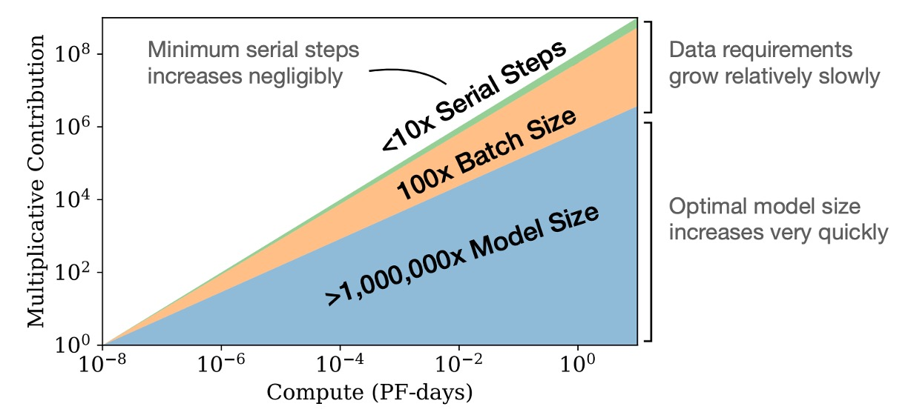

## モデルのスケーリング法則

[**Scaling Laws for Neural Language Models**](https://arxiv.org/abs/2001.08361)

---

OpenAI は Transformer デコーダをどんどん拡張しています。

## 問題の定義

前の数篇の記事から、OpenAI の野心が見えてきたことでしょう：彼らは「超巨大な」言語モデルを作りたいのです。

そのため、次の研究が登場しました：

- いったい、モデルをどのように大きくすればよいのか？

この問題こそが、本論文が解決しようとする核心的な課題です。

## 解決問題

本論文では、以下のハイパーパラメータを使用して Transformer アーキテクチャをパラメータ化しています：

- **中間フィードフォワード層の次元**
- **注意機構の出力次元**
- **各層の注意ヘッド数**
- **層数**：Transformer の層数
- **トークン数**：コンテキストの長さ、通常は 1024 に設定

### 訓練過程

特に記載がない限り、訓練は Adam オプティマイザーを使用して行われ、各訓練は $2.5 \times 10^{5}$ ステップで、バッチサイズは 512 のシーケンスで、各シーケンスには 1024 のトークンが含まれます。メモリ制約のため、10 億パラメータを超えるモデルは Adafactor を使用して訓練されました。

著者は様々な学習率と学習率スケジューリング方法を試しましたが、収束時の結果は学習率スケジューリングにほとんど影響されないことがわかりました。特別に記載がない限り、すべての訓練には 3000 ステップの線形ウォームアップ後にゼロに向けて段階的に減少する学習率スケジューリングが使用されています。

### データセット

モデルの訓練は「**拡張版 WebText データセット**」で行われました。

- 元の WebText データセットは Reddit の外部リンクから来ており、これらのリンクは 2017 年 12 月以前に少なくとも 3 人の他の読者によって支持されていました。
- WebText2 には、2018 年 1 月から 10 月にかけての Reddit の外部リンクが追加され、これらも少なくとも 3 人の他の読者によって支持されていました。
- Newspaper3k Python ライブラリを使用してリンクのテキストを抽出し、最終的なデータセットには 2030 万個のドキュメント、合計 96GB のテキストと $1.62 \times 10^{10}$ 語が含まれています。
- 可逆的なバイトペアエンコーディング（byte-pair encoding）を適用してトークン化し、最終的に $2.29 \times 10^{10}$ のトークンを得、$6.6 \times 10^{8}$ のトークンをテストセットとして保持しました。
- Books Corpus、Common Crawl、英語ウィキペディアおよび他の公共のネット書籍データを使用してテストを実施しました。

### 変化要因

言語モデルのスケーリング特性を広範囲に研究するために、本論文では以下の点でモデル訓練を行いました：

- **モデルサイズ**：768 から 15 億非埋め込みパラメータまでのモデル
- **データセットサイズ**：2200 万から 230 億トークンまでのデータセット
- **モデル構造**：深さ、幅、注意ヘッド数、フィードフォワード層の次元を含む
- **コンテキスト長**：ほとんどの訓練は 1024 の長さのコンテキストを使用しましたが、より短いコンテキストも試験しました
- **バッチサイズ**：ほとんどの訓練では $2^{19}$ のバッチサイズを使用しましたが、主要なバッチサイズを測定するためにバッチサイズを変化させました

これらの実験設計は、異なる条件下でのモデルの性能を体系的に研究し、関連するスケーリング法則を導き出すことを目的としています。

## 討論

### 規模大於一切

モデルの性能は大きくスケールに依存し、モデルの構造（深さや幅）に対する依存は比較的弱いことが実験から明らかになりました。モデルの性能は主に以下の三つの要素に依存します：

1. **N: モデルパラメータの数**
2. **D: データセットのサイズ**
3. **C: 使用する計算量**

実験では、合理的な範囲内では、他のアーキテクチャハイパーパラメータ（例えば、深さや幅）に対する依存は非常に弱いことが示されました。

### 冪定律

他の二つの比率因子によって制限されていない場合、性能は N、D、C の各要素に対して冪律関係が存在し、この傾向は「六つ」の数量級以上にわたります、図に示されているように。

- **左の図**：計算量が大きいほど、モデルの性能は良くなる。
- **中央の図**：データセットが大きいほど、モデルの性能は良くなる。
- **右の図**：モデルパラメータが多いほど、モデルの性能は良くなる。

:::tip
もしかすると、これは当たり前のことを言っているように感じるかもしれません？

しかし、これは過去のアーキテクチャ、例えば CNN や LSTM では必ずしも当てはまらなかった関係です。そうしたモデルでは、性能が飽和したり、過剰適合することがよくありました。このように六つの数量級を超える関係は、大きな突破口と言えます。
:::

### 過剰適合の普遍性

実験から、N と D を同時に増加させることで性能が予測可能に向上することが示されました。しかし、N または D が固定され、もう一方を増加させると、利益が減少していきます。性能の損失は、比率 $N^{0.74} / D$ によって予測可能であり、つまり、モデルのサイズを 8 倍増やすたびに、データは約 5 倍増加すれば損失を避けられるということです。

### テストパフォーマンスと下流タスクのパフォーマンス

実験では、訓練と異なる分布のテキストでモデルを評価した場合、テストセット上での結果が訓練セットと密接に関連していることが分かりました。損失の偏移量はほぼ一定であり、異なる分布への移行は恒常的なペナルティをもたらしますが、それ以外の部分ではテストセットのパフォーマンスに基づき改善されることが示されました。

### サンプル効率

大規模なモデルは小規模なモデルよりもサンプル効率が高く、より少ない最適化ステップ（上図、最初のグラフ）や少ないデータポイント（上図、二番目のグラフ）で同じパフォーマンスレベルを達成できます。

### 収束は非効率的なプロセス

図に示すように、モデルサイズを増加させることは、モデルを小さくして完全に収束させるよりも効果的な方法です。

簡単に言うと、計算リソースが固定されている場合、非常に大きなモデルを訓練し、それらが完全に収束する前に訓練を停止する方が、固定された計算予算内で最良の性能を得ることができます。これに対して、小さいモデルを完全に収束させる方法は効率が悪いです。

さらに、計算リソースが増加するにつれて、必要な訓練データ量はほとんど増えないため、計算リソースを増やすために大量のデータを追加する必要はありません。

### 最適なバッチサイズ

言語モデルの訓練における最適なバッチサイズは固定値ではなく、損失関数に依存しており、勾配のノイズスケールを測定することで決定できます。

本論文で定義された最大モデルは 15 億パラメータ（1.5B）で、最良の訓練効果が得られる時、最適なバッチサイズは約 100 万から 200 万トークンでした。このバッチサイズは訓練過程で最良の性能と効果を達成するのに役立ちます。

:::tip
ここで言及されている 100 万から 200 万は、トークン数を指し、バッチサイズの数ではありません。もしモデルのコンテキスト長が 1024 であれば、対応するバッチサイズは約 1000 から 2000 で、最良の効果が得られます。
:::

## 結論

この論文では多くの実験が行われ、言語モデルの訓練方法についての要点がまとめられています。

これらの結論は私たちにとって非常に有用であり、実験結果を感謝しながら受け入れています。
