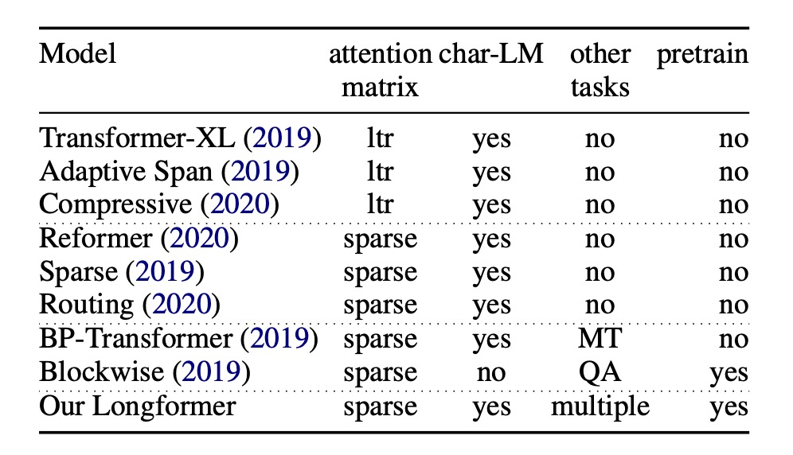
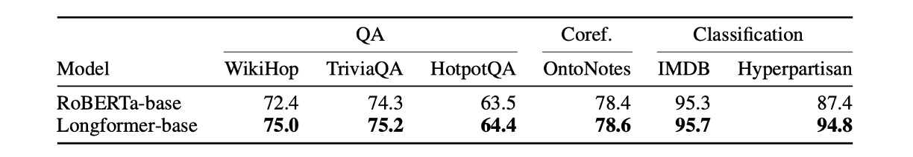
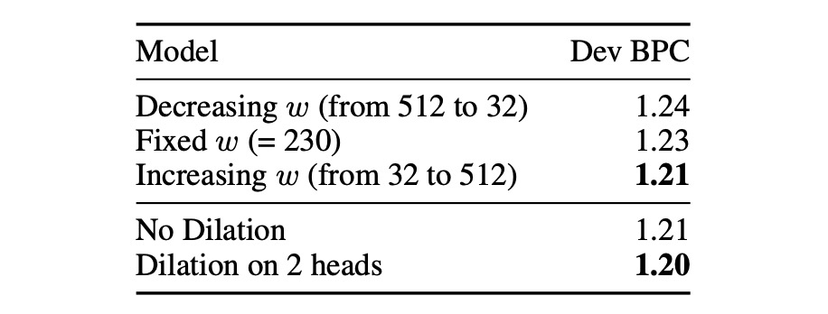

## 長距離注意機構

[**Longformer: The Long-Document Transformer**](https://arxiv.org/abs/2004.05150)

---

Transformer の自己注意機構の計算量は $O(n^2)$ です。

このような計算複雑度のアルゴリズムは、非常に大きな最適化の余地があることを意味します。

ん？この導入、少し見覚えがあるかもしれませんね？

## 問題の定義

オリジナルの Transformer の計算複雑度の問題を解決するために、研究者たちは絶えず最適化手法を模索しています。

一部の方法では、**Transformer-XL** の設計理念を採用し、スライディングウィンドウと追加のメモリブロックを組み合わせて長い文書を処理しています。

- [**Transformer-XL: より長い文脈**](../1901-transformer-xl/index.md)

しかし、このスライディングウィンドウの設計には、双方向の注意機構に対して天生の設計上の欠陥があります。

もう一つのアプローチは、疎な注意機構を採用することで、例えばこの論文よりも 1 年早く提案された **Sparse Transformer** のようなものです。

- [**Sparse Transformer: 疎な注意機構**](../1904-sparse-transformer/index.md)

過去の疎な注意機構に関する研究では、事前学習モデルの微調整や、さらなる下流タスクへの一般化能力については言及されていませんでした。

本論文の著者の動機はここで非常に明確になります：

1. 長いコンテキストには「疎な注意機構」を採用するのが良い解決策である。
2. しかし、注意マップの設計には最適化が必要である。
3. そして、事前学習フレームワークを導入し、さらに多くの下流タスクに対する一般化能力をテストすべきである。

## 解決問題

### モデルアーキテクチャ

この論文は非常に読みやすいです。なぜなら、この図を見るだけでほぼ全てが分かるからです。

ここでの説明は非常に明確で、著者は長文の処理能力をテストするために、3 つの疎注意機構を提案しています：

- 上図 (a) は元々の注意機構で、各トークンは他のすべてのトークンに注目します。
- 上図 (b) はスライディングウィンドウ注意機構で、各トークンは前後の固定範囲内のトークンにのみ注目します。
- 上図 (c) は膨張スライディングウィンドウ注意機構で、各トークンは前後の固定「間隔」のトークンに注目します。
- 上図 (d) は Global+Sliding Window 注意機構で、各トークンは前後の固定範囲内のトークンに注目するだけでなく、「特定」のトークンが他のすべてのトークンと「相互」に注目します。
  - 例えば、上図の「特定」のトークンは、1 番、2 番、6 番、16 番のトークンです。もちろん、これは示意図であり、実際の設計は調整可能です。

### 自回帰モデル

ここでは膨張スライディングウィンドウ注意機構（上図 (c)）が使用されており、過去の研究に従って、異なる層に異なる間隔を適用しています。

特に、低い層では小さな間隔を、高い層では大きな間隔を使用することで、モデルが異なる層で異なる受容野を持つように設計されています。

訓練に関しては、最初から超長いコンテキストを使用するのではなく、コンテキストの長さを段階的に増やすという戦略を採用しています。これにより、モデルは収束が容易になります。

初期段階では短いシーケンス長とウィンドウサイズから始め、これがモデルが局所的な詳細を学習するのを助けます。その後の各段階で、システムはウィンドウサイズとシーケンス長を倍増し、学習率を半分にします。この訓練方法は、訓練プロセスを加速させるだけでなく、モデルがより複雑な計算を行う準備を整えるため、より長いシーケンスの処理が可能になります。

モデルは全体で 5 つの段階で訓練され、段階的により長いシーケンスの処理に適応していきます。

最終段階では、シーケンス長 2,048 から始めて、23,040 に増加します。このような段階的な成長により、モデルはメモリ制限を超えることなく、大規模なデータを処理する能力を備えることができます。

### 自編碼モデル

自回帰モデルと比較するために、著者は自編碼モデルである BERT との比較も行いたいと考えました。

ただし、BERT の訓練コストが高いため、著者は事前に訓練された RoBERTa モデルを使用して MLM 微調整を行い、元々の注意機構を Longformer の設計に変更しました。

ここではスライディングウィンドウ注意機構（上図 (b)）を使用しています。

疎注意機構であるため、コンテキストの長さは元々の RoBERTa よりも 512 から 4,096 に増加しました。

さらに、特定のタスクではグローバルな注意機構が必要です。例えば、テキスト分類のための \[CLS\] トークンや、QA タスクのすべての質問トークンです。これらのケースでは、著者は Global+Sliding Window 注意機構（上図 (d)）を使用します。

## 討論

### 自回帰実験結果

参考文献の Table 2 に従い、実験結果は、小規模モデルにおいて Longformer が最良の結果を示すことを示しています。

参考文献の Table 3 によれば、同規模の大きなモデルにおいて、Longformer の性能は他の SOTA モデルと同等であることが示されています。

### 自己符号化実験結果

上表は、すべてのファインチューニング実験の結果をまとめたものです。

著者は、Longformer が常に RoBERTa のベンチマークを上回っていることを観察しています。

- 長いコンテキストを必要とするタスク（例：WikiHop と Hyperpartisan）では、特に効果が顕著です。
- TriviaQA では、ローカルコンテキストで問題が解決できることが多いため、改善幅は小さいです。
- HotpotQA では、事実補助監視によってモデルが関連するコンテキストを簡単に見つけ、ローカルコンテキストに集中することで、少しの改善が見られました。
- WikiHop は中間推論チェーンに対する遠隔監視のみを含んでおり、Longformer のアプローチは全体のコンテキストを推論することで優れたパフォーマンスを発揮しました。
- IMDB と OntoNotes データセットでは、パフォーマンスの向上は小さいです。IMDB では、ほとんどのデータセットが短い文書で構成されており、通常は二つの言及の間の距離が非常に小さいため、個別の小さなブロックを処理するベースラインは、交差するブロック間の相互作用を考慮せずに言及を指摘チェーンに統合できます。

### 自回帰消融実験

著者は自回帰モデルについて、二つの消融実験を行いました。

最初の実験では、スライディングウィンドウの設計をテストしました：

- w の減少（512 から 32 に）：下層から始めて、スライディングウィンドウのサイズを徐々に小さくする。
- w の固定（=230）：最初から最後まで同じサイズのスライディングウィンドウを使用する。
- w の増加（32 から 512 に）：下層から始めて、スライディングウィンドウのサイズを徐々に大きくする。

結果として、w の増加のデザインが最良の効果を示し、これは直感的にも納得できる結果です。なぜなら、このデザインにより、モデルは異なる層で異なる受容野を持つことができるからです。

次の実験では、膨張スライディングウィンドウのメカニズムが使用されるかどうかをテストしました。結果として、膨張スライディングウィンドウを使った設計が、多頭注意機構の二つのヘッドで最良の効果を示すことがわかりました。

:::tip
第二の消融実験に関して、著者の原文は次の通りです：

> Adding some dilation to two heads leads to some improvement compared with no dilation at all.

ここでの「heads」とは、多頭注意機構における二つのヘッドを指していると推測されますが、理解に誤りがあればお知らせください。
:::

### 自己符号化消融実験

著者は自己符号化モデルについて一連の消融実験を行いました。

最初に、すべての実験に Longformer-base モデルを使用しました。特に記載がない限り、すべての実験は同じハイパーパラメータを使用し、五つのエポックでファインチューニングを行いました。

1. **長いシーケンスの効果**：Longformer は、より長いシーケンスから利益を得て、モデルのパフォーマンスが向上します。
2. **全体注意の影響**：全体注意とその単独の投影行列は、モデルのパフォーマンスに正の影響を与えます。
3. **事前学習の影響**：MLM 事前学習はモデルのパフォーマンスを向上させます。
4. **訓練時間の影響**：より長い訓練時間はパフォーマンスの向上に寄与します。
5. **RoBERTa-base との比較**：Longformer の設定が RoBERTa-base と同じ（seqlen：512 および n2 注意）場合、Longformer のパフォーマンスは RoBERTa-base にわずかに劣ります。これは、パフォーマンスの向上が追加の事前学習によるものではないことを確認します。
6. **位置埋め込みのみを解凍する影響**：事前学習された RoBERTa モデルを使用し、追加の位置埋め込みのみを解凍する場合、パフォーマンスはわずかに低下します。これは、Longformer が大規模な訓練データセット（例：WikiHop）のタスク特定のファインチューニングにおいて、長範囲のコンテキストを効果的に学習し、利用できることを示唆しています。

## 結論

本論文の研究の主な焦点は、スパース注意機構の設計にあります。

Longformer のグローバルな注意機構は、下流タスクを通じて「どの」トークンにグローバルな視野を与えるべきかを決定します。以前の Sparse Transformer は、固定間隔を使用して「クラス」グローバルな注意機構を実現していたのとは異なります。

どちらの設計が優れているかについては、実験結果の表に基づくと、Longformer は過去の他のスパースアーキテクチャに対して確かに優れていますが、その差はそれほど大きくはありません。

したがって、具体的にどの設計を選択するかは、使用者のニーズによるといえるでしょう。（~あるいは、各アーキテクチャを試してみるのも一つの方法かもしれません。~）
