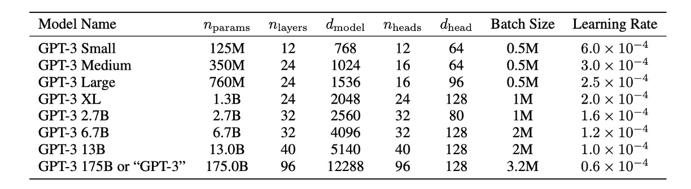
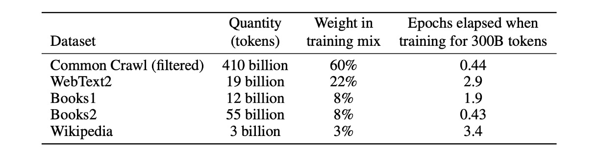

## 96 層デコーダ

[**Language Models are Few-Shot Learners**](https://arxiv.org/abs/2005.14165)

---

第二世代の GPT は、48 層の Transformer デコーダを重ねました。

OpenAI はこれで十分だと考えず、さらに 96 層の Transformer デコーダを追加し、パラメータ数は前例のない 175B に達し、これが GPT-3 です。

## 問題の定義

最近の研究は、大量のテキストで事前学習を行い、その後特定のタスクに微調整を加えることで、多くの NLP タスクとベンチマークテストで大きな成果を上げていることを示しています。理想的な NLP 技術は、人間のように少量の指示や例で迅速に適応し、さまざまな言語タスクを処理できることを目指していますが、現段階の研究にはいくつかの問題があり、理想とはまだ大きな差があります。

### 多様な言語タスクの要求

現在の言語モデルは、文法修正から抽象的な概念生成に至るまで、広範で多様な言語タスクに適応する必要があります。各新しいタスクには通常、大量の特定データセットが必要で、これがモデルの普遍的な適用性を制限しています。

### 大規模な監視データセットへの依存

多くの言語タスクにおいて、大規模なデータセットを収集しラベル付けすることは高額で時間がかかります。新しいタスクごとにこのデータ収集のプロセスを繰り返す必要があり、これが開発コストを増加させ、導入までの時間を長引かせます。

### モデルの過度な専門化と一般化の問題

現在のモデルは、特定のタスクで微調整を行うことで過度に専門化される可能性があり、その結果、訓練分布外のデータに対する一般化能力が低くなります。訓練中の虚偽の関連性は、モデルを誤った方向に導き、長期的および広範な適用に影響を与えることがあります。

### 人間の学習効率とモデルの比較

少量の例や直接的な指示で新しいタスクに迅速に適応できる人間の能力に比べ、現在のモデルは大量のラベル付きデータに依存しており、その効率は低くなっています。

## 解決問題

GPT-3 では、基本的な事前学習方法は GPT-2 で説明されたプロセスと似ており、モデルサイズ、データセットサイズ、多様性、訓練時間を単純に拡大したものです。コンテキスト学習の使用も GPT-2 と同様ですが、この作業では著者たちがコンテキスト学習のさまざまな設定を体系的に探求しました。主な違いは次の通りです：

1. **ファインチューニング**

   - これは最も一般的な方法で、所望のタスクに特化した監視データセットで事前学習済みモデルの重みを更新するものです。通常、数千から数十万のラベル付きサンプルを使用します。ファインチューニングの主な利点は、多くのベンチマークテストで優れたパフォーマンスを示すことです。
   - 主な欠点は、各タスクに新しい大規模なデータセットが必要で、分布外での一般化能力が低く、訓練データに基づいた虚偽の特徴が利用される可能性があることです。これにより、人間のパフォーマンスとの不公平な比較が生じることがあります。
   - この作業では、GPT-3 にファインチューニングは行っていません。彼らの焦点はタスクに依存しないパフォーマンスにありましたが、GPT-3 は原則としてファインチューニングが可能であり、これは今後の研究の有望な方向性です。

     :::tip
     これがおそらく後の ChatGPT-3.5 の伏線となります。
     :::

2. **Few-shot**

   - Few-shot は、推論時にモデルにいくつかのタスクの例を条件として与えますが、重みの更新は行いません。

     :::tip
     上の例のように、「英語の文をフランス語に翻訳する」という問題を解決する必要がある場合、モデルにいくつかの例を提供します。例えば：

     - `Translate English to French: "sea otter" -> "loutre de mer", cheese -> `

     そして、主要な翻訳対象の内容が下に続きます。ここでモデルは「cheese」のフランス語翻訳を出力することを期待しています。
     :::

   - 主な利点は、特定のタスクデータの必要性を大幅に減少させ、狭いデータセットから学ぶリスクを減らすことです。
   - 主な欠点は、これまでのところ、この方法の結果は最先端のファインチューニングモデルに比べて大幅に劣っていることです。また、少量のタスク特定のデータはまだ必要です。

3. **One-shot**

   - One-shot は Few-shot と似ていますが、モデルに 1 回の例示しか許可しません。加えて、タスクの自然言語による記述が必要です。この方法は、いくつかのタスクで人間とモデルがコミュニケーションを取る最も近い方法を提供します。たとえば、人間がタスクを生成するために（例えば、Mechanical Turk で）資料を作成する場合、通常はタスクの例を与えます。これに対して、例を与えないと、タスクの内容や形式を伝えることが難しい場合があります。

4. **Zero-shot**

   - One-shot と同様ですが、例示は許可されておらず、モデルにはタスクを記述した自然言語の指示のみが与えられます。この方法は、最大の便利さと堅牢性の可能性を提供し、虚偽の関連性を避けますが、最も挑戦的な設定です。場合によっては、事前の例がないと人間でもタスクの形式を理解することが難しくなることがあり、これは「非常に難しい」設定となります。

### モデルアーキテクチャ

本論文では、著者は GPT-2 と同じモデルとアーキテクチャを使用しており、これには変更された初期化、前処理、可逆的トークナイゼーションが含まれます。

異なる点は、著者が Transformer 内でスパース注意の Transformer を使用したことです。この技術の詳細については、別の記事を参照してください：

- [**[19.04] Sparse Transformer: 疎な注意機構**](../1904-sparse-transformer/index.md)

  

モデルサイズがパフォーマンスに与える影響を研究するために、著者は 8 つの異なるサイズのモデルを訓練しました。パラメータ数は 1.25 億から 1750 億までの 3 つのオーダーにわたります。最後のモデルが彼らが GPT-3 と呼んでいるものです。

上表からわかるように、すべてのモデルは 2048 のトークンのコンテキストウィンドウを使用しています。著者たちは、深さと幅の次元に沿って GPU 間でモデルを分割し、ノード間のデータ転送を最小限に抑えるようにしました。各モデルの正確なアーキテクチャのパラメータは、計算効率と GPU 間のモデルレイアウトの負荷分散に基づいて選択されました。

### データセット設定

本論文では、著者は Common Crawl データセットを使用してモデルの事前学習を行いました。

さらに、著者はフィルタリングされていない、または軽度にフィルタリングされた Common Crawl データの品質が、精緻に準備されたデータセットには劣ることを発見しました。

データセットの平均品質を向上させるために、著者は以下の 3 つの手順を取りました：

1. **データフィルタリングと品質管理**：Common Crawl のデータをフィルタリングし、高品質のリファレンスコーパスとの類似性が高いデータを選択しました。
2. **重複排除**：ファイルレベルでの曖昧な重複データを削除し、データセット内およびデータセット間で行い、冗長性を防ぎ、検証セットの完全性を保ちました。
3. **データ多様性の強化**：訓練データセットに既知の高品質のリファレンスコーパスを追加し、Common Crawl データの多様性を高めました。

この方法により、著者は 2016 年から 2019 年までの 41 個の Common Crawl 月次データを収集しました。これらのデータは、フィルタリング前の 45TB の圧縮プレーンテキストと、フィルタリング後の 570GB に相当し、約 4000 億個のトークンをエンコードしたものです。

また、訓練期間中はデータサイズに基づいてサンプリングせず、むしろ高品質のデータセット（例えば Common Crawl や Books2）を頻繁にサンプリングしました。この方法は、少量の過剰適合を利用してより高品質な訓練データを使用するためのものです。

:::tip
事前学習中にテストセットや開発セットが偶然に見られた場合、下流タスクのパフォーマンスに影響を与える可能性があります。

この影響を減らすために、著者はすべてのベンチマークおよび訓練データに重複がないかを検索し、可能な限り取り除くようにしました。残念ながら、フィルタリング中の誤りにより、一部の重複が見逃され、訓練コストのために再訓練ができず（予算が足りなかった）、後でこの誤りを修正しようと試みました。
:::

## 討論

著者は GPT-3 が言語モデリングと関連するタスクでどのように機能するかをテストしました。これには、単語の予測や文や段落の補完が含まれます。

### LAMBADA

LAMBADA データセットでは、モデルが文の最後の単語を予測するタスクが要求され、全体の文脈を読解する必要があります。このベンチマークテストは、モデルの遠距離依存関係を捉える能力を特に試すものです。

- 最近の研究では、LAMBADA ベンチマークテストにおける言語モデルのスケーリングが利益の減少をもたらしていることが指摘されています。過去の研究では、最先端の結果同士でモデルサイズを 2 倍にしただけでは精度が 1.5%しか向上せず、性能向上のためにハードウェアやデータのスケーリングを拡大することは有効ではないとの結論が出されています。
- しかし、OpenAI はこう述べています：「それはあなたの規模が足りていないからです。」Zero-shot 設定で、GPT-3 は LAMBADA において 76%の精度を達成し、以前の最高技術レベルよりも「8%向上」しました（上図の青線）。
- Few-shot 設定では、GPT-3 は 86.4%の精度を達成し、以前の最高技術レベルよりも「18%以上向上」しました（上図のオレンジ線）。

特に注目すべきは、モデルサイズが不足している場合、Few-shot 設定ではモデルのパフォーマンスが大幅に低下することです。上図では約 20%の差が表示されており、モデルの規模が「十分に大きい」場合にのみ、Few-shot 設定で良いパフォーマンスを発揮できることが示されています。上図によると、この「転換点」はパラメータ数が 2.6B に達した時点から始まり、後続の研究者には一つの参考となります。

### Closed Book Question Answering

このタスクは、GPT-3 が広範な事実に基づく質問に対してどれだけ答えられるかを測るものです。これらの質問は通常、情報検索システムを使用して関連するテキストを検索し、回答を生成します。このタスクは「オープンブック」設定と呼ばれ、システムが検索して関連するテキストを利用して回答を行います。もう一つの設定は「クローズドブック」（closed-book）で、システムは外部の情報に依存せず、直接的に回答します。

本研究では、GPT-3 が同じクローズドブック設定でどのように機能するかをテストしました。Zero-shot 設定で 64.3%、One-shot 設定で 68.0%、Few-shot 設定で 71.2%の精度を達成しました。微調整された T5-11B と比較して、GPT-3 は Zero-shot 設定で 14.2%向上し、Q&A 専用にカスタマイズされたバージョンと比較して 3.8%向上しました。また、One-shot 設定でも SoTA のレベルに達しました。

すべてのテストデータセットにおいて、著者はパフォーマンスがモデルサイズの変化に非常に滑らかに応じることを発見しました。これは、モデル容量が直接的にモデルパラメータがより多くの「知識」を吸収するという考えを反映しているかもしれません。

## 結論

この論文は全 75 ページの PDF ファイルで、上記に述べたもの以外にも多くの図表が提供されていますが、すべての図表が共通の傾向を示しています：大規模言語モデルのパフォーマンスは、Few-shot 設定を通じて最大限に引き出されるということです。この傾向は、さまざまなタスクやベンチマークテストにおいて顕著に見られます。これにより、「プロンプトエンジニアリング」の研究が発展し、最適なプロンプト方法を見つけることによって、モデルが Few-shot 設定で最良のパフォーマンスを発揮できるようにすることが求められています。

GPT-3 はテキスト生成や自然言語処理タスクにおいて前世代のモデルに比べて顕著な進歩を遂げましたが、依然として語義の重複、連続性の喪失、論理的誤りなどの問題があります。常識的な物理問題やコンテキスト学習行動に関しては、GPT-3 には特定の弱点が見られ、これはモデルが特定の言語タスクにおいて制限を持っていることを反映しています。

さらに、偏見と公平性に関する問題もあります。GPT-3 や類似の大規模言語モデルは、訓練過程で大量のインターネットデータを使用しており、そのためモデルは訓練データに含まれる偏見を吸収し反映することになります。主な問題点は以下の通りです：

### 1. 性別偏見

GPT-3 は性別に関連する内容を処理する際に明らかな偏見を示します。

例えば、職業に関する生成テキストでは、男性がテクノロジーや工学といった職業に関連付けられ、女性が看護や教育といった職業に関連付けられる傾向があります。

このような偏見は、社会における性別役割の固定観念を強化する可能性があります。

### 2. 人種偏見

人種に関しても、言語モデルは特定の人種に関連する特徴を含むテキストを生成することがあり、これが特定の人種に対するネガティブな描写を引き起こす可能性があります。

例えば、モデルが特定の人種について議論するように導かれると、その生成テキストは不均衡に負の特性やステレオタイプを反映することがあります。

### 3. 宗教偏見

GPT-3 は宗教に関連するクエリを処理する際にも偏見を示すことがあります。例えば、異なる宗教の信者の特徴を描写する際に、過度に一般化されたり偏った記述が使用されることがあります。

---

これらの課題と解決策は、大規模言語モデルの開発において技術の進歩と倫理的責任のバランスを取る重要性を浮き彫りにし、AI システムが引き起こす可能性のある不公正を減らすための継続的な研究と改善の必要性を強調しています。

GPT-3 および類似の言語モデルは、テキスト生成と自然言語処理能力の向上において顕著な潜力を持っていますが、多くの課題にも直面しています。今後の研究は、技術的進歩と倫理、公平性、効率のバランスを取ることが求められ、これらの先進技術が人類に役立つと同時に、より公平で持続可能な技術の発展を促進できることを目指さなければなりません。
