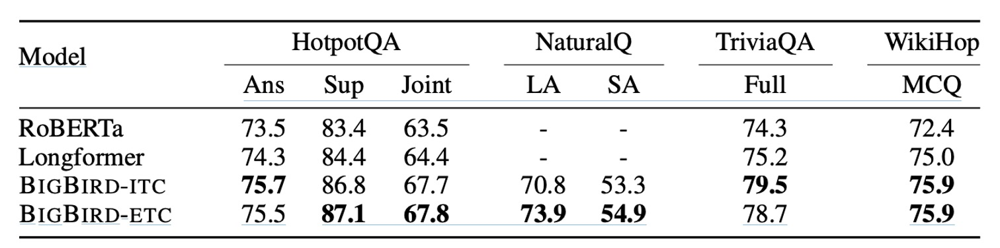

## ビッグバード

[**Big Bird: Transformers for Longer Sequences**](https://arxiv.org/abs/2007.14062)

---

Transformer の自己注意機構の計算複雑度は $O(n^2)$ です。

もしあるアルゴリズムの計算複雑度がこのような形で現れると、非常に大きな最適化の余地があることを意味します。

ん？どうしてまたこの始まり？

## 問題の定義

Transformer モデル（例えば BERT）は、並列計算能力と現代のハードウェアのサポートのおかげで、さまざまな自然言語処理タスクで優れたパフォーマンスを発揮しています。しかし、自己注意機構によって引き起こされる計算およびメモリの要求は、シーケンス長の二乗に比例し、長いコンテキストを必要とするタスクへの直接的な応用を制限しています。

**Longformer** の登場後、Google Brain チームは **BigBird** を提案しました。これは、長いシーケンスの処理に特化した Transformer の変種です。

- [**Longformer: 長距離注意機構**](../2004-longformer/index.md)

### 基本理論の不足

それに加えて、著者は過去の研究がすべて経験則に基づいたものであり、自己注意モデルに対する理論的な分析を提供していないと考えています。彼らは、過去の研究が自己注意モデルのパフォーマンスに影響を与える重要な要素と表現能力に対する理解が不十分であることを指摘しています。過去の研究では Transformer がチューリング完全であることが示されていますが、計算複雑度を削減しながらこの能力を維持できるかどうかは明確ではありません。

このような動機を基に、著者は BigBird モデルを提案しました。このモデルは、長いシーケンスタスクで優れたパフォーマンスを実現しながら、理論的な表現能力を維持するために、スパース注意機構を使用しています。

:::tip
チューリング完全性とは、システムがチューリングマシンと同じ計算能力を持ち、計算可能なすべてのタスクをシミュレートできることを指します。

これは、チューリング完全なシステムがあらゆるアルゴリズムやコンピュータープログラムを実行でき、理論的に無限の計算能力を持つことを意味します。ただし、十分な時間とリソースがあればの話です。
:::

## 解決問題

### モデルアーキテクチャ

この論文の概念は非常にシンプルで、この図を見るだけでほぼ理解できます。

BigBird のアーキテクチャでは、著者は 3 種類のコンポーネントを設計し、最終的にスパースなアーキテクチャを形成しました：

- 上図 (a) はランダム注意機構で、モデルの各層のトークン間でランダムに接続を構築します。
- 上図 (b) はスライディングウィンドウ注意機構で、各トークンは前後の固定範囲内のトークンにのみ注意を払います。
- 上図 (c) はグローバル注意機構で、特定のトークンは他のすべてのトークンに注意を払い、同時に他のトークンもそのトークンに注意を払います。
- 上図 (d) は、これら 3 つの機構を組み合わせて、BigBird の注意機構を形成します。

### アーキテクチャ設計

著者は 2 種類の異なるグローバルトークン選択方法を設計し、後の実験で比較を行いました：

- **BIGBIRD-ITC（内部 Transformer 構造）**

  - **グローバルトークンの選択**：この設計では、いくつかの既存のトークンが「グローバル」トークンとして指定されます。これにより、これらのトークンはシーケンス内のすべての他のトークンに注意を払うことができます。
  - **行列表示**：グローバルトークンとして選ばれたインデックス集合 $G$ に対して、対応する隣接行列 $A$ は調整され、すべてのグローバルトークン $i$ に対して、$A$ の行と列のすべての要素を 1 に設定します（すなわち、$A(i, :) = 1$ および $A(:, i) = 1$）。これにより、これらのトークンはシーケンス内のすべての他のトークンと相互作用することができます。

- **BIGBIRD-ETC（拡張 Transformer 構造）**

  - **追加のグローバルトークン**：ITC とは異なり、ETC 設計は追加のグローバルトークン（例えば CLS トークン）を導入します。これらのトークンは、すべての既存のトークンに注意を払うように設計されています。
  - **行列の拡張**：これらの追加のグローバルトークンを含めるために、元の隣接行列 $A$ は新しい行列 $B$ に拡張されます。$A$ に $g$ 行を追加し、新しい行列 $B$ では、この$g$ 行のすべての要素が 1 に設定されます（すなわち、$B(i, :) = 1$）。これにより、新しいグローバルトークンがシーケンス全体に注意を払うことができます。

### 証明前に

ここからは本論文で最も難解な部分が始まります。著者は BigBird の理論的な性質を証明し、「ランダム注意機構」を採用する理由を説明します。

結論を先に使っても問題ありませんが、せっかくなので少しだけ見てみましょう。

証明の前に、著者が自己注意機構についてどのように理論的に説明しているかを見てみましょう：

1. **一般化された注意機構**

   - BigBird モデルは、各層の Transformer でシーケンス $X = (x_1, \ldots, x_n)$ を処理するために、一般化された注意機構を使用します。
   - 注意機構は有向グラフ $D$ で表現され、グラフのノードセットは $[n] = \{1, \ldots, n\}$ であり、有向エッジは考慮される内積の集合を示します。

2. **注意出力ベクトル**

   - グラフの各ノード $i$ に対して、生成される出力ベクトル $\text{ATTND}(X)_i$ はノード $i$ とその隣接ノード $N(i)$ に基づいて計算されます。
   - 具体的な計算方法は次の通りです：
     $$
     \text{ATTN}_{D}(X)_i = x_i + \sum_{h=1}^H \sigma \left(Q_h(x_i) K_h(X_{N(i)})^T\right) \cdot V_h(X_{N(i)})
     $$
   - ここで、$Q_h, K_h, V_h$ はそれぞれクエリ、キー、バリュー関数で、$R^d$ を異なる空間にマッピングします。
   - $\sigma$ はスコア関数で、softmax や hardmax が使用されます。
   - $H$ はヘッドの数です。

3. **完全グラフとスパース化**：

   - もし$D$が完全な有向グラフであれば、それは Vaswani らが記述した完全な二次注意機構に戻ります。
   - グラフ$D$のスパース化は、ノード間で一定数のランダムエッジを選択することによって実現され、計算複雑度を削減します。

4. **ランダムスパースグラフ**：

   - 完全グラフを近似するためにランダムグラフの概念を利用します。これらのグラフは、固有値特性において完全グラフに似ており、拡張器として機能します。
   - 最も単純な Erdos-Rényi モデルを使用し、各エッジは固定された確率で独立に選ばれます。

5. **局所性とスライディングウィンドウ**：

   - 多くの NLP タスクや計算生物学の背景では、大量の参照情報が局所性を示し、隣接するトークンから情報を抽出することが多いです。
   - BigBird モデルでは、この局所性に対応するためにスライディングウィンドウ注意機構を使用します。

6. **グローバルトークンの使用**：

   - グローバルトークンを導入して、シーケンス内のすべてのトークンを扱う状況を模倣します。これらのトークンは注意計算で重要な役割を果たし、シーケンス全体の処理に関与します。

---

上記の説明では、新しい内容は特にありませんが、これを通じて、元々の注意機構は「一般化された注意機構」の一部であり、「特例」に過ぎないことが示されています。

この「特例」とは完全な有向グラフであり、注意機構を「特製」の有向グラフに調整することがスパース注意機構への道を開くことを意味しています。

また、なぜランダム注意機構が採用されたのかも説明されています：

- 完全グラフを「近似」する必要があるからです。

ランダムグラフの概念を用いて完全グラフを近似し、これらのグラフはスペクトル特性で完全グラフに似ており、拡張器として使用されます。ここでは、最も単純な Erdos-Rényi モデルを使用し、各エッジが独立した確率で選ばれます。

:::tip
もし、グラフ畳み込みニューラルネットワーク（GCN）や他のグラフニューラルネットワークに関する研究を行ったことがあれば、ここで言う「ノード」はトークンを指し、「エッジ」は注意接続を指し、「隣接行列」は注意グラフを指します。

なぜ注意機構が提案された後、グラフ畳み込みが流行らなくなったのか？それは注意機構が実質的にもっと汎用的なグラフ畳み込みであり、深さを積み重ねるのが簡単で、訓練も容易だからです。
:::

### 証明開始

Transformer のエンコーダースタックは、本質的に一連の繰り返しの単層エンコーダーであり、各エンコーダーにはそれぞれのパラメータセットがあります。

この構造は、複数の段階を通じて入力データを処理することを可能にし、各層は前の層の出力を基にデータをさらに変換します。

- **パラメータ化**：

  - **H**：各エンコーダー層の注意ヘッドの数。
  - **m**：各注意ヘッドのサイズ。
  - **q**：出力ネットワークの隠れ層のサイズ。

- **注意機構**：

  - 有向グラフ $D$ によって定義されます。従来の注意機構（例えば Vaswani らが提案したもの）とは異なり、この構成では、各シーケンスの開始時に特別なマーカー $x_0$ を追加します。このマーカーは、シーケンスの集約情報を表すためや、特定のコンテキスト要求に対応するために使用されます。グラフ $D$ の頂点集合にはこの特別なマーカーが含まれており、すなわち $\{0\} \cup [n] = \{0, 1, 2, \ldots, n\}$ です。

- **入力および出力処理**：

  - 初めに追加された余分なノード $x_0$ があっても、Transformer はシーケンスを $\mathbb{R}^{n \times d}$ から $\mathbb{R}^{n \times d}$ にマッピングするように概念化されています。
  - 最終出力層では、余分なノードとそのベクトルを破棄すると仮定し、出力の次元が入力と一致することを確認します。
  - 入力行列 $X$ に位置埋め込み $E \in \mathbb{R}^{d \times n}$ を追加し、モデルがシーケンス内での要素の位置に基づいてシーケンスデータを解釈する能力を強化します。

- **一般的な近似**：

  - 関数クラス $\text{FCD}$ は、連続関数の集合 $f: [0, 1]^{n \times d} \to \mathbb{R}^{n \times d}$ として定義され、連続性は特定の$p$-ノルムに基づいて定義された位相で評価されます。
  - 関数近似の品質を測る距離尺度は、$p$-ノルム距離 $d_p(f_1, f_2) = \left(\int \|f_1(X) - f_2(X)\|^p \, dX\right)^{1/p}$ です。

    :::tip
    あなたが大きな平面を持っていると想像してください。この平面上の各点は、2 つの数字で説明できます。それは地図の緯度と経度のようなものです。

    この例では、この平面は $[0, 1]^{n \times d}$ と呼ばれ、行と列がたくさんある大きな表のように思えます。その中で、各セルの数字は 0 と 1 の間にあります。

    関数$f$は、この大きな表の各点（または各行と列の数字）を別の新しい数字のセットに変換する特別な規則のようなものです。これにより、同じ大きさの新しい表が出力されます。この変換プロセスは、一定の滑らかさと連続性を満たす必要があります。つまり、出力の数字は急激に変化せず、連続的で秩序立った変化を持つということです。
    :::

- **定義：$0$ を中心にした星型グラフ $S$**

  - ここで、星型グラフ $S$ は特別なグラフ構造で、1 つの中心ノード（0 番ノード）が、グラフ内の他のすべてのノード（1 番から n 番まで）と直接接続されています。
  - この構造は非常に重要で、中心ノードが他のすべてのノードに直接影響を与えることを可能にするため、後の証明で使用される重要な特性です。

- **定理：疎注意機構の一般的な近似能力**

  - 定理は、あるグラフがこの星型グラフ $S$ を含んでいれば、そのグラフで定義された疎注意機構は汎用近似器として使用できることを述べています。
  - これは、このような Transformer モデルが関数クラス $FCD$ 内の任意の連続関数を近似できることを意味します。

- **証明ステップ 1：分割定数関数で$FCD$を近似**

  最初に扱う関数$f$は、有界領域 [0, 1)$^{n \times d}$ に定義された連続関数です。このような関数を近似するために、分割定数関数を選んで近似します。具体的には、[0, 1) 範囲を適切に小さな格子（粒度$\delta$）に分割し、領域全体が離散的な点集合$G_{\delta}$になります。各小格子内では、関数の値を定数と仮定します。これにより、新しい分割定数関数 $\bar{f}$ を使って元の関数$f$を近似できます。

- **証明ステップ 2：修正された Transformer で分割定数関数を近似**

  これは証明全体で最も重要なステップです。このステップでは、自己注意機構を利用して入力のコンテキストマッピングを生成します。各行列$X$とその列$x_i$は一意のコードにマッピングされ、そのコードが一意の出力列を生成するために使用されます。疎注意機構だけを使用しているため、各クエリがこのマッピングを完成するために十分な情報を得ることを保証する方法が重要な課題です。解決策として、入力行列内のデータ範囲に基づいて調整を行う疎移動演算子が開発され、各列のデータが完全で一意なマッピングを形成することが保証されます。

- **証明ステップ 3：元の Transformer で修正された Transformer を近似**

  最後のステップは、修正された Transformer モデルを元の Transformer モデル（ReLU と softmax 関数を使用）で近似することです。このステップにより、これらの修正が元のモデルの基本的な機能と効率から逸脱しないことが保証されます。

### チューリング完全性

実際、Pérez らの研究によると、完全な注意機構に基づいた Transformer モデルはチューリング完全であることが示されています。つまり、あらゆるチューリング機械の計算プロセスをシミュレートできるということです。

ただし、この結果は理論的な仮定に基づいています。それは、モデルが「任意の精度でデータを処理できる」という前提です。

実際の応用では、この仮定は成立しません。なぜなら、Transformer は実際には有限状態機械であり、真のチューリング完全性には達していないからです。

- **疎注意機構でもチューリング機械をシミュレートするのに十分か？**

  本文では、適切な調整を行うことで、疎エンコーダとデコーダを使用する Transformer もチューリング完全を実現できることが述べられています。

  この疎注意機構は、実際の操作では、各トークンが前のトークンとだけ相互作用することを要求します。BERT の完全な注意機構とは異なり、デコーディング過程ではトークンごとに動作します。

  さらに、Pérez らの方法では、各トークンがテープ履歴の表現としても機能し、完全な注意機構はテープ上の正しいシンボルを移動および検索するために使用されます。

  疎注意機構の実装において、履歴記録を指すアドレススキームの変更が必要ですが、その他のアーキテクチャはほとんどそのまま適用可能です。

  これにより、疎構成であっても、Transformer は任意の計算プロセスをシミュレートできる潜在能力を持っていることが示され、これがさまざまな複雑な計算タスクにおける Transformer の応用の理解と拡張に対する理論的な基盤を提供します。

:::tip
チューリング完全性（Turing Completeness）とは、ある計算システムが任意のチューリング機械の計算プロセスをシミュレートできる能力を指します。チューリング機械は数学者アラン・チューリングによって提案された抽象的な機械で、無限の紙テープ上にシンボルを読み書きするための簡単な規則を使用します。チューリング完全なシステムは、計算可能な任意の関数を実現できる、すなわち、他のすべてのチューリング完全システムが実行できる計算タスクを実行できることを意味します。これは、計算システムの能力を評価する重要な基準であり、例えばプログラミング言語やプロセッサアーキテクチャにおいても利用されます。
:::

### 疎注意機構の制限

この課題は、$n$ 個の単位ベクトル $\{u_1, ..., u_n\}$ が与えられたとき、各ベクトル $u_j$ に対して対応する最遠ベクトル $u_j^*$ を見つけることです。

ここでの「最遠」とは、ベクトル空間で 2 つのベクトル間のユークリッド距離が最大であることを意味します。実際には、これが内積を最小化することに相当します。

完全な注意機構では、この課題は比較的簡単に解決できます。なぜなら、この機構はすべてのベクトル対に対して内積計算を許すからです。

言い換えれば、完全な自己注意機構は、すべてのベクトル対間の関係を同時に評価できるため、$O(1)$ 層で各ベクトルの最遠ベクトルを見つけることができます。

疎注意機構の場合、状況は大きく異なります。

著者は、直交ベクトル予想（Orthogonal Vector Conjecture、OVC）に基づき、疎注意機構ではこの問題を解決するのが難しいことを指摘しています。定理は、任意の$O(n \log^k n)$（$O\tilde{}$ は多項式の対数因子を隠す）辺を持つ疎注意グラフ $D$ において、最遠ベクトルの検索のような簡単な問題を解くためにも、$\Omega(\tilde{n}^{1-o(1)})$ 層が必要であることを示しています。

これは、疎注意機構では計算資源の消費を削減できるものの、特定のタイプの問題を解決する際に、実際にはより多くの層が必要であり、実用上の制限になる可能性があることを示しています。

:::tip
OVC は計算複雑性理論の中で広く使用されている仮定であり、次二次時間で$n$個のブールベクトルの最小内積が 0 かどうかを判断することができないと示しています。
:::

## 討論

本節では、自然言語処理（NLP）タスクにおいて、より長い入力シーケンスを処理する利点を示すことを目的としています。ここでは、マスク言語モデル（MLM）、証拠を伴う質問応答（QA）、および長文書分類の 3 つの代表的なタスクを選んで研究を行いました。これらのタスクは、長い連続的なシーケンスを利用してより良い文脈表現を学習する可能性を探ることを目的としています。

### QA-dev

- **データセット**：HotpotQA、Natural Questions、TriviaQA、WikiHop を含む。
- **評価指標**：基本的なサイズのモデルを使用し、WikiHop の精度、および HotpotQA、Natural Questions、TriviaQA の F1 スコアを報告。

ここでは、RoBERTa、Longformer、BIGBIRD-ITC、BIGBIRD-ETC などの複数のモデル性能を比較しています。BIGBIRD-ETC モデルは、全域トークンの拡張設計の下で、他のすべてのモデルにおいて一貫して優れたパフォーマンスを示しました。

### QA Test finttune

- **タスクとデータセット**：HotpotQA、Natural Questions、TriviaQA、WikiHop を含む。
- **ベンチマーク**：BIGBIRD-ETC モデルと BIGBIRD を除いたランキング上位 3 つのモデルを比較。

この実験では、BIGBIRD-ETC が複数のデータセットで新しい SoTA（最先端技術）を確立しました。特に Natural Questions の長い答え、TriviaQA、WikiHop のテストで優れた結果を示しました。単一モデルの BIGBIRD と比較して、他の上位エントリーは集合モデルが多いため、BIGBIRD が精度の高い答え選択で若干劣る理由はここにある可能性があります。

### 長文書要約能力

このセクションでは、BIGBIRD モデルを用いて長文書の要約実験の設計と成果について考察しています。特に、長い範囲のテキストを処理する際に、モデルがどのように顕著な改善を示したのかを説明します。実験では、長文書向けに設計された 3 つのデータセットを使用しました。実験結果は上記の通りであり、BIGBIRD の疎エンコーダと完全なデコーダを適用することで、長文書データセットを訓練した際に要約の質と精度が効果的に向上することを証明しました。

この改善は、モデルがより長いテキスト範囲を処理できることによって、ファイル内の分散した重要な情報をより良く理解し、統合できることに起因しています。

これらの観察結果は、NLP タスクにおける BIGBIRD の潜在能力と実際の利益を際立たせ、特に深いテキスト分析と理解が必要なアプリケーションシナリオでの有効性を強調しています。

:::tip
Pegasus（Pre-training with Extracted Gap-sentences for Abstractive SUmmarization Sequence-to-sequence models）は、テキスト要約タスクのために設計された事前学習方法で、Google Research チームによって開発されました。Pegasus の核心的な革新は、その事前学習戦略であり、特に要約タスクのニーズに最適化されています。

Pegasus の事前学習プロセスでは、「gap sentences prediction」（GSP）戦略が採用されています。このプロセスでは、ドキュメントからいくつかの文をランダムに選び、それらを「マスク」（つまり削除）し、モデルがこれらのマスクされた文を予測することを求められます。これは、従来のマスク言語モデル（例えば BERT）とは少し異なり、BERT が通常、単語やトークンをランダムにマスクするのに対し、Pegasus は文全体をマスクします。
:::

## 結論

これまでの Sparse Transformer や Longformer などのモデルと比べて、本文の主要な貢献は、疎注意機構に対する詳細な数学的理論の証明を提供した点にあります。

また、完全な注意機構を近似したい場合には、ランダム、スライディングウィンドウ、一部全域といった方式でモデルの注意機構を設計する必要があることを指摘しています。

Transformer モデルの理論的特性を深く研究することで、著者は疎注意機構の汎用近似能力を示し、この機構が長いシーケンスタスクを処理する際の優越性を証明しました。

証明方法の詳細については、論文の付録に約 20 ページ分の内容があり、興味のある読者は元の論文を参照することをお勧めします。
