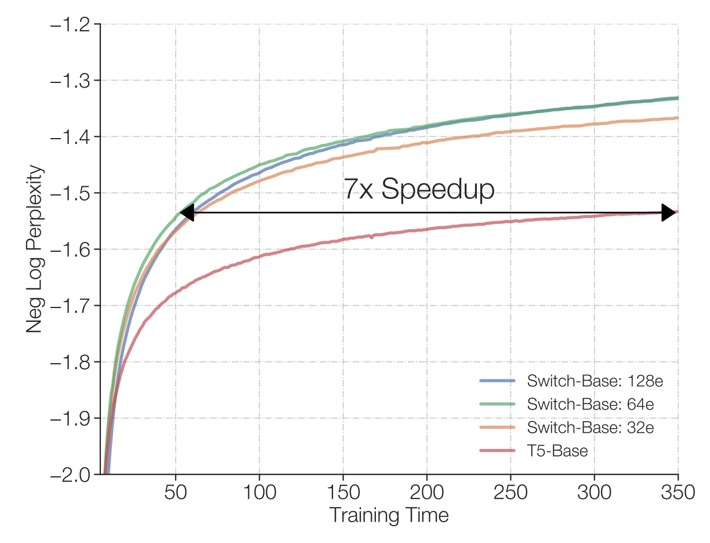

## 専門家に話をさせる

[**Switch Transformers: Scaling to Trillion Parameter Models with Simple and Efficient Sparsity**](https://arxiv.org/abs/2101.03961)

---

大規模言語モデル（LLM）の効果が良いことは誰もが知っている。

しかし、無闇にパラメータを積み上げる方法は、結局限界に達する。

## 問題の定義

一つのアイデアは微調整のアプローチを取ることで、以前見た LoRA のようなものだが、これでは根本的な問題を解決していない。

根本的な問題は、採用しているモデルのアーキテクチャが計算集約型であり、それが高い計算コストを引き起こしている点だ。

それに加えて、自己注意機構の$O(n^2)$の複雑度により、モデルの規模が増加するにつれて計算量が指数関数的に増加し、現在のハードウェアリソースではもはや実行不可能となる。

もう一つの解決策としては、専門家の混合モデル（Mixtures of Experts、MoE）がある。

MoE は新しい概念ではなく、2017 年に Google Brain がこのアイデアを提案した。

- [**[17.01] Outrageously Large Neural Networks: The Sparsely-Gated Mixture-of-Experts Layer**](https://arxiv.org/abs/1701.06538)

    

    <figure style={{"width": "50%"}}>
    
    </figure>
    

MoE はモデルを複数の「専門家」に分解し、1 つの「ルーター」が入力トークンの特性に基づいて、最も適切な専門家にそのトークンを割り当てる方式を採っている。この「疎起動」の戦略により、各データの計算量を増加させることなく、モデルのパラメータ数を大幅に増やすことができる。

言い換えれば、MoE の目標は「非常に大きなサイズのモデルを作りつつ、毎回の計算で少数のコンポーネントだけを起動する」ことにあり、同じハードウェアコストでより良いパフォーマンスを達成することを目指している。

著者は、MoE モデルが「top-$k$」専門家ルーティング戦略（$k > 1$）を採用していることについて、これはルーターに複数の専門家を比較するスペースを提供するものの、計算と通信のコストを相対的に複雑にしているため、このプロセスは簡素化できると考えている：

- **多くの人が話すように、ここでの「専門家」は、1 人で十分だ！**

## 解決問題

### モデルアーキテクチャ

<figure style={{"width": "90%"}}>

</figure>

モデルアーキテクチャ図から、Switch Transformer の設計コンセプトが明確にわかります：

1. **従来の FFN を疎な専門家層（Switch FFN）に置き換え**：

   一般的な Transformer では、各トークンが同じ FFN 重みを通じて前方計算を行います。しかし、Switch Transformer では、FFN が複数の「専門家（Experts）」に分解され、各専門家は独立した FFN です。

2. **ルーター（Router）の役割**：
   図にはルーターが表示されており、各トークンの特徴（例えば、入力された単語ベクトル表現）に基づいて、どの専門家に処理を任せるかを動的に選びます。

   - 例えば、図にある二つのトークン（x1 = "More"、x2 = "Parameters"）に対して、ルーターはそれぞれのトークンを計算し評価し、その後 x1 を特定の専門家に渡し、x2 を別の専門家または同じ専門家に渡して処理します。

3. **疎な特性**：
   各トークンは最終的に一つの専門家 FFN により処理されるため（元々の密な FFN ではすべてのトークンを一度に処理するわけではない）、これが「疎性」を意味します。つまり、全体で複数の専門家パラメータがありますが、毎回使用されるのはその中のごく一部であり、計算量が大幅に減少します。

4. **出力とルーターの重み（Gate Value）**：
   各トークンは選ばれた専門家 FFN を通過した後、ルーターによって生成された「gate value」を掛け算します。この値は、専門家がそのトークンを処理する際の信頼度や重要度を示す加重因子のようなものです。

これが Switch Transformer の「複数の専門家、個別のトークンに割り当て」の動的ルーティングメカニズムです。

### 専門家容量

<figure style={{"width": "90%"}}>

</figure>

複数の専門家（Experts）が一組のバッチ内のトークンを処理する際、事前に各専門家が処理できる最大トークン数の上限を定めます。

この上限は「専門家容量（expert capacity）」によって決まり、その計算方法は次の通りです：

$$
\text{expert capacity} = \frac{\text{total tokens in batch}}{\text{num experts}} \times \text{capacity factor}
$$

つまり、各専門家の「スロット」数は固定されており、「容量因子（capacity factor）」で追加の空間を調整します。

各トークンはルーター（Router）の計算を通過し、ルーターの確率分布に基づいて最も適切な専門家に割り当てられます。理想的な状態では、トークンが均等に割り当てられ、すべての専門家の容量がちょうど埋まり、オーバーフローが発生せず、それぞれが自分の役割を果たします。

もし、ある専門家に他の専門家よりも多くのトークンが割り当てられると（不均等な割り当て）、「Overflow（オーバーフロー）」が発生します。これは、その専門家の容量がすでに満杯であるため、追加のトークンはその層で処理できず、次の層に直接移動することを意味します（図の赤い破線で示されています）。

容量因子を増加させることで、オーバーフローが発生する確率を減らし、より多くの空間を確保することができます。しかし、逆に言うと、いくつかのケースでは専門家の一部の空間が空いている（図の白い空間はトークンが埋められていない「パディング」を示しています）ことになり、これは余分な計算と通信コストを意味します。

したがって、Switch Transformer は「専門家容量」と「トークンルーティング」間のバランスを取る必要があり、最適なパフォーマンスを達成するための工夫が求められます。

### 負荷バランス損失

ルーターが常に同じ専門家にトークンを割り当てないようにするために、Switch Transformer は微分可能な負荷バランス損失を導入しました。

基本的な概念は、各専門家に割り当てられるトークン数と、ルーターがその専門家に与える総確率値ができるだけ均等になるようにすることです。ここで、$f_i$は専門家$i$に割り当てられたトークンの割合（fraction of tokens）、$P_i$はその専門家に対する平均的なルーティング確率値（fraction of probability）を示します：

$$
f_i = \frac{1}{T} \sum_{x \in B} 1\{\arg\max p(x) = i\},
$$

$$
P_i = \frac{1}{T} \sum_{x \in B} p_i(x).
$$

すべての専門家に均等に割り当てたい場合、理想的な状態は$f_i \approx \frac{1}{N}$かつ$P_i \approx \frac{1}{N}$です。したがって、補助損失関数は次のように定義されます：

$$
\text{loss}_{\text{aux}} = \alpha \cdot N \sum_{i=1}^{N} f_i P_i,
$$

ここで、$\alpha$はハイパーパラメータ（本研究では$\alpha = 10^{-2}$）です。分配がより均等であれば、$f_i$と$P_i$が$1/N$に近づき、$f_i P_i \approx \frac{1}{N^2}$となり、全体的な損失が低くなります。

このメカニズムは訓練中に追加の勾配を提供し、モデルがより均等な負荷分配を達成するように促します。

### 改良された訓練と微調整

Switch Transformer の疎な専門家モデルは、特にハードスイッチングルーティングの決定や低精度形式（例えば bfloat16）の使用により、訓練中に不安定さを引き起こす可能性があります。

著者は以下の 2 つの改善技術を提案しています：

1. **選択的精度管理**：ルーティング関数内で float32 精度を局所的に使用し、デバイス内でのみ計算を行い、その後結果を bfloat16 に戻す方法です。この方法は、bfloat16 訓練の速度を維持しつつ、float32 の安定性を確保します。
2. **小さなパラメータ初期化**：深層学習モデルの成功には初期化が重要です。著者は、Transformer の初期化比率$s=1.0$を 10 倍減少させることを提案しています。この戦略は、モデルの質を向上させ、初期訓練時の不安定さを減らします。

また、微調整段階での過剰適合問題を解決するために、著者は以下の簡単で効果的な方法を提案しています：

- **専門家層内部でのドロップアウトの追加、いわゆる「Expert dropout」**。

微調整段階で各専門家層に異なるドロップアウト率を設定することで、過剰適合を効果的に軽減し、少ないサンプルの下流タスクでパフォーマンスを向上させることができます。

## 討論

### 密度モデルとの比較

著者は Switch T5 Base と密度モデルの基準を比較した結果、Switch Transformer アーキテクチャを使用したモデルは、101 の言語すべてにおいて性能向上を示すことがわかりました。

専門家の疎性を導入した Switch Transformer は、多言語および多タスクの事前訓練設定において、単に密なパラメータを増やすモデルよりも全体的なパフォーマンスが優れており、改善は個別の言語にとどまらず、全体的にパフォーマンスが向上しています。

### 専門家の数の影響

<figure style={{"width": "90%"}}>

</figure>

著者は論文内でいくつかのスケーリング特性について議論しており、最初に専門家の数がモデルのパフォーマンスに与える影響について述べています。

- **左図**：

  - 横軸はモデルのパラメータ量（主に専門家数の増加によって達成される）、
  - 縦軸はモデルの困惑度（perplexity）。

  図の最左上の点は T5-Base（約 2.23 億パラメータ）に対応しています。専門家数を右下に増やすことで（2 人から 256 人に増加）、パラメータ量は大幅に増加しますが、使用される計算量は大体変わりません。

  結果は、計算予算が同じままであっても、専門家数を増やすことでモデルの困惑度が減少し続け、すなわちモデル品質が向上することを示しています。

---

- **右図**：

  - 横軸は訓練ステップ数（steps）。
  - 縦軸は負の対数困惑度（negative log perplexity）、数値が大きいほど困惑度が低い（モデルの性能が良い）ことを示します。

  図は密度モデル（密なベースライン、紫線で示す）と複数の専門家数配置での Switch-Base モデルを比較しています。結果として、同じ計算予算での密度モデルと比べて、専門家数が多い Switch-Base モデルは、同じ訓練ステップ数でより良いパフォーマンスを達成し、より良い「サンプル効率（sample efficiency）」を示しています。

総じて、固定された計算リソースで専門家数（およびパラメータ数）を増やすことで、Switch Transformer はモデル品質を向上させ、学習の進行を加速させることができ、疎専門家手法を通じてモデル拡張が効果的であることが証明されています。

### 固定計算と訓練時間

<figure style={{"width": "70%"}}>

</figure>

著者は同じ TPU コアリソースと各サンプルに対して同じ FLOPs 設定での訓練結果を比較しました。

結果は、上図に示されているように、従来の密な Transformer と比べて、Switch Transformer（特に 64 人の専門家を持つモデル）は、より短時間で T5-Base と同じ品質パフォーマンスを達成でき、T5-Base の必要時間の七分の一で同等の困惑度レベルを得ることができました。また、この品質基準に到達した後、Switch Transformer はさらにモデルパフォーマンスを改善し続けることが可能です。

### モデルとデータ並列化

著者はさらに、大規模な訓練シナリオで「データ並列化」、「モデル並列化」および「専門家並列化」などのリソース配分戦略を同時に考慮する方法について探求しました。

1. **データ並列化（Data Parallelism）**：
   訓練データを複数の部分に分割し、各計算コアが異なる部分のデータを処理しますが、モデルのパラメータは各コアで同じです。訓練が終了した後、各コアが得た勾配を統合し、全体のモデルパラメータを更新します。この方法は単純で、順伝播や逆伝播の途中でパラメータや中間計算結果をコア間で通信する必要はなく、最後に勾配を統合するだけですが、モデルが大きくなると、個々のコアのメモリや計算負荷が増大します。

2. **モデル並列化（Model Parallelism）**：
   モデルのパラメータ（例えば FFN 内の大きな重み行列）を異なるコアに分割し、各コアがその一部の重みのみを保持して計算します。これにより、モデルがより大きくなり、単一のコアで巨大な重み行列を保存する必要がなくなります。ただし、計算中にコア間で頻繁に通信が発生するため、計算の効率性は低下します。例えば、FFN の入力と出力はコア間で伝達・統合する必要があります。

3. **専門家並列化（Expert Parallelism）**：
   これは Switch Transformer の特徴的な部分です。モデルの一部（例えば FFN 層）を複数の「専門家（experts）」に分割し、各専門家が異なるコアで動作し、ルーティングメカニズムに従って各トークンが一つの専門家で計算されるようにします。これにより、計算量を大幅に増加させることなくパラメータ数を増やすことができます。しかし、専門家の数がある程度増えると効果が小さくなり、最適なリソース利用を実現するためにはデータ並列とモデル並列の併用が必要です。

詳細な図は以下の通りです：

<figure style={{"width": "90%"}}>

</figure>

この図は、分散訓練におけるモデルの重みとデータの異なる計算コア間での分割戦略を示しています。全体の図は上下に分かれています：

- **上半部分**：
  異なるサイズの形状で、モデル内の異なる大きさの重み行列（例えば FFN 層の大きな重み行列）を示します。各コアにはその重みの一部が配置され、各コアが一定量のパラメータを担うことになります。大きな重み行列ほど、各トークンは多くの計算を実行する必要がありますが、全体として重みを切り分けることでコア間の負荷を均等にします。

- **下半部分**：
  トークンバッチの切り分け方法を示します。各コアには等量のトークンが与えられ、コア間のメモリ使用の一貫性を維持します。しかし、データ分割戦略が異なると、各コアが保持するトークンが同じか異なるかに違いが生じ（色分けされた方格で区別されます）、これが訓練のパフォーマンスや通信コストに影響を与えます。

データ並列、モデル並列、専門家並列を組み合わせることで、著者は 3950 億および 1.6 兆パラメータ規模の Switch Transformer を訓練し、同等の FLOPs 条件下で T5-XXL モデルより優れた困惑度パフォーマンスを示しました。

これは、巨大規模のパラメータ拡張が理論的に可能であり、サンプル効率を改善できることを意味します。しかし、Switch-XXL モデルでは依然として訓練中の不安定性が偶発的に発生するため、実際の応用では安定性が避けられない問題であることが示唆されています。

:::tip
モデルがクラッシュすると、投入したリソースがその瞬間に無駄になりますので、慎重に扱う必要があります。
:::

### 効果はパラメータ数によるものか？

はい、著者は認めています、Switch Transformer の利点は大量のパラメータ数に基づいています：

- **しかし、これは意図的な設計戦略です！**

同じ計算予算でパラメータ数を増やすことで、サンプル効率と性能の向上が得られます。同時に、従来の FLOPs（計算量）のみを増やす拡張方法と比較して、このアプローチは「同じ時間、同じ計算量でより良い結果を得る」価値を示しています。

### 小型モデルは使えるか？

著者は強調しています、Switch Transformer は非常に大規模なモデル（数百億から数兆パラメータ）に焦点を当てていますが、少数の専門家（例えば 2 人）であっても、標準的な GPU/TPU で実行可能であり、性能の向上をもたらします。言い換えれば、小型や中型の規模でも研究者やユーザーはこの手法から利益を得ることができます。

### 稀疎モデルが広く採用されない理由は？

これまでの密度モデルの成功と、ハードウェアがこれらの密なモデルに迅速に対応し最適化されたことが、稀疎手法を試す動機を弱めていました。また、過去の稀疎モデルは実装や訓練に多くの問題（ルーティングメカニズムの複雑さ、訓練の不安定性、コア間の通信問題）に直面していました。

Switch Transformer の設計は、これらの問題を顕著に改善し、稀疎モデルの採用のハードルを下げました。

## 結論

Switch Transformer は、Mixture of Experts（MoE）の設計を簡素化することにより、理解しやすく、安定した訓練とサンプルの効率的な活用を実現したモデルアーキテクチャを提供しています。この簡素化により、Switch Transformer の実装は容易になり、適用範囲が広がりました。

密度モデルのベースラインと比較して、Switch Transformer は複数の自然言語処理タスクと異なる訓練モードで優れたパフォーマンスを示し、顕著な加速効果を達成しました。

著者は、「稀疎モデル」の応用が確実に探求する価値のある方向であり、この研究がより多くの人々にこの分野に注目してもらうことを望んでいます。
