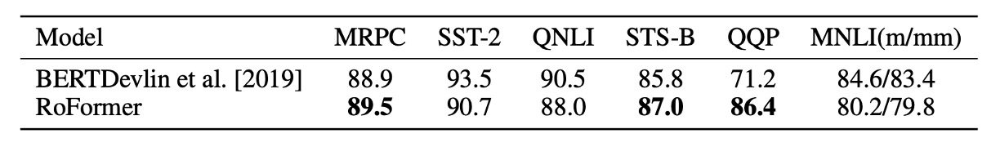

## 回転位置エンコーディング

[**RoFormer: Enhanced Transformer with Rotary Position Embedding**](https://arxiv.org/abs/2104.09864)

---

RoFormer という名前よりも、実際には RoPE の方がよく知られているかもしれません。

RoPE は RoFormer のコア概念であり、正式名称は「Rotary Position Embedding」で、新しいタイプの位置エンコーディング方法です。

## 問題の定義

RNN や CNN とは異なり、Transformer は位置に対する帰納的バイアスを持っていません。

そのため、モデルがシーケンス内の順序を理解できるように、追加で位置情報を提供する必要があります。

一般的には、位置エンコーディングは位置情報をベクトル形式に変換し、それを入力のトークン埋め込みに「加える」ことによって行われます。

### 絶対位置：三角式

- [**Attention Is All You Need**](https://arxiv.org/abs/1706.03762)

最初の Transformer 論文では、三角関数を用いた位置エンコーディングが採用されました。

$$
PE_{(pos, k)} = \begin{cases}
\sin(pos/10000^{2i/d_{\text{model}}}) & \text{if } k = 2i \\
\cos(pos/10000^{2i/d_{\text{model}}}) & \text{if } k = 2i + 1
\end{cases}
$$

この関数は、シーケンスの長さと特徴の次元を同時に考慮し、各位置に固定の位置エンコーディングを割り当てます。

三角関数は生成規則が固定されているため、外挿能力を持っています。

:::tip
**数式中の 10000 は何ですか？**

この 10000 の物理的な意味は、位置エンコーディングのスケールとして解釈できます。位置エンコーディングのスケールを適切な範囲に制限することで、異なる位置間の関係を効果的に捉えつつ、あまり高すぎるまたは低すぎる周波数が及ぼす悪影響を避けることができます。

もし位置エンコーディングの 10000 を 100 に変更すると、正弦関数と余弦関数の周波数が増加し、各位置の位置エンコーディングはより短い距離で周期的に繰り返されることになります。これにより、モデルは遠くの位置間の関係を捉える能力が低下する可能性があります。なぜなら、それらの位置エンコーディングがより似ているものとして表示されるからです。
:::

### 絶対位置：訓練式

- [**BERT: Pre-training of Deep Bidirectional Transformers for Language Understanding**](https://arxiv.org/abs/1810.04805)

BERT や GPT などのモデルでは、位置エンコーディングは訓練を通じて得られます。

最大シーケンス長を$N$とした場合、位置エンコーディングの次元は$d_{\text{model}}$であり、位置エンコーディングの行列は$N \times d_{\text{model}}$となります。

この設計の利点は非常にシンプルであり、特に深く考えることなく使用できることですが、欠点としては、シーケンス長が変更されると再訓練が必要であり、長いシーケンスへの汎化が難しいことです。

:::tip
実際、外挿性が絶対位置エンコーディングの明らかな欠点ではないこともあります。興味のある読者は、蘇劍林のこの記事を参照できます：

- [**层次分解位置编码，让 BERT 可以处理超长文本**](https://spaces.ac.cn/archives/7947)
  :::

### 相対位置：XL 式

- [**Transformer-XL: Attentive Language Models Beyond a Fixed-Length Context**](https://arxiv.org/abs/1901.02860)

この論文では、自己注意機構における$QK^T$の展開を行っています：

- $Q_i=(x_i+pos_i)W_Q$
- $K_j=(x_j+pos_j)W_K$
- $Q_iK_j^T=(x_i+pos_i)W_QW_K^T(x_j+pos_j)^T$

最終的に、次の式が得られます：

- $Q_iK_j^T=x_iW_QW_K^Tx_j^T+x_iW_QW_K^Tpos_j^T+pos_iW_QW_K^Tx_j^T+pos_iW_QW_K^Tpos_j^T$

次に、$pos_j$を相対位置ベクトル$R_{i-j}$に置き換え、$pos_i$を学習可能なベクトル$u$, $v$に置き換えた結果、次のようになります：

- $Q_iK_j^T=x_iW_QW_K^Tx_j^T+x_iW_QW_K^T{\color{red}{R_{i-j}^T}}+{\color{green}{u}}W_QW_K^Tx_j^T+{\color{green}{v}}W_QW_K^T{\color{red}{R_{i-j}^T}}$

その後、$uW_Q$と$vW_Q$は学習可能なパラメータであり、それらを一つにまとめることができます。これにより、次の式が得られます：

- $Q_iK_j^T=x_iW_QW_K^Tx_j^T+x_iW_QW_K^T{\color{red}{R_{i-j}^T}}+{\color{green}{u}}W_K^Tx_j^T+{\color{green}{v}}W_K^T{\color{red}{R_{i-j}^T}}$

${\color{red}{R_{i-j}^T}}$のエンコーディング空間と元々の$pos_j$のエンコーディング空間が異なるため、$W_K^T$を$W_{K, R}^T$に置き換えて次の式が得られます：

- $Q_iK_j^T=x_iW_QW_K^Tx_j^T+x_iW_QW_{K, R}^T{\color{red}{R_{i-j}^T}}+{\color{green}{u}}W_K^Tx_j^T+{\color{green}{v}}W_{K, R}^T{\color{red}{R_{i-j}^T}}$

最後に、この論文では QKV の V 行列には位置エンコーディングが追加されていません。その後の研究でも、QK 行列（すなわち注意行列）にのみ位置エンコーディングが追加されています。

### 相對位置：T5 式

- [**Exploring the Limits of Transfer Learning with a Unified Text-to-Text Transformer**](https://arxiv.org/abs/1910.10683)

T5 では、著者はコンテンツ情報と位置情報を解耦し、位置に関連する情報をすべて$\beta_{i,j}$に格納しました。これにより、次の式が得られます：

- $Q_iK_j^T=x_iW_QW_K^Tx_j^T + \beta_{i,j}$

### さらに多くの内容

ここではすべての位置エンコーディング方法を振り返るつもりはありません。さらに詳細な内容については、蘇劍林のウェブサイトの記事を参照してください：

- [**研究者を悩ませる Transformer 位置エンコーディング**](https://spaces.ac.cn/archives/8130)

## 解決問題

過去の研究を振り返ると、絶対位置エンコーディングと相対位置エンコーディングはそれぞれに利点と欠点があります。

本研究では、絶対位置エンコーディングと相対位置エンコーディングを融合する方法を提案することを目指しています。

### モデルアーキテクチャ

Transformer ベースの言語モデリングでは、通常、自己注意機構を通じて各トークンの位置情報を活用します。著者は、内積が相対的な形でのみ位置情報をエンコードすることを希望しました：

$$
\langle f_q(x_m, m), f_k(x_n, n) \rangle = g(x_m, x_n, m - n)
$$

最終的な目標は、関数 $f_q(x_m, m)$ と $f_k(x_n, n)$ が上記の関係式を満たすような等価なエンコーディング機構を見つけることです。

一連の導出の結果（**詳細は論文をご参照ください**）、著者が提案する解は次の通りです：

- $f_q(x_m, m) = (W_q x_m) e^{im\theta}$
- $f_k(x_n, n) = (W_k x_n) e^{in\theta}$
- $g(x_m, x_n, m - n) = \Re \left[ (W_q x_m)(W_k x_n)^* e^{i(m - n) \theta} \right]$

ここで、$\Re$ は実部を取る演算子、$*$ は共役複素数、$\theta$ はゼロでない定数です。

:::info
**オイラーの公式と回転**

オイラーの公式の中心的な概念は回転です。複素数 $z = x + iy$ に対して、これを平面上の点 $(x, y)$ と見なすことも、ベクトル $(x, y)$ と見なすこともできます。複素数 $z$ に $e^{i\theta}$ を掛けることは、ベクトル $(x, y)$ を原点を中心に逆時計回りに $\theta$ 度回転させることと等価です。

一例として、マークダウンでざっくりした図を描いてみましょう：

- **初期状態**

  ```
      y
      ^
      |
      |   z = x + iy
      |
      +-----------------> x
  ```

- **回転後**

  複素数 $z$ に $e^{i\theta}$ を掛けると、ベクトル $(x, y)$ を逆時計回りに $\theta$ 度回転させることになります：

  ```
      y
      ^
      |        z' = e^{i\theta}z
      |       /
      |      /
      |     /
      |    /
      |   /  z = x + iy
      |  /
      | /
      |/
      +-----------------> x
  ```

これは、$e^{i\theta}$ がオイラーの公式を使って次のように展開できるからです：

- $e^{i\theta} = \cos(\theta) + i\sin(\theta)$

この公式は、複平面上の単位ベクトルが原点を中心に $\theta$ 度逆時計回りに回転することを示しています。

- **特殊なケース**

  $\theta = \pi$ の場合、次のようになります：

  - $e^{i\pi} = -1$

  これは、複素数 $z$ を $e^{i\pi}$ で掛けることが、ベクトルを 180 度回転させて反対方向のベクトルを得ることを意味します。したがって、次の有名な恒等式が得られます：

  - $e^{i\pi} + 1 = 0$

  この公式はオイラーの恒等式として知られ、数学の中で最も美しい公式の一つであり、自然対数の底 $e$、虚数単位 $i$、円周率 $\pi$、1、0 を巧妙に結びつけています。
  :::

:::tip
論文中で、$in\theta$ という形式が登場しますが、ここでの $n\theta$ は回転角度の倍率を表しています。

$f_q(x_m, m)$ と $f_k(x_n, n)$ の形式は、複平面上でそれぞれのベクトルが $m\theta$ と $n\theta$ の角度で回転していることを示しています。

ここでの $m$ と $n$ はパラメータで、異なる周波数成分や空間的位置を表しています。この形式は、異なる回転角度における 2 つのベクトルの挙動を捉えることができます。

$$
g(x_m, x_n, m - n) = \Re \left[ (W_q x_m)(W_k x_n)^* e^{i(m - n)\theta} \right]
$$

ここで、$i(m - n)\theta$ は 2 つの回転角度の差を示しています。
:::

### 高次元拡張


RoPE の図による説明は上の通りです。

2 次元空間での結果を任意の $x_i \in R^d$ （$d$が偶数の場合）に拡張するために、著者は $d$ 次元空間を $d/2$ のサブ空間に分割し、内積の線形特性を利用して $f\{q,k\}$ を次のように変換しました：

$$
f\{q,k\}(x_m, m) = R^d_{\Theta,m} W_{\{q,k\}} x_m
$$

ここで、

$$
R^d_\Theta,m =
\begin{pmatrix}
\cos m\theta_1 & -\sin m\theta_1 & 0 & 0 & \cdots & 0 & 0 \\
\sin m\theta_1 & \cos m\theta_1 & 0 & 0 & \cdots & 0 & 0 \\
0 & 0 & \cos m\theta_2 & -\sin m\theta_2 & \cdots & 0 & 0 \\
0 & 0 & \sin m\theta_2 & \cos m\theta_2 & \cdots & 0 & 0 \\
\vdots & \vdots & \vdots & \vdots & \ddots & \vdots & \vdots \\
0 & 0 & 0 & 0 & \cdots & \cos m\theta_{d/2} & -\sin m\theta_{d/2} \\
0 & 0 & 0 & 0 & \cdots & \sin m\theta_{d/2} & \cos m\theta_{d/2}
\end{pmatrix}
$$

は、予め設定されたパラメータ $\Theta = \{\theta_i = 10000^{-2(i-1)/d}, i \in [1, 2, ..., d/2]\}$ を持つ回転行列です。

RoPE を自己注意機構に適用した場合、次の式が得られます：

$$
q^\top_m k_n = (R^d_{\Theta,m} W_q x_m)^\top (R^d_{\Theta,n} W_k x_n) = x^\top W_q R^d_{\Theta,n-m} W_k x_n
$$

ここで、$R^d_{\Theta,n-m} = (R^d_{\Theta,m})^\top R^d_{\Theta,n}$ です。注意すべき点は、$R^d_\Theta$ が直交行列であるため、位置情報をエンコードする過程での安定性が保証されることです。

### 長距離減衰


著者は元々の Transformer の設計思想を引き継ぎ、$\theta_i=10000^{-2i/d}$ を設定して、位置エンコーディングの長距離減衰特性を提供しています。上の図に示されたように、2 つの位置間の距離が増加するにつれて、位置エンコーディング間の内積が減少します。これは、テキスト内のより遠くの位置間の関係が弱くなると予想されるためです。

## 討論

### 他の位置エンコーディングとの比較


上の図は、RoPE と他の位置エンコーディング方法の比較を示しています。

左側は BERT との比較です。RoPE を使用したモデルが訓練過程でより良い性能を示し、MLM Loss が速く減少していることがわかります。右側は RoPE を PerFormer に追加した場合で、訓練過程での収束速度が速く、訓練終了時により良い性能を達成しています。

### GLUE ベンチマーク



著者は Hugging Face の Transformers ライブラリを使用して微調整し、GLUE データセットで実験を行いました。

実験結果から、RoFormer は GLUE データセットで BERT を上回る性能を示し、RoPE が自然言語処理タスクで有効であることを示しています。

### 制限

この研究は強力な理論的サポートと励みになる実験結果を提供していますが、著者は以下の制限が存在すると考えています：

1. 数学的には相対位置関係を 2D サブ空間内で回転として表現しましたが、この方法がなぜ他の位置エンコーディング戦略を使用したベースラインモデルよりも速く収束するのかについては、まだ深い説明が不足しています。
2. モデルが長距離減衰という有利な特性を持っていることは証明されていますが、これは既存の位置エンコーディング機構に似ており、長いテキストの処理において他のモデルよりも優れた性能を発揮しますが、まだ納得のいく説明が見つかっていません。

## 結論

この論文は少し難解かもしれませんが、RoPE の概念は非常に興味深く、原著を読むことを強くお勧めします。

現在、すでに多くの研究（例えば LLaMA や Mamba）が RoPE を使用しており、RoPE が自然言語処理の分野で非常に広い適用範囲を持っていることを示しています。

今後、RoPE に関する多くの研究が進められ、改良が加えられることでしょう。再びこのテーマについて話すことを楽しみにしています。
