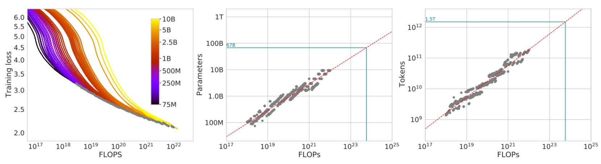
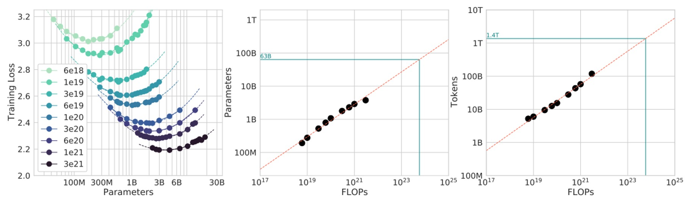
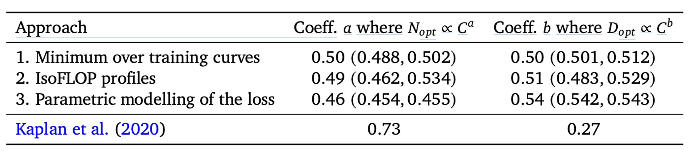

## チンチラの瞳

[**Training Compute-Optimal Large Language Models**](https://arxiv.org/abs/2203.15556)

---

これらの論文の著者による、意味不明な命名方法については、もうツッコミを入れる気力もありません。

この論文は、進化版の Scaling Laws であり、著者は過去のいくつかの見解を覆し、新たな訓練戦略を提案しています。

:::tip
もしまだ Scaling Laws について知らない場合は、以前の記事を参考にしてください：

- [**[20.01] Scaling Laws: モデルのスケーリング法則**](../2001-scaling_laws/index.md)
  :::

## 問題の定義

最近の大型言語モデルは、密なアーキテクチャを持つトランスフォーマーや混合専門家（MoE）モデルに関わらず、ますます大きなパラメータ数を追求しており、何十億、さらには五百億パラメータという規模に達することが多いです。

このような拡張は、訓練コストや推論コストの急増、またこれらのモデルに与えるために必要となる、より大きく、より高品質なデータセットの必要性といった一連の問題を引き起こします。いくらモデルが大きくても、満足のいく結果を得ることができません。

この論文の著者が解決しようとしている問題は次の通りです：

- **与えられた計算（FLOPs）予算の下で、「モデルサイズ」と「データ量」の最適な組み合わせを選択し、言語モデルの最終的な事前訓練損失を最小化する方法。**

Scaling Laws はすでに「与えられた計算リソースで、どのサイズのモデルを選ぶべきか？」という問題に対して答えようとしていますが、Scaling Laws では訓練のトークン数と学習率スケジュールを固定して実験を行っており、そのため結論には少し偏りがあります：

- **Scaling Laws の分析は、「モデルを大きくすればよいが、データ量はあまり増やさなくてもよい」という提案に偏りがちです。**

しかし、この論文の著者は、学習率と訓練ステップ数の調整方法を変更することで、モデルのサイズと訓練データ量は同等の割合で増加すべきだと考えています。

より正式な記述として、著者は最適解を次のように定義しています：

$$
N_{\text{opt}}(C), D_{\text{opt}}(C) \;=\; \arg\min_{N,D \;\;s.t.\;\; \text{FLOPs}(N,D)=C}\, L(N,D),
$$

ここで：

- $N$ はモデルのパラメータ数、
- $D$ は訓練トークンの数（訓練データの量を示す）、
- $C$ は固定された計算予算（つまり、与えられた計算リソースと時間内で、訓練に使える総 FLOPs の量）、
- $L(N, D)$ は、パラメータ数が$N$、訓練トークン数が$D$での事前訓練損失です。

この論文の目的は、固定された計算予算$C$のもとで、「モデルのサイズ（N）」と「訓練トークンの数（D）」を同時に最適化することです。

## 解決問題

以下の文章の読解を容易にするため、次の専門用語に対応する用語を覚えておいてください：

- $C$：固定された計算リソース（FLOPs）予算
- $N$：モデルサイズ（パラメータ数）
- $D$：訓練データ量（訓練トークン数）

著者はこの論文の中で、$C$に対する「最適な$N$と$D$のスケーリング関係」を推定するための 3 つの異なる方法を提案しています。

### 方法 1：固定されたモデルサイズ（$N$）

この方法では、まず「モデルサイズのセット」を固定し、各モデルサイズについて異なる訓練データ量を試すというアプローチを取ります。

モデルサイズは約 70M パラメータから 10B パラメータを超えるまでで、各サイズについて 4 回の独立した訓練を行い、各訓練で使用するデータ量の差は最大で 16 倍にもなります。訓練中、学習率はスケジュールに従って減衰し、各設定でスムージングと補間を行い、連続的な損失曲線を得ます。

この実験設計により、「特定の FLOPs 予算$C$のもとで、どの$(N, D)$の組み合わせが最も低い損失$L(N,D)$を達成できるか？」という問題に直感的に答えることができます。

数学的に言えば、著者は次の最適化問題を解こうとしています：

$$
N_{\text{opt}}(C), D_{\text{opt}}(C) = \arg\min_{N, D \; s.t. \; \text{FLOPs}(N,D)=C} L(N,D).
$$

この過程で、著者は対数スケール（log scale）で分布する 1500 個の異なる$C$値（すなわち異なる FLOPs 予算）を選択し、対応する$N_{\text{opt}}(C)$と$D_{\text{opt}}(C)$を観察しました。

フィッティングを通じて、最適なパラメータ設定はおおよそ次のように一致することがわかりました：

$$
a = 0.50, \quad b = 0.50
$$

つまり、使用可能な計算リソース$C$が増加するにつれて、最適な戦略はモデルパラメータ数$N$と訓練トークン数$D$をほぼ$C^{0.5}$の比率で同時に増加させることです。この結果は、過去の文献での提案と大きく異なり、従来はモデルサイズが訓練データ量よりも速く増加すべきだと考えられていました。

実験結果は以下の図に示されています：

図の左側では、各曲線が異なるモデルサイズ$N$と訓練データ量$D$に対応しています。横軸は訓練に使用された FLOPs の量、縦軸は訓練中のモデルの損失$L$です。

著者はこれらの訓練曲線を描き、包絡線（エンベロープ）を取り、任意の FLOPs 予算$C$における最小可能損失$L_{\min}(C)$を観察しました。

包絡線を通じて、固定された計算予算の下で、最適な$(N, D)$の組み合わせがないか、より良い結果を得るためにモデルサイズと訓練トークン数の比率を調整するべきかを判断できます。

次に、図の中央では、異なる FLOPs$C$の下で包絡線から推定される「最適なモデルパラメータ数$N_{\text{opt}}(C)$」を示しています。簡単に言うと、特定の FLOPs の下で最適なモデルサイズはどれかを示しています。

右側の図では、FLOPs が変化する中で「最適な訓練トークン数$D_{\text{opt}}(C)$」を示しています。これらの点を抽出した後、著者は冪律（パワーロウ）関係を使ってフィッティングし、$N_{\text{opt}}(C) \propto C^a$および$D_{\text{opt}}(C) \propto C^b$のようなスケーリング関係を見つけました。

図中の緑の点線は、Gopher モデルで使用された FLOPs（約$5.76 \times 10^{23}$）との比較を示しています。

同じ計算リソースの下で、これらの包絡線と推定された冪律関係に基づいて、最適な$N_{\text{opt}}$と$D_{\text{opt}}$が Gopher の元々の設計と大きく異なることがわかります。つまり、論文の分析に基づいて設定を調整すれば、同じ計算リソースの下でより低い損失を得ることができるということです。

### 方法 2：固定された訓練データ量（$D$）

この方法では、著者はまず FLOPs 予算のセットを固定し、その後、各固定された$C$についてモデルサイズ$N$と訓練トークン数$D$を調整して、最終的に訓練にかかる FLOPs がちょうどその$C$値になるようにします。

簡単に言うと、「FLOPs 消費を一定に保ち」、この「等 FLOPs 線」に沿って、異なるモデルサイズが最終的にどのような損失$L$を得るかを確認します。

理論的に、この図は通常「U 字型曲線」（またはやや放物線の谷間）を描くことになります。これは、最適なモデルサイズ$N_{\text{opt}}(C)$が、固定された計算リソースの下で最小の損失を達成することを示しています。著者はこの曲線を放物線関数でフィッティングし、最小値の位置を求めました。

このフィッティングを通じて、著者は次のような冪律に基づくデータ点を得ました：

$$
N_{\text{opt}} \propto C^a \quad \text{と} \quad D_{\text{opt}} \propto C^b.
$$

実験結果は以下の図に示されています：

計算したところ、$a \approx 0.49$、$b \approx 0.51$となりました。

同様に、これも計算予算$C$が増加するとき、最適な戦略はモデルサイズ$N$と訓練トークン数$D$をほぼ$\sqrt{C}$の割合で一緒に成長させることです（$0.5$次乗が平方根になるため）。

最後に、この結果を Gopher 訓練に使用された FLOPs 予算に適用して予測を行いました（図中の緑色マーカー）。

結論は前の方法と似ており、現在の大きなモデルはおそらくサイズが大きすぎて、訓練トークン数は相対的に少なすぎるということです。この結果に基づけば、同じ計算リソースの下でモデルを小さくし、訓練トークン数を増やすことで、理論的にはより良い最終的な損失を達成できると考えられます。

### 方法 3：整合的パラメータ化モデル

「方法 1」と「方法 2」で得られた多くの実験データ$(N, D, L)$があるので、適切な数学モデルを用いて、最終損失データを同時にフィッティングし、そこから導き出される最適なスケーリングルールを求めてみましょう。

仮定するパラメータ化された関数形式は以下のようになります：

$$
\hat{L}(N,D) = E + \frac{A}{N^\alpha} + \frac{B}{D^\beta}.
$$

このモデルにおいて：

- $E$ は理想的な状況下で、データ生成プロセスにおける自然言語コーパスの理論的損失下限（テキストのエントロピーに類似）として考えることができます。
- $\frac{A}{N^\alpha}$ は、モデルを極限まで訓練しても、有限のモデルサイズでは依然として存在するバイアス（偏り）を表します。$N$ が増加するにつれて、モデルは理想的な生成プロセスにより近づきますが、完全にはその差を埋めることはありません。
- $\frac{B}{D^\beta}$ は、訓練トークン数が不十分で、訓練ステップ数が足りないために生じる「未訓練」エラーを表します。$D$ が増加すると、このエラーは減少します。

著者は次に、L-BFGS オプティマイザーを使用して Huber 損失を最小化し、$\hat{L}(N,D)$が実際に観察された実験損失$L$と対数スケール（$\log L$）でできるだけ一致するようにしました。

ここでの目的関数は次のように定義されます：

$$
\min_{A,B,E,\alpha,\beta} \sum_{i} \text{Huber}_\delta\bigl(\log \hat{L}(N_i,D_i) - \log L_i\bigr),
$$

このパラメータ化されたモデルを得た後、著者は固定された FLOPs 予算$C$の下で最適化問題を解き、$N_{\text{opt}}(C)$と$D_{\text{opt}}(C)$を求めます。

さらに、FLOPs と$N$、$D$の関係はおおよそ$\text{FLOPs}(N,D) \approx 6ND$（Scaling Laws の結論を参考）であることが知られており、この制約を組み込むことで、数学的に$N_{\text{opt}}(C)$と$D_{\text{opt}}(C)$が冪律関係にあることがわかります：

$$
N_{\text{opt}}(C) \propto C^a, \quad D_{\text{opt}}(C) \propto C^b,
$$

ここで、

$$
a = \frac{\beta}{\alpha+\beta}, \quad b = \frac{\alpha}{\alpha+\beta}.
$$

フィッティングとパラメータ推定を経て、著者は$a \approx 0.46$および$b \approx 0.54$であることを発見しました。これは前の二つの方法で得られた結論と非常に近いものであり、$N$と$D$を同じ割合で同時に増加させるべきだと依然として示唆しています。

最後に、著者はこのパラメータ化されたモデルを使用して、さまざまな等損失曲線（isoLoss contours）や等 FLOPs スライス（isoFLOP slices）を描き、青色の「効率的フロンティア」（efficient frontier）を使って、同じ計算リソースの下で最低損失を達成する$(N,D)$の組み合わせを示しました。以下の図の通りです：

Gopher で使用されている計算リソース予算に適用したところ、最適なモデルサイズは約 40B パラメータであると予測され、元々の Gopher の 280B よりもかなり小さくなり、その分、より多くの訓練トークンが必要であることがわかりました。

## 討論

前三つの方法の実装詳細と分析方法は異なりますが、それらが示す提案は非常に似通っています：

- **計算リソース（FLOPs）が増加する際、最適な方法はモデルパラメータ数$N$と訓練データ量（トークン数）$D$をほぼ「等比例」に拡張することです**。

つまり、もし計算リソース$C$が増加すれば、最適な戦略は$N_{\text{opt}}(C) \propto C^a$および$D_{\text{opt}}(C) \propto C^b$であり、$a$と$b$はどちらも約 0.5 です。

<figure style={{"width": "90%"}}>

</figure>

これに対して、Scaling Laws の結論（上表参照）では、$N$はより速く成長すべき（$a \approx 0.73$）とし、$D$はより遅く成長するべき（$b \approx 0.27$）としています。著者の分析結果は、これまでの考え方が訓練トークン数の増加の効果を過小評価していた、すなわち「データ量」の重要性が無視されていたことを示唆しています。

その後、著者は次の表に、理想的な状態で「計算リソース最適化フロンティア」に位置するさまざまなモデルサイズに対して必要な FLOPs と対応する訓練トークン数を示しました：

<figure style={{"width": "80%"}}>

</figure>

結果として、例えば 1750 億パラメータのモデル（GPT-3 のような規模）を実際に「計算リソース最適化」された状態で訓練するには、必要な FLOPs とトークン数が現在の一般的な方法よりはるかに多くなることがわかります。つまり、あれほど大きなモデルを完全に最適化された状態で訓練するには、計算量と訓練データ量が現在の主流の投入規模を超える必要があります。

また、Gopher の訓練規模（約$5.76 \times 10^{23}$ FLOPs）を本研究の分析に照らし合わせると、最適なモデルサイズは約 67B パラメータであり、Gopher が使用した 280B のモデルよりも 4 倍小さく、必要な訓練トークンははるかに多くなります。

:::tip
著者は論文内でこれらの結果に関して「外挿時の不確実性がある」と特に言及していますが、現代の多くの大型言語モデルが「十分なデータ」を使用していない、つまりそのパラメータ規模が与えられた計算リソースとデータ量に対して「計算リソース最適化された選択」ではないことが明確に示されています。
:::

### Chinchilla のパフォーマンス

<figure style={{"width": "80%"}}>

</figure>

著者は自分たちのモデルを Chinchilla と名付け、さまざまなベンチマークでそのパフォーマンスをテストしました。これには言語モデリングタスクや MMLU などが含まれます。上記の図は、Chinchilla が The Pile のさまざまなサブデータセットでどのようにパフォーマンスを発揮したかを示しています。

実験結果によると、Chinchilla は Gopher に比べて bits-per-byte（bpb）スコアで顕著な改善を見せました。つまり、文字予測の精度、すなわち圧縮効果が Gopher よりも優れているということです。Jurassic-1（178B パラメータ）と比較しても、dm_mathematics と ubuntu_irc の 2 つのサブセットでわずかに劣っているだけで、その他の点では Chinchilla の方が優れています。

:::info
論文には非常に多くの実験結果があり、大多数が一貫した結論に至っています。興味のある読者は、元の論文を参照してください。ここでは詳細を省略します。
:::

## 結論

最後に、著者は訓練超大型モデルのコストが非常に高いため、実際に検証を行ったのは Chinchilla と Gopher という 2 つの大規模な点のみで、連続的な中規模の「実験点」は行っていないことを認めています。

さらに、彼らの分析は$N_\text{opt}(C)$と$D_\text{opt}(C)$の関係が単純な冪律であると仮定していますが、規模が拡大するにつれて曲率が発生する可能性があり、これは超高算力の下で最適なモデルサイズがさらに小さくなる可能性を示唆しています。また、彼らの実験は「1 エポック未満」の訓練で行われており、データは 1 回しか見ていません。将来的には「複数エポック」の状況を考慮する必要があるかもしれません。

それでも、Chinchilla は Gopher に対する結果として、理論を良く証明しています：同じ訓練コストの下で、より小さくても訓練データをより多く使用したモデルが、単に大規模なモデルを積み上げるだけのモデルよりも優れることが示されました。研究者はモデルのサイズだけでなく、データセットの拡張と品質にもっと重点を置くべきであることを示唆しています。

最後に、著者は「モデルサイズ vs. 訓練データ量」の最適化関係は言語モデルに限らず、他の分野のモデル訓練にも適用可能であると予測しています。大型モデルを訓練する際には、最適なモデルサイズと訓練スケジュールを予測することで、多くのリソースの無駄を避けることができると期待されます。

:::tip
このような結論にお金をかけた結果には感謝の気持ちを持って受け入れています。
:::
