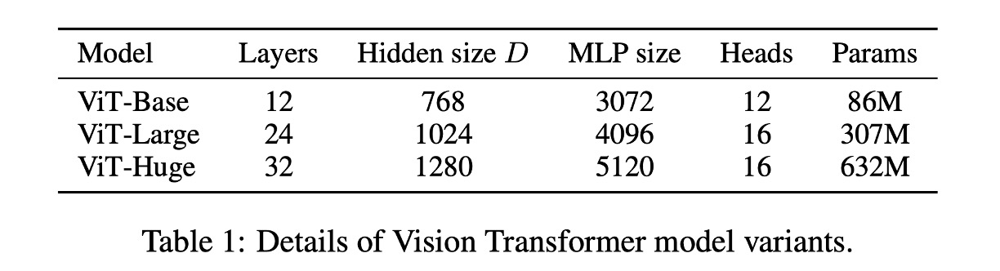
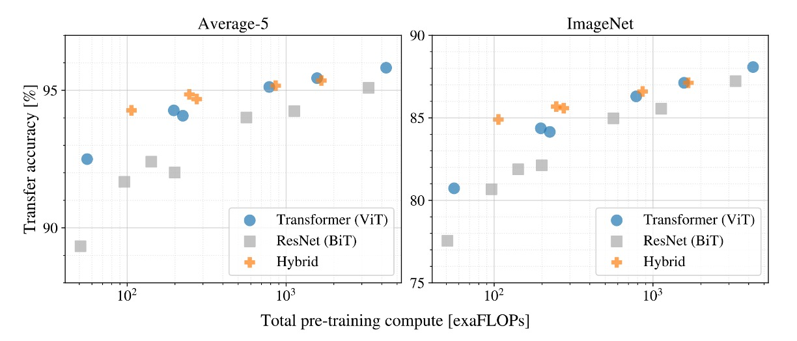

# [20.10] ViT

## 新世界の開拓者

[**An Image is Worth 16x16 Words: Transformers for Image Recognition at Scale**](https://arxiv.org/abs/2010.11929)

---

2017 年に Transformer モデルが提案され、NLP 分野で大きな反響を呼び起こしました。あっという間にその影響は広がり、戦火が飛び交うようになりました。

この風は 3 年間吹き続け、ついにその煙はコンピュータビジョン分野にも届きました。

## 定義問題

ここ数年の試みの中で、多くの研究者が注意機構と畳み込みネットワーク（CNN）を組み合わせる方法を試みました。

また、畳み込みネットワークの構造を変更せずに一部を置き換えるというアプローチもありました。

これらの研究は、Transformer アーキテクチャを画像領域に直接適用するのは難しいことを示唆しています。

本論文の著者は次のように考えています：

- **それはあなたたちの方法が間違っているだけだ！**

我々は畳み込みを完全に放棄し、Transformer を用いて画像を処理することができる。

画像とは、結局のところ 16x16 の文字の集まりに過ぎないのだ！

## 解決問題

### モデルアーキテクチャ


Transformer についてはよく知られています。

まず、テキストを埋め込み（Embedding）してシーケンスを作り、それをエンコーダに通し、デコーダを経て最終的に出力を得ます。

画像にこのアーキテクチャを適用する際に最初に考えるべき問題は：

- **画像をどのように文字のシーケンスに変換するか？**

ここで著者が提案した方法は：切り分けることだ！

### Patchify

与えられた画像が 224x224 のサイズだと仮定した場合、どのようにそれを小さな領域に分割するかを考えてみましょう。

手動で切るのですか？もちろん違います！

ここで著者は Conv2d 操作を導入し、このタスクを完了させます。

実際にコードを書いてみましょう：

```python
import torch
import torch.nn as nn

# 仮の画像サイズは224x224
dummy_img = torch.randn(1, 3, 224, 224)

# 切り分ける
patch_size = 16

# 埋め込み次元
embed_dim = 768

# Patchify
emb_layer = nn.Conv2d(3, embed_dim, kernel_size=patch_size, stride=patch_size)

# 切り分け後の結果：
# input.shape = (1, 3, 224, 224)
# tokens.shape = (1, 768, 14, 14)
tokens = emb_layer(dummy_img)
```

ここでは画像を 16x16 のサイズに切り分け、埋め込み次元を 768 に設定しています。

畳み込みのストライドによるオーバーラップのないスライディングウィンドウを使用することで、224x224 の画像を 14x14 のブロックに切り分けることができます。

元々の Transformer では、テキストのシーケンスの各トークンを埋め込みますが、ここでも同じことを行います。各切り分けた画像ブロックを埋め込むということは、各 16x16x3 の領域を線形変換で 768 次元のベクトルに投影することを意味します。

最後に、これらの切り分け結果をフラット化してシーケンスに変換します：

```python
tokens = tokens.flatten(2) # (1, 768, 14, 14) -> (1, 768, 196)
tokens = tokens.permute(2, 0, 1) # (1, 768, 196) -> (196, 1, 768)
```

Transformer エンコーダの入力では、最初の次元がシーケンスの長さ、2 番目の次元がバッチサイズ、3 番目の次元が特徴量の埋め込み長さです。

上記の操作を経て、Transformer に入力できるシーケンスが得られました。

### その後は？

その後は終了です。

その後は NLP の Transformer と同じように、好きなように進めていけばよいのです。

うーん！違う、こんな早く終わってはいけません！

＊

下表は ViT のパラメータ設定です：



### 帰納的バイアスなし

Transformer アーキテクチャには、画像に対する帰納的バイアス（inductive bias）がありません。

ViT では、MLP 層だけが局所的かつ平行移動不変であり、自己注意機構はグローバルで、2 次元の近傍の構造関係は非常に少ないです。

そのため、モデルはゼロから学習を始め、理解しなければなりません：画像とは何か？画像の特徴とは何か？

これが、Transformer から ViT への移行に時間がかかった理由であり、初期の研究のほとんどは畳み込みネットワークよりも優れた結果を出せなかったため、うまくいかなかったのです。

:::tip
**畳み込みネットワークの帰納的バイアスとは？**

畳み込みネットワークの帰納的バイアスとは、畳み込みネットワークが設計上、画像の平行移動不変性と局所性に強い偏りを持つことです。この偏りは、畳み込みカーネルの設計によって実現され、カーネルの共有重みと局所的な受容野により、畳み込みネットワークは画像の局所的な特徴を捉え、画像の平行移動不変性に対して非常に優れた性能を持ち、他の画像認識タスクにも容易に一般化できます。
:::

### 訓練データは大きくなければならない


実験から、訓練データが十分でない場合、ViT の性能は畳み込みネットワークに比べて大きく劣ることが分かります。

上の図では、灰色の線が ResNet50x1（BiT）および ResNet152x2（BiT）の結果を示しており、他の色の線が ViT の結果です。下の横軸は訓練データの量を示しており、データ量が 300M に達した時、ViT の性能はようやく畳み込みネットワークを超えました。

著者は次のように考えています：

- **小さなデータセットでは、畳み込みネットワークの帰納的バイアスが重要です。**
- **大きなデータセットでは、データから関連するパターンを直接学習することが十分です！**

:::tip
ViT モデルの読み方：

- ViT-L/16：Large モデル、16 x 16 の切り分け
- ViT-L/32：Large モデル、32 x 32 の切り分け

切り分けのサイズが小さいほど、埋め込みの解像度が高くなり、モデルの性能が向上しますが、計算量も増加し、平方関係で増加します。
:::

### さらに大きくできる



もし訓練を続けたら、どうなるでしょうか？

この実験では、著者は 3 つの異なるモデルを使用しました：

- ViT
- ResNet
- ハイブリッドモデル

実験結果では、訓練データが十分大きくなると、ViT の性能は ResNet を超えることが分かりました。

また、ハイブリッドモデルは小さなモデルでは ViT より若干優れた性能を示しましたが、モデルが大きくなると、この差は消失しました。

最終的に、ViT は試行した範囲内では飽和しておらず、まだ多くの潜在能力を引き出す余地があることが分かりました。

:::info
人々は、畳み込みによる局所特徴処理がどんなサイズの ViT にも役立つと期待するかもしれませんが、そうではありません。
:::


## 討論

### ViT が見たものは？


著者は最初の層で画像のパッチを低次元空間に投影し、最初の 28 個の主成分を取り出しました。

- **自己注意機構（上図左）**

  ViT は自己注意機構を通じて、画像全体の情報を統合できます。最初の層でもこの能力を発揮しています。

  注意重みは、画像空間内で情報統合の平均的な距離を計算するために使用され、これは CNN における受容野サイズに似ています。

  モデルは最初の層で画像の大部分に注意を向けており、これはそのグローバル情報統合能力を示しています。他の注意ヘッドは低層ではより局所的に集中しています。

- **位置埋め込み（上図中）**

  空間的に近いパッチは似た埋め込みを持ち、これらの埋め込みが画像内のパッチ間の距離関係を符号化できることを示しています。

  埋め込みからは行列の構造が見え、大きなグリッドでは顕著な正弦構造が観察されることもあります。

- **注意距離（上図右）**

  この「注意距離」は、CNN における受容野サイズに似ています。

  低層の各注意ヘッドでは平均注意距離に大きな変動があり、いくつかのヘッドは画像の大部分に注意を向け、他のヘッドはクエリ位置やその周辺の小さな領域に集中しています。

  深さが増すにつれて、すべてのヘッドの注意距離が増加します。ネットワークの後半では、ほとんどのヘッドが広範囲にわたって長い注意距離を持ち、これがモデルがこれらの層でグローバル情報に多くの注意を払っていることを示しています。

### \[CLS\] 予測を使うか、GAP 予測を使うか？


本論文では、著者は分類タスクに対して二つの異なる方法を使用しています：

- **\[CLS\] 予測**

  これは NLP でよく使われる方法で、シーケンスの最初のトークンをシーケンス全体の表現として使用します。

  この方法は画像領域でも良い結果を得ており、注目されています。

- **GAP 予測**

  GAP（Global Average Pooling）は一般的な特徴抽出方法で、特徴マップの各チャンネルを平均してベクトルを得る手法です。

  初めに著者はこの方法を試しましたが、非常に悪い結果となりました！

  詳しく分析した結果、問題は GAP にあるのではなく、「学習率」を大きく設定しすぎたことが原因であることが分かりました。

調整後、両方の予測方法は良い結果を得ました。

:::tip
私たちの経験では、Transformer アーキテクチャは学習率に非常に敏感であり、ViT でも同様です。
:::

### 自己教師あり学習

著者は MLM（Masked Language Modeling）による学習方法を試みました：画像の 50%のトークンを破壊する方法で、次の方法を使いました：埋め込みを学習可能な\[MASK\]（80%）で置き換え、ランダムに他のトークンに置き換え（10%）、またはそのまま保持（10%）。

次に JFT データセットを使用して訓練し、モデルは 100 万ステップ（約 14 エポック）実行されました。バッチサイズは 4096 で、訓練中は Adam オプティマイザーを使用し、基礎学習率は$2 \times 10^{-4}$に設定され、最初の 1 万ステップでウォームアップが行われ、余弦型学習率減衰が適用されました。

この過程で、著者はさまざまな予測目標を試しました：

1. 平均的な 3 色の予測
2. 4×4 縮小版トークンの予測
3. 16×16 完全なトークンの予測

実験の結果、これらの方法はすべて良い結果を出しました（L2 は少し劣った）。

最終的に、著者は最も効果的な第一の方法を選びました。これは少数ショット学習で最良の結果を示しました。さらに、著者は 15%のマスク率も試しましたが、この設定は少し劣った結果となりました。

どの方法を使用しても、教師あり学習よりも劣る結果となりました（精度で 4%遅れ）。

### その他の注意事項

主に述べられていないが、訓練のコツと注意点もいくつかあります：

1. 訓練には 0.1 の Weight Decay を使用しましたが、これは後の下流タスクに非常に役立ちました。
2. 入力画像の解像度が変わると、入力シーケンスの長さも対応して変わります（パッチサイズが固定のため）。この場合、学習した位置埋め込みを線形補間する必要があります。
3. Adam を使用するほうが SGD よりも良い結果を出します。著者は、これは Adam が学習率問題をよりうまく処理できるからだと考えています。（現在ではほとんどが AdamW を使用）
4. 1D または 2D の学習可能な位置埋め込み、または相対位置エンコーディングのいずれかを選ぶ必要があります。どれも選ばないと、結果は非常に悪くなります。

## 結論

この論文は、Transformer が画像領域に応用できることを示し、新しいアーキテクチャ ViT を提案しました。

ViT は大規模データセットで従来の畳み込みネットワークを超える性能を発揮し、実験ではさらに大きな潜力を示しました。

この論文の発表は、Transformer アーキテクチャが画像領域に成功裏に応用されたことを意味しており、今後の研究に新しい方向性を示しました。
