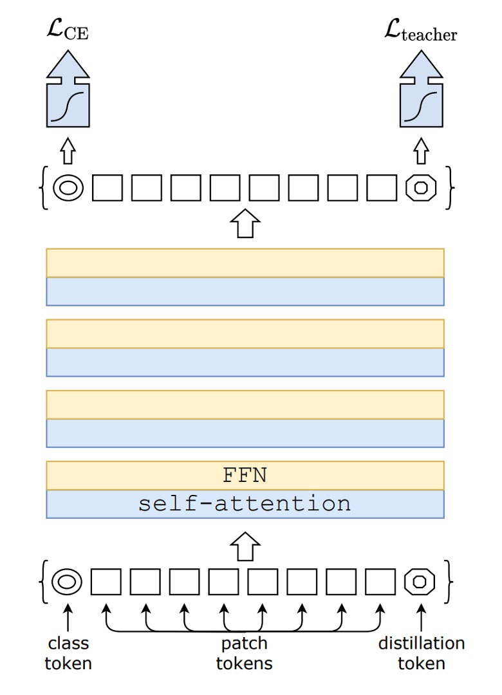
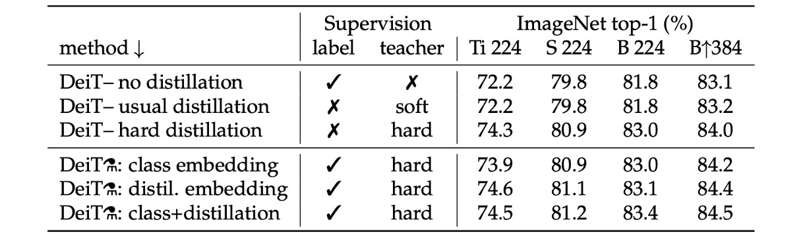
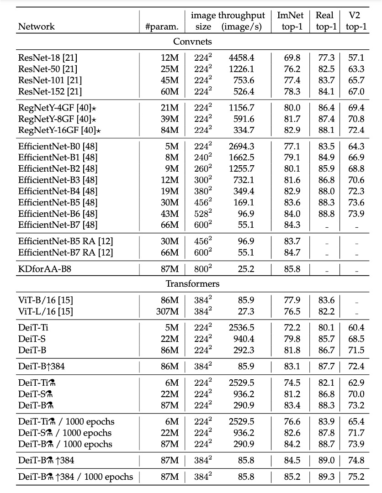

## 蒸留後はより芳香が増す

[**Training data-efficient image transformers & distillation through attention**](https://arxiv.org/abs/2012.12877)

---

先程、ViT を見ました。

- [**ViT: 新世界の開拓者**](../2010-vit/index.md)

この論文は、Transformer が画像領域に応用され、大規模データセットにおいて従来の畳み込みネットワークを超える効果を示し、実験ではさらに大きな潜力を示しました。

これに対して、著者が出した結論は次の通りです：

- **データ量が不足していると、うまく一般化できない。**

## 定義問題

本論文の著者は次のように考えています：

- **知識蒸留**を利用することで、モデルのデータ依存を減らし、同時に性能を向上させることができる。

## 解決問題

### モデルアーキテクチャ

この図を見ても驚かないでください。

これは新しいものではありません。`distillation`の部分を取り除けば、それは元々の ViT です。

上の図の左側の CE 損失は、元々の ViT の訓練プロセスを示しています。

この論文の内容は、上の図の右側の`distillation`トークンから始まります。

### モデル蒸留

著者は元々の ViT アーキテクチャに新たに 1 つのトークンを追加し、このトークンをモデル全体の自己注意機構に組み込みました。最終的に、このトークンの出力に対して、Teacher-Student 方式で監視を行います。

Teacher はここで、すでに訓練された別のモデルを導入します。これには ConvNet や他のアーキテクチャを使用できます。

訓練時、Teacher は出力クラスを Student に学習させますが、勾配更新には関与しません。

Student は、私たちが訓練するモデルであり、この論文では ViT-B/16 のアーキテクチャが目標です。

監視方法には 2 つの種類があります：

1. **ソフト蒸留（Soft distillation）**

   ソフト蒸留方法は、教師モデルと学生モデルの softmax 出力間の Kullback-Leibler 散度を最小化することで訓練を行います。$Z_t$は教師モデルのロジット、$Z_s$は学生モデルのロジット、τ は蒸留温度、λ は Kullback-Leibler 散度損失（KL）と基準ラベル$y$に基づく交差エントロピー（LCE）の重み係数、ψ は softmax 関数を示します。蒸留の目的関数は以下のように定義されます：

   - $$L_{global} = (1 − λ)L_{CE}(ψ(Z_s), y) + λτ^2KL(ψ(Z_s/τ), ψ(Z_t/τ))$$

   ここで、$L_{CE}$は元々の ViT 訓練アーキテクチャであり、交差エントロピー損失を示します。KL は蒸留アーキテクチャの KL 散度損失を示します。

   訓練時、λ を使用してソフト蒸留と交差エントロピー損失の重みを調整します。

2. **ハード蒸留（Hard-label distillation）**

   著者は蒸留の変種を導入し、教師モデルの決定を真のラベルとして扱います。

   $y_t = \arg\max_c Z_t(c)$を教師モデルのハード決定とし、ハードラベル蒸留に関連する目的関数は以下のように定義されます：

   - $$L_{global}^{hardDistill} = \frac{1}{2} L_{CE}(ψ(Z_s), y) + \frac{1}{2} L_{CE}(ψ(Z_s), y_t)$$

   与えられた画像に対して、教師モデルのハードラベルは特定のデータ拡張方法によって変化する可能性があります。この選択は伝統的な方法より優れており、パラメータを必要とせず、概念的に簡単です。教師の予測$y_t$は、実際のラベル$y$と同じ役割を果たします。

   また、ハードラベルはラベルスムージングを使用してソフトラベルに変換することができます。実際のラベルは確率$1 - ε$であり、残りの$ε$は他のクラスに分配されます。論文で実際のラベルを使用するすべての実験では、このパラメータは$ε = 0.1$に固定されます。

   :::tip
   ここは少し難しいかもしれません。

   例えば、入力画像があり、ラベルが「犬」だとしますが、この画像内の「犬」は非常に小さく、画像のほとんどは草地です。この画像を Teacher モデルに渡すと、出力は「草地」となります。

   この場合：

   - **[class token]** は「犬」のラベルを監視します。
   - **[distillation token]** は「草地」のラベルを監視します。

   最終的には、これら二つの損失を重み付きで足し合わせたものが最終損失関数となります。
   :::

### 教師ネットワーク

教師ネットワークの選択について、著者は実験の結果、教師として畳み込みネットワーク（ConvNet）を使用することで最良の結果が得られると結論しました。

その理由として、ViT が蒸留を通じて畳み込みネットワークの帰納的バイアスを引き継ぎ、モデルの一般化能力が向上したと推測しています。

## 討論

### どの蒸留戦略が最適か？

上表は、異なる蒸留戦略の性能を示しています。

- 蒸留を使用しないモデルとソフト蒸留のみを使用したモデルの性能はほぼ同じです。
- ハード蒸留のみを使用した場合、約 1%の性能向上があり、ハード蒸留の効果が良いことが分かります。

上表の下半分では、訓練時にラベルと教師の情報を同時に使用しています。次に比較するのは、予測時に教師の情報を使用するかどうかです。結果から、予測段階でクラス埋め込みと蒸留埋め込みを同時に使用した場合が最も効果的であることが分かります。

### ImageNet 実験結果

画像分類の文献では、著者は通常、精度と他の基準（例えば FLOPs、パラメータ数、ネットワークサイズなど）とのトレードオフを比較しています。

研究により、DeiT 方法は EfficientNet よりわずかに性能が劣ることが分かりました。これにより、ImageNet だけで訓練した場合、著者は視覚 Transformer と CNN の間の差をほぼ縮小したことが示唆されます。以前、ImageNet1k でのみ訓練された ViT モデルと比較すると、DeiT の結果は大きな改善であり、同じ設定でトップ 1 精度が 6.3%向上しました。

さらに、DeiT が比較的弱い RegNetY から蒸留されて生成されると、その性能は EfficientNet を上回ります。研究結果は、DeiT が JFT300M で 384 解像度で事前訓練された ViT-B モデルより 1%優れている（トップ 1 精度 85.2%対 84.15%）ことを示しており、同時に訓練速度が大幅に速くなっています。

以下の表は、ImageNet V2 および ImageNet Real でのデータと追加評価結果を詳細に報告しており、これらのテストセットは ImageNet 検証セットとは異なり、検証セットでの過剰適合を減少させることができます。研究結果は、GPU 上での精度と推論時間のトレードオフにおいて、DeiT-B と DeiT-B ↑384 が先端技術と比較して一定の優位性を持っていることを示しています。

## 結論

DeiT モデルは、ImageNet でのみ訓練し、わずか 3 日以内（単一の 8-GPU ノードを使用）で訓練を完了し、外部データなしで 83.1%のトップ 1 精度を達成しました。

さらに重要なのは、著者が蒸留トークンに基づく蒸留戦略を導入したことです。この戦略により、学生モデルは注意機構を通じて教師モデルから学習し、畳み込みネットワークとの比較で顕著な優位性を示しました。

この論文は、大量のデータと計算リソースを必要とせずに、高性能な ViT を訓練できることを証明し、これらのモデルが将来的に画像分類の方法として有力な選択肢となる潜力を示しました。

:::tip
この方法は訓練コストが低く、非常に使いやすいと感じています。
:::
