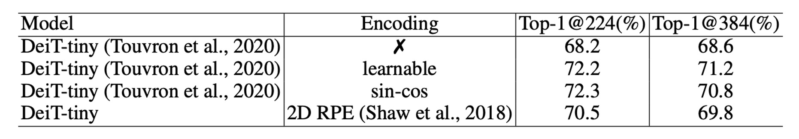

## 条件位置编码

[**Conditional Positional Encodings for Vision Transformers**](https://arxiv.org/abs/2102.10882)

---

ViT が提案された後、さまざまな研究が続々と登場しました。

もし ViT 関連のアーキテクチャをよく使っているのであれば、きっと同じような悩みを抱えているはずです：「この『学習可能な』位置埋め込み、本当に使いづらい！」

## 定義問題

ViT では、入力画像を固定サイズの画像ブロックに分割し、それらのブロックに対応する学習可能な絶対位置埋め込みが加算されます。しかし、この位置埋め込み方法には二つの主な問題があります：

### シーケンスの拡張

絶対位置埋め込みの長さは固定されており、これがモデルの処理能力を制限し、学習した位置埋め込みよりも長いシーケンスの処理を困難にします。

この問題に対して、位置埋め込みを直接捨てることはできないのでしょうか？

- **答えは：できません！**

位置埋め込みを捨てると、モデルの性能が大幅に低下します。DeiT の論文でもこの実験が行われており、DeiT-tiny モデルは ImageNet での精度が 72.2%から 68.2%に急落し、これは災害的な低下と言えます。

これは理解しやすいことです。なぜなら、入力シーケンスの順序は重要な手がかりであり、位置埋め込みがなければ、モデルは順序情報を取得できなくなるからです。

### 平行移動不変性

平行移動不変性とは、物体が画像内で移動したときに、モデルの応答がそれに応じて変化する特性です。

ViT アーキテクチャでは、各ブロックに一意の位置埋め込みが加算されるため、モデルは平行移動不変性を失い、物体が画像内で移動しても応答が変わらなくなります。この特性を失うことで、モデルの性能が低下し、特に分類タスクでは顕著に現れます。

DeiT モデルの研究では、位置埋め込みを補間技術で延長し、長いシーケンスと同じ長さにすることができることが示されていますが、この方法は何度も微調整を行う必要があります。微調整を行わずに直接適用すると、モデルの性能は大幅に低下します。

**では、相対位置埋め込み（Relative Positional Encoding, RPE）に変更することで解決できるのでしょうか？**

- **答えは：これら二つの問題を解決できます。**

しかし、絶対位置の情報を提供できないため、実験データによると、相対位置埋め込みの性能は絶対位置埋め込みに劣ることが分かっています。

:::tip

「相対位置埋め込み」と「絶対位置埋め込み」は、ImageNet データセットで約 1.5%の差があります。
:::

## 解決問題

### 条件位置编码


上記で述べた問題を解決するために、著者は新しい位置埋め込み方法を提案しました：条件位置埋め込み（Conditional Positional Encodings, CPE）。

上の図において、最も左側は元々の ViT アーキテクチャで、入力画像が Patchify された後、直接「学習可能な」絶対位置埋め込みが加算されています。

中央の図は著者が提案した CPE アーキテクチャで、ここでの重要な点は、**位置埋め込みの計算を Transformer の Encoder の中に組み込んだことです**。

正確には、位置埋め込みは「第一層」の Encoder の後、「第二層」の Encoder の前に組み込まれています。

:::tip
これはどういう操作でしょうか？

後ほど詳しく説明しますが、まずは位置埋め込みの構造を見ていきましょう。
:::

### 位置埋め込み生成器


位置埋め込み生成器は、論文で「Positional Encoding Generator」として名前が付けられています。

まず、この位置埋め込みの配置場所はおいておき、単純にこの Generator の構造を見てみましょう：

- **実際には、Conv2d 畳み込み層です！**

つまり、画像を Patch に分解した後、これらの Patch が畳み込み層を通じて、対応する位置埋め込みが生成されるということです。

この畳み込み層には工夫があります。`Zero Padding`を使用しなければなりません！ここでの`Zero Padding`は、モデルが特定の位置を特定するための方法です。畳み込みの方法を使うことで、モデルは入力画像に基づいて動的に対応する位置埋め込みを生成することができ、これが論文のタイトルにある「条件位置埋め込み」を実現します。

論文では実装の詳細も提供されており、簡単に見てみましょう：

```python title="Algorithm 1 PyTorch snippet of PEG by the authors"
import torch
import torch.nn as nn

class VisionTransformer:

    def __init__(self, layers=12, dim=192, nhead=3, img_size=224, patch_size=16):
        self.pos_block = PEG(dim)
        self.blocks = nn.ModuleList([
            TransformerEncoderLayer(dim, nhead, dim*4)
            for _ in range(layers)
        ])
        self.patch_embed = PatchEmbed(img_size, patch_size, dim*4)

    def forward_features(self, x):
        B, C, H, W = x.shape
        x, patch_size = self.patch_embed(x)
        _H, _W = H // patch_size, W // patch_size
        x = torch.cat((self.cls_tokens, x), dim=1)
        for i, blk in enumerate(self.blocks):
            x = blk(x)
            if i == 0:
                x = self.pos_block(x, _H, _W)
        return x[:, 0]

class PEG(nn.Module):

    def __init__(self, dim=256, k=3):
        # デモ用の簡単な実装。より複雑な関数も有効です。
        self.pos = nn.Conv2d(dim, dim, k, 1, k//2, groups=dim)

    def forward(self, x, H, W):
        B, N, C = x.shape
        cls_token, feat_tokens = x[:, 0], x[:, 1:]
        feat_tokens = feat_tokens.transpose(1, 2).view(B, C, H, W)
        x = self.pos(feat_tokens) + feat_tokens
        x = x.flatten(2).transpose(1, 2)
        x = torch.cat((cls_token.unsqueeze(1), x), dim=1)
        return x
```

ご覧の通り、`PEG`の実装は実際にはただの Conv2d 畳み込み層のみで、余分なものはありません。

### モデル訓練戦略

この新しい位置埋め込み方式を検証するために、著者は DeiT の訓練戦略を厳密に遵守し、関連する実験設定は以下の通りです：

1. **データセット**

   - 本研究では、1000 のクラスと 130 万枚の画像を含む ImageNet データセットを使用してモデルを訓練しました。
   - 評価結果は、5 万枚の画像を含む検証セットに基づいています。
   - より大きな JFT-300M データセットは使用していません。

2. **モデルの変種**

   - 異なる計算要求に対応するため、著者は 3 つの異なるサイズのモデルを設計しました。
   - すべての実験は Tesla V100 マシンで実行されました。
   - Tiny モデルの訓練は 300 エポックで約 1.3 日（単一ノードの 8 枚 V100 GPU を使用）、CPVT-S および CPVT-B モデルはそれぞれ 1.6 日と 2.5 日を必要としました。

3. **訓練の詳細**

   - CPVT-B モデルを除き、その他のモデルは 300 エポック訓練され、Tesla V100 マシンでバッチサイズ 2048 を使用しました。
   - 訓練には AdamW オプティマイザーが使用されました。

## 討論

### PEG の配置場所


先ほど触れた「配置場所」は、なぜ Encoder の第 1 層後、第 2 層前に配置されるのでしょうか？

:::tip

- 位置 0：第 1Encoder 層の出力
- 位置-1：第 1Encoder 層の前
  :::

著者は PEG を異なるモデルの位置に配置して試した結果（上表左）、PEG を位置 0 または位置 3 に配置した場合、モデルの Top-1 精度は約 72.4%に達し、最も良い結果を得ました。PEG を位置 0 に配置した方が位置-1 に配置した場合より良い結果を示し、位置 0 の性能が位置-1 より明らかに優れていることがわかりました。

これら 2 つの位置の主な違いは、それぞれの受容野の範囲が異なることです。位置 0 は全体の受容野を持ち、位置-1 は局所的な範囲しか見ません。畳み込みカーネルのサイズを大きくすると、両者の効果は似たものになるはずです。

この仮説を検証するために、著者は位置-1 により大きな畳み込みカーネル（27×27、パディングサイズ 13）を使用した結果、性能（72.5%）は位置 0 の効果と似ていることが分かり、この仮説を証明しました。

しかし、畳み込みカーネルのサイズを増やすと計算量が増加するため、著者はより良い性能を得るために PEG を位置 0 に配置することを選びました。

### PEG の改善点

<div align="center">
<figure style={{ "width": "70%"}}>

</figure>
</div>

人々は PEG の改善が PEG 内の畳み込み層による追加の学習可能なパラメータから来ているのではないかと疑うかもしれませんが、PEG の主な役割をテストするために、著者は PEG を注意層でのみ使用して Q と K を計算し、PEG の位置情報だけを伝達しました。

上の表に示された結果では、この場合、DeiT-tiny の Top-1 精度は 71.3%に達し、位置埋め込みなしの DeiT-tiny（68.2%）より明らかに優れ、Q、K、V に PEG を使用した結果（72.4%）に近いことがわかります。これにより、PEG は主に位置埋め込み手法として機能し、畳み込み層の追加パラメータに依存していないことが示されました。

さらに、PEG の性能向上が追加のパラメータによるものでないことをさらに確認するために、著者は別の実験を行いました。3×3 の PEG をランダムに初期化し、重みを固定したところ、Top-1 精度は 71.3%に達し、位置埋め込みなしの DeiT-tiny より 3.1%高くなりました。PEG の重みが固定されているため、性能向上は PEG が導入した位置情報に起因していることが証明されました。

:::tip
「訓練できない」畳み込みカーネルを使用するだけで、モデルの性能が向上するということです。
:::

逆に、12 層の畳み込み層（畳み込みカーネルのサイズは 1、すなわち局所関係を生成しない）を PEG の代わりに使用した場合、これらの層は PEG より遥かに多くの学習可能なパラメータを持っていますが、性能はわずか 0.4%向上して 68.6%にとどまりました。これにより、PEG の効果は主に位置情報によるものであり、追加のパラメータによるものではないことがさらに証明されました。

### 高解像度への一般化


上の表に示されたように、PEG は微調整なしでより大きな画像サイズに直接一般化できます。この点は、224×224 の画像で訓練したモデルを 384×384、448×448、512×512 の解像度でテストすることで確認されました。

DeiT-tiny モデルは 384×384 の入力画像を使用する場合、学習可能な位置埋め込みを装備すると、性能が 72.2%から 71.2%に低下します。正弦埋め込みを使用した場合、性能は 72.2%から 70.8%に低下します。

一方、CPVT モデルは PEG を装備していると、より大きな入力画像に直接対応でき、CPVT-Tiny（CPVT-Ti）は 384×384 の解像度で性能が 73.4%から 74.2%に向上します。CPVT-Ti は DeiT-tiny より 3.0%高く、入力解像度が増加するにつれてこの差はさらに広がります。

### 複雑度の低減

PEG では、深さ方向の畳み込みを選択すると、追加されるパラメータの数は$d \times l \times k^2$（$d$はモデルの次元、$l$は深さ方向の畳み込みの層数、$k$は畳み込みカーネルのサイズ）となります。可分離畳み込みを使用した場合、パラメータ数は$l(d^2 + k^2d)$となります。

CPVT-Tiny の場合、$k = 3$かつ$l = 1$（モデル次元$d = 192$）の場合、PEG は 1,728 個のパラメータを追加します。DeiT-tiny モデルは学習可能な位置埋め込みを使用し、パラメータ数は 192×14×14 = 37,632 です。

したがって、CPVT-Tiny のパラメータ数は DeiT-tiny より 35,904 個少ないことがわかります。可分離畳み込みで 4 層使用した場合でも、CPVT-Tiny の追加パラメータ数は 960（38,952 - 37,632）であり、DeiT-tiny の合計 5.7M のモデルパラメータにおいてほぼ無視できる差です。

### ImageNet での性能


DeiT と比較して、CPVT モデルは Top-1 精度で優れた性能を発揮し、推論速度は似たようなものです。CPVT モデルは、入力画像の解像度が増加するにつれて性能が向上する一方で、DeiT の性能は解像度の増加に伴い低下します。

グローバル平均プーリング（GAP）を装備した CPVT モデルは、ViT の新しい記録を打ち立て、現在の最高性能を達成しました。

CPVT-Tiny と DeiT-tiny モデルは、追加のハード蒸留訓練を行った後に比較され、ハード蒸留法では RegNetY-160 モデルが教師モデルとして使用されました。CPVT モデルの Top-1 精度は 75.9%に達し、DeiT-tiny モデルを 1.4%上回りました。

### 他の位置埋め込みとの比較

<div align="center">
<figure style={{ "width": "70%"}}>

</figure>
</div>

最後に、著者は PEG と他の一般的な位置埋め込み方式を比較し、PEG と絶対位置埋め込み（APE）、相対位置埋め込み（RPE）の組み合わせの効果を分析しました。

1. **PEG と他の位置埋め込みの比較**

   - DeiT-tiny モデルは学習可能な絶対位置埋め込み（LE）を使用して 72.2%の Top-1 精度を達成。
   - 2D 正弦埋め込みを使用した場合、性能はほぼ同等で、似た結果を得ました。
   - 相対位置埋め込み（RPE、範囲超パラメータ K を 8 に設定）を使用した場合、Top-1 精度は 70.5%となり、LE より低くなっています。RPE は絶対位置情報を符号化しないため、性能が低下している一因と考えられます。

2. **PEG と他の埋め込みの組み合わせ効果**

   学習可能な絶対位置埋め込みと単層 PEG を組み合わせた場合、基準モデル CPVT-Ti の性能は 0.5%向上しました。4 層 PEG を使用した場合、モデルの Top-1 精度は 72.9%に達しました。もし前の 5 つの Transformer ブロックに PEG を追加すると、精度はさらに 73.4%に向上し、単一ブロックに PEG をスタックする場合よりも良い結果となりました。

## 結論

著者は、PEG が長い入力シーケンスを処理し、平行移動不変性を保持することで、特に分類タスクでモデルの性能を大幅に向上させることができることを証明しました。絶対位置埋め込み（APE）や相対位置埋め込み（RPE）と比較して、PEG はより優れた性能を示しました。

また、PEG の実装はシンプルで、追加の計算コストとパラメータが非常に少なく、実用的で効果的な解決策となることが示されました。

:::tip
研究を行う際、例えば Transformer アーキテクチャを使うときは絶対に CNN を使わない、CNN を使うときは絶対に Transformer を使わない、などの派閥に分かれることがありますが、現場で必要なのはシンプルで効果的、そして性能を向上させる方法です。

機会を見つけて試してみますので、その後使用感を更新したいと思います。
:::
