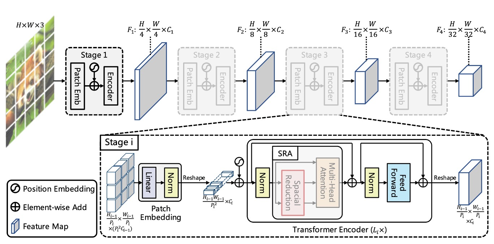
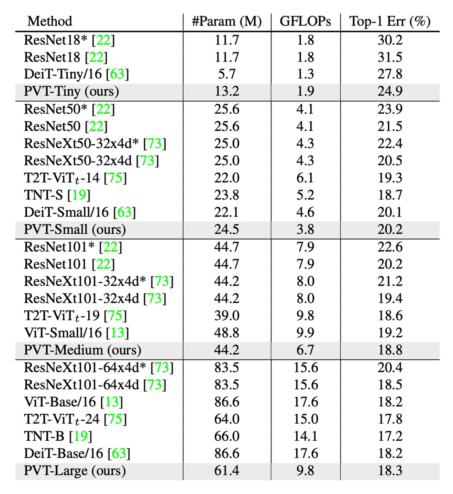
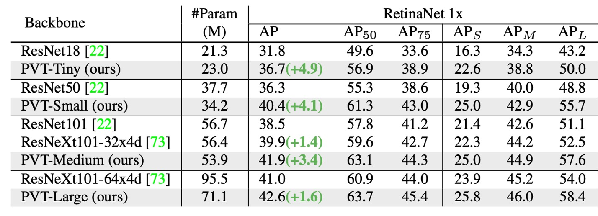

## 空間縮減注意機構

[**Pyramid Vision Transformer: A Versatile Backbone for Dense Prediction without Convolutions**](https://arxiv.org/abs/2102.12122)

---

ViT は画像分類で驚異的な成果を上げました。

正式に Transformer アーキテクチャがコンピュータビジョンの分野に登場し、席巻を始めました。

## 定義された問題

ViT アーキテクチャは、最初に 16 x 16 の大きなカーネル畳み込みを使用して、画像をパッチに分割します。

もし解像度 224 x 224 の画像であれば、パッチに分割された後、14 x 14 の画像になります。

この解像度の画像は画像分類には問題ありません、なぜなら分類では抽象度の高いグローバルな特徴に依存するからです。

しかし、もし密な予測タスク、例えば画像分割や物体検出などを行う場合、このような分割方法ではモデルが局所的な詳細を捉えるのが難しくなります。

- **なぜなら、詳細は 16 x 16 の特徴圧縮操作の中で失われてしまうからです。**

明らかに、密な予測を行うにはより細かい特徴が必要です。では、16 x 16 の畳み込みを 2 x 2 に変更するのはどうでしょうか？

- **もちろん、ダメです！**

224 x 224 の画像を例に取ってみましょう：

- 16 x 16 のパッチサイズを使うと、14 x 14 で合計 196 個の入力トークンを得ることができます。
- 2 x 2 のパッチサイズを使うと、112 x 112 で合計 12,544 個の入力トークンを得ることができます。

**12,544 x 12,544 の自己注意行列を計算してみてください……**

これが良いアイデアだと思う人は、誰もいないでしょう。

## 解決問題

### モデルアーキテクチャ



上の図は、PVT のアーキテクチャ設計を示しています。

一見複雑に見えますが、畳み込みネットワークのアーキテクチャを思い出すと、実際には同じ概念であることが分かります。

### 階層構造

最初に目にするのは階層構造です。これは、ConvNet でよく言及される 1/2 次元の縮小と似ており、全体で 5 つのステージに分かれています。

そのため、1/2 サイズの特徴マップ、1/4 サイズの特徴マップ、1/8 サイズの特徴マップなどが順次続きます。

PVT のアーキテクチャでは、1/4 サイズの特徴マップから始まり、最終的には 1/32 サイズの特徴マップまで進みます。

ダウンサンプリングの過程は、ストライド値を指定した畳み込みによって実現されます。

例えば、入力画像が 3 x 224 x 224 であり、ストライドを 4 に指定した場合、出力チャネル数が 64 であれば、計算の結果、得られる特徴マップのサイズは 64 x 56 x 56 となります。

そのため、最初のステージで Transformer エンコーダに入力されるデータは以下の通りです：

- **シーケンスの長さ**：3136（すべての画像パッチ、つまり 56 x 56 の数）
- **特徴量の数**：64（各パッチの特徴量数、つまり上記で述べたチャネル数）

### 空間縮減注意力（SRA）


特徴マップを得た後、(56 x 56) x (56 x 56)の自己注意行列が依然として非常に大きいため、真剣に処理する必要があります。

ここで著者は「空間縮減注意力」（Spatial Reduction Attention）の概念を提案しています。

この方法では、クエリ（Query）のサイズを保持し、キー（Key）とバリュー（Value）のサイズを縮小します。

例えば、元の自己注意マップのサイズ**$QK^T$**が(56 x 56) x (56 x 56)の注意マップを生成する場合、Key と Value のサイズを(56 x 56)から(7 x 7)に縮小すると、最終的な注意マップのサイズは 3136 x 49 に変わります。

先ほどは非常に大きすぎた自己注意行列が、今や処理可能なサイズになりました。

＊

従来通り、実装を見てみましょう。この論文の核心思想がすぐに分かります。

重要な部分はハイライトで示されており、論文中では`sr_ratio`の設定が**[8, 4, 2, 1]**であることが述べられています。これは各ステージの空間縮減比率です。

先ほどの例では、最初の層で元々の 56 x 56 が 7 x 7 に縮小されます。

```python {31-34,40-44}
# Reference:
#   - https://github.com/whai362/PVT/blob/v2/classification/pvt.py

import torch
import torch.nn as nn

class SpatialReductionAttention(nn.Module):

    def __init__(
        self,
        dim,
        num_heads=8,
        qkv_bias=False,
        qk_scale=None,
        attn_drop=0.,
        proj_drop=0.,
        sr_ratio=1
    ):
        super().__init__()
        self.dim = dim
        self.num_heads = num_heads
        head_dim = dim // num_heads
        self.scale = qk_scale or head_dim ** -0.5

        self.q = nn.Linear(dim, dim, bias=qkv_bias)
        self.kv = nn.Linear(dim, dim * 2, bias=qkv_bias)
        self.attn_drop = nn.Dropout(attn_drop)
        self.proj = nn.Linear(dim, dim)
        self.proj_drop = nn.Dropout(proj_drop)

        self.sr_ratio = sr_ratio
        if sr_ratio > 1:
            self.sr = nn.Conv2d(dim, dim, kernel_size=sr_ratio, stride=sr_ratio)
            self.norm = nn.LayerNorm(dim)

    def forward(self, x, H, W):
        B, N, C = x.shape
        q = self.q(x).reshape(B, N, self.num_heads, C // self.num_heads).permute(0, 2, 1, 3)

        if self.sr_ratio > 1:
            x_ = x.permute(0, 2, 1).reshape(B, C, H, W)
            x_ = self.sr(x_).reshape(B, C, -1).permute(0, 2, 1)
            x_ = self.norm(x_)
            kv = self.kv(x_).reshape(B, -1, 2, self.num_heads, C // self.num_heads).permute(2, 0, 3, 1, 4)
        else:
            kv = self.kv(x).reshape(B, -1, 2, self.num_heads, C // self.num_heads).permute(2, 0, 3, 1, 4)
        k, v = kv[0], kv[1]

        attn = (q @ k.transpose(-2, -1)) * self.scale
        attn = attn.softmax(dim=-1)
        attn = self.attn_drop(attn)

        x = (attn @ v).transpose(1, 2).reshape(B, N, C)
        x = self.proj(x)
        x = self.proj_drop(x)

        return x
```

### モデル設定

最後に、PVT のモデル設定を見ていきましょう。

1. $P_i$：第$i$ステージのパッチサイズ
2. $C_i$：第$i$ステージの出力チャネル数
3. $L_i$：第$i$ステージのエンコーダ層の数
4. $R_i$：第$i$ステージの SRA（空間縮減注意力）の縮小比率
5. $N_i$：第$i$ステージの SRA のヘッド数
6. $E_i$：第$i$ステージのフィードフォワード層の拡張比率

モデル設計は ResNet の設計ルールに従っています：

1. 浅いステージでは小さな出力チャネル数を使用します。
2. 主な計算リソースは中間のステージに集中させます。

議論のために、下表では異なるスケールの PVT モデルを示します。これには PVT-Tiny、PVT-Small、PVT-Medium、PVT-Large が含まれており、それぞれのパラメータ数は ResNet18、ResNet50、ResNet101、ResNet152 に相当します。


## 討論

### ImageNet の性能



著者は PVT を、最も代表的な CNN バックボーンである ResNet と ResNeXt と比較しています。これらのモデルは、さまざまな下流タスクのベンチマークで広く使用されています。

上の表に示すように、PVT モデルは、類似したパラメータ数と計算予算で、従来の CNN バックボーンを上回っています。

例えば、GFLOP がほぼ同じである場合、PVT-Small の top-1 誤差率は$20.2\%$で、ResNet50 の$21.5\%$より 1.3 ポイント低い（$20.2\%$ vs. $21.5\%$）です。

同じかそれ以下の複雑さで、PVT モデルの性能は、最近提案された Transformer ベースのモデル、例えば ViT や DeiT と同等です。

PVT-Large の top-1 誤差率は$18.3\%$で、ViT（DeiT）-Base/16 の$18.3\%$と同等です。

### 物体検出の性能




このアーキテクチャは、最初から密な予測タスクをターゲットにしており、特に PVT の密な予測タスクにおける性能を見ていきます。

1. **データセット**：

   - COCO ベンチマークを使用
   - 訓練セット：COCO train2017（118k 枚の画像）
   - 検証セット：COCO val2017（5k 枚の画像）

2. **モデルと初期化**：

   - 標準的な検出器：RetinaNet および Mask R-CNN
   - バックボーンは ImageNet の事前学習された重みを初期化に使用
   - 新たに追加された層は Xavier 初期化

3. **訓練設定**：

   - バッチサイズ：16
   - ハードウェア：8 台の V100 GPU
   - 最適化器：AdamW
   - 初期学習率：$1 \times 10^{-4}$

比較可能なパラメータ数の下で、PVT モデルは従来のモデルを大きく上回ります。RetinaNet を使用した場合、PVT-Tiny の AP は ResNet18 より 4.9 ポイント高く（36.7 vs. 31.8）なっています。

Mask R-CNN を使用した場合、PVT-Tiny のマスク AP (APm) は 35.1 で、ResNet18 より 3.9 ポイント高い（35.1 vs. 31.2）、さらに ResNet50 より 0.7 ポイント高い（35.1 vs. 34.4）です。

これらの結果は、PVT が物体検出とインスタンスセグメンテーションタスクにおける CNN バックボーンの優れた代替案となり得ることを示しています。

以下の図は、PVT の COCO 検証セットにおける結果を示しています。


### ピラミッド構造の貢献

最後に著者は、PVT の各部分が性能に与える影響を検証するためにいくつかの消融実験を行いました。

最初に見るのはピラミッド構造の貢献分析です。以下の表に示しています：


元の ViT 構造と比較して、PVT のピラミッド構造は AP スコアを 8.7 ポイント改善しました。

これは、ピラミッド構造の設計が密な予測タスクの性能向上に確実に貢献していることを示しています。

### 深さと幅のトレードオフ


著者はさらに、PVT が深くすべきか、広くすべきか、そして異なるステージでの特徴マップのサイズが性能に与える影響を探ります。

PVT-Small の隠れ次元を 1.4 倍にし、PVT-Medium のパラメータ数に相当させた場合を示しています。

実験結果によると、パラメータ量が近い場合、より深いモデルの方が性能が良いことがわかります。

### 変わらない問題


最後に、著者は性能に関するいくつかの議論を行いました。

まず、入力サイズが増加すると、PVT の GFLOPs の増加率は ResNet よりも高く、ViT よりは低いことがわかります。

入力サイズが 640×640 ピクセルを超えない場合、PVT-Small と ResNet50 の GFLOPs は類似しています。

さらに、入力画像が短辺 800 ピクセルに固定されている場合、PVT-Small を基にした RetinaNet の推論速度は遅くなります。

つまり、畳み込みネットワークベースのアーキテクチャは大きな入力サイズに適しており、これが実際の性能向上の重要な方向であることがわかります。

:::tip
その理由は、SRA メカニズムは単に自己注意行列を縮小するだけで、自己注意行列の計算複雑度の問題を根本的に解決していないからです。
:::

## 結論

2021 年の時点では、この論文はまだ ResNet と ResNeXt に挑戦しているため、やや保守的に見えるかもしれません。

しかし、この研究はピラミッド構造を Transformer に導入し、密な予測タスク用の純粋な Transformer バックボーンを提供しました。これは、特定のタスクのヘッドや画像分類モデルではなく、今後の研究に向けた重要な方向を提供しています。

また、Transformer ベースのモデルがコンピュータビジョンにおいて応用される初期段階であり、今後の技術とアプリケーションには多くの潜在的な可能性が待ち受けています。
