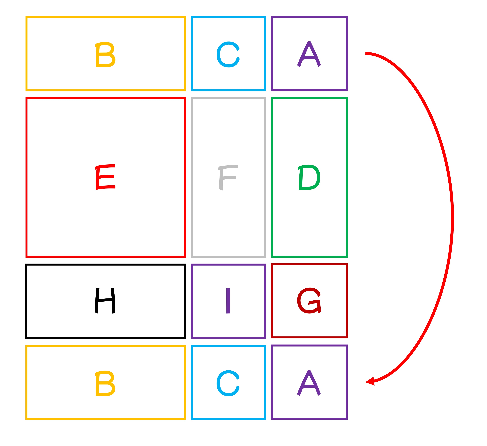
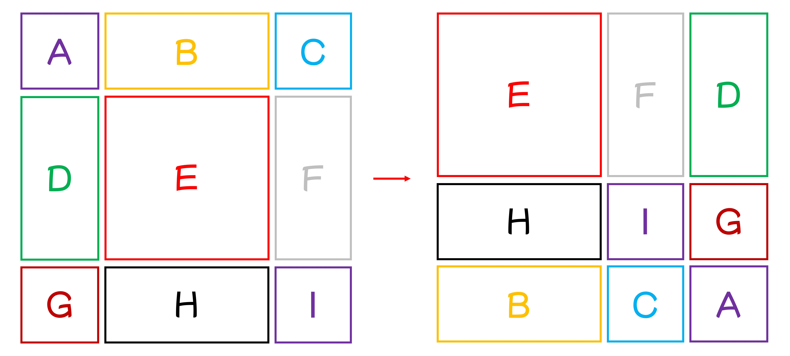
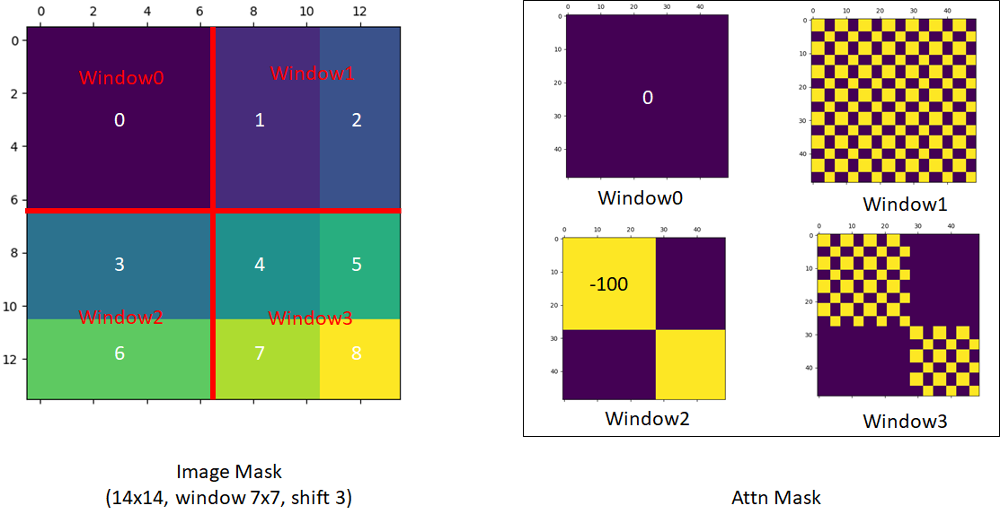

## 舞踏会の開始

[**Swin Transformer: Hierarchical Vision Transformer using Shifted Windows**](https://arxiv.org/abs/2103.14030)

---

同じ時期に提案された PVT は、畳み込みネットワークの階層的構造を Transformer に導入したものです。

- [**[21.02] PVT: 空間縮減注意機構**](../2102-pvt/index.md)

PVT は SRA 機構（Spatial Reduction Attention）を使用して注意機構の計算量を削減していますが、このアプローチでは問題は完全には解決されておらず、注意機構の平方の計算量は依然として残っています。

## 問題の定義

本論文では、ターゲットとする対象は元々の ViT アーキテクチャであり、主に以下のいくつかの問題が存在します：

### 多尺度検出能力

ViT は検出やセグメンテーションのようなタスクには適用できないことは広く知られています。なぜなら、ViT は通常、入力画像を 16x16 のパッチに分割し、各層でこれらのパッチに対して自己注意機構を適用します。このプロセスは、最初から最後まで同じスケールで行われるため、他のアーキテクチャと比較して ViT は多尺度検出能力が欠けているのです。

### 平方計算量

物体検出を行う場合、224 x 224 の入力画像だけを使用することはありません。

大きな画像の入力は、注意機構の計算量を非常に大きくします。例えば、元々 224 x 224 の画像の場合、得られるパッチの数は 14 x 14 = 196 ですが、1536 x 1536 の画像の場合、パッチの数は 96 x 96 = 9216 になります。この数で自己注意計算を行うのは通常の計算機では耐えられません。これが、ViT が大きな画像での適用に制限がある理由でもあります。

## 解決された問題

### モデルアーキテクチャ

モデルが多尺度の問題を処理できるようにするためには、まず階層型のアーキテクチャを採用する必要があります。上図は Swin-T アーキテクチャです。

入力として H x W x 3 の画像を与え、4 x 4 の方法でパッチに分割し、その後特徴の次元を C に投影することで、H/4 x W/4 x C の特徴マップが得られます。上図の 48 は、1 つのパッチに 4 x 4 x 3 のピクセルがあり、そこから C 次元に変換されることを示しており、ここでの C は 96 です。

:::tip
実装時には通常、ここで 1 つの畳み込み操作を使いますが、ここでは作者が詳細に描画しており、より多くの詳細がわかります。
:::

その後、Swin-Transformer ブロックのセットを通過します。ここでは、モジュール内に一般的な Transformer ブロックのセットがあり、続いて Swin ブロックが続きます。これらはペアで並んでおり、上図で示されているモジュールの数は 2 の倍数になります。

ダウンサンプリングはパッチマージングを使用して行われます。ここでのパッチマージングは、各パッチを 2 x 2 の方法で 4 つのパッチに分割することを意味します。したがって、元のサイズが H x W x C の場合、パッチマージング後は H/2 x W/2 x 4C になります。

以下に示す図をご覧ください：

<figure style={{ "width": "70%"}}>

</figure>

チャンネル数を制御するために、最後に 1 x 1 の畳み込みを使用してチャンネル数を 4C から 2C に調整します。

基本的なアーキテクチャを見た後、次に Swin ブロックの詳細を見ていきましょう。

### スライディングウィンドウ

論文の内容によると：

- 各パッチのサイズは 4 x 4 ピクセル、つまり上図の灰色の四角形です。
- 各 7 x 7 のパッチが 1 つのウィンドウを構成し、このハイパーパラメータは M と呼ばれ、ここでは M=7 です。

モデルは各ウィンドウ内でのみ自己注意計算を行います。したがって、各注意のシーケンスの長さは 49 となり、画像サイズが大きくなるにつれて各ウィンドウのシーケンスの長さは変わらず、ウィンドウの数のみが増加し、計算量は最終的に 49 x N になります。このようにして、元々の平方計算量を線形計算量に低減することができます。

**しかし、この設計方法ではウィンドウ間の情報の流れが遮断されてしまい、Transformer の利点を生かすことができません。どうすればそれを克服できるのでしょうか？**

そこで作者は、Shifted Window という概念を提案しました。上図の右側に示されているように、各ウィンドウは「右下隅に 2 つ移動」して、新しいウィンドウを構成します。この手順により、各ウィンドウ内のパッチは他のウィンドウ内のパッチと相互作用できるようになります。

:::tip
ここでは、論文の図が左から右にどう変わるのかをより理解しやすくするために、簡単な図を描いてみました：

:::

### 新たな問題

この方法を使用すると、新たな問題が発生します：

元々$N \times N$のウィンドウが、移動後には$(N+1) \times (N+1)$のウィンドウになります。また、ウィンドウのサイズが不一致になるため、計算時にパディング操作を使用しなければならず、これにより計算量が増加します。

これは作者が受け入れられないことです。

この問題を解決するために、作者は特殊なマスクの方法を提案しました。

### 循環シフト（Cyclic Shift）

上図のように、これは移動後の新しいウィンドウです。作者はまずこれらのウィンドウを循環シフトし、その後これらを結合して新しいウィンドウを得る方法を取ります。

:::tip
この段階で、少し混乱を感じるかもしれません。ここではさらに説明を補うため、9 つのウィンドウに A から I までの番号を付けてみました：

論文設定に基づき、ここでのシフトサイズは 3 であり、つまり各ウィンドウは右下隅に 3 つ移動します。

まず、各ウィンドウを右に 3 つ移動します：

<figure style={{ "width": "50%"}}>

</figure>

次に、下に 3 つ移動させると、新しいウィンドウが得られます：

<figure style={{ "width": "50%"}}>

</figure>

これを合わせて見ると、論文の図のようになります：

<figure style={{ "width": "80%"}}>

</figure>

:::

上記の移動方法を通じて、再び完全な N x N のウィンドウが得られ、余計な計算量を避けることができます。

しかし、移動後、各大きなウィンドウは複数の小さなウィンドウで構成され、作者はこれらの小さなウィンドウ間で相互作用が行われないようにしたいため、ここではマスクを使用して異なる小さなウィンドウ間の相互作用を防いでいます。

### 特殊マスク

:::tip
この部分はエンジニアリング実装に関する内容であり、論文の主要な貢献ではありませんが、この部分が非常に素晴らしいと思ったので紹介します！
:::

この部分は少し複雑であり、作者が GitHub で説明している内容を参照する必要があります：

- [**Swin-Transformer/issues/38**](https://github.com/microsoft/Swin-Transformer/issues/38)

このマスク設計について順を追って見ていきましょう。計算の過程で、各ウィンドウ内のパッチを直線的に展開し、一対一で対応させる必要があります：

1. 最初のウィンドウは完全なウィンドウであり、したがって注意マスクを行う必要はありません。
2. 二番目のウィンドウは、上の手描き図を参照して、B と H のブロックです。

   :::tip
   ここで展開した後の並びは、B, B, B,..., B, H, H,...H のようになるため、注意マスク図では完全なマスクブロックが表示されます。
   :::

3. 三番目のウィンドウは、上の手描き図を参照して、F と D のブロックです。

   :::tip
   ここで展開した後の並びは、F, F, D, D, D, F, F, D, D, D, F,...のようになり、F と D のブロックが交互に並ぶため、注意マスク図では格子状のマスクブロックが表示されます。
   :::

4. 四番目のウィンドウは、上の手描き図を参照して、I, G, C, A のブロックです。

   :::tip
   ここでは前述のケースを統合しているため、注意マスク図には格子状のマスクブロックと完全なマスクブロックの両方が表示されます。
   :::

### 逆方向の移位

循環移位と特殊なマスク設計を経て、作者はウィンドウ間の情報の流れの問題を解決し、線形計算量を維持しました。上記のプロセスが完了した後、逆方向の移位を行い、ウィンドウを元の位置に戻すことで、完全な特徴マップが得られます。

このステップを実行しなければ、特徴マップは右下隅に移動し続けることになり、その結果、後続のタスクに問題を引き起こす可能性があります。

## 討論

### ImageNet-1K 上での性能

画像分類において、作者は ImageNet-1K において提案された Swin Transformer のベンチマークテストを行いました。

このデータセットには、1,000 のカテゴリからの 128 万枚の訓練画像と 5 万枚の検証画像が含まれています。以下は訓練設定です：

- **オプティマイザー**：AdamW
- **訓練エポック数**：300
- **学習率スケジューラ**：コサイン減衰
- **線形ウォームアップ**：20 エポック
- **バッチサイズ**：1024
- **初期学習率**：0.001
- **重み減衰**：0.05
- **データ拡張と正則化戦略**：ほとんどの戦略を使用、ただし繰り返し拡張と EMA は性能向上には寄与しないため使用しません。

---

上表は、Transformer ベースおよび ConvNet ベースのバックボーンを使用した他のアーキテクチャとの比較を示しています。

以前の最先端の Transformer ベースのアーキテクチャ（例えば DeiT）と比較して、Swin Transformer は顕著な性能向上を見せました。

- **Swin-T (81.3%)** は **DeiT-S (79.8%)** より 1.5%向上。
- **Swin-B (83.3%/84.5%)** は **DeiT-B (81.8%/83.1%)** よりそれぞれ 1.5%と 1.4%向上。

最先端の ConvNet アーキテクチャ（例えば RegNet や EfficientNet）と比較しても、Swin Transformer はスピードと精度のトレードオフにおいてもわずかに優れています。RegNet と EfficientNet は徹底的なアーキテクチャ探索によって得られたものである一方、提案された Swin Transformer は標準的な Transformer を基に改良されており、さらに強力な潜在能力を有しています。

### 物体検出設定

このアーキテクチャは主に多尺度問題を解決することを目的としているため、物体検出タスクでの性能が特に重要です。

物体検出およびインスタンスセグメンテーションの実験は、COCO 2017 データセットで行われました。このデータセットには、118K の訓練画像、5K の検証画像、20K のテスト開発画像が含まれています。

消失研究では、作者は 4 つの典型的な物体検出フレームワークを考慮しました：

1. Cascade Mask R-CNN
2. ATSS
3. RepPoints v2
4. Sparse RCNN

これらのフレームワークは、同じ訓練設定を使用しています：

- **多尺度訓練**：入力サイズを調整し、短辺を 480 から 800 の間、長辺は最大 1333 に設定。
- **オプティマイザー**：AdamW（初期学習率は 0.0001、重み減衰は 0.05、バッチサイズは 16）。
- **訓練エポック数**：3x スケジューリング（36 エポック）。

システムレベルの比較では、作者は改良された HTC（HTC++）を採用し、以下の特徴を持っています：

- インスタブースト
- より強力な多尺度訓練
- 6x スケジューリング（72 エポック）
- ソフト NMS
- ImageNet-22K の事前訓練モデルによる初期化

作者は Swin Transformer と標準的な ConvNet（例えば ResNe(X)t）および以前の Transformer ネットワーク（例えば DeiT）を比較しました。他の設定を変えずにバックボーンだけを変更することで、公平な比較を行っています。Swin Transformer と ResNe(X)t は階層的な特徴マップを持ち、上記のすべてのフレームワークに直接適用できますが、DeiT は単一解像度の特徴マップしか生成しないため、DeiT の階層的特徴マップを構築するために逆畳み込み層を使用しています。

### Swin vs ResNe(X)t

<figure style={{ "width": "80%"}}>

</figure>

上表 (a) は、Swin-T と ResNet-50 が 4 つの物体検出フレームワークでの結果を示しています。

- Swin-T は ResNet-50 に対して一貫して+3.4〜4.2 のボックス AP 向上をもたらしました。
- モデルサイズ、FLOP、遅延は若干大きい。

上表 (b) は、Cascade Mask R-CNN を使用した異なるモデル容量での Swin Transformer と ResNe(X)t を比較しています。

- Swin Transformer は、51.9 のボックス AP と 45.0 のマスク AP を達成し、同様のモデルサイズ、FLOP、遅延を持つ ResNeXt101-64x4d と比較して、それぞれ+3.6 のボックス AP と+3.3 のマスク AP を向上させました。

改良された HTC フレームワークにおける高いベースラインを使用した場合、Swin Transformer は 52.3 のボックス AP と 46.0 のマスク AP を達成し、以前の ResNe(X)t より+4.1 のボックス AP と+3.1 のマスク AP の向上を示しました（上表 (c) を参照）。

推論速度については、ResNe(X)t は高度に最適化された Cudnn 関数を使用して構築されていますが、Swin Transformer は未完全に最適化された PyTorch の組み込み関数を使用しています。最適化カーネルについてはこの記事の範囲外なので、ここでは議論しません。

### Swin vs DeiT

Cascade Mask R-CNN フレームワークを使用した DeiT-S の性能は、上表(b)に示されています。

- Swin-T の結果は DeiT-S より+2.5 のボックス AP と+2.3 のマスク AP が向上し、モデルサイズは似ており（86M vs. 80M）、推論速度は顕著に高い（15.3 FPS vs. 10.4 FPS）です。

DeiT の推論速度が低いのは、主に入力画像サイズにおける二次計算量によるものです。

### Swin vs SOTA

表(c)は、最良の結果と先行する最先端モデルの結果を比較しています。

- Swin Transformer は COCO test-dev で 58.7 のボックス AP と 51.1 のマスク AP を達成し、先行する最良の結果を+2.7 のボックス AP（外部データなし）と+2.6 のマスク AP（DetectoRS）で上回りました。

これらの比較と実験結果から、作者は以下をまとめています：

- Swin Transformer は複数の物体検出フレームワークにおいて ResNe(X)t と DeiT を顕著に上回る性能を示しました。
- Swin Transformer はモデルサイズと遅延が似ているにもかかわらず、物体検出とインスタンスセグメンテーションの精度を大幅に向上させました。
- 現在、PyTorch 関数の未最適化が推論速度に影響を与えているものの、Swin Transformer は強力な性能の潜在能力を示しています。

### 消融実験

最後に、作者は画像分類と物体検出タスクにおける Swin Transformer の消融研究を詳述し、重要な設計要素の有効性を検証しました。

1. **シフトウィンドウ（Shifted Windows）**

   

   作者はまずシフトウィンドウの効果を探求しました。

   実験の結果、シフトウィンドウを使用した Swin-T モデルは、単一ウィンドウ区画法を使用したものよりもすべてのタスクで優れていました：

   - ImageNet-1K で、top-1 精度が 1.1%向上。
   - COCO で、ボックス AP が 2.8、マスク AP が 2.2 向上。
   - ADE20K で、mIoU が 2.8 向上。

   これらの結果は、シフトウィンドウが早期層でウィンドウ間の接続を効果的に構築する能力を示しています。また、シフトウィンドウによる遅延オーバーヘッドは非常に小さいです。

2. **相対位置バイアス（Relative Position Bias）**

   次に、作者は異なる位置埋め込み方法の効果を比較しました。
   結果は、相対位置バイアスを使用した Swin-T が、位置エンコードなしや絶対位置埋め込み法と比較して、すべてのタスクで顕著に優れていることを示しました：

   - ImageNet-1K で、top-1 精度がそれぞれ 1.2%と 0.8%向上。
   - COCO で、ボックス AP が 1.3 と 1.5、マスク AP が 1.1 と 1.3 向上。
   - ADE20K で、mIoU が 2.3 と 2.9 向上。

   これにより、相対位置バイアスが画像分類、物体検出、語義セグメンテーションタスクにおいて有効であることが示されました。

3. **異なる自己注意計算方法（Different Self-Attention Methods）**

   

   最後に、作者は異なる自己注意計算方法の実際の速度を比較しました。

   結果は、循環実装がより高いハードウェア効率を持つことを示しました。特に深い段階において、Swin-T、Swin-S、Swin-B にそれぞれ 13%、18%、18%の加速がもたらされました。また、シフトウィンドウをベースにした自己注意モジュールは、スライディングウィンドウよりも数倍効率的です。

   

   作者はまた、シフトウィンドウを基盤にした Swin Transformer と Performer の性能を比較しました。結果は、Swin Transformer がわずかに高速で、ImageNet-1K での top-1 精度が 2.3%向上したことを示しています。

## 結論

Swin Transformer は革新的な視覚 Transformer であり、その設計により階層的な特徴表現が生まれ、計算の複雑さは入力画像サイズに対して線形で増加します。COCO の物体検出や ADE20K の語義セグメンテーションタスクで Swin Transformer は最先端の性能を示し、以前の最良手法を大幅に上回っています。

最後に、作者は Swin Transformer の鍵となる操作はシフトウィンドウであると指摘し、この設計が将来的に NLP 分野にも適用され、汎用的な Transformer モデルとして広まることを期待しています。

:::tip
この論文は前後で約五回読みましたが、私たちが賢くないので、何度も読むしかありません……

この論文は非常に素晴らしいので、皆さんも原文を探して、時間をかけてじっくり読んでみてください。
:::
