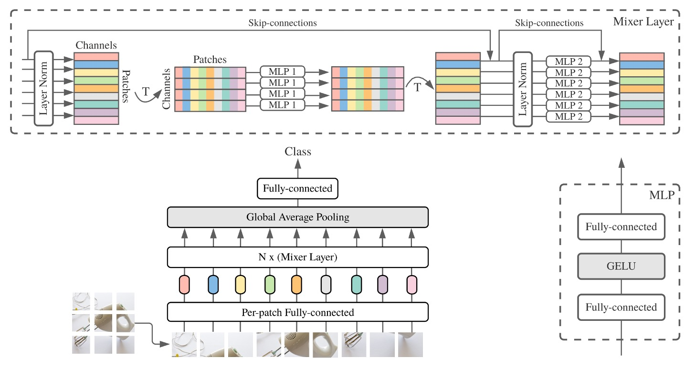

## 少しの損失があればそれは得

[**MLP-Mixer: An all-MLP Architecture for Vision**](https://arxiv.org/abs/2105.01601)

---

Transformer がコンピュータビジョンの分野に導入されて以来、多くの研究が Patch 間での情報交換をより効率的に行う方法を探求してきました。

この目的のために、新たな用語が登場しました：「Token-Mixer」。

その名の通り、Token-Mixer の目的は、異なる Patch 間の情報を混ぜ合わせ、モデルの性能を向上させることです。

従来の自己注意機構は、その一つの Token-Mixer の実装方法です。

しかし、元々の注意機構では計算量が非常に高いため、学術界では代替手段が模索され始めました。

MLP-Mixer はそのうちの一つです。

:::tip
Token-Mixer は後の論文で定義された用語であり、本論文で提案された独自の用語ではありません。
:::

## 問題の定義

著者は、自己注意の計算量が高すぎると考え、「それなら、自己注意を完全に廃止してしまおう！」という結論に至ります。

では、廃止した後、どうするか？

「ほら、そこにシンプルな全結合層があるじゃないか、それを使おう！」

~そしてこの論文は終了です。~（もちろん、そうではありません！）

## 問題の解決

### モデルアーキテクチャ



本論文では、2 段階の全結合層（MLP：多層パーセプトロン）を使用して情報交換を行うことを提案しています。

上の図は少し理解しにくいかもしれませんが、順を追って説明します：

1. 入力画像は 3 x 224 x 224 のサイズで、これを 16 x 16 のパッチに分割し、次元数は 512 と仮定します。

   - サイズの変化：[B x 3 x 224 x 224] -> [B x 512 x 14 x 14]。

2. Transformer の入力に変換します。

   - サイズの変化：[B x 512 x 14 x 14] -> [B x 512 x 196]。

3. 第 1 段階：パッチ間の情報交換。

   ```python
   import torch.nn as nn

   patch_mixer = nn.Linear(196, 196)

   # 入力サイズ：x = [B x 512 x 196]
   x_mix_patch = patch_mixer(x)

   # スキップ接続
    x = x + x_mix_patch
   ```

4. 第 2 段階：チャネル間の情報交換。

   ```python
   import torch.nn as nn

   channel_mixer = nn.Linear(512, 512)

   # 入力サイズ：x = [B x 512 x 196]
   # 先にreshape -> [B x 196 x 512]
   x_mix_channel = x.permute(0, 2, 1)
   x_mix_channel = channel_mixer(x_mix_channel)

   # reshapeして戻す
   x_mix_channel = x_mix_channel.permute(0, 2, 1)

   # スキップ接続
   x = x + x_mix_channel
   ```

これで 1 回の MLP-Mixer の計算が完了です。

上記の流れで、第二段階は元々の自己注意機構と同じように、MLP の計算が含まれています。

異なる点は、第一段階で、元々計算していたパッチの自己注意マップを、全結合層で直接計算していることです。

### 討論

### ImageNet 上の性能


- 「ImNet」と「ReaL」欄：それぞれ元の ImageNet 検証セットとクリーニング後の ReaL ラベルセットの結果を示しています。

- Avg 5：5 つの下流タスク（ImageNet、CIFAR-10、CIFAR-100、Pets、Flowers）の平均性能を示しています。

---

ImageNet-21k で事前訓練し、追加の正則化を行った場合、MLP-Mixer は ImageNet で 84.15%の top-1 精度を達成し、強力な性能を示しましたが、他のモデルにはやや劣りました。正則化なしでは、Mixer は過学習しやすく、これは ViT の結果とも一致します。

ImageNet でランダム初期化から MLP-Mixer を訓練した場合、Mixer-B/16 は解像度 224 で 76.4%のスコアを達成し、従来の ResNet50 に似た結果でしたが、BotNet（84.7%）や NFNet（86.5%）のような最先端の CNN/混合モデルには劣りました。

上流のデータセットサイズが増えると、MLP-Mixer の性能は顕著に向上しました。

Mixer-H/14 は ImageNet で 87.94%の top-1 精度を達成し、BiT-ResNet152x4 を 0.5%上回り、ViT-H/14 には 0.5%劣るだけでした。Mixer-H/14 は、ViT-H/14 よりも 2.5 倍速く、ほぼ BiT の 2 倍の速さでした。

精度と計算のトレードオフに関して、Mixer はより伝統的なニューラルネットワークアーキテクチャと競争力があります。異なるアーキテクチャクラス間で、総事前訓練コストと下流タスクの精度に顕著な相関があります。

### 可視化分析


一般的に、CNN の最初の層は Gabor のような検出器を学習し、画像の局所領域のピクセルに作用します。

一方で、MLP-Mixer は Token 情報を MLP 内で全体的に交換することを可能にします。このことから疑問が生じます：

- MLP-Mixer は、情報を CNN と同様に処理するのでしょうか？

この問いに答えるために、著者は MLP-Mixer の異なる層の特徴を視覚化しました。その結果、異なる層の特徴抽出が次のように示されました：

- 一部の学習された特徴は画像全体に影響を与え、他の特徴はより小さな領域に作用します。
- 深い層になるほど、明確に識別可能な構造は少なくなります。
- CNN と同様に、反対の位相を持つ特徴検出器が多く見られます。

## 結論

少しの損失があればそれは得！

元々の自己注意機構に比べて、MLP-Mixer は計算量を大幅に削減しました。性能が若干劣るかもしれませんが、それでも十分に市場に適応できる性能を持っています！
