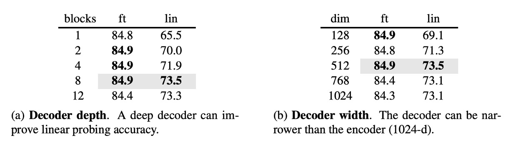
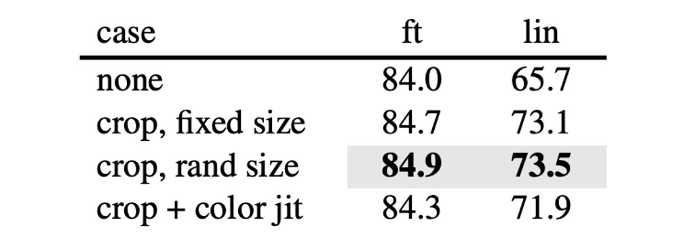
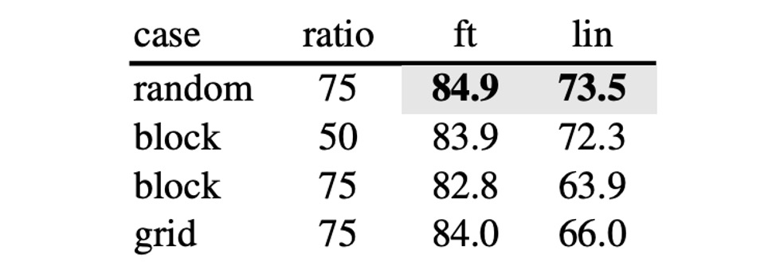

## 四分之一の線索

[**Masked Autoencoders Are Scalable Vision Learners**](https://arxiv.org/abs/2111.06377)

---

NLP の分野では、最も有名な事前学習の方法は Mask LM です。簡単に言うと、入力データの 15%のトークンを隠し、モデルにその隠されたトークンの内容を予測させるというものです。このクラシックな学習パラダイムにより、多くの優れたモデルが誕生しました。例えば、BERT、RoBERTa、ALBERT などです。

では、画像はどうでしょうか？

なぜ視覚領域では、似たような事前学習の方法がないのでしょうか？

## 問題の定義

ViT が提案された時、すでに似たような実験が行われていました。

- [**[20.10] ViT: 新世界の開拓者**](../2010-vit/index.md)

論文の中で、著者は Mask LM の方法を模倣し、画像の一部を隠し、その隠された部分を予測させるという手法を試みました。さらに、予測方法がピクセル単位か領域単位である違いについても探求しました。

結論は：どちらも良くない。

いずれの自己教師あり学習方法も、監視付きの方法と比較すると効果が劣っていました。

---

本論文の著者は、主な問題点として次のことを挙げています：**言語と視覚の情報密度が異なる！**

言語は人間が生成する信号で、高度な意味と情報密度を持っています。モデルが各文の中でいくつかの欠落した単語を予測するだけのタスクは、複雑な言語理解を引き起こすように見えます。一方、画像は自然信号であり、大量の空間的冗長性を持っています。モデルは近くのパッチから失われた情報を回復でき、部品、物体、シーンについての高度な理解を必要としません。

モデルにとっては、周囲のパッチから適当にいくつかを補間すれば、大部分の情報を回復できるため、学習する動機がほとんどありません。そのため、最終的な効果は期待したほど良くはなりません。

## 問題の解決

この違いを克服するために、著者は思い切って大部分のパッチを直接遮断し、残りの部分を学習させることにしました。遮断する割合は、75%です！

### モデルアーキテクチャ

ViT 論文で議論されていた元々のアーキテクチャとは異なり、いくつか変更が加えられています。

最初に、画像をパッチに分割し、その一部をランダムに隠します。中心偏差を避けるため、隠されるパッチはランダムサンプリングで選ばれます。

- **Encoder**

  ここからが異なります。

  隠されたパッチは、Encoder モデルに送られた後、学習には使用されず、損失計算にも含まれません。モデルは、隠されていないパッチのみを学習します。

  この方法の利点は、少量の計算リソースで非常に大きなモデルを計算できることです。実際に推論を行う際には、全てのマスクを外すことで、完全なモデルの能力を得ることができます。

- **Decoder**

  ここでは、補助的な訓練用の Decoder モデルが導入されています。ここでの入力は「完全な」画像のシーケンスで、隠されたパッチを含んでいます。隠されたパッチには位置情報だけがあり、その他の内容はありません。

  モデルの目標は、隠されたパッチを予測し、最終的に元の画像と比較して損失を計算することです。

  事前学習が終了した後、この全体のモジュールは捨てられ、Encoder 部分のみが残ります。

### 訓練方法

MAE は、各マスクされたパッチのピクセル値を予測することで入力を再構築します。Decoder の最終層は線形投影で、出力チャネルの数はパッチ内のピクセル数と等しくなります。

損失関数は、ピクセル空間での再構築画像と元の画像との間の平均二乗誤差（MSE）を計算します。ここでは、隠されたパッチだけを訓練し、画像全体ではなくその一部に対してのみ学習します。

論文の著者は読者が理解できないのではないかと心配し、論文内に多くの図を挿入しています。その一例を以下に示します：

最左が入力画像（マスク付き）、中央が Decoder の出力、最右が元の画像です。

## 討論

著者はまず、ViT の訓練方法を最適化し、元々の 76.5%の top-1 精度を 82.5%に向上させ、モデルの基準として設定しました。

MAE の操作により、この基準からさらに 84.9%にまで精度が向上し、その効果は驚くべきものでした。

### どれくらいの割合を隠すべきか？

著者は二つのシナリオ、Fine-tuning と Linear-probing で実験を行いました。

:::tip
違いは、Fine-tuning は事前学習したモデルを微調整する方法であり、Linear-probing は事前学習したモデルを凍結し、最後の分類器のみを訓練する方法です。
:::

上の図から見ると、隠す割合が 80%を超えると、精度は下降し始めます。40%から 80%の間が最も効果的です。最終的に著者は Linear-probing の実験結果を基に、75%のマスク割合を選択しました。

特に注意すべきは、Encoder 段階でマスクされたパッチを入力すると、効果が非常に悪化する（14%減少）ことです。これは、この方法がモデルの訓練とデプロイメントの方法を一致させることを妨げ、学習を阻害するためです。

### Decoder パラメータ

著者はさらに Decoder のパラメータが最終的な効果に与える影響を探りました。

実験結果から、Decoder の深さが 8 の時が最も効果的であり、Decoder の幅は必ずしも Encoder と一致させる必要はなく（dim=1024）、幅は半分程度でも良いことがわかりました。

### 学習目標

本論文の結果はすべて元のピクセルを再構築することに基づいていますが、著者は他の学習目標も探求しました。例えば、PCA 主成分の予測、dVAE の潜在変数の予測などです。

これらの結果は、元のピクセルの再構築に比べて効果は劣りますが、標準化されたピクセル値の予測が良好な結果を示したことがわかりました。

### 画像強化

著者は訓練過程で画像強化を導入し、ランダムクロッピングやランダム回転などを試みましたが、結果としてこれらは必要ないことが分かりました。モデルは元の画像で最良の効果を発揮しました。

これは、対照学習の関連手法とは非常に明確に異なります。対照学習では、BYOL や SimCLR などの方法で画像強化が非常に重要で、これらの強化なしでは効果が大幅に低下します。

- [**[20.02] A Simple Framework for Contrastive Learning of Visual Representations**](https://arxiv.org/abs/2002.05709)
- [**[20.06] Bootstrap your own latent: A new approach to self-supervised Learning**](https://arxiv.org/abs/2006.07733)

### マスク方法

論文で提案されたマスク方法に加え、著者は幾つかの異なるマスク方法をテストしました。

- random: ランダムマスク
- block: ブロック単位のマスク
- grid: グリッド単位のマスク

違いは以下の図の通りです：

実験結果によると、ブロック方式は 50%のマスク割合で良好な効果を示しましたが、75%のマスク割合ではランダム方式の方が効果的でした。ランダム方式は最も多くのマスクを行い、モデルの訓練に加え、最良の結果を提供しました。

### ImageNet での効果

1. **自己教師あり方法の比較**：

   - ViT-B モデルにおいて、異なる方法間での性能差はほとんどありません。
   - ViT-L モデルにおいては、方法間の差が大きく、これは大規模なモデルで過剰適合を減らすことが課題であることを示しています。
   - MAE 方法は良好なスケーラビリティを持ち、より大きなモデルで安定して精度を向上させることができます。
   - ViT-H モデル（224 サイズ）を使用した場合、MAE 方法は 86.9%の精度を達成し、サイズを 448 に調整した後、IN1K データのみで精度は 87.8%に向上しました。

2. **先進的な方法との比較**：

   - IN1K データのみを使用した全ての方法の中で、MAE 方法は以前の最先端ネットワークに基づく最高精度（87.1%）を超えました。
   - MAE は BEiT モデルよりも精度が高く、さらに簡単な操作で訓練速度が速く（各エポックで 3.5 倍のスピードアップ）、dVAE 事前学習を必要としません。

MAE モデルは 1600 エポックの事前学習で精度を向上させ、他の方法よりも総事前学習時間は短いです。監視付き事前学習との比較では、MAE 方法はモデルの規模を拡大し、監視付き訓練よりも良好な結果を示しました。

## 結論

画像処理では、光信号は文字のように明確な意味の分解を持っていませんが、MAE は精緻な画像再構築を生成でき、これにより重要な視覚的概念を捉えていることが示されています。

これは NLP 分野での成功経験と似ており、視覚分野も異なる方法で同様の発展軌跡を歩んでいることがわかります。

今後、多くの研究がこのアプローチを取り入れ、MAE の手法を訓練過程に加えることでモデルの効果を向上させています。関連する研究が登場した際には、さらに共有したいと思います。
