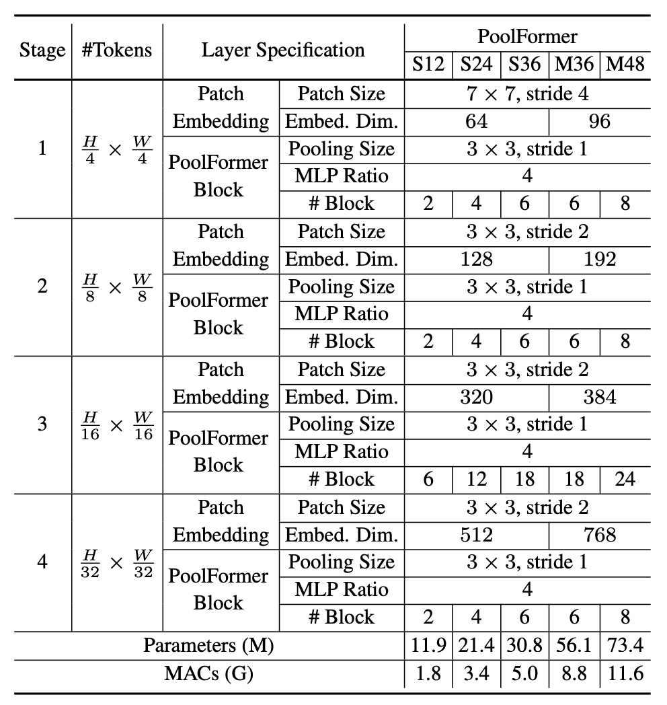
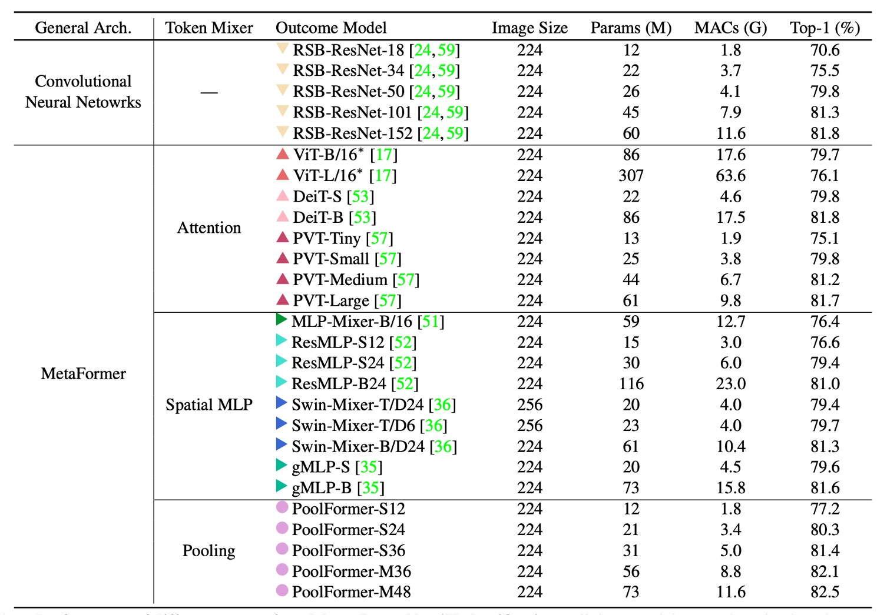

## あなたが必要なのはフレームワーク！

[**MetaFormer Is Actually What You Need for Vision**](https://arxiv.org/abs/2111.11418)

---

Transformer アーキテクチャが視覚領域に導入された後、研究の波が巻き起こりました。

過去の研究では、多くの人が Token-Mixer の性能向上に取り組み、一部の人々は Patchify プロセスの最適化に取り組んでいました。

しかし、これらの研究は重要な問題を無視していました：**フレームワーク**。

## 問題の定義


この「**フレームワーク**」は、Transformer を構成する基本的な構造を指します。具体的には以下の要素を含みます：

### 入力埋め込み (Input Embedding)

この部分は画像をベクトルシーケンスに変換する過程で、通常は CNN を用いて行われます。

:::tip
通常、これは重なりのないスライディングウィンドウを使用した大きなカーネル畳み込みで、実際には全結合層として機能しますが、CNN を使用する理由はスライディングウィンドウの仕組みを利用して切り分けの効果を得るためです。
:::

### Token-Mixer

この部分は「Token 間」の混合を行うもので、通常は Transformer の Self-Attention を用いて行います。

最近の研究では、Token-Mixer の Self-Attention を MLP に置き換える MLP-Mixer という概念が導入され、これにより計算量を減らすことができます。

### チャネル MLP (Channel MLP)

この部分は各 Token 内の「次元間」の混合を行います。

この部分は主に MLP を使って実行されます。

### Token-Mixer は重要でない？

著者は、Transformer の中で基づいている注意機構の Token-Mixer が成功にどれだけ貢献しているのか、それとも Transformer 全体のアーキテクチャ（MetaFormer）がより重要なのかを探ることを試みました。

彼らは、元々の注意モジュールをシンプルなプーリング演算子に置き換えて実験を行い、MetaFormer アーキテクチャそのものがモデルのパフォーマンスにおいて重要な役割を果たしていることを確認しました。

## 解決問題

### モデルアーキテクチャ


著者は MetaFormer の重要性を検証するために、Token-Mixer の役割を弱め、元々の Self-Attention モジュールをプーリング操作に置き換えました。この操作の単純さは、ほぼ恒等写像に次ぐものです。プーリングは、データセットの数値を統計的に操作するだけのものです。例えば、最大プーリングや平均プーリングなどがあります。

さらに、著者は PVT の多層アーキテクチャを踏襲し、CNN モデルのように階層的なダウンサンプリングを行いました。

- [**PVT: 空間縮減注意機構**](../2102-pvt/index.md)

プーリング操作について、著者は実装の詳細を以下のように示しています：

```python {20}
import torch.nn as nn

class Pooling(nn.Module):

    def __init__(self, pool_size=3):
        super().__init__()
        self.pool = nn.AvgPool2d(
            pool_size,
            stride=1,
            padding=pool_size//2,
            count_include_pad=False,
        )

    def forward(self, x):
        """
        [B, C, H, W] = x.shape
        入力自体との差分が追加されているのは、ブロックにすでに残差接続が
        あるためです。
        """
        return self.pool(x) - x
```

特に注目すべきは、実装中の `self.pool(x) - x` という部分で、初めて見ると少し混乱するかもしれません。

著者はコメントで、この理由を次のように説明しています。Token-Mixer の構造には残差接続の仕組みがあり、次のような式が成り立っています：

$$
x = x + \text{TokenMixer}(x)
$$

ここで `x` を引く理由は、元々の残差接続をキャンセルして、プーリング操作の効果を純粋に評価するためです。

### モデル設定



ここでのアーキテクチャ設定は、これまでの研究の比率に従い、1:1:3:1 の比率を採用しています。また、MLP の拡張比率は 4 です。

## 討論

### ImageNet 実験



PoolFormer の実験結果は非常に驚くべきもので、ImageNet でのパフォーマンスは、ViT、MLP-Mixer、PVT などの以前の「精緻に設計された」モデルを超えています。

単に「平均プーリング」を Token-Mixer の代替として使用するだけで、これほど素晴らしい結果が得られることがわかり、MetaFormer の重要性が証明されました。

上の表をグラフにすると、PoolFormer はパラメータ数と計算量が少ないにもかかわらず、他のモデルを上回る性能を発揮していることがわかります。


### 消融実験

:::tip
この論文のタイトルを基に、このセクションが最も重要な部分であると考えられます。
:::


PoolFormer の有効性をさらに検証するために、著者は消融実験を行い、PoolFormer のアーキテクチャを徐々に元の Transformer アーキテクチャに戻しました。

1. **Token-Mixer**

   - **恒等写像**
     - プーリングを恒等写像に置き換えた後、MetaFormer は依然として 74.3%の top-1 精度を達成しました。これにより、MetaFormer 自体が性能保証のカギであることが示されています。
   - **全域ランダム行列**
     - 全域ランダム行列を用いて Token 混合を行った結果、モデル精度は 75.8%となり、恒等写像よりも 1.5%向上しました。
   - **深層畳み込み**
     - 深層畳み込みでプーリングを置き換えた場合、モデル精度は 78.1%となり、PoolFormer-S12 より 0.9%向上しました。

2. **プーリングサイズ**

   - プーリングサイズを 3、5、7 でテストした結果、性能は似たようなものであり、デフォルトではプーリングサイズ 3 が選ばれました。

3. **層標準化（MLN）の変更**

   - 標準化された平均値と分散を計算することで、Layer Normalization や Batch Normalization よりもそれぞれ 0.7%または 0.8%高い結果を得ました。
   - 標準化を削除すると、モデルの性能は 46.1%に低下しました。

4. **GELU vs ReLU vs SiLU**

   - ReLU を使用すると、性能が 0.8%低下しました。
   - SiLU を使用すると、性能は GELU と同じでした。
   - デフォルトでは GELU を使用しています。

5. **残差接続とチャンネル MLP**

   - 残差接続やチャンネル MLP がないと、モデルは収束せず、精度は 0.1%/5.7%にとどまりました。

6. **混合モデル**
   - 下部の段階でプーリングを使用し、上部で注意機構や空間 MLP ベースの混合器を使用する変種。 この変種は 16.5M のパラメータと 2.5G の MAC で 81.0%の精度を達成しました。
   - ResMLP-B24 と比較すると、116M のパラメータと 23G の MAC を必要とし、同じ精度に達するにはそれだけのリソースが必要です。

上記の消融実験に基づき、著者はいくつかの見解を提出しました：

- MetaFormer アーキテクチャは性能保証のカギである。
- シンプルなプーリングを Token-Mixer として使用するだけでも競争力のある性能が得られる。
- 層標準化（MLN）は通常の LayerNorm や BatchNorm よりも優れている。
- 残差接続と Channel MLP は欠かせない要素である。
- プーリングと他の Token-Mixer を組み合わせることが性能向上の有望な方向である。

## 結論

この研究で著者は、元々の Transformer を MetaFormer という汎用アーキテクチャに抽象化しました。

Transformer 内の注意機構を Token-Mixer として抽象化したことは革新的であり、この抽象化は特定の Token-Mixer に限定されないため、柔軟で強力なフレームワークを提供します。

プーリングという非常にシンプルな操作を Token-Mixer として使用することによって、著者は PoolFormer モデルがさまざまな視覚タスクで競争力を持つことを示し、MetaFormer が視覚に必要なアーキテクチャであるという主張を強力に支持しました。

今後の研究の方向性の一つは、MetaFormer アーキテクチャの広範な適用性と堅牢性を検証することです。

著者は、PoolFormer が自然言語処理（NLP）タスクにどのように適用できるかを探求することを提案しており、MetaFormer が NLP 分野でも有効であることを証明できれば、MetaFormer の汎用アーキテクチャとしての地位はさらに強固なものになるでしょう。
