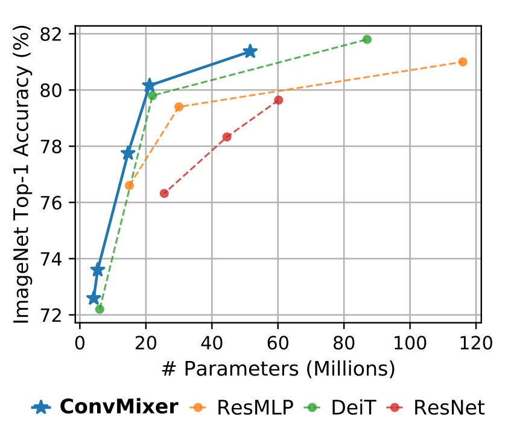

## コンボリューションミキサー

[**Patches Are All You Need?**](https://arxiv.org/abs/2201.09792)

---

この数年間、「XXX is all you need」というタイトルをよく目にします。

このようなタイトルを見ると、何が起こったのか気になってしまいます。

## 問題の定義

ViT が提案されてからの数年間、誰もがその強力な理由を知りたがっています。それは自注意機構によるものか？それとも Token-Mixer の仕組みか？それとも全体のアーキテクチャの設計によるものか？

本論文では、ViT の強力さが Patchify の仕組みに由来するのかを探ることを目的とし、ConvMixer を提案しています。自注意機構の影響を排除した場合でも、モデルの性能が維持できるなら、Patchify の仕組みが「ある程度」重要であることを証明できるからです。

## 問題の解決

### モデルアーキテクチャ

著者は元々の ViT アーキテクチャに改変を加え、主な違いは 2 つです：

1. **元々の Self-Attention モジュールを Convolution モジュールに置き換えました。**

   上の図では、変更した部分が追加で示されています。

   初めの Patchify のプロセスは変更されませんが、Token-Mixer 部分では元々の Self-Attention モジュールを Depthwise Convolution に置き換えました。

   この変更により、元々すべての Token が他の全ての Token を見れる状態から、各 Token は自分の「近くの」Token しか見ることができなくなります（畳み込みカーネルのサイズによって異なります）。これにより、自注意機構が消失し、Patchify の仕組みがモデル性能に与える影響を観察できるようになりました。

2. **元々の MLP を Pointwise Convolution に置き換えました。**

   この変更は実質的には変更していないということです。なぜなら、Pointwise Convolution は実際には MLP と同じだからです。

   これを特に挙げた理由は、これらの操作が畳み込みによって実現でき、画像チャネルに対する全結合層の操作を Pointwise Convolution と呼ぶからです。

### 訓練戦略

著者は追加のトレーニングデータを導入することなく、ImageNet を用いて訓練を行いました。

訓練の設定は他のモデルと似ており、RandomAug、MixUp などの方法を使用して訓練しています。最適化器には AdamW を使用しましたが、エポック数は少なめです。これは論文に記載されている通り、計算リソースが不足していたためです。

### モデルパラメータ設計

ConvMixer モデルの設計パラメータは以下の 4 つです：

1. **幅（hidden dimension, h）**：つまり、パッチ埋め込みの次元、またはモデルの隠れ次元です。

2. **深さ（depth, d）**：ConvMixer 層の繰り返し回数で、モデルの深さを示します。

3. **パッチサイズ（patch size, p）**：モデル内部の解像度を制御するパラメータです。このパラメータは、入力画像が畳み込み時にどのように初期分割されるかを決定します。

4. **カーネルサイズ（kernel size, k）**：深層畳み込み層のカーネルサイズで、畳み込み操作の範囲に影響を与えます。

ConvMixer モデルは通常、隠れ次元と深さに従って命名されます。例えば、ConvMixer-h/d です。また、ConvMixer は可変サイズの入力をサポートしており、内部解像度は元の入力サイズ n をパッチサイズ p で割った値に基づいて決まります。

## 討論

### ImageNet でのパフォーマンス

:::tip
小さいパッチサイズのため、ConvMixer の推論速度は他の競合と比べて遅くなります。
:::

ConvMixer-1536/20 は ResNet-152 よりも優れた性能を発揮しましたが、そのパラメータ数ははるかに少なく、ConvMixer-768/32 は ResNet-152 の 1/3 のパラメータで、同等の精度を達成しました。

ConvMixer-1536/20 はパラメータ数が少ないにもかかわらず、ResMLP-B24 を上回り、DeiT-B と同等の性能を示し、パラメータ数に対する効率性を示しました。これに対し、DeiT や ResMLP の結果はハイパーパラメータの調整を含んでいますが、ConvMixer の結果はハイパーパラメータの調整なしで得られています。

## 結論

本論文では、ConvMixer を提案し、Patchify の仕組みを探るために自注意機構の影響を弱めました。

実験結果により、自注意機構を排除してもモデルの性能は維持され、著者は次の 2 つの結論を導きました：

1. Patchify の仕組みは確かに重要である。
2. ConvMixer はシンプルで優れた性能を持ち、推奨される操作である。

:::tip
実験結果に基づき、「自注意機構は必須ではない」という結論に賛同しますが、「Patchify」部分は非常にシンプルで、これ以上簡素化することはできません。

Patchify は結局、ただの Linear 操作に過ぎず、NLP タスクでよく使われる `nn.Embedding` と同じようなものです。NLP では、`nn.Embedding`が「優れた操作」とされることはほとんどなく、大抵のエネルギーは「Tokenize」の設計に費やされます。

したがって、この論文のタイトルを考えると、期待するのは「優れた Patchify 操作」であり、Transformer アーキテクチャに基づいて大幅に性能を向上させるものだと思います。

その時に「A good patchify is all you need」と言えるかもしれませんが、また別の問題に直面するでしょう。

我々は強力な構造であるはずの Transformer に、より多くの操作を加えることで、依然としてその力を信じていないような状態です。

ああ、このタイトルは本当に悩ましいですね！
:::
