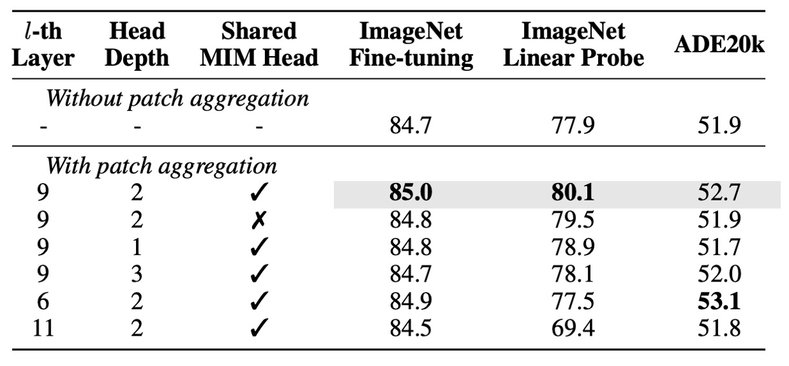
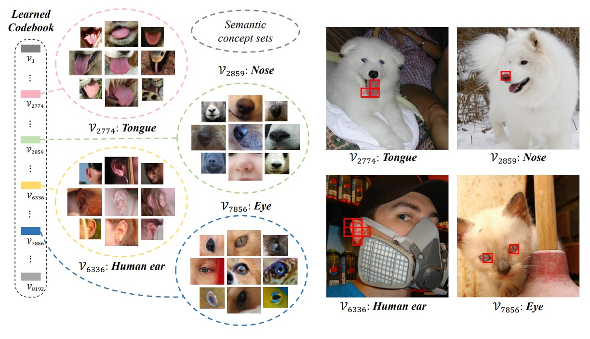

## 高次元に隠された暗号

[**BEiT v2: Masked Image Modeling with Vector-Quantized Visual Tokenizers**](https://arxiv.org/abs/2208.06366)

---

BEiT を覚えていますか？

もし忘れてしまったなら、早速復習しましょう。そうしないと、この論文を読むことができません：

<figure style={{"width": "80%"}}>

</figure>

BEiT の核心となる概念は、画像を一組の離散的な視覚特徴（8192 個）に変換することです。ここには 2 つのアーキテクチャが同時に存在しており、上の図のように示されています。

最初のアーキテクチャは、VAE に似た構造で、図の上半部に位置します。この部分は過去の研究成果であり、訓練には関与せず、画像を離散的な視覚特徴に変換するために使われます。全体的な概念は「画像辞書」を訓練するようなもので、画像の異なる抽象的な概念に対応しています。

次のアーキテクチャは下半部で、実際に勾配更新に関与するモデルです。ここでは、BERT の MLM（Masked Language Modeling）機構を導入し、画像のブロックに対してマスキング再構成を行います。画像ブロックを隠すので、Masked Image Modeling（MIM）とも呼ばれます。

:::tip
BEiT の詳細に興味がある方は、以前のノートをご参照ください：

- [**[21.06] BEiT: 離散エンコーディングによる事前学習**](../2106-beit/index.md)
  :::

## 問題の定義

MIM と言えば、最近では MAE が最も有名かもしれません。

MAE は、画像情報には多くの冗長性が存在すると考え、少しの領域をマスキングするだけではモデルが有用な情報を学習できないとしています。MAE の方法では、50％から 75％の画素をマスキングして画像を再構成する戦略を採用し、モデルが学習する難易度を高めています。

実験結果は確かに素晴らしく、流行を巻き起こしました。

:::tip
MAE についてもっと詳しく知りたい方は、こちらの論文をご覧ください：

- [**[21.11] MAE: 四分之一の線索**](../2111-mae/index.md)
  :::

しかし、MAE は結局のところ「低次元」の画素再構成に注力し、「高次元」の意味情報を無視しているため、表現学習における意味的能力が不足しています。

では、「高次元」の意味情報とは何でしょうか？

著者は、BEiT が提案する視覚トークン（visual token）が画素から離れた「より高次元」の抽象的な概念であると考えています。そのため、BEiT の成果を基に、モデルがより豊かな意味情報を学習できるような方法を考えたのです。

## 問題解決

### モデルアーキテクチャ

このアーキテクチャは著者が「ベクトル量子化知識蒸留（Vector-Quantized Knowledge Distillation）」、略して VQ-KD と呼んでいます。

突然多くの専門用語が出てきて驚くかもしれませんが、図を見ながら一歩一歩説明していきます。

- **ステップ 1: 画像特徴量の計算**

  まず、入力画像 $x \in \mathbb{R}^{H \times W \times C}$ を $N = \frac{HW}{P^2}$ 個の画像ブロック（patch）に分割します。

  画像が $224 \times 224$ で、各 patch のサイズが $16 \times 16$ の場合、$14 \times 14 = 196$ 個の patch があり、つまり $N=196$ となります。各 patch を平坦化し、ViT エンコーダを通してベクトル表現 $h_i$ を得ます（ここで $i=1,2,\dots,N$ ）。

  よって、私たちは一組のベクトル $\{h_i\}_{i=1}^N$ を得ます。各 $h_i$ は対応する画像ブロックに対応します。

  ここまでは、BEiT の初代とあまり変わりはありません。

---

- **ステップ 2: 特徴量を使ってコードブックを検索**

  ここから違いが出てきます。BEiT の初代では、著者は直接 DALL-E が出力する視覚トークンを使用していました。

  第 2 代のアーキテクチャでは、直接コードブック（codebook） $V \in \mathbb{R}^{K \times D}$ を設定します。ここには $K$ 個のコードベクトル $\{v_j\}_{j=1}^K$ が含まれ、各 $v_j$ は $D$ 次元ベクトルです。

  ベクトル $h_i$ を対応するコード $v_{z_i}$ にマッピングするために、著者は以下の式を使って最も類似したコードインデックス $z_i$ を検索します：

  $$
  z_i = \arg\min_j \| \ell_2(h_i) - \ell_2(v_j) \|^2,
  $$

  L2 正規化とは、ベクトル $h_i$ を単位球面に投影し、最も類似したコード $v_j$ を見つけることです。この方法では、ベクトルの長さではなく、方向を比較することができます。

  このステップが「ベクトル量子化」の過程であり、連続的な特徴ベクトルを離散的なコードに変換するものです。

---

- **ステップ 3: 教師モデルを整列させ、知識蒸留を行う**

  コード $v_{z_i}$ を選んだ後、その L2 正規化されたベクトル $\ell_2(v_{z_i})$ をデコーダー（これも Transformer アーキテクチャ）に入力します。

  デコーダーの出力は $o_i$ となり、「教師モデル」（例えば CLIP）によって与えられた意味的特徴 $t_i$ と整列させて高次の意味を学習します。

  訓練時には、$o_i$ と $t_i$ のコサイン類似度を最大化することを目指し、デコーダーが意味的に質の高い表現を生成できるようにします。

  このステップが「知識蒸留」の過程であり、モデルに豊かな意味情報を学ばせるものです。

---

簡単に言うと、デコーダーはコードベクトルを受け取った後、$o_i$ を出力し、$\cos(o_i, t_i)$ をできるだけ大きく（つまり $o_i$ と $t_i$ が似ているほど良い）しようとします。

量子化の過程（arg min でコードを選択する）では、直接 $z_i$ に対して微分できません。著者は以下の方法でこの問題を解決しています：

- 特定のパスで勾配が伝播しないように、stop-gradient（記号 $sg[\cdot]$）操作を使用します。
- デコーダーへの入力の勾配を「直通」（straight-through）でエンコーダーに伝播させ、エンコーダーとコードブックの両方が更新されるようにします。

VQ-KD の全体的な訓練目標は次のようになります：

$$
\max_{\{v_j\}} \sum_{x \in D} \sum_{i=1}^{N} \cos(o_i, t_i) - \| sg[\ell_2(h_i)] - \ell_2(v_{z_i}) \|_2^2 - \|\ell_2(h_i) - sg[\ell_2(v_{z_i})]\|_2^2,
$$

この目的関数には 3 つの部分があります：

- $\cos(o_i, t_i)$：デコーダーの出力と教師特徴の類似度を最大化し、コードに高い意味情報を持たせます。
- $\| sg[\ell_2(h_i)] - \ell_2(v_{z_i}) \|_2^2$：コードブックで選ばれたコード $v_{z_i}$ をエンコーダーの出力 $h_i$ に近づける（ただし、$h_i$ は $v_{z_i}$ に勾配を伝えません）。
- $\|\ell_2(h_i) - sg[\ell_2(v_{z_i})]\|_2^2$：エンコーダーの出力 $h_i$ を選ばれたコード $v_{z_i}$ に近づける（コードはその項から勾配を受け取らない）。

stop-gradient を使って、エンコーダーとコードブックをお互いに近づけるよう調整し、最終的に意味的にバランスの取れたコードブックが得られます。

訓練中の一般的な問題は、コードブック内でごく少数のコードしか頻繁に使用されず、他のコードは「アイドル状態」になることです。

この問題を解決するために、著者は以下の戦略を採用しています：

- L2 正規化を使って距離を計算し、各コードの使用頻度を均等にします。
- コードブックのベクトル次元を 32 次元に縮小し、再度高次元空間にマッピングすることで、一部のコードが過度に集中して使用される問題を減少させます。
- 指数移動平均（Exponential Moving Average, EMA）を使用してコードを更新し、更新をより安定させ、多様化させます。

これらの手順とテクニックを通じて、VQ-KD は視覚トークナイザーに離散的なコードを使って画像を表現させ、画像の意味情報を保持しながら、連続的な特徴から高次元の意味的離散表現への変換を実現します。

### 事前学習方法

VQ-KD が完了すると、視覚トークナイザーは離散的なコードを使って画像を表現できるようになります。次はこれらのコードを使って MIM 事前学習を行います。

入力画像 $x$ の約 40％の patch をランダムにマスク（masked）します。マスク後、マスクされた位置 $M$ には同じ学習可能な埋め込みベクトル $e[M]$ を使って元の patch 埋め込み $e_{p_i}$ を置き換えます。

上の図では、青い部分が実際に BEiT 初代の MIM 事前学習プロセスであり、マスクの割合も同じです。予測時には、単純な全結合層（MIM ヘッド）を使用して視覚コードを予測します。この視覚コード $z_i$ は、前の訓練で学習された視覚トークナイザーによって提供されます。つまり、$z_i$ は元画像の対応する patch の離散コードです。

MIM の訓練損失は次のようになります：

$$
L_{\text{MIM}} = -\sum_{x \in D} \sum_{i \in M} \log p(z_i | x_i^M)
$$

ここで、$D$ は事前学習に使用される画像データセットです。

### グローバル表現の事前学習

上図の `Path Aggregation` 部分は、今回の BEiT v2 の新しい設計です。

監視情報が視覚トークナイザーの全域に深く浸透するようにするため、著者は「グローバル表現の事前学習」と呼ばれる新しい設計を提案しました。

この方法では、視覚トークナイザーの最終層に Transformer デコーダーを追加し、[CLS]トークンと途中の層で得られた patch 特徴量を結合して、浅い Transformer デコーダーに入力します。このデコーダーは、マスクされた patch の予測を行います。

ここでのデコーダーは、元の MIM ヘッドのパラメータを共有しており、損失計算の方法は前述の MIM 損失と同様で、$L_{c}^{\text{MIM}}$ として記録されます。そのため、最終的な事前学習損失は、元の MIM 損失とこの浅いデコーダー MIM 損失の合計です：

$$
L_{\text{total}} = L_{\text{MIM}} + L^{c}_{\text{MIM}}
$$

訓練が終了した後、この浅いデコーダーは破棄され、グローバル特徴を持つ[CLS]トークンのみが残ります。

### モデル設定

- **視覚トークナイザー (Visual Tokenizer)**

  BEiT V2 の base-（B）および large-（L）規模事前学習を行うために、視覚トークナイザーのアーキテクチャには ViT-B/16 を採用しています。デコーダーは三層の Transformer を使用し、トークナイザーエンコーダーと同じ次元と注意ヘッド数を持っています。

  教師モデルは OpenAI CLIP-B/16 で、ImageNet-1K（解像度 224×224）で VQ-KD を訓練します。後続の base-size または large-size モデルの事前学習には、同じ base-size の教師を使用してトークナイザーを訓練します。

  Codebook のサイズは$K=8192$、コードの次元は$D=32$です。

  :::tip
  他の詳細については、論文の付録 D を参照してください。
  :::

- **Masked Image Modeling 設定**

  BEiT と同様に、著者はラベルのない ImageNet-1K で自己教師あり事前学習を行い、入力画像の解像度は$224 \times 224$です。

  モデルには ViT-B/16 および ViT-L/16 をバックボーンアーキテクチャとして採用しています（$16 \times 16$ patch）。パッチ集約の戦略では、ViT-B/16 には$l=9$を設定し、ViT-L/16 には$l=21$を設定、深さはデフォルトで 2 層です。マスク率は 40％（約 75 個の patch）で、マスク戦略は block-wise masking です。

  :::tip
  他の詳細については、論文の付録 E を参照してください。
  :::

## 討論

### 他の方法との比較

<figure style={{"width": "80%"}}>

</figure>

まずはファインチューニングの結果を見てみましょう。著者は BEiT v2 を BEiT、CAE、SplitMask、PeCo、MVP と比較し、BEiT v2 が ImageNet-1K での top-1 精度において他の方法を大きく上回る結果を示しています。

事前学習のエポック数を増やすことで、BEiT v2 の top-1 精度はさらに向上し、85.5％に達しました。これは自己教師あり学習の新記録です。ViT-L/16 モデルでは、300 エポックで 86.6％に達し、さらに長い事前学習で 87.3％に向上しました。

上表の最後の列は、著者が ADE20K（Zhou et al., 2019）データセットで実験を行った結果です。このデータセットは 25K 枚の画像と 150 の意味的カテゴリーを含んでいます。UperNet（Xiao et al., 2018）をタスク層として使用し、$512 \times 512$の入力解像度で 160K イテレーションでファインチューニングを行いました。

結果として、BEiT v2 は ADE20K で従来の自己教師あり学習方法を大きく超える結果を示し、ViT-L/16 モデルでは mIoU が 56.7 に達し、MIM 手法として新たな記録を樹立しました。

### アブレーション実験－コードブックのサイズ

上表は、異なるアーキテクチャとコードブックのサイズが VQ-KD に与える影響を示しています。

実験は、patch 集約を含まない ViT-B/16（300 エポックの事前学習）を基準にしています。

結果は以下の通りです：

- より深いデコーダーは再構成の精度を高めますが、コードブックの利用率が低下し、下流タスクの性能も悪化します。
- コードブック検索時の次元を減らすことで、コードブックの利用率が向上することがわかります。

### アブレーション実験－パッチ集約戦略

<figure style={{"width": "80%"}}>

</figure>

次に著者が行ったパッチ集約戦略のアブレーション実験の結果を見てみましょう：

- より浅いヘッド（1 層または 2 層）を使用する方が、より深いヘッド（3 層）を使用するよりも良い結果を示しました。これは、浅いヘッドが入力の[CLS]トークンをよりよく活用する傾向があることを意味しています。
- この戦略を適用したモデルは、基準モデルよりも優れたパフォーマンスを発揮し、特に線形プロービングで大きな向上を見せました。これは、この戦略が画像レベルの表現を強化したことを示しています。
- この戦略を使用することで、MIM ヘッドの共有が下流タスクの性能を向上させることが分かります。

### アブレーション実験－教師モデルの分析

<figure style={{"width": "80%"}}>

</figure>

著者は DINO と CLIP を教師として使用した場合の VQ-KD の効果を比較しました：

- DINO を教師として使用した場合、BEiT v2 は ImageNet で 84.4％、ADE20K で 49.2％に達し、元の DINO モデルを大きく上回っています。
- CLIP を教師として使用した場合、BEiT v2 はさらに向上し、VQ-KD の拡張性が確認されました。

上表の灰色の文字は、直接 ImageNet で VQ-KD エンコーダーを微調整した場合の結果を示していますが、その転送能力は教師モデルに劣ります。しかし、MIM 事前学習を追加することで、モデルは教師やトークナイザーエンコーダーを超える結果を出し、この自己教師あり学習法の優位性が証明されました。

### コードブックの視覚化

最後に、コードブックの視覚化結果を見てみましょう。

著者は VQ-KD を使用して ImageNet-1k 検証セットの離散コードを計算し、同じコードを持つ画像パッチをグループ化しました。見ると、同一のコードに対応するパッチが類似した意味的特徴を持っていることがわかります。例えば、コード 7856 に対応するパッチはすべて「目」に関連しており、人間、猫、犬、魚、蛇の目が含まれています。

## 結論

コードブックは非常に魅力的な概念です。

現在の研究トレンドを見ると、コードブックは画像トークナイゼーションだけでなく、より高品質な視覚トークナイザーの訓練や MIM 事前学習にも活用されており、さらに多モーダル領域を橋渡しする強力な方法の一つと見なされています。また、離散コードを仲介として使用することで、モデルは大量のラベルなしデータから意味的特徴を抽出でき、大規模な人工ラベルに対する依存を減少させることができます。ラベルが不足している領域では、コードブックを用いた方法で自己教師あり学習が可能であるかもしれません。

全体的に見て、本文は VQ-KD を通じて BEiT の事前学習プロセスを改善し、MIM をより高次元の意味理解に進展させました。同時に、著者が提案したパッチ集約機構は、モデルがグローバル情報をよりよく統合し、事前学習目標と下流アプリケーション間のギャップを縮めることに貢献しました。

次のステップは、「離散エンコーディング」のコンセプトを携えて、多モーダル分野に進出することです。それが BEiT-3 です。

- [**[22.08] BEiT-3: 英雄见るところ略同じ**](../../multimodality/2208-beit-v3/index.md)
