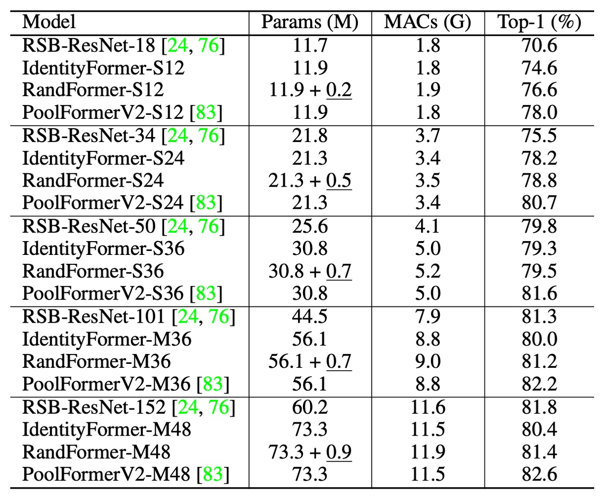

# [22.10] CAFormer

## MetaFormer ユーザーマニュアル

[**MetaFormer Baselines for Vision**](https://arxiv.org/abs/2210.13452)

---

著者は初版の MetaFormer 論文を発表した後、その性能を示すために、続けて別の論文を発表しました。

- [**PoolFormer: あなたが必要なのはフレームワークです！**](../2111-poolformer/index.md)

この論文では新しいアーキテクチャを提案するのではなく、前の論文で提案されたフレームワークに基づいて、ユーザーがどのようにモデルを構築すべきかを示しています。

私たちはこの論文を読んで、この論文こそが MetaFormer の使用説明書であると感じました。

## 問題の定義

著者が手取り足取り MetaFormer の使い方を教えてくれます。

## 問題の解決

### モデルアーキテクチャ

MetaFormer の性能を示すために、著者は 4 つの Token Mixer を提案し、それぞれがモデルの性能に与える影響を調べました。

1. **Identity Token Mixer**: 恒等写像、何もしません。
2. **Random Token Mixer**: 注意機構を使用し、初期化時にランダムに注意マップを生成し、パラメータを凍結して訓練しません。
3. **Conv Token Mixer**: MobileNetV2 の深層畳み込みを使用して情報交換を行います。
4. **Self-Attention Token Mixer**: Self-Attention を使用して情報交換を行います。これは元々の Transformer です。

モデルの 4 つのダウンサンプリング段階において、上記の 4 つの Token Mixer を組み合わせて 4 つのモデルを作成します。それぞれは次の通りです：

1. **IdentityFormer**: すべて Identity Token Mixer を使用。
2. **RandFormer**: 最初の 2 層に Identity Token Mixer を使用し、残りの 2 層に Random Token Mixer を使用。
3. **ConvFormer**: すべて Conv Token Mixer を使用。このアーキテクチャは「完全畳み込み型」です。
4. **CAFormer**: 最初の 2 層に Conv Token Mixer を使用し、残りの 2 層に Self-Attention Token Mixer を使用。

:::tip
上記の 4 つの部分は、図と一緒に使用するとより理解しやすくなります。
:::

### StarReLU

基礎アーキテクチャが完成した後、著者は新しい活性化関数である StarReLU を提案しました。

この関数は、広く知られている活性化関数である ReLU と GELU から進化したものです。

まず、従来の Transformer モデルでは、ReLU が活性化関数として使用され、その数学的表現は次のようになります：

$$
\mathrm {ReLU}(x) = \mathrm {max}(0, x)
$$

ここで、$x$は入力されたニューロンの単位を表し、計算コストは各単位 1 FLOP です。

その後、GPT モデルでは GELU 活性化関数が採用され、BERT、GPT-3、ViT などの後続の Transformer モデルでも広く使用されました。GELU の近似表現は次のようになります：

$$
\mathrm {GELU}(x) = x\Phi (x) \approx 0.5 \times x(1 + \mathrm {tanh}(\sqrt {2 / \pi }(x + 0.044715 \times x^{3})))
$$

ここで、$\Phi(·)$はガウス分布の累積分布関数です。

GELU は ReLU と比較して優れた性能を示しますが、その計算コストは 14 FLOPs に達します。

GELU を簡略化するために、研究では Squared ReLU を代替として提案しました。

- [**Primer: Searching for Efficient Transformers for Language Modeling**](https://arxiv.org/abs/2109.08668)

定義は次のようになります：

$$
\mathrm {SquaredReLU}(x) = x\mathrm {ReLU}(x) = (\mathrm {ReLU}(x))^{2}
$$

Squared ReLU の計算コストは、各入力単位で 2 FLOPs に過ぎません。

しかし、研究によると、Squared ReLU は一部の画像分類モデルで GELU よりも劣る結果を示すことがあり、これは出力分布の偏りが原因である可能性があります。例えば、入力$x$が平均 0、分散 1 の正規分布に従うと仮定すると、

$$
\mathrm {E}\left ((\mathrm {ReLU}(x))^2\right ) = 0.5, \qquad \mathrm {Var}\left ((\mathrm {ReLU}(x))^2\right ) = 1.25
$$

この問題を解決するために、著者は StarReLU を提案しました。

その定義は次のようになります：

$$
\mathrm {StarReLU}(x) = \frac {\left (\mathrm {ReLU}(x)\right )^2 - \mathrm {E}\left ((\mathrm {ReLU}(x))^2\right )}{\sqrt {\mathrm {Var}\left ((\mathrm {ReLU}(x))^2\right )}}
$$

$$
= \frac {\left (\mathrm {ReLU}(x)\right )^2 - 0.5}{\sqrt {1.25}}
$$

$$
\approx 0.8944 \cdot \left (\mathrm {ReLU}(x)\right )^2 - 0.4472
$$

StarReLU は計算中に多くの乗算を使用しているため、この名前が付けられました。

さまざまなモデルや初期化状況に適応できるように、スケーリング因子$s$とオフセット$b$は学習可能なパラメータとして設定されています。

その統一された表現は次のようになります：

$$
\mathrm {StarReLU}(x) = s \cdot (\mathrm {ReLU}(x))^{2} + b
$$

ここで、$s$と$b$はスケーリングとオフセットのスカラーで、すべてのチャネルで共有されます。この形式の StarReLU の計算コストは 4 FLOPs に過ぎず、GELU の 14 FLOPs よりもはるかに低く、同時に性能も向上します。

## 討論

### 基本的 Token Mixer の使用

<figure style={{"width": "70%"}}>

</figure>

:::tip
上の表にある PoolFormerV2 と V1 には違いはありません。しかし、他のアーキテクチャと比較するために、著者は V1 とは異なる訓練テクニックと方法を採用し、V2 を特別に区別として追加しました。
:::

1. **IdentityFormer のパフォーマンス**

   - **小型モデル**
     - IdentityFormer-S12: RSB-ResNet-18 より 4.0% 高い性能
     - IdentityFormer-S24: RSB-ResNet-34 より 2.7% 高い性能
   - **モデルサイズの拡大**
     - IdentityFormer-M48: 73M パラメータ、12G MAC、精度 80.4%
     - 比較: RSB-ResNet-50 の精度は 79.8%

2. **RandFormer のパフォーマンス**

   - **最初の 2 段階の Token Mixer をランダムに置き換えた場合**
     - RandFormer-S12: 精度 76.6%、IdentityFormer-S12 より 2.0% 高い
     - RandFormer-M48: 精度 81.4%、IdentityFormer-M48 より 1.0% 高い
   - **中型および大型モデル**
     - RandFormer-M36: 精度 81.2%、RSB-ResNet-101 の 81.3% に近い

MetaFormer フレームワークは、性能において安定した下限を示しており、モデルのパラメータ数と MAC が IdentityFormer-M48 と似ている場合、精度は 80% を下回ることはありません。これは、特定の条件下でも MetaFormer が満足のいくパフォーマンスを保証できることを示しています。

RandFormer のテスト結果は、MetaFormer がさまざまな Token Mixer と良好な互換性を持っていることを示しています。これにより、異なる Token Mixer を使用しても、MetaFormer は引き続き優れた性能を維持できることが確認されました。しかし、プーリングベースの Token Mixer を使用した PoolFormerV2 と比較すると、IdentityFormer と RandFormer の性能には差が見られます。

IdentityFormer の性能が劣るのは理解できます。なぜなら、直接的なマッピングは Token の混合を行わず、そのため他のモデルに比べて性能が劣るからです。また、RandFormer と PoolFormerV2 の間の性能差は、プーリングによる局所的な帰納的偏りが原因である可能性があります。これらの違いは、Token Mixer がモデルの性能において重要な役割を果たすことをさらに強調しています。

### 一般的な Token Mixer の使用

<figure style={{"width": "85%"}}>

</figure>

1. **ConvFormer と CAFormer のアーキテクチャ**

   - ConvFormer は MobileNetV2 の深層可分離畳み込みを Token Mixer として使用しています。
   - CAFormer は下位の 2 段階で深層可分離畳み込みを使用し、上位の 2 段階で通常の自己注意機構を使用して構築されています。

2. **ConvFormer のパフォーマンス**

   - **ConvFormer は強力な CNN モデル ConvNeXt よりも明らかに優れています。**

     - 参考資料：[**ConvNeXt**](../../classic-cnns/2201-convnext/index.md)
     - ConvFormer-B36（100M パラメータ、22.6G MAC）は 224×224 解像度で ConvNeXt-B（198M パラメータ、34.4G MAC）よりも 0.5% 高い top-1 精度を示し、パラメータは 51%、MAC は 66% に減少します。

   - **ConvFormer は多くの基づいた注意機構を用いた強力なモデルやハイブリッドモデルよりも優れています。**
     - ConvFormer-M36 は Swin-B/CoAtNet-2 よりそれぞれ 1.0% / 0.4% 高い精度を示し、パラメータは 35% / 24%、MAC は 17% / 18% 減少します。

3. **CAFormer のパフォーマンス**

   - CAFormer は ImageNet-1K で新しい記録を達成し、224×224 解像度での top-1 精度は 85.5% です。
   - ImageNet-21K での事前訓練時、ConvFormer-B36 と CAFormer-B36 の性能はそれぞれ 87.0% と 87.4% に向上し、ImageNet-1K での訓練結果よりもそれぞれ 2.2% と 1.9% 向上しました。
   - CAFormer は異なるサイズの他のモデルを常に上回り、優れた性能を示しています。

ConvFormer-B36 のパラメータは ConvNeXt-L より 0.2% 優れており、パラメータは 49%、MAC は 34% 減少します。これは、MetaFormer フレームワークが性能とリソース使用において顕著な優位性を持っていることを示しており、「古典的」な Token Mixer であっても、ConvFormer と CAFormer は注目すべき成果を達成していることを示しています。

### 消融実験

<figure style={{"width": "85%"}}>

</figure>

1. **活性化関数の影響**

   - **ReLU を StarReLU に置き換える**
     - ConvFormer-S18: パフォーマンスは 83.0% から 82.1% に低下。
     - CAFormer-S18: パフォーマンスは 83.6% から 82.9% に低下。
   - **ReLU を Squared ReLU に置き換える**
     - パフォーマンスは満足のいくものであるが、GELU より劣る。
   - **GELU を StarReLU に置き換える**
     - ConvFormer-S18 と CAFormer-S18 の精度はそれぞれ 0.3% と 0.2% 向上。
     - 71% の活性化 FLOP を削減。

2. **StarReLU の変種の適用**

   - デフォルトでは、学習可能なスケールとオフセットを持つ StarReLU が使用され、さまざまなモデルと初期化に適応します。

3. **その他の技術の影響**

   - **ResScale**
     - 分岐出力スケーリング技術で最良のパフォーマンスを示す。
   - **各ブロックのバイアスを無効にする**
     - ConvFormer-S18 には影響なし。
     - CAFormer-S18 の性能は 0.1% 向上。

## 結論

著者はこの論文で MetaFormer の性能を示し、いくつかの結論を提供しました：

1. **MetaFormer は安定した性能を保証**

   Token Mixer として直接的なマッピングを使用した IdentityFormer モデルは、ImageNet-1K での精度が 80% を超えています。これにより、基本的な構成でも MetaFormer が強力な性能を提供できることが示されました。

2. **MetaFormer は任意の Token Mixer と良好に連携**

   ランダム行列を Token Mixer として使用した RandFormer モデルは、精度が 81% を超え、IdentityFormer より優れています。新しい Token Mixer を採用しても、MetaFormer の結果は信頼できるものであることが示されました。

3. **MetaFormer は最先端の結果を簡単に達成**

   深層可分離畳み込みを Token Mixer として使用した ConvFormer は、強力な CNN モデル ConvNeXt より優れた性能を示しました。CAFormer は下位段階で深層可分離畳み込み、上位段階で自己注意機構を使用し、ImageNet-1K で新記録を達成しました。224 × 224 解像度で、普通の監視訓練の下で top-1 精度が 85.5% に達しました。

4. **新しい活性化関数 StarReLU**

   GELU と比較して、StarReLU は 71% の活性化 FLOP を削減し、性能が向上しました。StarReLU は Squared ReLU の変種であり、分布の偏り問題を軽減することに焦点を当てており、MetaFormer 型のモデルやその他のニューラルネットワークにおいて大きな応用の可能性を持っています。

MetaFormer は最先端の性能を実現する巨大な潜在能力を示しており、先進的な Token Mixer や訓練戦略が導入されることで、MetaFormer 型のモデルの性能はさらに新記録を更新することが期待されます。
