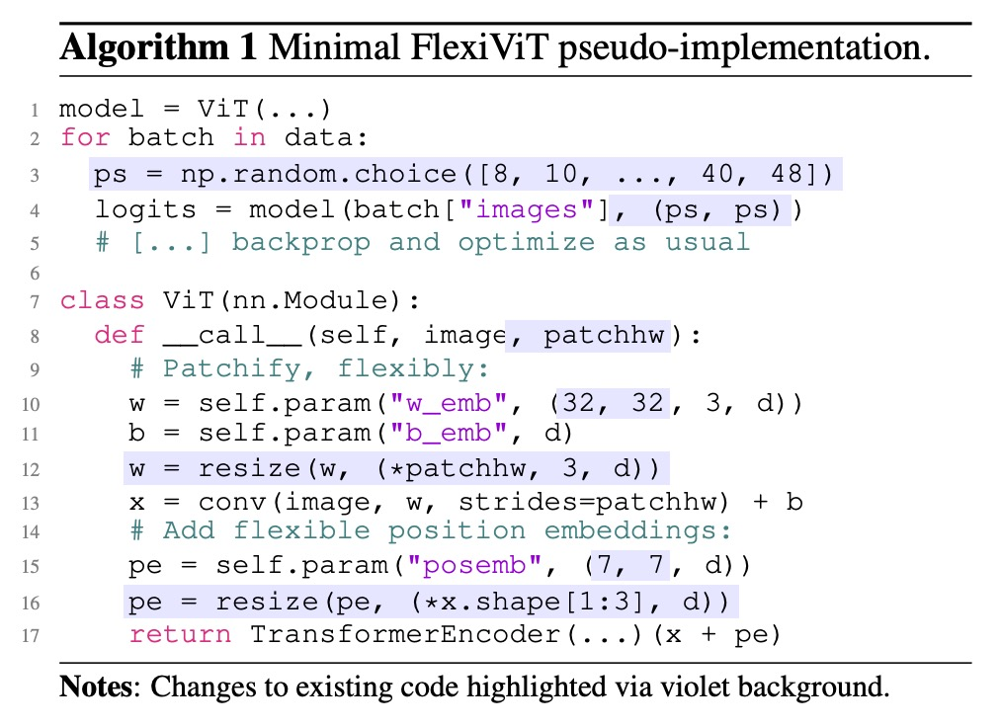
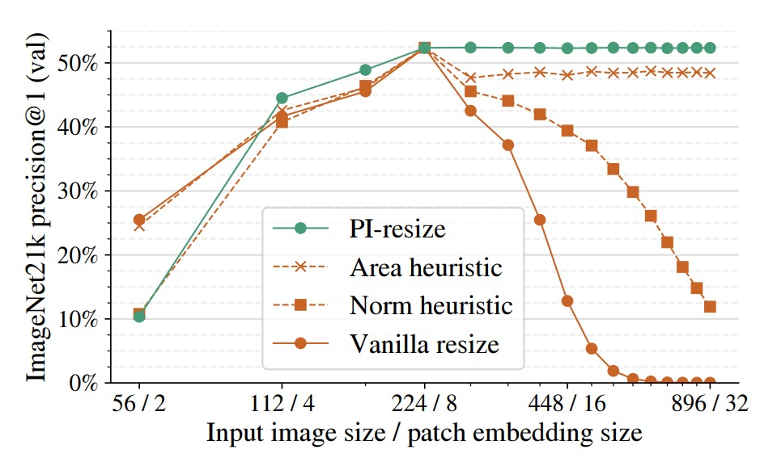
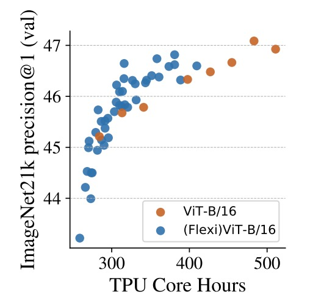

## 自由なパッチサイズ

[**FlexiViT: One Model for All Patch Sizes**](https://arxiv.org/abs/2212.08013)

---

今回は Google Research の作品を見てみましょう。

## 問題の定義

<div align="center">
<figure style={{"width": "60%"}}>

</figure>
</div>

Vision Transformer（ViT）の台頭は、視覚表現のパラダイムシフトを象徴しています。

画像を固定サイズのパッチに分割し、self-attention を通じて全体の関係性を処理する手法であり、従来の CNN の畳み込みフィルターに依存しません。

しかしこの革命の裏で、重要な設計要素であるパッチサイズは長らく固定されたハイパーパラメータとみなされてきました。

> **なぜ誰もパッチサイズの設計に挑戦しなかったのでしょうか？**

著者は本論文で一つのパラドックスを指摘しています：

- パッチサイズは明確にモデルの計算コストや分類性能を変化させる。
- しかしパッチサイズはモデルを再訓練せずに調整できない。

そこで、ViT により高いリソース適応性と転移能力をもたらすために、

> **「同じパラメータセット」で「複数のパッチサイズ」をサポートする方法はあるか？**

## 問題の解決

<div align="center">
<figure style={{"width": "80%"}}>

</figure>
</div>

このアルゴリズムの実装を見て、また一つ論文を読み終えました！

行ごとに見ていきましょう。

### ランダムパッチサイズ

```python
1 model = ViT(...)
2 for batch in data:
3     ps = np.random.choice([8, 10, ..., 40, 48])
4     logits = model(batch["images"], (ps, ps))
5     # [...] backprop and optimize as usual
```

この 5 行は FlexiViT のコアな訓練動作を定義しています：

- 3 行目：各バッチ開始時にパッチサイズ `ps` をランダムに選択
- 4 行目：そのサイズをモデルに渡し、順伝播を行う
- 5 行目：通常の逆伝播で最適化

このパッチ単位のランダム化（patch-wise randomization）戦略により、モデルは複数のトークン長、多様な位置エンコーディング、異なる計算負荷の文脈に曝され、

異なるサイズ条件でも安定した予測性能を習得します。

### モデル内部の動的再構成

```python
7 class ViT(nn.Module):
8     def __call__(self, image, patchhw):
9         # Patchify, flexibly:
10        w = self.param("w_emb", (32, 32, 3, d))
11        b = self.param("b_emb", d)
12        w = resize(w, (*patchhw, 3, d))
13        x = conv(image, w, strides=patchhw) + b
```

このコードは ViT の最初のパッチ埋め込み部分を処理し、ViT の元の `Conv2d(patch_size, d)` に対応しています：

- 10 行目：デフォルトで **32×32** のパッチ埋め込み重み `w` を生成
- 12 行目：現在のパッチサイズに応じて `w` を動的にリサイズ
- 13 行目：リサイズ済みの `w` を使い、stride を `patchhw` とした畳み込みで画像をパッチ化

つまり、**パッチ化のロジックが静的から動的に変化**したのです。

各サイズごとに埋め込みを訓練する必要はなくなり、

ひとつのコアパラメータセットをリサンプリング（PI-resize や双線形補間）で全サイズに対応可能です。

### スケーラブルな位置エンコーディング

```python
14        # Add flexible position embeddings:
15        pe = self.param("posemb", (7, 7, d))
16        pe = resize(pe, (*x.shape[1:3], d))
17        return TransformerEncoder(...)(x + pe)
```

位置エンコーディングもパッチ埋め込みと同様に処理：

- 7×7 の `posemb` をデフォルトで用意
- 現在のトークングリッド（`patchhw` で決まる）に合わせてリアルタイムにリサイズ
- `x` に加算してから Transformer encoder に渡す

これにより、位置の意味は特定サイズに縛られず、

トークン長に応じて空間構造に柔軟に対応できるようになり、

ViT 本来の self-attention 設計と下流互換性を維持しています。

### 正確なサイズ調整方法とは？

:::tip
このセクションは非常に重要なので、省略できません！
:::

**複数の patch size に対応する際、最も見落としやすい点は、patch embedding の重みと入力 patch 間の内積関係がサイズ変化によりどのように歪むか、ということです。**

入力 patch を $x \in \mathbb{R}^{p \times p}$、対応する patch embedding 重みを $\omega \in \mathbb{R}^{p \times p}$ とします。

標準 ViT では token の生成は両者の内積によって得られます：

$$
e = \langle x, \omega \rangle
$$

ここで、$x$ と $\omega$ を双線形補間で $2p \times 2p$ に拡大した場合、新たな内積は以下のようになります：

$$
\langle \text{resize}^{2p}_{p}(x), \text{resize}^{2p}_{p}(\omega) \rangle \approx \tfrac{1}{4} \langle x, \omega \rangle
$$

つまり、token のノルムはサイズ変化に伴いスケールダウンし、意味が不安定になります。

このスケールシフトは訓練の妨げになるだけでなく、モデルの patch size 間での一般化能力を損ないます。

一貫性を保つためには、両者の内積結果を等しくする必要があり、目標は：

- **patch と embedding がリサイズされても、元の token 意味を保つこと。**

$$
\langle x, \omega \rangle \overset{?}{=} \langle Bx, \hat{\omega} \rangle
$$

ここで、$B$ は双線形リサイズを表す線形写像行列です：

$$
\text{resize}^{p^*}_{p}(o) = B^{p^*}_{p} \cdot \text{vec}(o)
$$

このミスマッチを解決するため、著者は数学的により整合性のある重み変形手法、

Pseudo-Inverse Resize（PI-resize）を提案しています。

式は次の通り：

$$
\hat{\omega} = \arg\min_{\hat{\omega}} \mathbb{E}_{x \sim X} \left[ \left( \langle x, \omega \rangle - \langle Bx, \hat{\omega} \rangle \right)^2 \right]
$$

$p^* \geq p$ の場合、一般化逆行列（pseudo-inverse）により解けます：

$$
\hat{\omega} = P \omega
$$

ただし、

$$
P = (B^\top B)^{-1} B^\top = (B^\top)^+
$$

これにより任意の $x$ に対して、

$$
\langle x, \omega \rangle = \langle Bx, \hat{\omega} \rangle
$$

すなわち、**token embedding の内積が完全に一致します。**

:::info
この理論は情報損失のないリサイズ（主にアップサンプリング）を前提としています。

ダウンサンプリング（$p^* < p$）の場合は、$x$ の分布統計に基づき誤差最小化で近似解を求めます。たとえば $x \sim \mathcal{N}(0, I)$ であっても同様の解が得られます。
:::

以下の図は基準モデル ViT-B/8 に対し、patch embedding と入力画像を同時にリサイズして精度の変動を観察したものです。

<div align="center">
<figure style={{"width": "80%"}}>

</figure>
</div>

比較した手法は以下の通り：

- **Vanilla resize**：単純な双線形補間
- **Norm heuristic**：token embedding 後に一定ノルムで正規化
- **Area heuristic**：面積スケール係数で再調整
- **PI-resize**：数学的に導出された内積等価調整

結果として、PI-resize はアップスケール時にほぼ精度低下を起こさず、ダウンスケールでも最も安定かつ揺れが少ない性能を示しています。

### FlexiViT の表現空間

FlexiViT の設計目的は、複数の patch size において安定した予測能力を維持することです。

しかしその背後には、より根本的な問いがあります：

> **モデル内部で学習される表現（representation）は、異なる patch size 間でも一貫しているのか？**

著者は FlexiViT の表現の安定性を検証するため、以下の一般的な表現比較手法を用いました：

- **CKA（Centered Kernel Alignment）**：ニューラルネットワーク各層の出力の類似度を計測
- **Arc-Cosine + t-SNE**：類似度を距離に変換し、可視化を実施

これらの手法で、異なる patch size（例：grid size = 5, 10, 30）における各層の特徴マップの一貫性を観察しています。

下図より、主な発見は以下の通りです：

<div align="center">
<figure style={{"width": "80%"}}>

</figure>
</div>

- **前半安定**：0〜6 層目の MLP 直前まで、patch size に関わらず各層の表現は非常に類似
- **中盤揺らぎ**：6 層目の MLP にて顕著な分岐が生じ、異なる grid size の表現が分離
- **後半再集合**：最終層（特に 11 層目）にかけて徐々に表現が再び近づく
- **CLS トークンの安定性**：patch token は grid size により分布が変わるが、分類出力で使う CLS トークンは異なるサイズ間でも高い整合性を保つ

この解析は興味深い現象を示しています：

FlexiViT は異なるサイズの入力を「無理に同一表現へ圧縮」するのではなく、

中間層で各解像度に応じた処理経路を形成しつつ、

**最終的には分類出力の表現で収束する**ということです。

これが、FlexiViT が多様な patch size を支援できる理由の一端といえます：

> **モデルは「異なる道を通っても、最後は同じゴールに辿り着くことを学んだ」。**

## 討論

記事の分量の制約上、すべての実験結果と図表を掲載することは控えます。

以下にいくつかの注目すべき断片を取り上げますので、その他の実験に興味がある読者はぜひ原論文をご参照ください。

### 複数タスクにわたる総覧

<div align="center">
<figure style={{"width": "90%"}}>

</figure>
</div>

上図は FlexiViT が複数の下流タスクにおいて示す転移性能を示しており、画像分類、セマンティックセグメンテーション、画像検索、オープンボキャブラリ物体検出といった代表的な応用を網羅しています。

実験では、事前学習済みの FlexiViT‑B を固定パッチサイズ（/16 と /30）で微調整および推論し、対応するパッチサイズで事前学習された ViT‑B モデル 2 種と比較しました。

結果は、FlexiViT の全体的な性能が個別に学習された ViT と同等かやや優れていることを示しています。特に小さいパッチサイズ（/16）での精度はわずかに上回り、大きいパッチサイズ（/30）では 0.2 ～ 0.4%程度の差に収まっており、誤差範囲内の同等レベルと見なせます。

これは FlexiViT がマルチサイズ適応能力を持ちながらも予測品質を犠牲にしていないことを意味します。

さらに重要なのは、これらの性能が単一の重みセットで達成されている点です。

従来の方法では、多様なリソース制約やタスクシナリオに対応するために複数の ViT モデルを個別に訓練する必要があります。これに対し FlexiViT は、性能を落とさずにモデルのメンテナンスや展開コストを大幅に簡素化した実用的な解決策を提供します。

言い換えれば、「高性能」と「省リソース」を動的に切り替える必要のある応用シナリオにおいて、単一の FlexiViT モデルが複数の ViT に代わる合理的な骨幹かつ統一的な展開対象となり得ます。

### 高速な転移と推論の柔軟性

<div align="center">
<figure style={{"width": "70%"}}>

</figure>
</div>

上図は実際の展開シナリオにおける FlexiViT の非常に価値ある特性を示しています：

- **低計算コストで微調整を完了し、推論段階ではより高解像度を用いて性能向上が可能。**

実験では FlexiViT‑B と ViT‑B/30 をともに 8×8 のグリッドサイズで ImageNet‑1k 上で微調整し、その後異なるグリッドで評価しました。

結果、標準の ViT‑B/30 は元の訓練サイズから外れると精度が急激に低下しますが、FlexiViT は逆に 8×8 から 24×24 に解像度を上げると Top‑1 精度が 3.5 ポイント（81.8%→85.3%）も向上しました。

右図では同一モデルを 8×8、15×15、30×30 の各グリッドで微調整し、異なるグリッドで性能を比較しています。

結果は、どの解像度で最初に訓練しても、高解像度下で一貫して性能が向上する安定した傾向を示しています。

この特性は新たなモデル活用戦略をもたらします：

**リソース制約の厳しい環境では粗いグリッドで素早く微調整を行い、推論時に動的に細かいグリッドに切り替えて高精度を得ることが可能です。**

多様な計算リソースのサポート、A/B テストや動的パラメータ調整を必要とするシステムにとって、「低コストな訓練・高い推論柔軟性」という特徴は運用の幅と実用価値を大きく広げます。

### オープンボキャブラリ物体検出

<div align="center">
<figure style={{"width": "50%"}}>

</figure>
</div>

著者は FlexiViT を画像エンコーダとして OWL‑ViT 検出フレームワークに組み込み、固定パッチサイズの ViT‑B/16 および ViT‑B/30 と比較しています。

評価には多様なクラスと長尾分布を特徴とする LVIS データセットを用い、ゼロショット検出タスクの試験場として適しています。

結果は、柔軟な B/flexi バックボーンを用いた Flexi OWL‑ViT が、すべての評価パッチサイズにおいて固定バックボーン版と同等以上の平均精度（AP）を示しています。

高解像度設定（/24 や /30）では、ViT‑B/30 と比較して 2 ～ 3 ポイント上回り、解像度向上時の汎化能力を示唆します。一方、低解像度（/12 や /16）でも性能劣化は見られません。

この特性はオープンボキャブラリ検出タスクにとって極めて重要です。

対象物の大きさが環境によって大きく変わるため、最適なパッチサイズは固定できません。高解像度による精密な位置特定が必要な場合もあれば、大域的に粗い特徴で把握することが望ましい場合もあります。

FlexiViT はパッチサイズを柔軟に変えられるエンコード能力を提供し、入力画像の特徴や計算リソースに応じて再訓練なしで解像度を調整できるため、オープンワールドタスクにおいて適応性と展開効率を大幅に向上させます。

### 時間は計算資源なり

<div align="center">
<figure style={{"width": "50%"}}>

</figure>
</div>

最後に、著者はもう一つ価値ある方向性を検討しています：

- **柔軟なパッチサイズ訓練を利用して ViT の事前学習を高速化する。**

上図は ImageNet‑21k 上での 2 つの事前学習設定を比較しています。

一つは固定パッチサイズで継続的に訓練する従来型 ViT‑B/16、もう一つは異なるパッチサイズを組み合わせたカリキュラムを採用する (Flexi)ViT‑B/16 です。

TPU コア時間（core-hours）を横軸に取ると、ほぼ全期間にわたり FlexiViT 系列は標準モデルを上回る精度を維持します。特に約 400 時間時点では 1%の精度向上があり、訓練時間を伸ばしてもこの差は維持・拡大傾向にあります。

この訓練法は動的なカリキュラム設計に近く、

**初期は大きなパッチで計算を高速かつ粗く意味を捉え、後期に細かいパッチに切り替えて詳細と識別能力を補う。**

結果としてモデルは速く、かつ安定して学習します。

実務面では、これは既存 ViT 事前学習プロセスへのプラグイン的な加速策と見なせます。

最終的なモデルが単一パッチサイズであっても、多サイズ訓練カリキュラムによって収束時間の短縮や初期性能向上が可能であり、FlexiViT の「柔軟性」は推論段階にとどまらず、訓練効率と資源利用にも恩恵をもたらします。

## 結論

FlexiViT はシンプルかつ効果的な戦略を示しており、一つのモデルで異なる計算資源要件や解像度要求を横断的に扱うことを可能にします。

これは複雑な追加構造を導入せず、ViT の根幹設計である **patchification** に立ち返り、計算量と意味表現の調整における重要パラメータを掘り下げたものです。

ランダムなパッチサイズ訓練、PI-resize による重み再配置、知識蒸留による精密な誘導を通じて、FlexiViT は画像分類、セマンティックセグメンテーション、オープンボキャブラリ検出、マルチモーダル検索など多様な下流タスクで安定した性能を発揮し、単一骨幹で多様なシナリオを支えます。

FlexiViT は patchification の役割を再考させ、今後トークンエンコードから構造圧縮、多尺度融合、データ駆動のスケジューリングに至るまで、より創造的な応用の広がりを期待させます。
