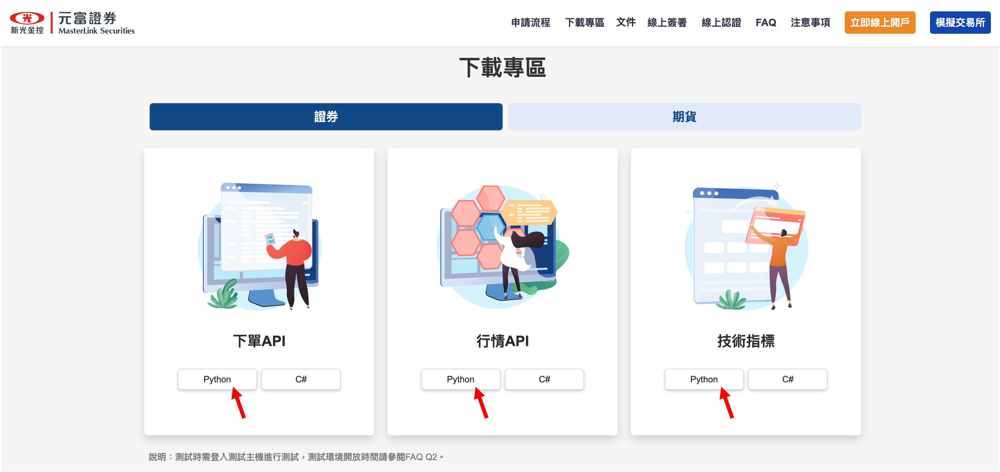

# インストールパッケージ

現在、Pypi にはインストールパッケージは提供されておらず、短期間での予定もありません。

このプロジェクトを使用するには、GitHub から直接プロジェクトをクローンし、依存パッケージをインストールする必要があります。

## インストール手順

1. **このプロジェクトをクローンする：**

   ```bash
   git clone https://github.com/DocsaidLab/AutoTraderX.git
   ```

2. **プロジェクトディレクトリに移動する：**

   ```bash
   cd AutoTraderX
   ```

3. **依存パッケージをインストールする：**

   ```bash
   pip install setuptools wheel
   ```

4. **パッケージファイルを作成する：**

   ```bash
   python setup.py bdist_wheel
   ```

5. **パッケージファイルをインストールする：**

   ```powershell
   pip install dist\autotraderx-*-py3-none-any.whl
   ```

これらの手順に従えば、`AutoTraderX` のインストールはうまくいくはずです。

### 元富証券 Python API のインストール

元富証券の公式ウェブサイトから Python API をダウンロード：

- [**元富証券-ダウンロードセクション**](https://mlapi.masterlink.com.tw/web_api/service/home#download)

  

ダウンロード後、解凍し、pip でインストールします：

```powershell
pip install .\MasterTradePy\MasterTradePy\64bit\MasterTradePy-0.0.23-py3-none-win_amd64.whl
pip install .\Python_tech_analysis\tech_analysis_api_v2-0.0.5-py3-none-win_amd64.whl
pip install .\SolPYAPI\PY_TradeD-0.1.15-py3-none-any.whl
```

インストールが完了すると、このプロジェクトを使用できるようになります。

:::tip
このプロジェクトでは元富証券 Python API の.whl インストールファイルも提供しています。`MasterLink_PythonAPI`フォルダ内にあります。

以下のコマンドを実行してインストールできます：

```powershell
.\run_install.bat
```

これらのファイルは更新されないので、最新バージョンを取得するために元富証券の公式ウェブサイトからダウンロードしてください。
:::

## インストールテスト

インストールが成功したかを確認するには、次のコマンドを使用できます：

```bash
python -c "import autotraderx; print(autotraderx.__version__)"
# >>> 0.1.0
```

`0.1.0` のようなバージョン番号が表示されれば、インストールは成功です。
