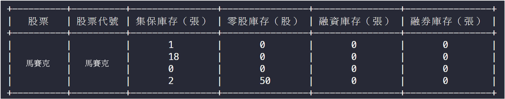

# 注文システム

元富証券の注文システム Python API を分析した後、自分のニーズに基づいて注文システムを開発できます。

ほとんどの状況では、単一の証券アカウントを操作するだけなので、現在の実装は単一アカウントのシナリオに基づいています。

:::warning
当社は株式の推奨を行いません。証券アカウント内の株式情報はモザイク処理されています。
:::

## アカウントへのログイン

アカウントのユーザー名とパスワードをクラスの入力に直接記述することもできますが、私たちの方法を参考にして、アカウント情報を保存するために yaml ファイルを使用することもできます。

パラメータファイルには、アカウントのユーザー名、パスワード、アカウント番号が必要です。この情報で元富証券のアカウントにログインできます。

```python
from autotraderx import load_yaml
from autotraderx.masterlink import Trader

# アカウント情報の読み込み
cfg = load_yaml(DIR / "account.yaml")

# アカウントにログイン
account = Trader(
    user=cfg["user"],
    password=cfg["password"],
    account_number=str(cfg["account_number"]),
    is_sim=False,
    is_force=True,
    is_event=False,
)

account.login()
# 処理を実行
account.stop()
```

## 在庫の確認

アカウントにログイン後、`get_inventory` 関数を呼び出すと、現在の在庫状況を確認できます。

結果はコマンドラインに表示され、現在の在庫状況が確認できます。情報をさらに使用したい場合は、返り値を直接使用できます。

```python
data = account.get_inventory()
```



`data` の出力形式は辞書で、内容は次のようになります：

```python
{
    '2002': {
        '株式': '中鋼',
        '融券在庫（枚）': '0',
        '融資在庫（枚）': '0',
        '集保在庫（枚）': '1',
        '零株在庫（株）': '0'
    },
    '2330': {
        '株式': '台積電',
        '融券在庫（枚）': '0',
        '融資在庫（枚）': '0',
        '集保在庫（枚）': '1',
        '零株在庫（株）': '0'
    },
    # ...以下省略
}
```

コマンドラインに表示したくない場合は、`Trader` を初期化する際に、`verbose` パラメータを `False` に設定します。

```python
account = Trader(
    verbose=False
)
```

## 注文情報の確認

アカウントにログイン後、`get_order_report` 関数を呼び出すことで、現在のすべての注文情報を確認できます。

結果はコマンドラインに表示され、現在のすべての注文情報が確認できます。情報をさらに使用したい場合は、返り値を直接使用できます。


```python
data = account.get_order_report()
```

`data` の出力形式は List\[Dict\] で、内容は次のようになります：

```python
[
    {
        '委託価格': '13.95',
        '注文方法（価格）': '限価注文',
        '注文方法（有効期限）': '当日有効',
        '注文時間': '08:31:32.032000',
        '注文番号': 'i0040',
        '注文数量': '4000',
        '成立価格': '',
        '成立時間': '',
        '成立数量': '',
        '状態': '',
        '株式': 'モザイク',
        '株式コード': 'モザイク',
        'メッセージ': '',
        '買売区分': 'Sell',
        'タイプ': '注文'
    },
    # ...以下省略
]
```

## 成約情報の確認

アカウントにログイン後、`get_trade_report` 関数を呼び出すことで、現在のすべての成約情報を確認できます。

結果はコマンドラインに表示され、現在のすべての成約情報が確認できます。情報をさらに使用したい場合は、返り値を直接使用できます。


```python
data = account.get_trade_report()
```

`data` の出力形式は List\[Dict\] で、内容は次のようになります：

```python
[
    {
        '委託価格': '13.95',
        '注文方法（価格）': '限価注文',
        '注文方法（有効期限）': '当日有効',
        '注文時間': '08:31:32.032000',
        '注文番号': 'i0040',
        '注文数量': '4000',
        '成立価格': '',
        '成立時間': '09:00:11.609000',
        '成立数量': '4000',
        '状態': '111) 完全成立',
        '株式': 'モザイク',
        '株式コード': 'モザイク',
        'メッセージ': '',
        '買売区分': 'Sell',
        'タイプ': '注文'
    },
    # ...以下省略
]
```

## 注文定義タイプ

注文プロセスで、元富証券は幾つかの定数を定義しており、これらの定義を理解する必要があります。

### OrderType

```python
# 注文方式（有効期限）
class OrderType(str, Enum):
    # 当日有効
    ROD = "R"
    # 即時成立、成立しなければキャンセル
    IOC = "I"
    # 即時全量成立、成立しなければキャンセル
    FOK = "F"
```

### PriceType

```python
# 注文方式（価格）
class PriceType(str, Enum):
    # 限価注文
    LMT = "L"
    # 市場価格注文
    MKT = "M"
```

### TradingType

```python
# 注文種別
class TradingType(str, Enum):
    # 集保
    CUSTODY = "G"
```

### TradingUnit

```python
# 取引単位
class TradingUnit(int,Enum):
    COMMON = 1000
    ODD = 1
```

### TradingSession

```python
# 取引時間
class TradingSession(str, Enum):
    # 通常
    NORMAL = "N"
    # 盤後
    FIXED_NORMAL = "F"
    # 盤中零株
    ODD = "R"
    # 盤後零株
    FIXED_ODD = "L"
```

### Side

```python
# 買売区分
class Side(str, Enum):
    # 買い
    Buy = "B"
    # 売り
    Sell = "S"
```

## 買い注文

アカウントにログイン後、`buy` 関数を呼び出すことで、買い注文を出すことができます。

例えば、台積電（銘柄コード：2330）1 単位を 500 元で購入する場合。

デフォルトの注文方式：

- 価格タイプ：OrderType.KMT、限価注文
- 注文タイプ：PriceType.ROD、当日有効
- 取引時間：TradingSession.NORMAL、通常取引時間
- 取引単位：TradingUnit.COMMON、通常取引単位

```python
account.buy(symbol="2330", qty=1, price=500)
```

## 売り注文

アカウントにログイン後、`sell` 関数を呼び出すことで、売り注文を出すことができます。

例えば、台積電（銘柄コード：2330）1 単位を 500 元で売却する場合。

デフォルトの注文方式：

- 価格タイプ：OrderType.KMT、限価注文
- 注文タイプ：PriceType.ROD、当日有効
- 取引時間：TradingSession.NORMAL、通常取引時間
- 取引単位：TradingUnit.COMMON、通常取引単位

```python
account.sell(symbol="2330", qty=1, price=500)
```

## カスタム注文方式

アカウントにログイン後、`set_order` 関数を呼び出すことで、カスタム注文を出すことができます。

以下に `set_order` 関数の定義を示します。ニーズに合わせて注文方式をカスタマイズできます。

```python
 def set_order(
        self,
        symbol: str,    # 株式コード
        side: Side,     # 買売区分
        qty: int,       # 注文数量
        price: float,   # 注文価格
        order_type: OrderType = OrderType.ROD,  # 注文タイプ
        price_type: PriceType = PriceType.MKT,  # 価格タイプ
        trading_session: TradingSession = TradingSession.NORMAL,  # 取引時間
        trading_unit: TradingUnit = TradingUnit.COMMON,  # 取引単位
    ):
        self.api.ReqBasic(symbol)

        order = Order(
            tradingSession=trading_session,
            side=side,
            symbol=symbol,
            priceType=price_type,
            price=str(price),
            tradingUnit=trading_unit,
            qty=str(qty),
            orderType=order_type,
            tradingAccount=self.account_number,
            userDef=''
        )
        rc = self.api.NewOrder(order)
        if rc == RCode.OK:
            print(u'注文が送信されました')
        else:
            print(u'注文失敗！プログラムを再実行し、報告内容に基づいて入力を修正してください')
```

:::warning
`set_order` 関数では、1 単位を購入する場合、`qty` パラメータは 1000 に設定する必要があります。
:::

例えば：台積電（銘柄コード：2330）1 単位を 500 元で購入し、注文タイプを即時全量成立、価格タイプを市場価格注文にする場合。

```python
account.set_order(
    symbol="2330",
    side=Side.Buy,
    qty=1000,
    price=500,
    order_type=OrderType.FOK,
    price_type=PriceType.MKT
)
```

## 価格変更

価格を変更するには、まず変更する「注文番号」を見つけ、その後 `change_price` 関数を呼び出して価格を変更します。

例えば、台積電（銘柄コード：2330）の価格を 600 元に変更する場合。

```python
account.change_price(order_number="i0041", mod_price=600)
```

## 数量変更

数量を変更するには、まず変更する「注文番号」を見つけ、その後 `change_qty` 関数を呼び出して数量を変更します。

例えば、台積電（銘柄コード：2330）の数量を 1 単位から 2 単位に変更する場合。

```python
account.change_qty(order_number="i0041", mod_qty=2000)
```

## 注文のキャンセル

数量変更の方法を使用し、「注文数量」を 0 に変更することで、注文をキャンセルできます。

## その他の機能

元々の API には資券残高を確認する機能もありますが、現在手元にあるアカウントでは関連する権限が開通していないため、これらの機能についての開発テストは行えません。

また、元富証券の API には「アカウントの在庫成約価格情報」を取得する機能が見当たらなかったため、コードから追跡してみたところ、最終的なデータ充填層が`.dll`ファイルにパッケージされており、これらのデータを取得するためには`.dll`を逆コンパイルしてデータ解析を行わなければなりません......この作業は私たちには少し大変です！

結論として、「在庫平均価格」を計算するサービスは現在提供できません。元富証券がこの機能を公開することを祈っています。

:::tip
もし「在庫平均価格」や「1 単位ごとの成約価格」の情報を取得する方法をご存知の方がいれば、ぜひ教えてください！🙏 🙏 🙏
:::
