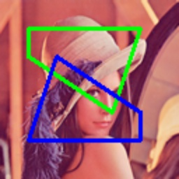

# draw_polygons

> [draw_polygons(img: np.ndarray, polygons: _Polygons, colors: _Colors = (0, 255, 0), thicknesses: _Thicknesses = 2, fillup: bool = False, **kwargs) -> np.ndarray](https://github.com/DocsaidLab/Capybara/blob/main/capybara/vision/visualization/draw.py)

- **依存関係**

  - `capybara-docsaid[visualization]` を先にインストールしてください。

- **説明**：画像に複数の多角形を描画します。

- **パラメータ**

  - **img** (`np.ndarray`)：描画する画像、NumPy 配列形式です。
  - **polygons** (`List[Union[Polygon, np.ndarray]]`)：描画する多角形のリスト、多角形オブジェクトまたは NumPy 配列形式の[[x1, y1], [x2, y2], ...]で指定します。
  - **colors** (`_Colors`)：描画する多角形の色（BGR）。単一の色または色のリストで指定できます。デフォルトは(0, 255, 0)です。
  - **thicknesses** (`_Thicknesses`)：描画する多角形の辺の太さ。単一の太さまたは太さのリストで指定できます。デフォルトは 2 です。
  - **fillup** (`bool`)：多角形を塗りつぶすかどうか。デフォルトは False です。
  - **kwargs**：その他のパラメータ。

- **戻り値**

  - **np.ndarray**：複数の多角形を描画した画像。

- **例**

  ```python
  from capybara import Polygon, imread
  from capybara.vision.visualization.draw import draw_polygons

  img = imread('lena.png')
  polygons = [
      Polygon([(20, 20), (100, 20), (80, 80), (20, 40)]),
      Polygon([(100, 100), (20, 100), (40, 40), (100, 80)])
  ]
  polygons_img = draw_polygons(
      img,
      polygons,
      colors=[(0, 255, 0), (255, 0, 0)],
      thicknesses=2,
  )
  ```

  
