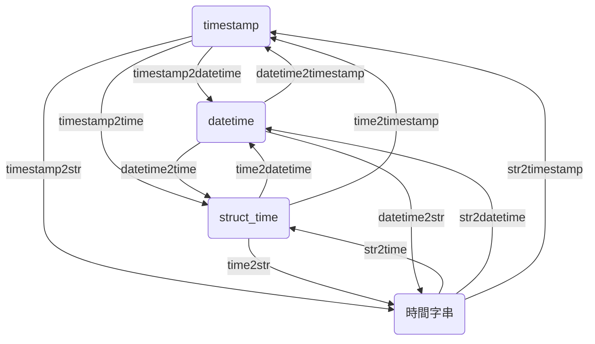

# Time2Time

このツールは、さまざまな時間形式を相互に変換するためのものです。

Python では、異なる時間ライブラリ間での変換はよく問題になります。これを解決するために、`datetime`、`struct_time`、`timestamp`、および時間文字列の間で自由に変換できるいくつかの関数を開発しました。

以下は、これらの関数の関係図です：


もし上記の図がどのように描かれたのか興味があれば、以下の Mermaid コードを参考にしてください：



図を見て、必要な変換関数を見つけたら、対応する関数を使用できます。

---

## timestamp2datetime

> [timestamp2datetime(ts: Union[int, float]) -> datetime](https://github.com/DocsaidLab/Capybara/blob/975d62fba4f76db59e715c220f7a2af5ad8d050e/capybara/utils/time.py#L189)

- **説明**：タイムスタンプを `datetime` に変換します。

- **パラメータ**

  - **ts** (`Union[int, float]`)：タイムスタンプ。

- **返り値**

  - **datetime**：`datetime` オブジェクト。

- **例**

  ```python
  import capybara as cb

  ts = 1634025600
  dt = cb.timestamp2datetime(ts)
  print(dt)
  # >>> 2021-10-12 16:00:00
  ```

## timestamp2time

> [timestamp2time(ts: Union[int, float]) -> struct_time](https://github.com/DocsaidLab/Capybara/blob/975d62fba4f76db59e715c220f7a2af5ad8d050e/capybara/utils/time.py#L193)

- **説明**：タイムスタンプを `struct_time` に変換します。

- **パラメータ**

  - **ts** (`Union[int, float]`)：タイムスタンプ。

- **返り値**

  - **struct_time**：`struct_time` オブジェクト。

- **例**

  ```python
  import capybara as cb

  ts = 1634025600
  t = cb.timestamp2time(ts)
  print(t)
  # >>> time.struct_time(tm_year=2021, tm_mon=10, tm_mday=12, tm_hour=16, tm_min=0, tm_sec=0, tm_wday=1, tm_yday=285, tm_isdst=0)
  ```

## timestamp2str

> [timestamp2str(ts: Union[int, float], fmt: str) -> str](https://github.com/DocsaidLab/Capybara/blob/975d62fba4f76db59e715c220f7a2af5ad8d050e/capybara/utils/time.py#L197)

- **説明**：タイムスタンプを時間文字列に変換します。

- **パラメータ**

  - **ts** (`Union[int, float]`)：タイムスタンプ。
  - **fmt** (`str`)：時間のフォーマット。

- **返り値**

  - **str**：時間文字列。

- **例**

  ```python
  import capybara as cb

  ts = 1634025600
  s = cb.timestamp2str(ts, fmt='%Y-%m-%d %H:%M:%S')
  print(s)
  # >>> '2021-10-12 16:00:00'
  ```

## time2datetime

> [time2datetime(t: struct_time) -> datetime](https://github.com/DocsaidLab/Capybara/blob/975d62fba4f76db59e715c220f7a2af5ad8d050e/capybara/utils/time.py#L201)

- **説明**：`struct_time` を `datetime` に変換します。

- **パラメータ**

  - **t** (`struct_time`)：`struct_time` オブジェクト。

- **返り値**

  - **datetime**：`datetime` オブジェクト。

- **例**

  ```python
  import capybara as cb

  ts = 1634025600
  t = cb.timestamp2time(ts)
  dt = cb.time2datetime(t)
  print(dt)
  # >>> datetime.datetime(2021, 10, 12, 16, 0)
  ```

## time2timestamp

> [time2timestamp(t: struct_time) -> float](https://github.com/DocsaidLab/Capybara/blob/975d62fba4f76db59e715c220f7a2af5ad8d050e/capybara/utils/time.py#L207)

- **説明**：`struct_time` をタイムスタンプに変換します。

- **パラメータ**

  - **t** (`struct_time`)：`struct_time` オブジェクト。

- **返り値**

  - **float**：タイムスタンプ。

- **例**

  ```python
  import capybara as cb

  ts = 1634025600
  t = cb.timestamp2time(ts)
  ts = cb.time2timestamp(t)
  print(ts)
  # >>> 1634025600.0
  ```

## time2str

> [time2str(t: struct_time, fmt: str) -> str](https://github.com/DocsaidLab/Capybara/blob/975d62fba4f76db59e715c220f7a2af5ad8d050e/capybara/utils/time.py#L213)

- **説明**：`struct_time` を時間文字列に変換します。

- **パラメータ**

  - **t** (`struct_time`)：`struct_time` オブジェクト。
  - **fmt** (`str`)：時間フォーマット。

- **返り値**

  - **str**：時間文字列。

- **例**

  ```python
  import capybara as cb

  ts = 1634025600
  t = cb.timestamp2time(ts)
  s = cb.time2str(t, fmt='%Y-%m-%d %H:%M:%S')
  print(s)
  # >>> '2021-10-12 16:00:00'
  ```

## datetime2time

> [datetime2time(dt: datetime) -> struct_time](https://github.com/DocsaidLab/Capybara/blob/975d62fba4f76db59e715c220f7a2af5ad8d050e/capybara/utils/time.py#L219)

- **説明**：`datetime` を `struct_time` に変換します。

- **パラメータ**

  - **dt** (`datetime`)：`datetime` オブジェクト。

- **返り値**

  - **struct_time**：`struct_time` オブジェクト。

- **例**

  ```python
  import capybara as cb

  ts = 1634025600
  dt = cb.timestamp2datetime(ts)
  t = cb.datetime2time(dt)
  print(t)
  # >>> time.struct_time(tm_year=2021, tm_mon=10, tm_mday=12, tm_hour=16, tm_min=0, tm_sec=0, tm_wday=1, tm_yday=285, tm_isdst=-1)
  ```

## datetime2timestamp

> [datetime2timestamp(dt: datetime) -> float](https://github.com/DocsaidLab/Capybara/blob/975d62fba4f76db59e715c220f7a2af5ad8d050e/capybara/utils/time.py#L225)

- **説明**：`datetime` をタイムスタンプに変換します。

- **パラメータ**

  - **dt** (`datetime`)：`datetime` オブジェクト。

- **返り値**

  - **float**：タイムスタンプ。

- **例**

  ```python
  import capybara as cb

  ts = 1634025600
  dt = cb.timestamp2datetime(ts)
  ts = cb.datetime2timestamp(dt)
  print(ts)
  # >>> 1634025600.0
  ```

## datetime2str

> [datetime2str(dt: datetime, fmt: str) -> str](https://github.com/DocsaidLab/Capybara/blob/975d62fba4f76db59e715c220f7a2af5ad8d050e/capybara/utils/time.py#L231)

- **説明**：`datetime` を時間文字列に変換します。

- **パラメータ**

  - **dt** (`datetime`)：`datetime` オブジェクト。
  - **fmt** (`str`)：時間フォーマット。

- **返り値**

  - **str**：時間文字列。

- **例**

  ```python
  import capybara as cb

  ts = 1634025600
  dt = cb.timestamp2datetime(ts)
  s = cb.datetime2str(dt, fmt='%Y-%m-%d %H:%M:%S')
  print(s)
  # >>> '2021-10-12 16:00:00'
  ```

## str2time

> [str2time(s: str, fmt: str) -> struct_time](https://github.com/DocsaidLab/Capybara/blob/975d62fba4f76db59e715c220f7a2af5ad8d050e/capybara/utils/time.py#L237)

- **説明**：時間文字列を `struct_time` に変換します。

- **パラメータ**

  - **s** (`str`)：時間文字列。
  - **fmt** (`str`)：時間フォーマット。

- **返り値**

  - **struct_time**：`struct_time` オブジェクト。

- **例**

  ```python
  import capybara as cb

  s = '2021-10-12 16:00:00'
  t = cb.str2time(s, fmt='%Y-%m-%d %H:%M:%S')
  print(t)
  # >>> time.struct_time(tm_year=2021, tm_mon=10, tm_mday=12, tm_hour=16, tm_min=0, tm_sec=0, tm_wday=1, tm_yday=285, tm_isdst=-1)
  ```

## str2datetime

> [str2datetime(s: str, fmt: str) -> datetime](https://github.com/DocsaidLab/Capybara/blob/975d62fba4f76db59e715c220f7a2af5ad8d050e/capybara/utils/time.py#L243)

- **説明**：時間文字列を `datetime` に変換します。

- **パラメータ**

  - **s** (`str`)：時間文字列。
  - **fmt** (`str`)：時間フォーマット。

- **返り値**

  - **datetime**：`datetime` オブジェクト。

- **例**

  ```python
  import capybara as cb

  s = '2021-10-12 16:00:00'
  dt = cb.str2datetime(s, fmt='%Y-%m-%d %H:%M:%S')
  print(dt)
  # >>> datetime.datetime(2021, 10, 12, 16, 0)
  ```

## str2timestamp

> [str2timestamp(s: str, fmt: str) -> float](https://github.com/DocsaidLab/Capybara/blob/975d62fba4f76db59e715c220f7a2af5ad8d050e/capybara/utils/time.py#L249)

- **説明**：時間文字列をタイムスタンプに変換します。

- **パラメータ**

  - **s** (`str`)：時間文字列。
  - **fmt** (`str`)：時間フォーマット。

- **返り値**

  - **float**：タイムスタンプ。

- **例**

  ```python
  import capybara as cb

  s = '2021-10-12 16:00:00'
  ts = cb.str2timestamp(s, fmt='%Y-%m-%d %H:%M:%S')
  print(ts)
  # >>> 1634025600.0
  ```
