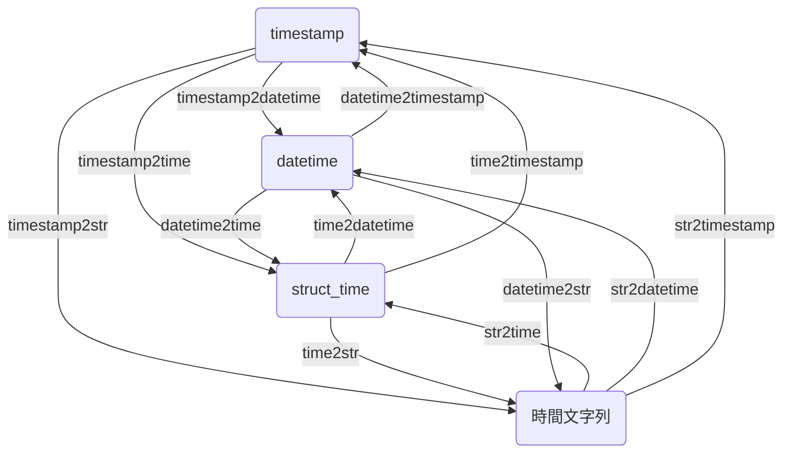

# Time2Time

これは時間フォーマットを変換するためのツールです。

Python では、異なる時間パッケージ間での変換が問題となることがあります。

この問題を解決するために、`datetime`、`struct_time`、`timestamp`、および時間文字列間の変換を自由に行える関数を開発しました。

以下はこれらの関数間の関係図です：


もし上の図がどのように描かれたのか気になる場合は、以下の Mermaid コードを参考にしてください：



図を見ながらストーリーを理解した後、必要な変換関数を選び、以下の変換を行います：

---

## timestamp2datetime

> [timestamp2datetime(ts: Union[int, float]) -> datetime](https://github.com/DocsaidLab/DocsaidKit/blob/012540eebaebb2718987dd3ec0f7dcf40f403caa/docsaidkit/utils/time.py#L188)

- **説明**：タイムスタンプを `datetime` に変換します。

- **パラメータ**

  - **ts** (`Union[int, float]`)：タイムスタンプ。

- **戻り値**

  - **datetime**：`datetime` オブジェクト。

- **例**

  ```python
  import docsaidkit as D

  ts = 1634025600
  dt = D.timestamp2datetime(ts)
  print(dt)
  # >>> 2021-10-12 16:00:00
  ```

## timestamp2time

> [timestamp2time(ts: Union[int, float]) -> struct_time](https://github.com/DocsaidLab/DocsaidKit/blob/012540eebaebb2718987dd3ec0f7dcf40f403caa/docsaidkit/utils/time.py#L192)

- **説明**：タイムスタンプを `struct_time` に変換します。

- **パラメータ**

  - **ts** (`Union[int, float]`)：タイムスタンプ。

- **戻り値**

  - **struct_time**：`struct_time` オブジェクト。

- **例**

  ```python
  import docsaidkit as D

  ts = 1634025600
  t = D.timestamp2time(ts)
  print(t)
  # >>> time.struct_time(tm_year=2021, tm_mon=10, tm_mday=12, tm_hour=16, tm_min=0, tm_sec=0, tm_wday=1, tm_yday=285, tm_isdst=0)
  ```

## timestamp2str

> [timestamp2str(ts: Union[int, float], fmt: str) -> str](https://github.com/DocsaidLab/DocsaidKit/blob/012540eebaebb2718987dd3ec0f7dcf40f403caa/docsaidkit/utils/time.py#L196)

- **説明**：タイムスタンプを時間文字列に変換します。

- **パラメータ**

  - **ts** (`Union[int, float]`)：タイムスタンプ。
  - **fmt** (`str`)：時間のフォーマット。

- **戻り値**

  - **str**：時間の文字列。

- **例**

  ```python
  import docsaidkit as D

  ts = 1634025600
  s = D.timestamp2str(ts, fmt='%Y-%m-%d %H:%M:%S')
  print(s)
  # >>> '2021-10-12 16:00:00'
  ```

## time2datetime

> [time2datetime(t: struct_time) -> datetime](https://github.com/DocsaidLab/DocsaidKit/blob/012540eebaebb2718987dd3ec0f7dcf40f403caa/docsaidkit/utils/time.py#L200)

- **説明**：`struct_time` を `datetime` に変換します。

- **パラメータ**

  - **t** (`struct_time`)：`struct_time` オブジェクト。

- **戻り値**

  - **datetime**：`datetime` オブジェクト。

- **例**

  ```python
  import docsaidkit as D

  ts = 1634025600
  t = D.timestamp2time(ts)
  dt = D.time2datetime(t)
  print(dt)
  # >>> datetime.datetime(2021, 10, 12, 16, 0)
  ```

## time2timestamp

> [time2timestamp(t: struct_time) -> float](https://github.com/DocsaidLab/DocsaidKit/blob/012540eebaebb2718987dd3ec0f7dcf40f403caa/docsaidkit/utils/time.py#L206)

- **説明**：`struct_time` をタイムスタンプに変換します。

- **パラメータ**

  - **t** (`struct_time`)：`struct_time` オブジェクト。

- **戻り値**

  - **float**：タイムスタンプ。

- **例**

  ```python
  import docsaidkit as D

  ts = 1634025600
  t = D.timestamp2time(ts)
  ts = D.time2timestamp(t)
  print(ts)
  # >>> 1634025600.0
  ```

## time2str

> [time2str(t: struct_time, fmt: str) -> str](https://github.com/DocsaidLab/DocsaidKit/blob/012540eebaebb2718987dd3ec0f7dcf40f403caa/docsaidkit/utils/time.py#L212)

- **説明**：`struct_time` を時間文字列に変換します。

- **パラメータ**

  - **t** (`struct_time`)：`struct_time` オブジェクト。
  - **fmt** (`str`)：時間フォーマット。

- **戻り値**

  - **str**：時間の文字列。

- **例**

  ```python
  import docsaidkit as D

  ts = 1634025600
  t = D.timestamp2time(ts)
  s = D.time2str(t, fmt='%Y-%m-%d %H:%M:%S')
  print(s)
  # >>> '2021-10-12 16:00:00'
  ```

## datetime2time

> [datetime2time(dt: datetime) -> struct_time](https://github.com/DocsaidLab/DocsaidKit/blob/012540eebaebb2718987dd3ec0f7dcf40f403caa/docsaidkit/utils/time.py#L218)

- **説明**：`datetime` を `struct_time` に変換します。

- **パラメータ**

  - **dt** (`datetime`)：`datetime` オブジェクト。

- **戻り値**

  - **struct_time**：`struct_time` オブジェクト。

- **例**

  ```python
  import docsaidkit as D

  ts = 1634025600
  dt = D.timestamp2datetime(ts)
  t = D.datetime2time(dt)
  print(t)
  # >>> time.struct_time(tm_year=2021, tm_mon=10, tm_mday=12, tm_hour=16, tm_min=0, tm_sec=0, tm_wday=1, tm_yday=285, tm_isdst=-1)
  ```

## datetime2timestamp

> [datetime2timestamp(dt: datetime) -> float](https://github.com/DocsaidLab/DocsaidKit/blob/012540eebaebb2718987dd3ec0f7dcf40f403caa/docsaidkit/utils/time.py#L224)

- **説明**：`datetime` をタイムスタンプに変換します。

- **パラメータ**

  - **dt** (`datetime`)：`datetime` オブジェクト。

- **戻り値**

  - **float**：タイムスタンプ。

- **例**

  ```python
  import docsaidkit as D

  ts = 1634025600
  dt = D.timestamp2datetime(ts)
  ts = D.datetime2timestamp(dt)
  print(ts)
  # >>> 1634025600.0
  ```

## datetime2str

> [datetime2str(dt: datetime, fmt: str) -> str](https://github.com/DocsaidLab/DocsaidKit/blob/012540eebaebb2718987dd3ec0f7dcf40f403caa/docsaidkit/utils/time.py#L230)

- **説明**：`datetime` を時間文字列に変換します。

- **パラメータ**

  - **dt** (`datetime`)：`datetime` オブジェクト。
  - **fmt** (`str`)：時間フォーマット。

- **戻り値**

  - **str**：時間の文字列。

- **例**

  ```python
  import docsaidkit as D

  ts = 1634025600
  dt = D.timestamp2datetime(ts)
  s = D.datetime2str(dt, fmt='%Y-%m-%d %H:%M:%S')
  print(s)
  # >>> '2021-10-12 16:00:00'
  ```

## str2time

> [str2time(s: str, fmt: str) -> struct_time](https://github.com/DocsaidLab/DocsaidKit/blob/012540eebaebb2718987dd3ec0f7dcf40f403caa/docsaidkit/utils/time.py#L236)

- **説明**：時間文字列を `struct_time` に変換します。

- **パラメータ**

  - **s** (`str`)：時間文字列。
  - **fmt** (`str`)：時間フォーマット。

- **戻り値**

  - **struct_time**：`struct_time` オブジェクト。

- **例**

  ```python
  import docsaidkit as D

  s = '2021-10-12 16:00:00'
  t = D.str2time(s, fmt='%Y-%m-%d %H:%M:%S')
  print(t)
  # >>> time.struct_time(tm_year=2021, tm_mon=10, tm_mday=12, tm_hour=16, tm_min=0, tm_sec=0, tm_wday=1, tm_yday=285, tm_isdst=-1)
  ```

## str2datetime

> [str2datetime(s: str, fmt: str) -> datetime](https://github.com/DocsaidLab/DocsaidKit/blob/012540eebaebb2718987dd3ec0f7dcf40f403caa/docsaidkit/utils/time.py#L242)

- **説明**：時間文字列を `datetime` に変換します。

- **パラメータ**

  - **s** (`str`)：時間文字列。
  - **fmt** (`str`)：時間フォーマット。

- **戻り値**

  - **datetime**：`datetime` オブジェクト。

- **例**

  ```python
  import docsaidkit as D

  s = '2021-10-12 16:00:00'
  dt = D.str2datetime(s, fmt='%Y-%m-%d %H:%M:%S')
  print(dt)
  # >>> datetime.datetime(2021, 10, 12, 16, 0)
  ```

## str2timestamp

> [str2timestamp(s: str, fmt: str) -> float](https://github.com/DocsaidLab/DocsaidKit/blob/012540eebaebb2718987dd3ec0f7dcf40f403caa/docsaidkit/utils/time.py#L248)

- **説明**：時間文字列をタイムスタンプに変換します。

- **パラメータ**

  - **s** (`str`)：時間文字列。
  - **fmt** (`str`)：時間フォーマット。

- **戻り値**

  - **float**：タイムスタンプ。

- **例**

  ```python
  import docsaidkit as D

  s = '2021-10-12 16:00:00'
  ts = D.str2timestamp(s, fmt='%Y-%m-%d %H:%M:%S')
  print(ts)
  # >>> 1634025600.0
  ```
