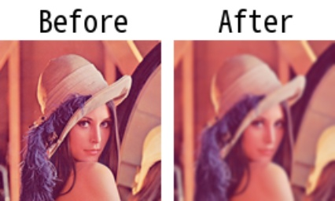

# gaussianblur

> [gaussianblur(img: np.ndarray, ksize: \_Ksize = 3, sigmaX: int = 0, \*\*kwargs) -> np.ndarray](https://github.com/DocsaidLab/Capybara/blob/975d62fba4f76db59e715c220f7a2af5ad8d050e/capybara/vision/functionals.py#L54)

- **説明**：入力画像に対してガウスぼかし処理を適用します。

- **引数**

  - **img** (`np.ndarray`)：ぼかし処理を行う入力画像。
  - **ksize** (`Union[int, Tuple[int, int]]`)：ぼかし処理に使用するカーネルのサイズ。整数値を指定すると、指定されたサイズの正方形カーネルを使用します。タプル `(k_height, k_width)` を指定すると、指定されたサイズの矩形カーネルを使用します。デフォルトは 3。
  - **sigmaX** (`int`)：ガウスカーネルの X 方向の標準偏差。デフォルトは 0。

- **戻り値**

  - **np.ndarray**：ぼかし処理後の画像。

- **例**

  ```python
  import capybara as cb

  img = cb.imread('lena.png')
  blur_img = cb.gaussianblur(img, ksize=5)
  ```

  
