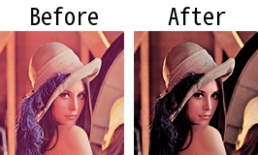

# imadjust

> [imadjust(img: np.ndarray, rng_out: Tuple[int, int] = (0, 255), gamma: float = 1.0, color_base: str = 'BGR') -> np.ndarray](https://github.com/DocsaidLab/DocsaidKit/blob/012540eebaebb2718987dd3ec0f7dcf40f403caa/docsaidkit/vision/functionals.py#L122)

- **説明**：画像の強度を調整します。

- 引数

  - **img** (`np.ndarray`)：強度調整を行う入力画像。2D または 3D である必要があります。
  - **rng_out** (`Tuple[int, int]`)：出力画像の強度のターゲット範囲。デフォルトは (0, 255)。
  - **gamma** (`float`)：ガンマ補正の値。ガンマが 1 未満の場合、マッピングは高い（明るい）出力値に偏ります。ガンマが 1 より大きい場合、マッピングは低い（暗い）出力値に偏ります。デフォルトは 1.0（線形マッピング）。
  - **color_base** (`str`)：入力画像の色基準。'BGR'または'RGB'である必要があります。デフォルトは'BGR'。

- **返り値**

  - **np.ndarray**：調整後の画像。

- **例**

  ```python
  import docsaidkit as D

  img = D.imread('lena.png')
  adj_img = D.imadjust(img, gamma=2)
  ```

  
