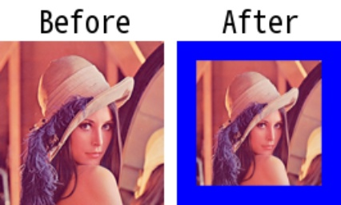

# pad

> [pad(img: np.ndarray, pad_size: Union[int, Tuple[int, int], Tuple[int, int, int, int]], fill_value: Optional[Union[int, Tuple[int, int, int]]] = 0, pad_mode: Union[str, int, BORDER] = BORDER.CONSTANT) -> np.ndarray](https://github.com/DocsaidLab/DocsaidKit/blob/012540eebaebb2718987dd3ec0f7dcf40f403caa/docsaidkit/vision/functionals.py#L194)

- **説明**：入力画像に対してパディング処理を適用します。

- 引数

  - **img** (`np.ndarray`)：パディング処理を行う入力画像。
  - **pad_size** (`Union[int, Tuple[int, int], Tuple[int, int, int, int]]`)：パディングのサイズ。整数で指定することで、すべての辺に同じパディング量を指定できます。また、タプル`(pad_top, pad_bottom, pad_left, pad_right)`で各辺に異なるパディング量を指定することも、タプル`(pad_height, pad_width)`で高さと幅に同じパディング量を指定することもできます。
  - **fill_value** (`Optional[Union[int, Tuple[int, int, int]]]`)：パディングに使用する値。入力画像がカラー画像（3 チャンネル）の場合、`fill_value`は整数または`(R, G, B)`のタプルでカラーを指定できます。入力画像がグレースケール画像（1 チャンネル）の場合、`fill_value`は整数で指定する必要があります。デフォルトは 0。
  - **pad_mode** (`Union[str, int, BORDER]`)：パディングモード。使用可能なオプションは以下の通りです： - BORDER.CONSTANT：定数値（`fill_value`）を使用してパディングします。 - BORDER.REPLICATE：端のピクセルをコピーしてパディングします。 - BORDER.REFLECT：端を反射させてパディングします。 - BORDER.REFLECT101：端を反射させ、人工的な痕跡を避けるために微調整したパディングを行います。
    デフォルトは BORDER.CONSTANT。

- **返り値**

  - **np.ndarray**：パディング後の画像。

- **例**

  ```python
  import docsaidkit as D

  img = D.imread('lena.png')
  pad_img = D.pad(img, pad_size=20, fill_value=(255, 0, 0))

  # パディング後の画像を元のサイズにリサイズして可視化
  pad_img = D.imresize(pad_img, [img.shape[0], img.shape[1]])
  ```

  
