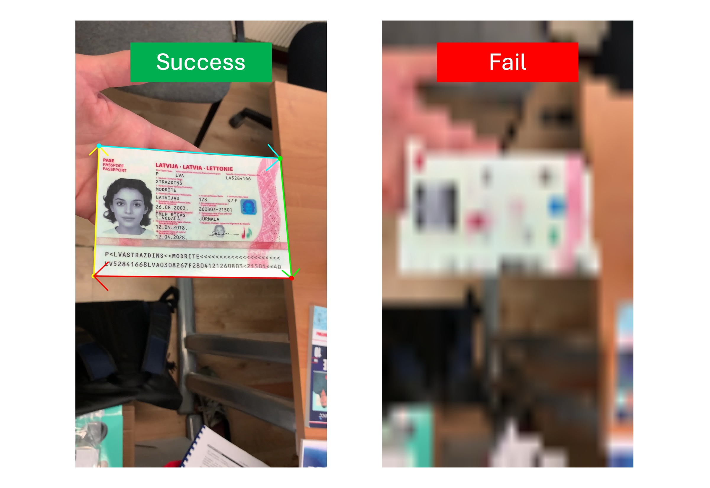

# クイックスタート

私たちは、前処理と後処理のロジックを含む簡単なモデル推論インターフェースを提供しています。

まず、必要な依存関係をインポートし、`DocAligner` クラスを作成する必要があります。

## モデル推論

以下は、`DocAligner` を使用してモデル推論を行う方法を示す簡単な例です：

```python
from docaligner import DocAligner

model = DocAligner()
```

モデルを起動した後、次に推論を行う画像を準備します：

:::tip
`DocAligner` が提供するテスト画像を使用できます：

ダウンロードリンク：[**run_test_card.jpg**](https://github.com/DocsaidLab/DocAligner/blob/main/docs/run_test_card.jpg)
:::

```python
import docsaidkit as D

img = D.imread('path/to/run_test_card.jpg')
```

または、URL を通じて直接画像を読み込むこともできます：

```python
import cv2
from skimage import io

img = io.imread('https://github.com/DocsaidLab/DocAligner/blob/main/docs/run_test_card.jpg?raw=true')
img = cv2.cvtColor(img, cv2.COLOR_RGB2BGR)
```


次に、`model` を使って推論を行います：

```python
result = model(img)
```

得られた推論結果は、私たちがラップした [**Document**](../docsaidkit/funcs/objects/document) クラス型で、文書のポリゴンや OCR の文字情報などが含まれています。このモジュールでは OCR に関連する機能は使用しないので、`image` と `doc_polygon` の属性のみを使用します。推論結果を取得した後、さまざまな後処理操作を行うことができます。

:::tip
`DocAligner` は `__call__` でラップされているので、インスタンスを直接呼び出して推論を行うことができます。
:::

:::info
最初に `DocAligner` を使用する際、モデルは自動的にダウンロードされます。
:::

## 出力結果

### 1. ポリゴンを描画

文書のポリゴンが描画された画像を保存します。

```python
# draw
result.draw_doc(
    folder='path/to/save/folder',
    name='output_image.jpg'
)
```

または、パスを指定せずに直接出力：

```python
# デフォルトの出力パスは現在のディレクトリ
# デフォルトの出力ファイル名は現在時刻を使用し、f"output_{D.now()}.jpg" になります。
result.draw_doc()
```


### 2. NumPy 画像を取得

他のニーズがある場合、`gen_doc_info_image` メソッドを使用して、自分で処理を行うことができます。

```python
img = result.gen_doc_info_image()
```

### 3. フラット化された画像を抽出

もし文書の元のサイズが分かっていれば、`gen_doc_flat_img` メソッドを使って、文書画像をそのポリゴンの境界に基づいて矩形画像に変換できます。

```python
H, W = 1080, 1920
flat_img = result.gen_doc_flat_img(image_size=(H, W))
```

もし画像のクラスが不明な場合、`image_size` パラメータを指定することなく、最小矩形画像が自動的に計算され、最小矩形の長さと幅は `H` と `W` に設定されます。

```python
flat_img = result.gen_doc_flat_img()
```

:::tip
画像内で文書が大きく傾いている場合、計算された最小矩形が扁平になることがあり、その場合フラット化すると一定の歪みが生じます。このような場合には、`image_size` パラメータを使って手動で設定することをお勧めします。
:::

## なぜモデルが文書を検出できないのか？

これはすぐに答えるのが難しい質問で、ひとつひとつ解説していく必要があります。

以下は、MIDV-2020 の画像を例に説明します。読者はこの画像をダウンロードしてテストできます：


### 画像内の文書サイズ

最初に考慮すべきは、画像内の文書のサイズです。文書が大きすぎたり、小さすぎたりすると、モデルが検出できない可能性があります。

トレーニングデータを調査した結果、文書のスケールはおおよそ 1/2 ~ 1/8 の間であることがわかりました。以下の図を参照してください：


つまり、画像内で文書のサイズが上記の 1/8 のスケールの「単一のグリッド」サイズよりも小さい場合、その文書はモデルによって無視される可能性があります。モデルはそれを背景として判断するかもしれません。

私たちは、文書検出が後続のタスクのために行われることを考慮し、実際のアプリケーションシーンでは小さすぎる文書が意味を持たないかもしれないと考え、この特性をトレーニングデータに反映させました。

### 文書の角点が欠けている

文書が大きすぎる場合、通常はモデルに影響を与えませんが、この場合、文書の角点が画像の端に切り取られたり、画像からはみ出すことがあります。

このモデルの主な機能は角点検出であるため、文書の角点が欠けていると、モデルは不安定な推定結果を出します。もし角点が文書の端に欠けている場合、モデルは無効な文書と判定し、ポリゴン結果を出力しないことがあります。以下の図を参照してください：


### 画像内の文書がぼやけている

もう一つの検出失敗の原因は、文書がぼやけていることです。ぼやけた文書は、モデルが文書の境界を見つけられなくなり、検出に失敗する原因となります。以下の図を参照してください：



### モデルが認識しない文書

私たちがトレーニングしたモデルの規模は限られており、約 5MB から 20MB の範囲です。モデルには一定の一般化能力がありますが、トレーニングデータに含まれていない特殊な文書には対応できない場合があります。

例えば、以下の図の青い計算機は「特殊な文書」であると仮定しましょう：


この画像をモデルに入力すると、空のポリゴンが返されます。なぜなら、モデルは「計算機」という文書を認識しないからです。この解決方法は、この「特殊な文書」に対して手動で訓練し、アノテーションを追加してモデルを微調整することです。

## モデルの可視化

この機能はラッピングしていませんが、実際には中間処理の一部であり、その後に他の画像処理ステップが行われます。

それでも、可視化を見たい場合には、以下のようにコードを書いて出力を見ることができます。例えば、ヒートマップモデルを使用してモデルの出力を可視化する方法は以下の通りです：

```python
import cv2
import docsaidkit as D
import numpy as np
from docaligner import DocAligner
from docaligner.heatmap_reg.infer import preprocess

model = DocAligner()

img = D.imread('midv2020_example.jpg')

img_infos = preprocess(
    img=img,
    img_size_infer=(256, 256)
)

heatmap = model.detector.model(**img_infos['input'])['heatmap'][0].sum(0)
heatmap = np.uint8(heatmap * 255)
heatmap = D.imresize(heatmap, size=img.shape[:2])
heatmap = cv2.applyColorMap(heatmap, cv2.COLORMAP_JET)
output = cv2.addWeighted(img, 0.5, heatmap, 0.5, 0)
D.imwrite(output)
```


上記のコードを使うことで、モデルの出力を視覚化できます。これはヒートマップで、色が濃いほどその領域が文書の角点である可能性が高いことを示しています。検出に失敗した場合、問題の可能性がある場所をこの図で見つけることができます。

## お問い合わせ

もし上記の答えが見つからなかった場合、問題があると思われる画像を電子メールで送っていただければ、時間があるときに確認いたします。

以下のメールアドレスでご連絡ください：**docsaidlab@gmail.com**
