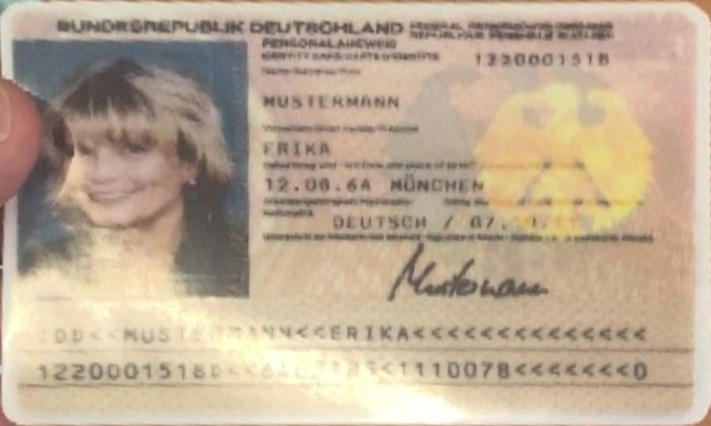
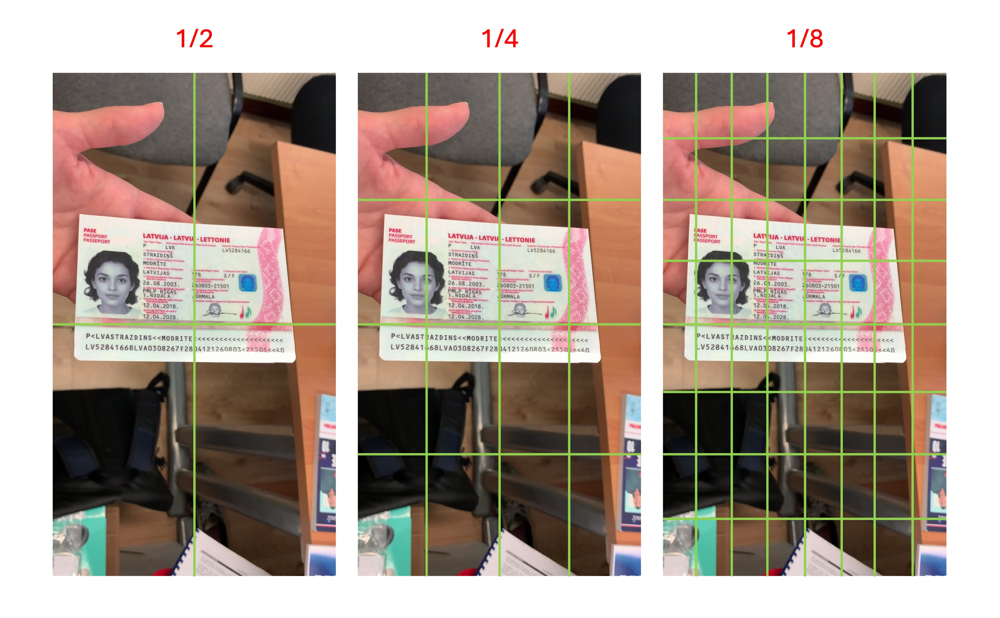

# クイックスタート

簡単なモデル推論インターフェースを提供しており、前処理と後処理のロジックも含まれています。

まず、必要な依存関係をインポートし、`DocAligner` クラスを作成する必要があります。

## モデル推論

:::info
モデルの自動ダウンロード機能を設計しています。プログラムがモデルが不足していることを確認すると、サーバーに接続して自動的にダウンロードします。
:::

以下は簡単な例です：

```python
import cv2
from skimage import io
from docaligner import DocAligner

# モデルを構築
model = DocAligner()

# 画像を読み込む
img = io.imread('https://github.com/DocsaidLab/DocAligner/blob/main/docs/run_test_card.jpg?raw=true')
img = cv2.cvtColor(img, cv2.COLOR_RGB2BGR)

# 推論を実行
polygon = model(img)

# 出力された四隅の座標
# print(polygon)
#    [[ 48.151894 223.47687 ]
#    [387.1344   198.09961 ]
#    [423.0362   345.51334 ]
#    [ 40.148613 361.38782 ]]
```

:::tip
上記の例で使用した画像のダウンロードリンクは、[**run_test_card.jpg**](https://github.com/DocsaidLab/DocAligner/blob/main/docs/run_test_card.jpg) を参照してください。

<div align="center">
<figure style={{"width": "50%"}}>

</figure>
</div>
:::

:::tip
`DocAligner` は `__call__` でラップされているため、インスタンスを直接呼び出して推論を行うことができます。

最新バージョンでは、モデルは numpy.ndarray 形式で結果を返すため、ユーザーにより柔軟で後続のアプリケーションがしやすい形になっています。
:::

## 結果の出力

### 多角形を描画

ファイルの多角形を含む画像を描画して保存します。

```python
import cv2
import numpy as np

def draw_polygon_image(
    img: np.ndarray,
    polygon: np.ndarray,
    thickness: int = 3
) -> np.ndarray:

    colors = [(0, 255, 255), (255, 255, 0), (0, 255, 0), (0, 0, 255)]
    export_img = img.copy()
    _polys = polygon.astype(int)
    _polys_roll = np.roll(_polys, 1, axis=0)
    for p1, p2, color in zip(_polys, _polys_roll, colors):
        export_img = cv2.circle(
            export_img, p2, radius=thickness*2,
            color=color, thickness=-1, lineType=cv2.LINE_AA
        )
        export_img = cv2.arrowedLine(
            export_img, p2, p1, color=color,
            thickness=thickness, line_type=cv2.LINE_AA
        )
    return export_img

# 描画
export_img = draw_polygon_image(img, polygon)
```

<div align="center">
<figure style={{"width": "50%"}}>

</figure>
</div>

### 平坦化された画像の抽出

ファイルの元のサイズが分かっている場合は、`Capybara.imwarp_quadrangle` メソッドを呼び出し、ファイル多角形の画像を矩形画像に変換できます。

- 参照元コード：[**Capybara.imwarp_quadrangle**](https://github.com/DocsaidLab/Capybara/blob/40dbe8a58c959023ed87c7d48c1c378de5bcf038/capybara/vision/geometric.py#L155)

```python
from capybara import imwarp_quadrangle

H, W = 480, 800
flat_img = imwarp_quadrangle(img, polygon, dst_size=(W, H))
```

実行結果は以下の通りです：

<div align="center">
<figure style={{"width": "50%"}}>

</figure>
</div>

もし画像の種類が不明な場合、`dst_size` パラメータを指定しなくても、自動的に最小矩形画像を計算して、最小矩形の幅と高さを `W` と `H` に設定します。

```python
flat_img = imwarp_quadrangle(img, polygon)
```

:::tip
画像内でファイルが大きく傾いている場合、最小矩形が非常に扁平な形状になることがあります。この場合、平坦化すると一定の歪みが生じる可能性があります。

そのため、このような場合は `dst_size` パラメータを使用して手動で設定することをお勧めします。
:::

## なぜモデルがファイルを検出できないのか？

これはすぐに答えられる問題ではなく、個別に解決する必要があります。

以下では、MIDV-2020 の画像を例として説明します。読者はこの画像をダウンロードしてテストできます：

<div align="center">
<figure style={{"width": "30%"}}>

</figure>
</div>

### 画像内のファイルサイズ

最初に考慮すべきは、画像内のファイルのサイズです。ファイルが大きすぎたり小さすぎたりすると、モデルが検出できない可能性があります。

訓練データを調査した結果、ファイルのスケールは約 1/2 ～ 1/8 の範囲に収まっています。下記の図を参考にしてください：



つまり、ファイルのサイズが画像内で上記の 1/8 より小さい「単一のグリッド」サイズの場合、そのファイルはモデルによって無視される可能性があります。モデルはそれを背景と見なす可能性があります。

実際のアプリケーションシーンで小さすぎるファイルを検出しても意味がないため、訓練データを設計する際にこの特性を保持しています。

### ファイルの角点が欠けている

ファイルが大きすぎると通常はモデルに影響を与えませんが、この場合、ファイルの角点が画像の端に切り取られたり、画像を越えてしまったりすることがあります。

このモデルの主な機能は角点の検出であるため、ファイルの角点が欠けていると、モデルは不安定な推定結果を出力します。角点がファイルの端に欠けている場合、モデルは無効なファイルとして判断し、Polygon 結果を出力しない場合があります。以下の図を参照してください：


### 画像内のファイルがぼやけている

もう一つの検出失敗の原因は、ファイルがぼやけていることです。ぼやけたファイルは、モデルがファイルの境界を見つけられなくなり、検出が失敗する原因となります。以下の図を参照してください：

<div align="center">
<figure style={{"width": "80%"}}>

</figure>
</div>

### モデルが認識しないファイル

私たちが訓練したモデルは規模が限られており、約 5MB ～ 20MB の範囲です。モデルは一定の汎化能力を持っていますが、訓練データセットに含まれていない特殊なファイルを検出することはできません。

例えば、以下の図の青い計算機は「特殊なファイル」と仮定します：

<div align="center">
<figure style={{"width": "60%"}}>

</figure>
</div>

この画像をモデルに送ると、空の Polygon が返されます。モデルは「計算機」というファイルを認識できないためです。この問題を解決するには、この「特殊なファイル」を手動で訓練データに追加し、モデルを微調整する必要があります。

## モデルの可視化

この機能はラッピングしていませんが、実際には中間処理であり、その後に他の画像後処理が行われます。

もし本当に見たい場合は、次のコードを使って表示できます。熱画像モデルを使用していると仮定します：

```python
import cv2
import numpy as np
from capybara import imresize, imread
from docaligner import DocAligner
from docaligner.heatmap_reg.infer import preprocess

model = DocAligner()

img = imread('midv2020_example.jpg')

img_infos = preprocess(
    img=img,
    img_size_infer=(256, 256)
)

heatmap = model.detector.model(**img_infos['input'])['heatmap'][0].sum(0)
heatmap = np.uint8(heatmap * 255)
heatmap = imresize(heatmap, size=img.shape[:2])
heatmap = cv2.applyColorMap(heatmap, cv2.COLORMAP_JET)
output = cv2.addWeighted(img, 0.5, heatmap, 0.5, 0)
D.imwrite(output)
```

<div align="center">
<figure style={{"width": "80%"}}>

</figure>
</div>

上記のコードを使用すると、モデルの出力を視覚化できます。これは熱画像で、色が濃いほどその領域がファイルの角点である可能性が高いことを示します。検出に失敗した場合、この画像で問題の可能性を特定できる場合があります。

## お問い合わせ

上記が答えでない場合は、問題があると思われる画像を電子メールで送信してください。時間があるときに確認させていただきます。

メールでお問い合わせください：**docsaidlab@gmail.com**
