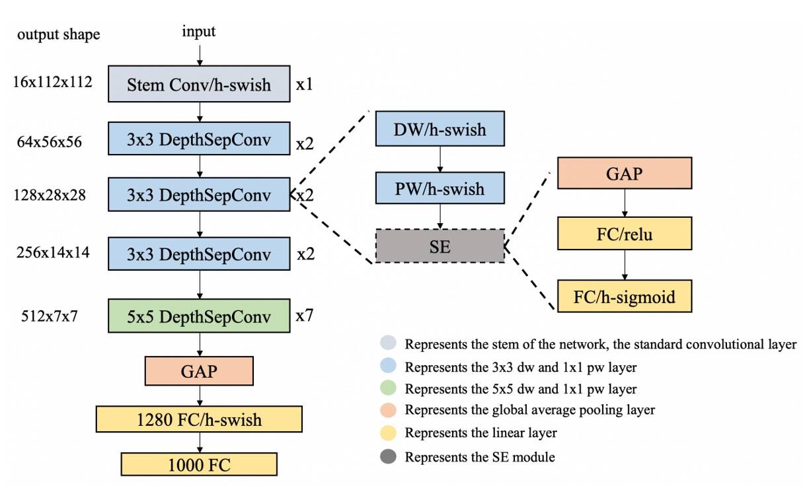
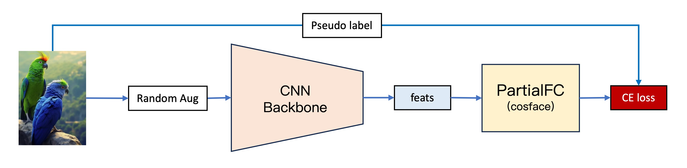
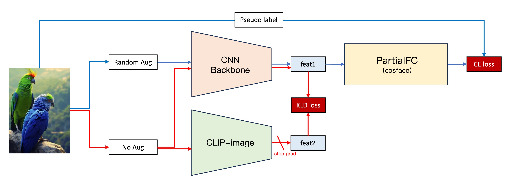

# モデル設計

完全なモデル機能を作り上げるには、何度も調整と設計を繰り返す必要があります。

## 第一世代モデル


第一世代モデルは、私たちの最初のバージョンです。その基本的な構造は 4 つの部分に分かれています。

### 1. 特徴抽出



この部分は主に画像をベクトルに変換するために使用され、[**PP-LCNet**](https://arxiv.org/abs/2109.15099) を特徴抽出器として使用しました。

入力画像は 128 x 128 の RGB 画像で、特徴抽出器を通過後、256 次元のベクトルが出力されます。

:::tip
**なぜ LCNet を使うことが多いのですか？**

私たちはモデルをスマートフォンにデプロイする必要があることが多いため、LCNet は非常に軽量で、スマートフォンで動作させるのに適しています。また、モデルの量子化が必要な場合でも、LCNet は通常、演算子がサポートされない問題に直面することはありません。
:::

### 2. CosFace

[](https://arxiv.org/pdf/1801.09414.pdf)

最初からメトリック学習の効果をテストしたいと考えていたため、従来の分類器の実装を飛ばし、[**CosFace**](https://arxiv.org/abs/1801.09414) の手法を使用しました。ここでは、Margin-based の方法を紹介することが主題ではないので、詳細に触れることは避けますが、必要があれば後ほど論文の読解セクションでこの進化について紹介できます。

簡単に言えば、CosFace はマージンベースの方法で、元々のソフトマックス損失関数にマージンパラメータを追加することで、モデルが異なるカテゴリを区別しやすくするものです。

### 3. データセット

モデルを訓練するために、私たちは簡単なクローラーを作成し、ネット上からいくつかの文書画像を収集しました。

約 650 種類以上の異なる文書があり、その大半は各銀行のクレジットカードに関するものです。

このデータセットはここにあります：[**UniquePool**](https://github.com/DocsaidLab/DocClassifier/tree/main/data/unique_pool)、興味があれば自分でダウンロードしてください。

### 4. 訓練

モデルの訓練には PyTorch を使用しましたが、ここでは詳しくは触れません。

ここで言いたいのは、データのカテゴリをどう扱うかです。この世代のモデルでは、「各画像」を 1 つのカテゴリとして扱っています。モデルには、さまざまなファイルの違いをきちんと認識させたいので、もし異なるファイル（わずかな違いがあるかもしれません）が同じカテゴリに入っていたら、それは期待通りの結果にはなりません。

この設計により 1 つの問題が発生しました。カテゴリ数が多すぎ、元々のデータが少なすぎる（1 枚だけ）。そのため、画像の強化技術を使ってデータを増やす必要がありました。

データ増強のモジュールとしては、[**Albumentations**](https://github.com/albumentations-team/albumentations)を選びました。このモジュールは非常に便利で、データ量を素早く増やすことができるため、ここでも皆さんにおすすめします。

---

第一世代モデルは、アイデアの検証に重点を置いています。第一世代では、このアイデアが実現可能であることを確認しましたが、実際のアプリケーションでいくつかの問題が発覚しました：

1. **安定性**

   実際のテストシーンでは、モデルの安定性が十分ではなく、外的環境の変化に敏感でした。特に、文書が校正中に変形することがあり、これはモデルに大きな影響を与えました。しかし、文書の変形は避けられない現象であり、安定したモデルは少しの歪みで影響されるべきではありません。

2. **性能**

   実際のテストシーンでは、類似した文書がモデルを混乱させ、モデルが学習した特徴が不十分で、異なる文書をうまく区別できないことが分かりました。

これらの二点を総合すると、私たちの結論は次の通りです：**モデルが過剰適合している！**

## 第二世代モデル



第二世代モデルは、第一世代モデルを基にいくつかの改良を加えました：

### 1. データの追加

これ以上の文書を見つけることができませんでした。

そこで、私たちは思いました：**他のオープンソースのデータセットも文書として扱うことができるのではないか？**

そこで、[**Indoor Scene Recognition**](https://web.mit.edu/torralba/www/indoor.html)という MIT のオープンソースデータセットを見つけました。これには 67 種類の異なる室内シーンがあり、約 15,620 枚の画像が含まれています。このデータセットを使うことで、さらに多くの「文書」を手に入れることができました。

### 2. PartialFC への変更


カテゴリ数が増えると、巨大な分類ヘッドの問題がすぐに露呈しました。

顔認識の分野には、非常に有名な手法である[**PartialFC**](https://arxiv.org/abs/2203.15565)があります。この研究チームは、顔特徴学習において、ソフトマックス関数の負のカテゴリ（ターゲット以外のカテゴリ）の重要性は、以前考えられていたほど高くないことを発見しました。実験によると、ソフトマックスベースの損失関数を使って訓練する際に、10%のカテゴリだけをランダムに抽出しても、すべてのカテゴリを使う訓練と比べて精度が失われないことが示されました。

:::tip
私たちのような計算資源が限られている場合、これはまさに神のような存在です！ここで[**insightface**](https://github.com/deepinsight/insightface)の実装に感謝します。もし時間があれば、ぜひ彼らのリポジトリにスターをつけてください。
:::

### 3. さらに多くのデータ

データを増やしましたが、それでも過剰適合の問題は完全には解決していませんでした。モデルが学習した特徴は十分ではなく、類似した文書を区別するのに十分ではありませんでした。

そこで、データセットにいくつかの調整を行い、各画像を回転、反転、切り抜きなどの操作を行いました。これにより、1 枚の画像で「24 個」のカテゴリを定義できるようになりました。

このロジックは以下の通りです：

- 元の画像
- 90 度回転
- 180 度回転
- 270 度回転
- 水平反転
- 水平反転 + 90 度回転
- 水平反転 + 180 度回転
- 水平反転 + 270 度回転
- 上半分の元画像
- 上半分の元画像 + 90 度回転
- 上半分の元画像 + 180 度回転
- ......

これにより、元の画像を (15,620 + 650) x 24 = 390,480 枚の画像（カテゴリ）に変換することができました。

### 4. さらにさらに多くのデータ！

過剰適合の問題は緩和されましたが、完全には解決していません。

明らかに、「新しい」カテゴリをどう定義しても、単に **Indoor Scene Recognition** のデータだけでは十分ではなく、もっと多様性が必要で、モデルの学習を支えるためにそれを必要としていました。

そこで、私たちは **Indoor Scene Recognition** を捨て、[**ImageNet-1K**](https://www.image-net.org/) に切り替えました。これは非常に大きなデータセットで、1,000 種類のカテゴリがあり、約 1,281,167 枚の画像が含まれています。

:::tip
1K バージョンだけでなく、21K バージョンもあります。このバージョンには約 1400 万枚の画像があります。
:::

最終的に、カテゴリを 128 万以上に拡大することで、過剰適合の問題が解決されました。

## 第三世代モデル



より安定したモデルを追求して、私たちは新しい方法をいくつか試しました：

### 1. CLIP

OpenAI が提案した[**CLIP**](https://arxiv.org/abs/2103.00020)が発表されてから数年が経ちましたが、このアイデアは依然としてさまざまな分野で活躍しています。私たちは、元のアーキテクチャに CLIP の特性を組み込むことで、モデルの安定性を向上させられると考えました。

仮定としては、CLIP が多くの画像を見てきたため、CLIP がより堅牢な特徴ベクトルを提供できるだろうというものです。そのため、私たちは自分のモデルが学習した特徴と CLIP の特徴を一致させることで、より良い特徴表現が得られると考えました。

その仮定を検証するため、次のプロセスを設計しました：

1. 第二世代アーキテクチャはそのままにします。
2. 元の画像を自分たちで構築した CNN バックボーンに入力し、画像の特徴ベクトルを取得します、特徴 1。
3. 画像を入力する際に、同じ画像を CLIP-Image 分岐に入力し、画像の特徴ベクトルを取得します、特徴 2。
4. 特徴 1 と特徴 2 の KLD 損失（ベクトルの類似性を考慮した損失関数）を計算します。
5. KLD 損失を元の損失関数に追加し、CLIP-Image 分岐のパラメータを凍結し、第二世代のアーキテクチャ分岐だけを訓練します。

この試みは前例のない成功を収めました。モデルの安定性が大幅に向上し、検証データセットで約 5 ポイントの向上を達成しました。

### 2. 標準化層の追加

第二世代モデルでは、BatchNorm、LayerNorm、InstanceNorm など、さまざまな標準化層をテストしました。顔認識のモデルでは一般的に BatchNorm を使用して優れた結果を得ていることが多いですが、私たちの実験では、LayerNorm の方が効果的でした。

しかし、ある偶然の実験で、さらに良い標準化方法を発見しました：

- **BatchNorm と LayerNorm を同時に使用する！**

この方法を発見したのは、訓練中に削除し忘れて気づいた結果、スコアが突然 5 ポイント上がったことがきっかけです。

```python
self.embed_feats = nn.Sequential(
    nn.Linear(in_dim_flatten, embed_dim, bias=False),
    nn.LayerNorm(embed_dim),
    nn.BatchNorm1d(embed_dim),
    nn.Linear(embed_dim, embed_dim, bias=False),
    nn.LayerNorm(embed_dim),
    nn.BatchNorm1d(embed_dim),
)
```

詳細に調べた結果、この方法がパフォーマンス向上に寄与していることを確認し、採用しました。

## 結論

第三世代のモデルは、安定性と性能の両方で大幅な改善が見られ、私たちはこのモデルに満足しています。実際の応用でも良好な結果が得られました。このタスクのフェーズは終了したと考えており、ここにこれらの結果を公開し、皆さんの参考になればと思います。
