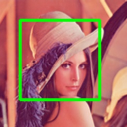

# draw_box

> [draw_box(img: np.ndarray, box: Union[Box, np.ndarray], color: \_Color = (0, 255, 0), thickness: \_Thickness = 2) -> np.ndarray](https://github.com/DocsaidLab/DocsaidKit/blob/71170598902b6f8e89a969f1ce27ed4fd05b2ff2/docsaidkit/vision/visualization/draw.py#L31)

- **説明**：画像上に Bounding Box を描画します。

- **パラメータ**

  - **img** (`np.ndarray`)：描画する画像、NumPy 配列形式。
  - **box** (`Union[Box, np.ndarray]`)：描画する Bounding Box、Box オブジェクトまたは NumPy 配列形式の[x1, y1, x2, y2]。
  - **color** (`_Color`)：描画する枠線の色。デフォルトは(0, 255, 0)。
  - **thickness** (`_Thickness`)：描画する枠線の太さ。デフォルトは 2。

- **戻り値**

  - **np.ndarray**：枠線が描画された画像。

- **例**

  ```python
  import docsaidkit as D

  img = D.imread('lena.png')
  box = D.Box([20, 20, 100, 100])
  box_img = D.draw_box(img, box, color=(0, 255, 0), thickness=2)
  ```

  
