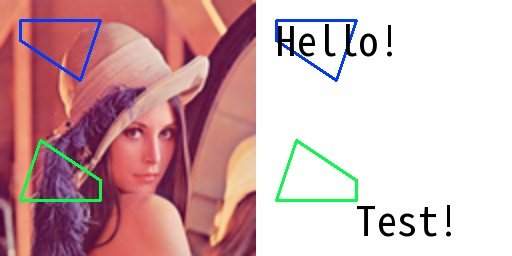

# draw_ocr_infos

> [draw_ocr_infos(img: np.ndarray, texts: List[str], polygons: Polygons, colors: tuple = None, concat_axis: int = 1, thicknesses: int = 2, font_path: str = None) -> np.ndarray](https://github.com/DocsaidLab/DocsaidKit/blob/71170598902b6f8e89a969f1ce27ed4fd05b2ff2/docsaidkit/vision/visualization/draw.py#L308)

- **説明**：画像上に OCR 結果を描画します。

- **パラメータ**

  - **img** (`np.ndarray`)：描画する画像。
  - **texts** (`List[str]`)：検出された文字列のリスト。
  - **polygons** (`D.Polygons`)：検出された文字の境界を示す多角形リスト。
  - **colors** (`tuple`)：描画する色の RGB 値。指定されていない場合、各文字に基づいて固定のロジックで一意の色が生成されます。
  - **concat_axis** (`int`)：元の画像と注釈付き画像を結合する軸。デフォルトは 1（水平）。
  - **thicknesses** (`int`)：多角形を描く太さ。デフォルトは 2。
  - **font_path** (`str`)：使用するフォントファイルのパス。指定されていない場合、デフォルトのフォント「NotoSansMonoCJKtc-VF.ttf」が使用されます。

- **戻り値**

  - **np.ndarray**：元の画像と注釈付き画像が結合された画像。

- **例**

  ```python
  import docsaidkit as D

  img = D.imread('lena.png')
  texts = ['Hello!', 'Test!']
  polygons = [
      D.Polygon([(20, 20), (100, 20), (80, 80), (20, 40)]),
      D.Polygon([(100, 200), (20, 200), (40, 140), (100, 180)])
  ]
  ocr_img = D.draw_ocr_infos(img, texts, polygons, concat_axis=1, thicknesses=2)
  ```

  
