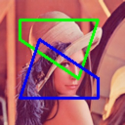

# draw_polygons

> [draw_polygons(img: np.ndarray, polygons: Polygons, color: \_Colors = (0, 255, 0), thickness: \_Thicknesses = 2, fillup=False, \*\*kwargs) -> np.ndarray](https://github.com/DocsaidLab/DocsaidKit/blob/71170598902b6f8e89a969f1ce27ed4fd05b2ff2/docsaidkit/vision/visualization/draw.py#L156)

- **説明**：画像上に複数の多角形を描画します。

- **パラメータ**

  - **img** (`np.ndarray`)：描画する画像、NumPy 配列形式。
  - **polygons** (`List[Union[Polygon, np.ndarray]]`)：描画する多角形、多角形オブジェクトのリストまたは NumPy 配列形式の[[x1, y1], [x2, y2], ...]。
  - **color** (`_Colors`)：描画する多角形の色。単一の色または色のリスト。デフォルトは(0, 255, 0)。
  - **thickness** (`_Thicknesses`)：描画する多角形の辺の太さ。単一の太さまたは太さのリスト。デフォルトは 2。
  - **fillup** (`bool`)：多角形を塗りつぶすかどうか。デフォルトは False。
  - **kwargs**：その他のパラメータ。

- **戻り値**

  - **np.ndarray**：多角形が描画された画像。

- **例**

  ```python
  import docsaidkit as D

  img = D.imread('lena.png')
  polygons = [
      D.Polygon([(20, 20), (100, 20), (80, 80), (20, 40)]),
      D.Polygon([(100, 100), (20, 100), (40, 40), (100, 80)])
  ]
  polygons_img = D.draw_polygons(img, polygons, color=[(0, 255, 0), (255, 0, 0)], thickness=2)
  ```

  
