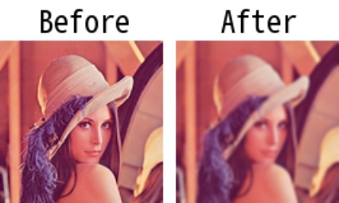

# gaussianblur

> [gaussianblur(img: np.ndarray, ksize: \_Ksize = 3, sigmaX: int = 0, \*\*kwargs) -> np.ndarray](https://github.com/DocsaidLab/DocsaidKit/blob/012540eebaebb2718987dd3ec0f7dcf40f403caa/docsaidkit/vision/functionals.py#L54)

- **説明**：入力画像に対してガウシアンブラー処理を適用します。

- 引数

  - **img** (`np.ndarray`)：ぼかし処理を行う入力画像。
  - **ksize** (`Union[int, Tuple[int, int]]`)：ぼかし処理に使用するカーネルサイズ。整数値を指定した場合、指定されたサイズの正方形カーネルを使用します。タプル`(k_height, k_width)`を指定した場合、指定されたサイズの長方形カーネルを使用します。デフォルトは 3。
  - **sigmaX** (`int`)：ガウシアンカーネルの X 方向の標準偏差。デフォルトは 0。

- **返り値**

  - **np.ndarray**：ぼかし処理後の画像。

- **例**

  ```python
  import docsaidkit as D

  img = D.imread('lena.png')
  blur_img = D.gaussianblur(img, ksize=5)
  ```

  
