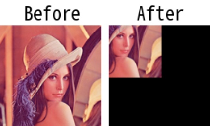

# imcropbox

> [imcropbox(img: np.ndarray, box: Union[Box, np.ndarray], use_pad: bool = False) -> np.ndarray](https://github.com/DocsaidLab/DocsaidKit/blob/012540eebaebb2718987dd3ec0f7dcf40f403caa/docsaidkit/vision/functionals.py#L257)

- **説明**：提供されたボックスを使用して入力画像をクロップします。

- 引数

  - **img** (`np.ndarray`)：クロップする入力画像。
  - **box** (`Union[Box, np.ndarray]`)：クロップボックス。入力は DocsaidKit のカスタム Box オブジェクトで、(x1, y1, x2, y2) 座標で定義されます。また、同じ形式の NumPy 配列も使用可能です。
  - **use_pad** (`bool`)：境界外の領域をパディングで処理するかどうか。True に設定すると、外部領域はゼロでパディングされます。デフォルトは False。

- **返り値**

  - **np.ndarray**：クロップ後の画像。

- **例**

  ```python
  import docsaidkit as D

  # カスタムBoxオブジェクトを使用
  img = D.imread('lena.png')
  box = D.Box([50, 50, 200, 200], box_mode='xyxy')
  cropped_img = D.imcropbox(img, box, use_pad=True)

  # クロップした画像を元のサイズにリサイズして可視化
  cropped_img = D.imresize(cropped_img, [img.shape[0], img.shape[1]])
  ```

  
