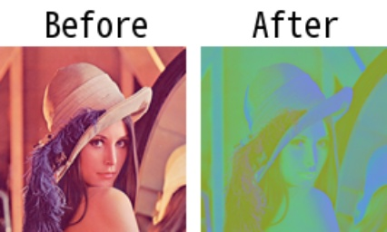
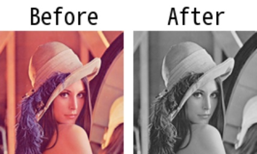

# imcvtcolor

> [imcvtcolor(img: np.ndarray, cvt_mode: Union[int, str]) -> np.ndarray](https://github.com/DocsaidLab/DocsaidKit/blob/012540eebaebb2718987dd3ec0f7dcf40f403caa/docsaidkit/vision/functionals.py#L96)

- **説明**：入力画像の色空間を変換します。

- 引数

  - **img** (`np.ndarray`)：変換する入力画像。
  - **cvt_mode** (`Union[int, str]`)：色変換モード。変換コードを表す整数定数または OpenCV の色変換名を表す文字列にできます。例えば、`BGR2GRAY`は BGR 画像をグレースケールに変換するために使用されます。使用可能なパラメータは[**OpenCV COLOR**](https://docs.opencv.org/4.x/d8/d01/group__imgproc__color__conversions.html)を参照してください。

- **返り値**

  - **np.ndarray**：要求された色空間の画像。

- **例**

  ```python
  import docsaidkit as D

  img = D.imread('lena.png')
  ycrcb_img = D.imcvtcolor(img, 'BGR2YCrCb')
  ```

  

  ```python
  import docsaidkit as D

  img = D.imread('lena.png')
  ycrcb_img = D.imcvtcolor(img, 'BGR2YCrCb')
  ```

  
