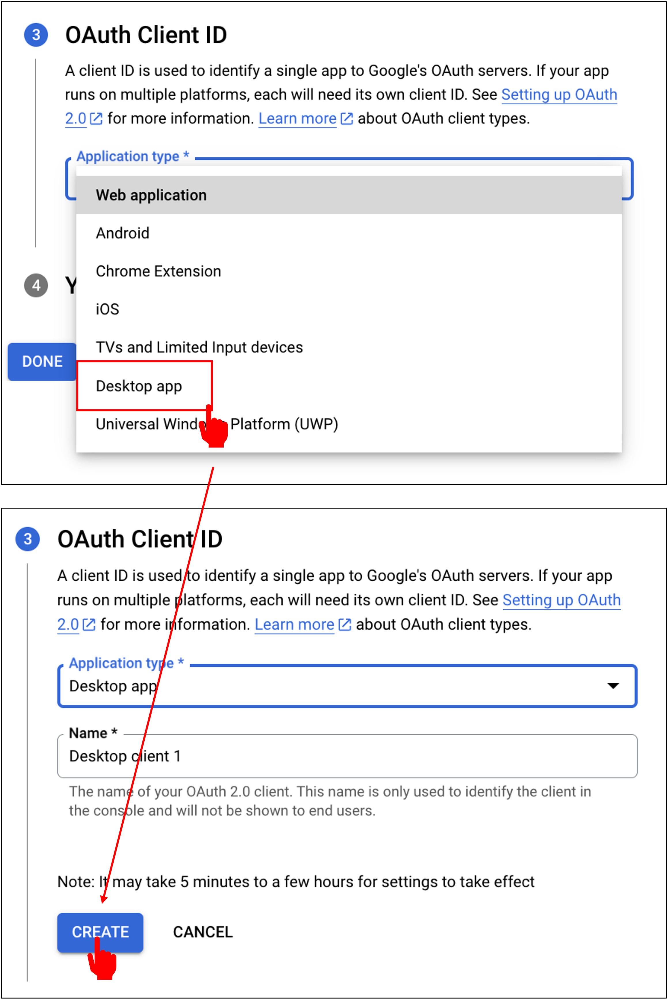

# Gmail API の認証

Gmail API を有効にした後、システムから認証情報を作成するよう求められますので、そのまま進めます。

## 認証情報の作成

「Create credentials」をクリックします。

最初のステップでは、認証情報のタイプを設定します。「User Data」を選択し、「Next」をクリックします。

次は「OAuth Consent Screen」です。ここでアプリケーション名とメールアドレスを入力し、「Save and Continue」をクリックします。

:::warning
最後の「開発者連絡先情報」は、Google が問題を報告する際に使用する連絡手段です。誤って入力すると通知を受け取れない場合がありますので注意してください。
:::

次に「Scopes」で、「Add or Remove Scopes」を選択し、「ReadOnly」の権限を選んで「Update」をクリックします。

次は「OAuth Client ID」です。ここで「Desktop App」を選択し、「Create」をクリックします。

認証情報の作成が完了したら、「Download」をクリックして、次に「Done」をクリックします。

ダウンロードした認証情報は JSON ファイルで、`credentials.json`としてプロジェクトのルートディレクトリに保存します。

## OAuth 2.0 の設定

設定が完了したら、Gmail API のページに戻り、「OAuth consent screen」をクリックします。

今回は自分の Gmail を確認するだけなので、公開する必要はなく、テストユーザーを追加するだけで十分です。

これで、Gmail API の認証設定が完了しました。
