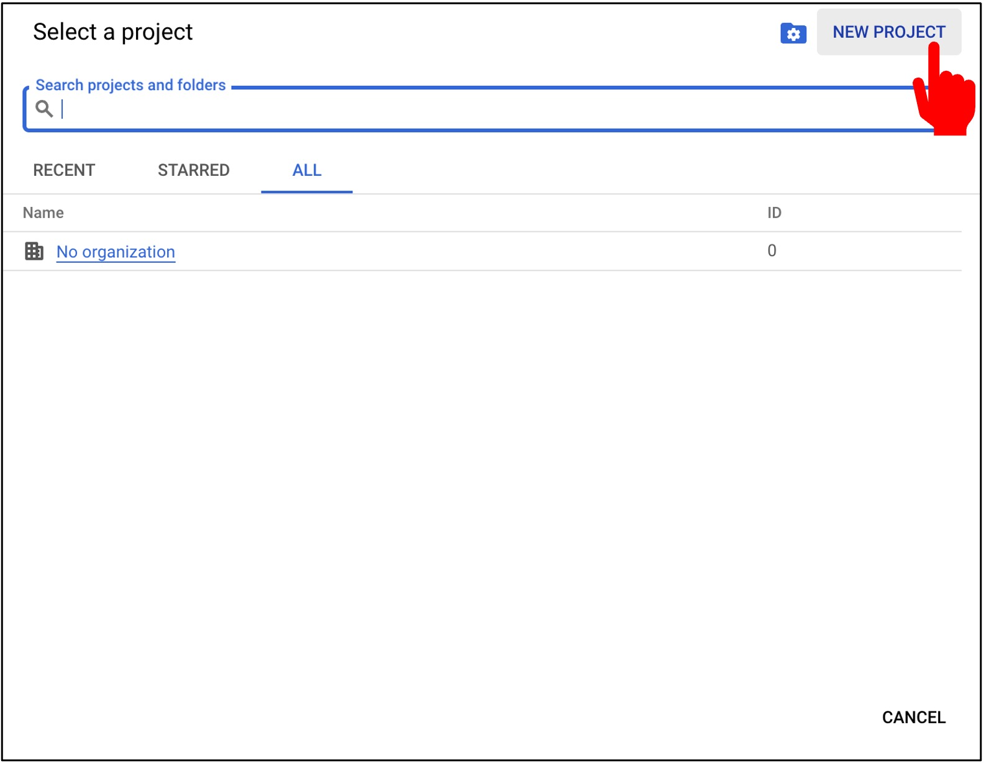
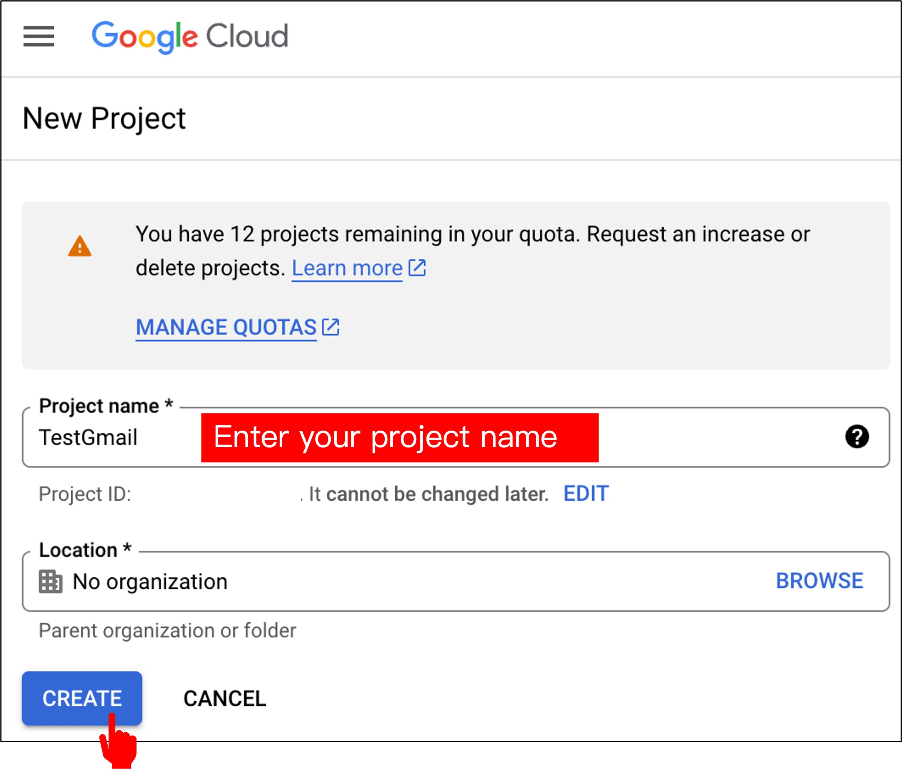
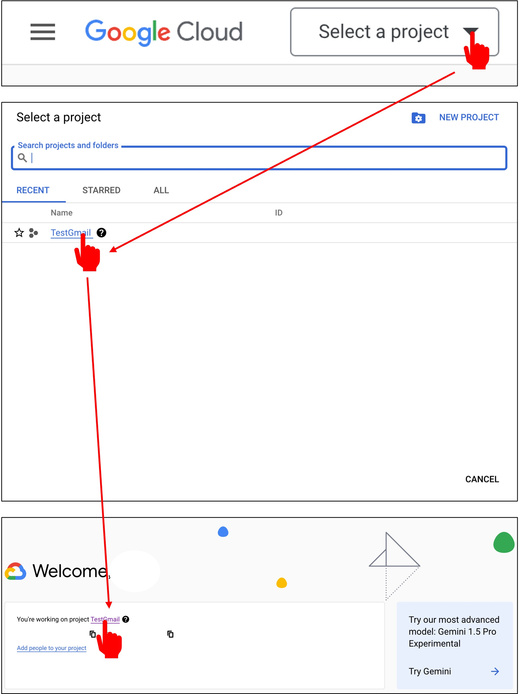

# Gmail API の有効化

これはタイムリーな章です。なぜなら、Gmail API の使用方法は Google のアップデートによって変更される可能性があるからです。

読む際は、最新の公式ドキュメントをご確認ください：[**GmailAPI**](https://developers.google.com/gmail/api)。

## 概要

Gmail API は REST アーキテクチャに基づいたアプリケーションインターフェースで、開発者が Gmail アカウントにアクセスし、メールを送信することを可能にします。ほとんどの Web アプリケーションにとって、Gmail API はユーザーの Gmail データに対する認可アクセスを提供し、以下のようなさまざまなユースケースに適しています：

- 読み取り専用モードでのメールの抽出、インデックス作成、バックアップ
- 自動化またはプログラムによるメッセージの送信
- メールアカウントの移行
- メールの整理（フィルタリングやソートを含む）
- 組織全体での電子メール署名の標準化

:::warning
Gmail API は IMAP を代替して完全な電子メールクライアントを開発するためのものではありません。完全な電子メールクライアントの開発には、IMAP、POP、SMTP 標準を参照してください。
:::

Gmail API でよく使用される用語は以下の通りです：

- **メッセージ（Message）**：送信者、受信者、件名、本文を含む電子メールのメッセージ。メッセージは一度作成されると変更できません。各メッセージはメッセージリソースとして表されます。
- **スレッド（Thread）**：関連するメッセージの集合からなる会話。電子メールクライアントアプリケーションでは、1 人以上の受信者がメッセージに返信すると、それがスレッドを形成します。
- **ラベル（Label）**：メッセージやスレッドを整理するためのメカニズム。例えば、「税務」ラベルを作成し、それをすべての税務関連のメッセージやスレッドに適用できます。ラベルには 2 種類があります：
  - **システムラベル**：内部で作成されたラベル、例：受信トレイ（INBOX）、ゴミ箱（TRASH）、スパム（SPAM）。これらのラベルは削除や変更ができません。ただし、いくつかのシステムラベル（受信トレイなど）はメッセージやスレッドに適用したり、そこから削除したりできます。
  - **ユーザーラベル**：ユーザーが作成したラベル。これらのラベルはユーザーまたはアプリケーションによって削除または変更できます。ユーザーラベルはラベルリソースとして表されます。
- **下書き（Draft）**：送信されていないメッセージ。下書きのメッセージは置き換え可能です。下書きを送信すると、下書きは自動的に削除され、送信（SENT）システムラベルの付いたメッセージが作成されます。下書きは下書きリソースとして表されます。

## アカウントにログイン

始める前に、Google Cloud アカウントを作成していることを確認してください：[**Google Cloud**](https://cloud.google.com/)。

次に、Google Cloud Console でプロジェクトを作成し、「Console」をクリックします。

## プロジェクトを作成

Console に入ったら、「プロジェクトを作成」をクリックします。

次に、「新しいプロジェクトを作成」をクリックします。

プロジェクト名を入力し、「作成」をクリックします。

## Gmail API の有効化

プロジェクトが作成されたら、メインメニューからプロジェクトを選択します。

ダッシュボードに移動したら、「API とサービス」をクリックします。

次に、「API とサービスを有効にする」をクリックします。

検索ボックスに「Gmail」を入力し、「Gmail API」をクリックします。

「有効にする」をクリックします。

これで、Gmail API が正常に有効化されました。

