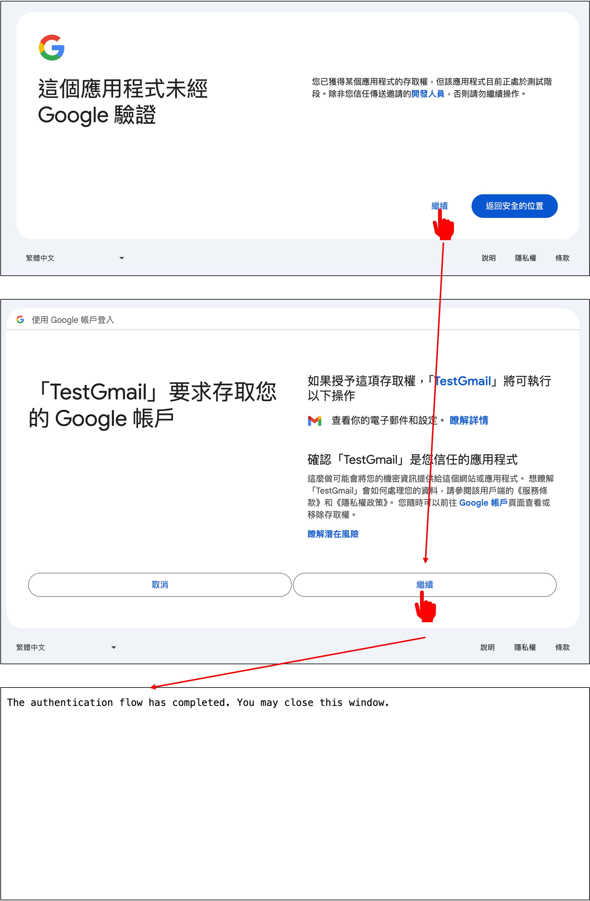

# Gmail API の利用

設定が完了したら、Gmail API を使い始められます。

まず、先ほどダウンロードした `credentials.json` を見つけて、プロジェクトのルートディレクトリに配置してください。

次に、Google が提供しているチュートリアルを開きます：[**Python quickstart**](https://developers.google.com/gmail/api/quickstart/python)

## パッケージのインストール

Python 用の Google クライアントライブラリをインストールします：

```bash
pip install -U google-api-python-client google-auth-httplib2 google-auth-oauthlib
```

## 設定例

1. 作業ディレクトリに `quickstart.py` という名前のファイルを作成します。

   - Google が提供するサンプルコードをそのまま使っても構いません：[**source code**](https://github.com/googleworkspace/python-samples/blob/main/gmail/quickstart/quickstart.py)

2. 以下のコードを `quickstart.py` に追加します：

   ```python title="quickstart.py"
   import os.path

   from google.auth.transport.requests import Request
   from google.oauth2.credentials import Credentials
   from google_auth_oauthlib.flow import InstalledAppFlow
   from googleapiclient.discovery import build
   from googleapiclient.errors import HttpError

   # If modifying these scopes, delete the file token.json.
   SCOPES = ["https://www.googleapis.com/auth/gmail.readonly"]


   def main():
   """Shows basic usage of the Gmail API. Lists the user's Gmail labels."""
   creds = None
   # The file token.json stores the user's access and refresh tokens, and is
   # created automatically when the authorization flow completes for the first
   # time.
   if os.path.exists("token.json"):
       creds = Credentials.from_authorized_user_file("token.json", SCOPES)
   # If there are no (valid) credentials available, let the user log in.
   if not creds or not creds.valid:
       if creds and creds.expired and creds.refresh_token:
           creds.refresh(Request())
       else:
           flow = InstalledAppFlow.from_client_secrets_file(
               "credentials.json", SCOPES
           )
           creds = flow.run_local_server(port=0)
       # Save the credentials for the next run
       with open("token.json", "w") as token:
           token.write(creds.to_json())

   try:
       # Call the Gmail API
       service = build("gmail", "v1", credentials=creds)
       results = service.users().labels().list(userId="me").execute()
       labels = results.get("labels", [])

       if not labels:
           print("No labels found.")
           return
       print("Labels:")
       for label in labels:
           print(label["name"])

   except HttpError as error:
       # TODO(developer) - Handle errors from gmail API.
       print(f"An error occurred: {error}")

   if __name__ == "__main__":
       main()
   ```

## 実行例

`quickstart.py` を実行します：

```bash
python quickstart.py
```

初回実行時には認証画面が表示されるので、「Allow」をクリックしてください。



すると、次のような出力が表示されます：

```bash
Labels:
CHAT
SENT
INBOX
IMPORTANT
TRASH
DRAFT
SPAM
CATEGORY_FORUMS
CATEGORY_UPDATES
CATEGORY_PERSONAL
CATEGORY_PROMOTIONS
CATEGORY_SOCIAL
STARRED
UNREAD
```

また、`token.json` というファイルも生成されます。次回以降は、このファイルにより再認証が不要になります。

## 使い始める

ここからは、Gmail API を使ってメール内容を解析していきます。

実装するのは、次の 3 つです：クライアントの作成、メールの取得、メール本文の解析。

まず、必要なパッケージをインポートします：

```python
from base64 import urlsafe_b64decode
from datetime import datetime, timedelta
from typing import Dict, List

import pytz
from google.oauth2.credentials import Credentials
from googleapiclient.discovery import build
```

### クライアントの作成

Gmail API クライアントを作成する際は、`token.json` に保存されたアクセストークンとリフレッシュトークンを読み込みます。アクセストークンの有効期限が切れている場合は、自動的に更新されます。

```python
def build_service():
    creds = None
    token_file = 'token.json'
    creds = Credentials.from_authorized_user_file(
        token_file, scopes=['https://www.googleapis.com/auth/gmail.readonly'])
    service = build('gmail', 'v1', credentials=creds)
    return service
```

### メールの取得

次に、メール内容を取得する関数を定義します：

```python
def get_messages(
    service,
    user_id='me',
    after_date=None,
    subject_filter: str = None,
    max_results: int = 500
) -> List[Dict[str, str]]:

    tz = pytz.timezone('Asia/Taipei')
    if not after_date:
        now = datetime.now(tz)
        after_date = (now - timedelta(days=1)).strftime('%Y/%m/%d')

    messages = []
    try:
        query = ''
        if after_date:
            query += f' after:{after_date}'
        if subject_filter:
            query += f' subject:("{subject_filter}")'

        response = service.users().messages().list(
            userId=user_id, q=query, maxResults=max_results).execute()

        messages.extend(response.get('messages', []))

        # Handle pagination with nextPageToken
        while 'nextPageToken' in response:
            page_token = response['nextPageToken']
            response = service.users().messages().list(
                userId=user_id, q=query, maxResults=max_results, pageToken=page_token).execute()
            messages.extend(response.get('messages', []))

    except Exception as error:
        print(f'An error occurred: {error}')

    if not messages:
        print("No messages found.")

    return messages
```

### メールの解析

取得したデータには大量のメタデータが含まれているため、読みやすい形式に整形します。

```python
def parse_message(service, msg_id, user_id='me'):

    try:
        message = service.users().messages().get(
            userId=user_id, id=msg_id, format='full').execute()
        headers = message['payload']['headers']
        parts = message['payload'].get('parts', [])
        email_data = {
            'Date': None,
            'Subject': None,
            'Text': None
        }

        # ヘッダーを解析して送信日時と件名を取得
        for header in headers:
            if header['name'] == 'Date':
                email_data['Date'] = header['value']
            elif header['name'] == 'Subject':
                email_data['Subject'] = header['value']

        # メール本文を解析
        for part in parts:
            if part['mimeType'] == 'text/plain' or part['mimeType'] == 'text/html':
                data = part['body']['data']
                text = urlsafe_b64decode(data.encode('ASCII')).decode('UTF-8')
                email_data['Text'] = text
                break  # 最初に一致した部分のみを取得

        return email_data

    except Exception as error:
        print(f'An error occurred: {error}')
        return None
```

## まとめ

ここまでで、Gmail API の基本的な使い方は一通り説明できました。

ただし、まだ実行するのは少し待ってください。先にいくつか準備が必要です。

次は OpenAI API と接続し、メール内容を ChatGPT に渡して解析できるようにします。
