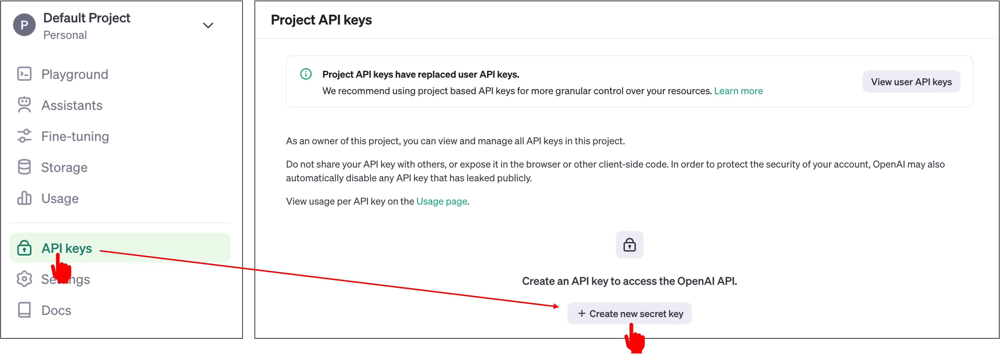
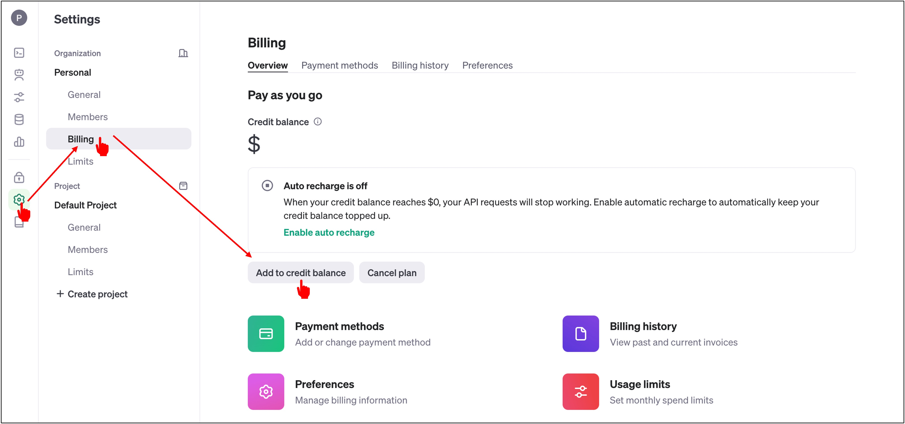

# OpenAI API の有効化

この章では、[OpenAI API](https://platform.openai.com/docs/overview)の公式サイトに登録し、API キーを取得する方法を説明します。

:::info
OpenAI が提供するユーザーがテキストを入力できる ChatGPT と、API を通じて呼び出す GPT などのサービスは異なるシステムです！たとえ ChatGPT の有料版を使用していても、API 呼び出しのシステムでは再度料金が発生するので注意してください。
:::

## アカウントの登録

ここでは、Gmail API のように複雑な手順はありません。公式サイトで指示に従って登録を進めてください。

## API キーの取得

登録が完了したら、サイドバーの「API Keys」をクリックし、「Create new secret key」をクリックします。

好きな名前を付け、「Create」をクリックします。

次に、API キーが表示されますので、これをコピーしてプロジェクトで使用します。

## 使用開始？

まだです！支払いを先に行う必要があります。

「Billing」をクリックし、API 呼び出しに使用する金額（米ドル）をチャージします。

これで OpenAI API の登録と有効化が完了しました。次は、OpenAI API を使用する準備が整いました！
