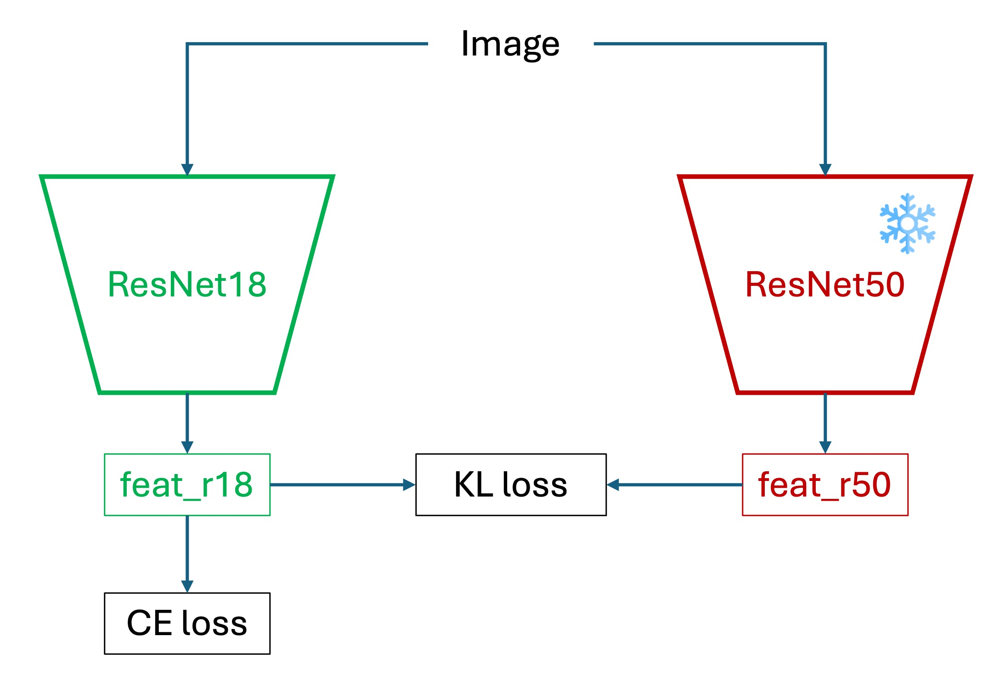

# CIFAR-100

## 過学習の眠れぬ夜

本プロジェクトは、CIFAR-100 画像分類タスクを用いたシンプルな PyTorch トレーニング例を提供し、初心者が素早く取り組めるようにしています。同時に、異なる実験ニーズに対応しやすい柔軟な調整・拡張例コードも用意しています。

それでは、さっそく始めましょう。

:::info
本プロジェクトのコードは Github にて入手可能です：[**cifar100_training_demo**](https://github.com/DocsaidLab/cifar100_training_demo)。
:::

## 本プロジェクトのダウンロード

プロジェクトの事前準備は完了しています。以下のコマンドでコードを取得してください：

```bash
git clone https://github.com/DocsaidLab/cifar100-training-demo.git
```

## トレーニング環境の構築（Ubuntu 22.04/24.04）

:::tip
**なぜ Docker を使うのか？**

1. **一貫性**：「私の PC で動くなら、あなたの PC でも同じように動く」を保証します。
2. **汚染防止**：依存パッケージはすべてイメージ内に封じ込められ、元の Python や conda 環境を乱しません。
3. **簡単リセット**：エラー時は `docker rm` + `docker run` で環境を瞬時に初期化可能です。
   （もし venv や conda に慣れているなら、自身で環境を作成しても構いませんが、本プロジェクトは Docker をメインにしています。）
   :::

### Docker 環境の構築

この章は私たちの基礎ツールボックスプロジェクトで詳しく説明しています。以下を参照してください：

- [**Docsaid Capybara #進階インストール**](https://docsaid.org/ja/docs/capybara/advance)

### イメージのダウンロードとビルド

```bash
cd cifar100-training-demo
bash docker/build.bash
```

- ベースイメージ：`nvcr.io/nvidia/pytorch:25.03-py3`
- バージョン詳細：[**PyTorch Release 25.03**](https://docs.nvidia.com/deeplearning/frameworks/pytorch-release-notes/rel-25-03.html#rel-25-03)
- 初回ビルド時のダウンロード容量は約 20GB、所要時間はお使いのネット速度にもよりますが約 5〜20 分です。

ビルド完了後、以下でイメージを確認できます：

```bash
docker images | grep cifar100_train
```

## データセットの構築

PyTorch では、CIFAR-100 データセットは `torchvision` に標準搭載されているため、直接以下のように使用できます：

```python
from torchvision.datasets import CIFAR100

train_dataset = CIFAR100(root='data/', train=True, download=True)
test_dataset = CIFAR100(root='data/', train=False, download=True)
```

しかし、ここで練習のために自分でデータセットをダウンロードし構築してみましょう。これによりデータ処理の流れをより深く理解できます。

まずは公式サイトから CIFAR-100 データセットをダウンロードして解凍します：

```bash
wget https://www.cs.toronto.edu/~kriz/cifar-100-python.tar.gz
tar xvf cifar-100-python.tar.gz
```

解凍後、作業ディレクトリ内に `cifar-100-python` フォルダができており、訓練データとテストデータが含まれています。

構造は大体以下のようになっています：

```text
cifar-100-python/
├── train
├── test
├── meta
├── file.txt~
```

これは画像ファイルではなく、Python の pickle ファイル形式でパッケージされています。使用時には `pickle` モジュールで読み込む必要があります。

## データセットの作成

データセットが用意できたら、PyTorch 用のデータセットクラスを実装して読み込みましょう。

ここでは簡単な `CIFAR100DatasetSimple` クラスを実装します：

```python
import pickle

import capybara as cb
import numpy as np

DIR = cb.get_curdir(__file__)

class CIFAR100DatasetSimple:

    def __init__(
        self,
        root: str=None,
        mode: str='train',
        image_size: int=32,
        return_tensor: bool=False,
        image_aug_ratio: float=0.5,
    ):

        if mode not in ['train', 'test']:
            raise ValueError("mode must be either 'train' or 'test'")

        if root is None:
            self.root = DIR / 'cifar-100-python'
        else:
            self.root = root

        self.image_size = image_size
        self.return_tensor = return_tensor

        # データファイルの読み込み
        with open(f'{self.root}/{mode}', 'rb') as f:
            data = pickle.load(f, encoding='bytes')
            self.images = data[b'data']
            self.labels = data[b'fine_labels']
            self.filenames = data[b'filenames']

        # shape: (N, 3, 32, 32)
        self.images = self.images.reshape(-1, 3, 32, 32)

    def __len__(self):
        return len(self.labels)

    def __getitem__(self, idx):
        img = self.images[idx]
        label = self.labels[idx]

        img = np.transpose(img, (1, 2, 0)) # (C, H, W) -> (H, W, C)
        img = cb.imresize(img, size=self.image_size)

        if self.return_tensor:
            img = np.transpose(img, (2, 0, 1))  # (H, W, C) -> (C, H, W)
            img = img.astype(np.float32) / 255.  # 簡単に [0,1] に正規化
            label = np.array(label, dtype=np.int64)
            return img, label

        return img, label
```

このクラスの機能は以下の通りです：

1. 出力画像サイズ（`image_size`）を指定可能。デフォルトは 32。
2. 画像を PyTorch の Tensor 形式に変換するか選択可能（`return_tensor`）。
3. データセットのモードを指定可能（`mode`）。訓練用は `train`、テスト用は `test`。

より複雑な機能は後述しますが、まずはこのクラスで最初のベースラインモデルをトレーニングしましょう。

## 最初のモデル：Acc=44.26%

`config` フォルダ内にいくつかのデフォルト設定ファイルがあります。これらを用いてトレーニングを制御します。最初は `resnet18_baseline.yaml` を使い、よく知られている ResNet-18 をベースモデルとして使用します。

トレーニングを始める前に、一つ上のディレクトリに戻ります：

```bash
cd ..
```

次に以下のコマンドでトレーニングを開始できます：

```bash
bash cifar100-training-demo/docker/train.bash resnet18_baseline
```

初めてのモデルなので、パラメータ設定を詳しく見てみましょう。

### 重要な設定の説明

`config/resnet18_baseline.yaml` の主な設定内容は以下の通りです：

1. **バッチサイズ**：250 に設定。訓練データ 5 万件を割り切れるサイズで、訓練サイクルを簡略化。

   :::tip
   通常は 32 の倍数を選び GPU 資源を有効活用しますが、小規模データセットなのでこの制約を無視して 250 を使用しています。これにより 1 エポックあたり 200 回（50000 ÷ 250 = 200）のイテレーションで済みます。
   :::

2. **画像サイズ**：32 に設定。CIFAR-100 の元画像サイズに合わせ、特に指定がなければ以降の実験もこれを使います。

3. **モデル設定**

   ```yaml
   model:
     name: CIFAR100ModelBaseline
     backbone:
       name: Backbone
       options:
         name: timm_resnet18
         pretrained: False
         features_only: True
     head:
       name: Baseline
       options:
         num_classes: 100
   ```

   - `timm_resnet18`をプリトレーニングなし（pretrained=False）で使用し、モデルがゼロから学習する様子を把握しやすくしています。
   - `Baseline`は backbone の出力を 100 クラスの予測に変換します。

4. **エポック数**：200 に設定。試行の結果、200 以上は改善が目立ちませんでした。

5. **オプティマイザ**：`AdamW`を使用し、学習率（lr）は 0.001。全体的に安定した訓練が可能です。

6. **Weight Decay**：0.0001 に設定。小規模モデルはある程度の正則化が内部に含まれているため、この値を抑え気味にしています。

---

最終的にこのモデルは 186 エポック目でテストセットの精度 44.26%を達成しました。

しかし、訓練セットの精度は既に 100%で、典型的な過学習の兆候です。

## 訓練ハイパーパラメータの調整

「過学習」とは、モデルが訓練データを丸暗記してしまい、他のデータに適用できない状態を指します。

CIFAR-100 のような小規模データセットでは特に起こりやすく、クラス数が多くサンプル数が少ないため、モデルは細かい特徴を記憶しがちでルールを学びにくいのです。

### 一般的な対処法は以下の通りです

1. **モデル容量の削減**：小さいモデルに変更し、過学習のリスクを減らす。
2. **データ拡張（Data Augmentation）**：ランダムな切り抜き、反転、輝度調整などを加え、モデルに多様な画像を見せて汎化能力を高める。
3. **正則化（Regularization）**：Dropout や Weight Decay を利用し、学習時にモデルの過剰適合を抑制。
4. **早期停止（Early Stopping）**：検証精度が伸びなくなった時点で学習を終了し、過学習を防止。
5. **事前学習済みモデルの利用（Pretrained Model）**：許可されていれば ImageNet など大規模データセットで学習済みモデルを微調整する。
6. **学習率・バッチサイズの調整**：学習率が高すぎる・低すぎると不安定になるほか、バッチサイズも勾配更新の安定性に影響。

---

Early Stopping は今回は使わず、固定で 200 エポック走り最高スコアを報告します。

まずはよく使われるデータ拡張を試してみましょう。

## データ拡張：Acc=36.48%

モデルの汎化性能を改善するためにデータ拡張を使ってみます。

ここでは `albumentations` ライブラリを導入し、基本的な拡張処理を追加します。

```python
import albumentations as A

class DefaultImageAug:

    def __init__(self, p=0.5):
        self.aug = A.OneOf([
            A.ShiftScaleRotate(),
            A.CoarseDropout(),
            A.ColorJitter(),
            A.HorizontalFlip(),
            A.VerticalFlip(),
        ], p=p)

    def __call__(self, img: np.ndarray):
        img = self.aug(image=img)['image']
        return img
```

選んだ拡張は以下の通りです：

- **ShiftScaleRotate**：ランダムに平行移動、拡大縮小、回転を行う。
- **CoarseDropout**：ランダムに画像の一部をマスクし、欠損を模擬。
- **ColorJitter**：輝度、コントラスト、彩度をランダムに調整。
- **HorizontalFlip**：ランダムに水平反転。
- **VerticalFlip**：ランダムに垂直反転。

経験的に、これらの拡張はモデルの汎化力を向上させます。

続いて `config/resnet18_augment.yaml` にこの拡張を追加します：

```yaml
dataset:
  train_options:
    name: CIFAR100AugDataset
    options:
      mode: train
      return_tensor: True
      image_aug_ratio: 1.0
  valid_options:
    name: CIFAR100AugDataset
    options:
      mode: test
      return_tensor: True
```

しかし結果は期待外れでした。

テスト精度は 36.48%で、前回の 44.26%より大きく下がりました。

これは CIFAR-100 の解像度 32×32 の小画像に対して、回転 ±45° や大きなマスク、垂直反転など強い拡張を一度に多用すると画像の意味が壊れ、モデルが基本的特徴を安定して学べなくなるためです。

## 強い正則化：Acc=40.12%

次に、正則化でモデルの汎化性能を改善してみます。

一般的に CNN モデルは、畳み込み構造の平行移動不変性やパラメータ共有特性により、ある程度の正則化効果があります。Transformer モデルが訓練初期に過学習しやすいのとは対照的です。

とはいえ試してみます。

`weight_decay`を 0.1 に上げて、学習・汎化への影響を観察。

`config/resnet18_baseline_wd01.yaml`で以下を変更：

```yaml
optimizer:
  name: AdamW
  options:
    lr: 0.001
    betas: [0.9, 0.999]
    weight_decay: 0.1
    amsgrad: False
```

結果は予想通りで、テスト精度が 40.12%に低下し、元の 44.26%を下回りました。

これはよくある現象で、小規模データセットでは強い正則化がモデルの十分な特徴学習を抑制し、早期収束してしまうため、最終的に汎化性能が落ちることを示しています。

## ラベルスムージング：Acc=44.81%

次にラベルスムージングを使ってモデルの汎化性能を試します。

ラベルスムージングとは、各クラスのラベルを one-hot から滑らかな分布に変換し、過学習を抑える手法です。

`config/resnet18_baseline_lbsmooth.yaml`で設定可能。

使い方は簡単で、損失関数に `label_smoothing` パラメータを加えるだけです。

```python
loss_fn = nn.CrossEntropyLoss(label_smoothing=0.1)
```

実験結果は、59 エポック目でテスト精度 44.81%に達し、従来の 44.26%を上回っただけでなく、約 100 エポック早くこの精度に到達しました。

これにより、このタスクでラベルスムージングが過学習軽減と汎化性能向上に効果的であることが示されました。

## 結局はやはりデータ不足

ここまでの実験から、現実的な結論が得られます：

> **ある問題は、モデル設計やハイパーパラメータの微調整だけでは解決できない。**

CIFAR-100 を例にとると、サンプル数は多いものの解像度が低く、意味情報が乏しく、各クラスのサンプル数も限られています。このようなデータ特性は、モデルが汎化可能な判別特徴を学習するのを難しくします。

実務的な観点では、最も直接的な解決策は：**データを増やすこと**です。

しかしデータ収集は高コストな作業であり、多くの応用シーンでデータの入手が困難で、ラベル付けも時間と労力を要します。これが深層学習の実運用における核心的なボトルネックとなっています。

そこで実務界でより一般的かつ現実的な選択肢が：**転移学習（Transfer Learning）**です。

転移学習により、モデルをゼロから訓練する代わりに、大規模データセット（例えば ImageNet）で事前学習されたモデルをバックボーンとして利用し、対象タスクに対して微調整（ファインチューニング）します。

この戦略は多くの利点があります：

- **収束の高速化**：初期重みが意味的特徴を含み、モデルが早く学習方向を見つけられる
- **性能向上**：ターゲットデータが少なくても汎用表現を最大限活用可能
- **過学習の軽減**：事前学習モデルは訓練の安定したスタート地点となり、より良い汎化性能を実現

そこで次に、`timm` が提供する事前学習モデルを使って実際に試してみます。

:::info
**timm とは？**

深層学習界隈で広く知られているライブラリです。

`timm` は PyTorch 向けのモデルライブラリで、多数の事前学習済みモデルやツールを提供し、ユーザーが様々な深層学習タスクを迅速に実装できるよう支援します。最新のモデルアーキテクチャや訓練技術も豊富に含まれ、特に画像分類や物体検出に適しています。

- [**Timm GitHub**](https://github.com/huggingface/pytorch-image-models)
  :::

## 事前学習済み重み：Acc = 56.70%

Baseline 設定を継続し、`label_smoothing` や他の正則化技術は一旦使わず、backbone の事前学習済み重みに注目しました。

今回は設定ファイル `resnet18_pretrained.yaml` を使用し、主に backbone の `pretrained` オプションを `True` にして ImageNet 由来の事前学習済み重みを有効化しています。

```yaml
model:
  name: CIFAR100ModelBaseline
  backbone:
    name: Backbone
    options:
      name: timm_resnet18
      pretrained: True
      features_only: True
  head:
    name: Baseline
    options:
      num_classes: 100
```

112 エポック目にテストセットで 56.70%の精度を達成し、元の 44.26%から **12.44%** の大幅な向上となりました。

非常に効果的で、これまでのハイパーパラメータ調整よりも有効だったと言えます。

ただし、転移学習にも万能ではなく、事前学習データと対象タスクの差異が大きい場合は、モデルが有効に転移できず「**ネガティブトランスファー（Negative Transfer）**」が生じることがあります。例えば、画像用に事前学習したモデルを自然言語処理に使うとほぼ効果がありません。

しかし本例の CIFAR-100 は標準的な画像分類タスクで、ImageNet の文脈に近いため、転移学習の効果が非常に良好に現れました。

## Margin Loss：Acc = 57.92%

ここまで来て、問題解決の戦略を変える必要があります。

単にクロスエントロピー損失だけで精度向上が見込めないなら、**訓練の難易度を意図的に上げて**、モデルにより識別力の高い特徴表現を学習させる手法を試します。これが Margin Loss の狙いです。

### なぜ Margin が必要か？

通常の分類タスクでは、クロスエントロピー損失は正解クラスのロジットスコアを高くするよう促しますが、**他の誤ったクラスとのスコア差（マージン）を十分に確保することは強制しません**。つまり正解が最高スコアなら良く、どれだけ高いかは問わない設計です。

このため、サンプル分布が近い、ノイズが多い、類似クラスがある場合、モデルの判別境界があいまいになりがちで、汎化が不安定になります。

Margin Loss はこの問題に対処するために作られました：

> **「ただ正しい」だけでなく「はっきり正しい」ことを求める。**

### Margin Loss とは？

基本思想は：

> **ロジット空間や特徴空間で正負サンプル間の距離を広げ、同一クラス内のばらつきを小さくする。**

代表的な Margin Loss には以下があります：

- **Large Margin Softmax (L-Softmax)**
- **ArcFace / CosFace / SphereFace**
- **Triplet Loss / Contrastive Loss**

多くは softmax の前に角度や大きさのマージンを加え、特徴空間で明確なクラス境界を学習させます。以下は角度マージンのイメージ図です：


図のように、Margin Loss は同じクラスの特徴をより密集させ、クラス間の境界をより広くし、分類の確信度と安定性を向上させます。

### 幾何空間との関係

これらの損失は、特徴ベクトルを単位超球面に射影（L2 正規化）し、半径 1 の球面上に分布させます。

こうする利点は：

- **特徴の長さの影響を排除し、方向（角度）の比較に集中できる**
- **マージンが角度に与える影響を調整しやすい**
- **数学的に分類問題を角度分類問題へ変換可能**

多くの Margin ベース手法は cosine similarity にマージンを付与し、直接ロジット値には操作を加えません。

### 実験結果

事前学習済み ResNet-18 を backbone に使い、`config/resnet18_pretrained_arcface.yaml` に Margin Loss 設定を追加しました。

実装として `ArcFace` と `CosFace` を試し、それぞれ異なるマージン設定で評価。

```python
class ArcFace(nn.Module):

    def __init__(self, s=64.0, m=0.5):
        super(ArcFace, self).__init__()
        self.s = s
        self.margin = m
        self.cos_m = math.cos(m)
        self.sin_m = math.sin(m)
        self.theta = math.cos(math.pi - m)
        self.sinmm = math.sin(math.pi - m) * m
        self.easy_margin = False

    def forward(self, logits: torch.Tensor, labels: torch.Tensor):
        index = torch.where(labels != -1)[0]
        target_logit = logits[index, labels[index].view(-1)]
        with torch.no_grad():
            target_logit.arccos_()
            logits.arccos_()
            final_target_logit = target_logit + self.margin
            logits[index, labels[index].view(-1)] = final_target_logit
            logits.cos_()
        logits = logits * self.s
        return logits


class CosFace(nn.Module):

    def __init__(self, s=64.0, m=0.40):
        super(CosFace, self).__init__()
        self.s = s
        self.m = m

    def forward(self, logits: torch.Tensor, labels: torch.Tensor):
        index = torch.where(labels != -1)[0]
        logits[index, labels[index].view(-1)] -= self.m
        logits *= self.s
        return logits
```

複数回の試行で両者の効果は大差ありませんが、ArcFace の方がやや高得点でした。

そのため最終報告は ArcFace の結果とし、199 エポック時点でテストセット精度 57.92%を達成。通常の Softmax 損失比で 1.22%の向上となりました。

この結果は、Margin Loss が類似クラスが多い場合でもモデルの識別力を高め、過学習を抑えて汎化能力を向上させる効果があることを示しています。

## 入力画像サイズ拡大：Acc = 79.57%

Margin Loss の設定を維持しつつ、入力画像サイズを大きくしてモデルの精度向上を試みました。

`config/resnet18_pretrained_arcface_224x224.yaml` では `image_size` を 224 に設定しています：

```yaml
global_settings:
  image_size: [224, 224]
```

入力画像を大きくした結果、29 エポック目でテストセット精度が最大 79.57%となり、以前の 57.92%から **21.65%** も向上しました。

驚くべき結果ですが、理由は以下の通りです：

1. **解像度が事前学習モデルの前提に合致**
   ResNet-50 など多くの ImageNet モデルは 224×224 で事前学習されており、小さな 32×32 画像では畳み込みフィルタが画像全体を一気に見てしまい、詳細特徴が潰されます。大きくすることで層ごとに適切に局所構造を抽出可能になります。

2. **空間サンプリング点数の大幅増加**
   32² から 224² へと約 49 倍のピクセル数増加で、双線形補間により平滑化されつつも多くのエッジ・テクスチャ・色彩情報が得られ、判別力が増します。

3. **信号の歪み・エイリアシング抑制**
   低解像度ではストライドやプーリングの影響で細部が失われやすいですが、高解像度にすることで重要特徴が保持され、畳み込みの高周波折り返しも減少します。

---

ただし計算コストが大幅増加し、訓練時間は約 3 分から RTX 4090 環境で約 2 時間に延びました。

また、初期 30 エポックで約 80%に達し、その後の精度向上は僅かで、データセット自体の情報量に限界がある可能性を示唆しています。

## モデル容量拡大：Acc = 61.76%

入力画像サイズは変えずに、モデル容量を増やした場合はどうでしょうか？

理論的にモデル容量が大きいほど特徴量を多く学習できますが、過学習のリスクも増えます。

Margin Loss を使っているため過学習は多少抑制されていると期待でき、モデル容量拡大を試みます。

`resnet50_pretrained_arcface.yaml` 設定ファイルで backbone を ResNet-50 に変更し、入力サイズは 32×32 のままです。

```yaml
model:
  name: CIFAR100ModelMargin
  backbone:
    name: Backbone
    options:
      name: timm_resnet50
      pretrained: True
      features_only: True
  head:
    name: MarginHead
    options:
      hid_dim: 512
      num_classes: 100
```

結果、199 エポック目でテスト精度 61.76%に達し、57.92%から 3.84%向上しました。パラメータ数はほぼ倍増しています。

これは、入力サイズを変えられない場合でもモデル容量の増加が性能向上に有効であることを示し、特に Margin Loss 導入によりクラス境界学習が強化されていることが分かります。

## 入力画像サイズとモデル容量同時拡大：Acc = 81.21%

最後にモデル容量と入力画像サイズを両方拡大して効果を検証します。

`config/resnet50_pretrained_arcface_224x224.yaml` で入力画像サイズを 224 に設定：

```yaml
global_settings:
  image_size: [224, 224]
```

この構成では最初の 5 エポックで 80%を超え、174 エポックで最高 81.21%に達しました。

ResNet-18 + 224x224 の結果とほぼ同等ですが、パラメータ数は約 2 倍です。データセットの情報量が飽和し、モデル容量を増やしても顕著な性能向上は見込めなくなっていると考えられます。

## 知識蒸留（Knowledge Distillation）：Acc = 57.37%

ResNet-18・入力サイズ 32×32 のままで性能向上を目指す場合、知識蒸留（KD）フレームワークを利用できます。

大きな教師モデルが高解像度で学習した識別力を、小型の学生モデルに転移し、学生モデルの汎化能力と収束速度を向上させる手法です。

従来の監督学習と異なり、実際のラベル（ハードラベル）に加えて教師モデルが出す確率分布（ソフトラベル）を利用し、クラス間の関係性を学生に教えます。

蒸留損失は以下の通り定義されます：

$$
\mathcal{L}_{\text{distill}} = (1 - \alpha)\,\mathcal{L}_{\text{CE}}(y, p_s) + \alpha T^2 \cdot \mathrm{KL}(p_t^{(T)} \,||\, p_s^{(T)})
$$

- $\mathcal{L}_{\text{CE}}$：学生モデルの実ラベルに対するクロスエントロピー損失
- $\mathrm{KL}$：温度 $T$ でスケールした教師・学生の softmax 分布間の Kullback–Leibler 散度
- $\alpha$：実ラベルと蒸留信号の重み付け（通常 0.5 ～ 0.9）
- $T$：温度パラメータで、ロジットを平滑化し非主クラスの情報を強調

---

本実験では、224×224 入力で事前学習済みの ResNet-50 を教師モデルとし、学生モデルは ResNet-18 で入力は 32×32 のままに設定。教師モデルは訓練中固定し、ソフトラベルのみ提供します。

学習の流れは以下の通りです：

<div align="center">
<figure style={{ "width": "60%"}}>

</figure>
</div>

1. 教師モデルを事前に訓練し、ロジットを取得。
2. 教師・学生モデルのロジットに温度付きソフトマックスを適用しソフトラベルを生成。
3. KD 損失で学生モデルを学習。
4. 最終的に学生モデルのみを使用し、教師は不要。

### 実験結果

`config/resnet18_pretrained_arcface_kd.yaml` にて知識蒸留のパラメータを設定しました。まず、224×224 入力で事前学習済みの ResNet-50 モデルを教師モデルとして読み込みます：

```yaml
common:
  batch_size: 250
  image_size: [32, 32]
  is_restore: True
  restore_ind: "2025-05-26-00-49-22"
  restore_ckpt: "epoch=177-step=35600.ckpt"
  preview_batch: 1000
```

結果は Margin Loss とほぼ同等で、テストセット精度は約 57.37%でした。

教師モデルがこの環境では期待ほど役立っていないと言えます。

考えられる理由は：

1. **モデル表現能力の不足**：ResNet-18 の表現空間は ResNet-50 よりも狭く、教師の細かな決定境界を模倣するのは困難。
2. **入力画像サイズの違い**：教師は 224×224 で学習し、学生は 32×32 で学習するため、学生は教師の特徴を十分に捉えられない。

もちろん他の理由も考えられますが、これらが主な原因と考えられます。

## 実験と結果のまとめ

以下に各設定と CIFAR-100 テストセットでの最終精度を表で整理します：

<div style={{
  whiteSpace: 'nowrap',
  overflowX: 'auto',
  fontSize: '1rem',
  lineHeight: '0.8',
  justifyContent: 'center',
  display: 'flex',
}}>

| 設定ファイル                               | 精度   | 説明                                                       |
| ------------------------------------------ | ------ | ---------------------------------------------------------- |
| `resnet18_baseline.yaml`                   | 44.26% | ResNet-18、事前学習なし、AdamW(lr=0.001)、WD=0.0001        |
| `resnet18_augment.yaml`                    | 36.48% | Albumentations によるデータ拡張（回転、マスク、反転など）  |
| `resnet18_baseline_wd01.yaml`              | 40.12% | ResNet-18、事前学習なし、Weight Decay=0.1                  |
| `resnet18_baseline_lbsmooth.yaml`          | 44.81% | ResNet-18、事前学習なし、Label Smoothing=0.1               |
| `resnet18_pretrained.yaml`                 | 56.70% | ResNet-18、**ImageNet 事前学習あり**                       |
| `resnet18_pretrained_arcface.yaml`         | 57.92% | ResNet-18 事前学習＋ Margin Loss（ArcFace）                |
| `resnet18_pretrained_arcface_224x224.yaml` | 79.57% | ResNet-18 事前学習＋ Margin Loss、入力画像サイズ 224×224   |
| `resnet50_pretrained_arcface.yaml`         | 61.76% | ResNet-50 事前学習＋ Margin Loss、入力画像サイズ 32×32     |
| `resnet50_pretrained_arcface_224x224.yaml` | 81.21% | ResNet-50 事前学習＋ Margin Loss、入力画像サイズ 224×224   |
| `resnet18_pretrained_arcface_kd.yaml`      | 57.37% | 知識蒸留（教師：ResNet-50 224×224、学生：ResNet-18 32×32） |

</div>

## その他

ここでは主に ResNet-18 をベースに 32×32 の入力サイズで実験しましたが、CIFAR-100 の最高精度は[Paper with Code](https://paperswithcode.com/sota/image-classification-on-cifar-100)によると 96%以上に達しています。

それらのモデルは主に以下のような戦略を組み合わせています：

- 大型の ViT 構造やカスタム CNN ネットワーク
- 高解像度入力
- 事前学習・転移学習および高度なデータ拡張（RandAugment、MixUp、CutMix など）
- 長期間の訓練と Cosine Annealing や One-Cycle スケジュールの利用
- Label Smoothing や Sharpness-Aware Minimization 等の新しい正則化技術
- 複数モデルの蒸留やアンサンブルによる最終推論

これらは必ずしもすべての環境で実用的とは限りません。特にリソース制約のある環境では難しい場合もあります。

ですが一つ明確なのは：

> **性能の上限はモデル単体ではなく、総合的な訓練戦略の設計に依存する。**

もし CIFAR-100 を学習実験の場にしているなら、ぜひ様々な構造や戦略の組み合わせを試してみてください。

最後に、深層学習の旅がより実り多いものとなることを願っています！
