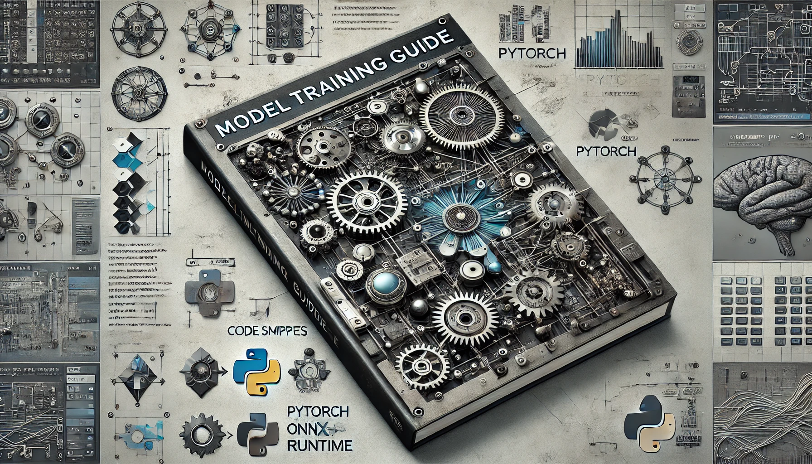

プロジェクト開発において、開発者の個々の習慣やニーズが異なるため、モデルの設定方法もさまざまです。より良い協力を実現するために、私たちは基盤モジュールを共同で維持し、それに基づいて異なるニーズに対応するモデル訓練方法を派生させることを決定しました。

基盤モジュールは以下の 2 つの主要部分に分かれています：

1. [**Capybara**](https://github.com/DocsaidLab/Capybara)：ONNXRuntime と OpenCV を含み、主に推論に使用され、基本的な画像処理機能を実現します。
2. [**Chameleon**](https://github.com/DocsaidLab/Chameleon)：PyTorch モジュールに基づき、主に深層学習モデルの訓練に使用されます。

一部の開発者は Pytorch-Lightning フレームワークを好む一方で、他の開発者は Huggingface やその他のフレームワークに精通している場合があるため、モデル訓練の具体的な実装には違いがあります。

私たちは、開発者が自分のニーズに応じて適切なツールと方法を選択し、その経験や成果を共有することを奨励し、支援しています。

今後、さらに多くの開発者が最善の実践や知見を共有し、このモデル訓練ガイドを継続的に改善していくことを目指しています。

---



---

```mdx-code-block
import DocCardList from '@theme/DocCardList';

<DocCardList />
```
