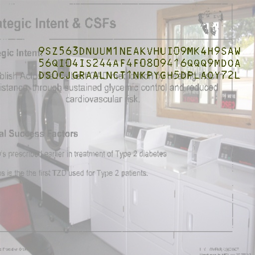
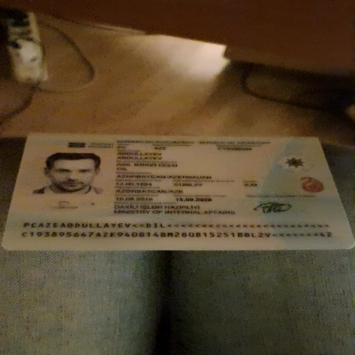

# データセットの説明

MRZ 画像には証明書のデータが含まれているため、十分な訓練データを集めるのは非常に難しいです。

そのため、最初から実際のデータを使用するつもりはなく、全て合成データセットを使用しています。私たちは自分たちで合成データセット生成ツールを作成し、さまざまな MRZ フォーマットを生成できるようにし、文字の内容、フォント、サイズ、色なども制御できるようにしました。

## 訓練データセット

私たちは訓練モジュールを公開していませんが、独自に作成した合成データセットは GitHub に公開しています：

- [**MRZScanner/dataset/train_dataset.py**](https://github.com/DocsaidLab/MRZScanner/blob/main/dataset/train_dataset.py)

使用を開始する前に、読者が行うべきことがいくつかあります：

1. `MIT Indoor Scenes` データセットをダウンロード：[**MIT Indoor Scenes**](https://www.kaggle.com/datasets/itsahmad/indoor-scenes-cvpr-2019)

   このデータセットは背景画像として使用します。ダウンロードした後、任意の場所に保存し、データ生成ツールを実行するときにそのパスを指定してください。

---

2. `DocVQA` データセットをダウンロード：[**DocVQA**](https://www.docvqa.org/)

   MRZ が含まれる文書には通常多くの他の文字が含まれているため、こうした無関係な文字を適切に模倣することはモデルの訓練に有用です。

   同様に、ダウンロード後、任意の場所に保存し、データ生成ツールを実行する際にそのパスを指定してください。

   :::tip
   **注意：** これらの 2 つのデータセットを一緒に保存する必要があります。指定できるパスは 1 つしかありませんので、忘れずに配置してください。
   :::

---

3. モジュールをインストール：[**WordCanvas Github**](https://github.com/DocsaidLab/WordCanvas)

   合成データセットは、別のモジュール`WordCanvas`に依存しているため、まずはそのインストールを完了させてください。

   - [**WordCanvas Docs**](../wordcanvas/intro.md)

    <figure style={{width: "80%"}}>
   
    </figure>

---

これらのステップを完了した後、データセットの生成を開始できます。

使用方法は以下の通りです：

```python
import cv2
import docsaidkit as D
from train_dataset import MRZDataset

ds = MRZDataset(
    root='/data/Dataset', # 自分のデータセットパスに変更
    image_size=(512, 512),
    aug_ratio=1.0,
    return_tensor=True, # PyTorch Tensorに変換
    length_of_dataset=1000000, # データセットのサイズを指定
)
```

訓練データセットから返される値は多く、こちらを確認してみましょう：

```python
img, gt, poly, fixed_points, mrz_points_hmap, mrz_region_hmap = ds[0]
```

:::tip
`idx=0`を指定していますが、実際には`MRZDataset`はランダムにデータを生成するため、毎回実行結果が異なります。
:::

---

### 1. img

最初に表示されるのは`img`です。これを直接表示してみましょう：

<figure align="center">

</figure>

### 2. gt

出力される`gt`は文字列で、`split`関数を使って分割できます。

デフォルトでは、MRZ は`&`で分割されます：

```python
print('GT original:', gt)
# >>> GT original: 9SZ563DNUUM1NEAKVHUI09MK4H9SAW&56QI04IS244AF4F0809416QQQ9MDOA&DS0CJGRAALNCT1NKPYGH5DPLAOY72L

print('GT:', gt.split('&'))
# >>> GT: ['9SZ563DNUUM1NEAKVHUI09MK4H9SAW',
#          '56QI04IS244AF4F0809416QQQ9MDOA',
#          'DS0CJGRAALNCT1NKPYGH5DPLAOY72L']
```

文字認識モデルを使う場合、この文字列がラベルになります。

### 3. poly

`poly`は MRZ 領域の 4 つの点で、これを描画してみましょう：

```python
import docsaidkit as D

poly_img = D.draw_polygon(img.copy(), poly, color=(0, 255, 0))
D.imwrite(poly_img, 'poly.jpg')
```

<figure align="center">

</figure>

区域認識モデルを作成する場合、この 4 つの点がラベルになります。

### 4. fixed_points

データセット生成ツールは TD1, TD2, TD3 の 3 つの MRZ フォーマットを生成します。それぞれの文字数が異なるため、出力されたデータの長さを一定に保つために`fixed_points`が使用されます。そうしないと、PyTorch はエラーを発生させてしまいます。

ここで使用される点は各文字の中心点で、最も長い TD1 フォーマットに基づいて出力文字列の長さは 90 になります。

これを描画してみましょう：

```python
import docsaidkit as D

point_img = img.copy()
for p in fixed_points:
    if p[0] == 0 and p[1] == 0:
        break
    cv2.circle(point_img, (int(p[0]), int(p[1])), 2, (0, 0, 255), -1)

D.imwrite(point_img, 'points.jpg')
```

<figure align="center">

</figure>

文字点を正確に認識するためには、これらの点をラベルとして使用できます。

### 5. mrz_points_hmap

`mrz_points_hmap`は MRZ 内の「各文字中心点」の領域を示すヒートマップです：

<figure align="center">

</figure>

キーポイント検出方法を使用する場合、このヒートマップを監視して訓練します。

### 6. mrz_region_hmap

`mrz_region_hmap`は MRZ 文字領域のバイナリ画像です。これを描画してみましょう：

<figure align="center">

</figure>

分割モデルを使用する場合、この画像を監視して訓練します。

### 小結

これでこのデータセットに関するすべての情報が揃いました。背景となるデータセットを ImageNet のようなものに変更することもできます。文字ノイズの部分も、他のテキストを含むデータセットで置き換えることができます。

---

合成データセットで訓練したモデルは、汎化能力が不足する可能性があります。なぜなら、実際のシーンと合成されたシーンには大きな違いがあるからです。

私たちの実験結果では、合成データで訓練したモデルは、実際のシーンの検証セットで約 97％の ANLS と 30％の ACC を達成しました。

この数値の意味は、モデルが 97％の MRZ 領域内の文字を見つけることができるということです。しかし、MRZ 領域内の文字が 72 文字以上あるため、すべての文字が正確でないと「正しい」と見なされません。

「完全に正しい」結果を得るのは非常に難しいです。

:::tip
私たちが準備した検証データはすべて`DocAligner`モジュールで補正され、MRZ 領域の傾斜角度が 5 度以内であることを確認しています。

このように「精密に調整された」データでも、30％の精度しか達成できません。したがって、合成データセットだけでは十分ではありません。
:::

## 微調整データセット

MIDV-2020 データセットを使用しました。これは MRZ 画像を合成データセットで生成しており、文字の変化は少ないですが、非常に美しい画像が作られています。このデータセットを使用してモデルを微調整できます。

以下のコードで、MIDV-2020 データセット内の MRZ を含む画像を抽出しました：

- [**MRZScanner/dataset/finetune_dataset.py**](https://github.com/DocsaidLab/MRZScanner/blob/main/dataset/finetune_dataset.py)

使用を開始する前に、以下のことを完了させてください：

1. `MIDV-2020` データセットをダウンロード：[**MIDV-2020**](http://l3i-share.univ-lr.fr/MIDV2020/midv2020.html)

   必ずダウンロードしてください。そうでないと、データがありません。ダウンロード後、任意の場所に保存し、データ生成ツールを実行するときにそのパスを指定してください。

---

これらのステップを完了した後、データセットの生成を開始できます。

使用方法は以下の通りです：

```python
import docsaidkit as D
from finetune_dataset import MRZFinetuneDataset

ds = MRZFinetuneDataset(
    root='/data/Dataset', # データセットのパスに変更
    image_size=(512, 512),
    aug_ratio=1.0,
    return_tensor=True, # PyTorch Tensorに変換
)
```

微調整データセットから返される値は 2 つだけです：

```python
img, gt = ds[1]
```

以上です！画像とラベルだけです、他の情報はありません。

:::tip
これが、最終的に訓練したモデルが文字監視のみを使用し、他の補助分岐を使用しなかった理由です。微調整データセットには通常、文字だけしかなく、他の情報はないので、どんな補助分岐を使っても微調整段階では効果がありません。
:::

---

### 1. img

特に言うことはありませんが、画像を表示してみましょう：

<figure align="center">

</figure>

### 2. gt

元の`gt`は文字列で、そのまま表示できます：

```python
print('GT:', gt)
# >>> GT: PCAZEABDULLAYEV<<DIL<<<<<<<<<<<<<<<<<<<<<<<<C193895647AZE9408148M28081525188L2V<<<<<<<42

print('GT:', gt.split('&'))
# >>> GT: ['PCAZEABDULLAYEV<<DIL<<<<<<<<<<<<<<<<<<<<<<<<',
#          'C193895647AZE9408148M28081525188L2V<<<<<<<42']
```

## 訓練戦略

データセットについて話したので、次に訓練戦略について話しましょう。

私たちは合成データセットで事前訓練を行い、以下のようにパラメータを設定しました：

```python
ds = MRZDataset(
    root='/data/Dataset',
    image_size=(512, 512),
    aug_ratio=1.0,
    return_tensor=True,
    length_of_dataset=640000,
)
```

100 エポックで訓練を行い、AdamW オプティマイザを使用、Weight Decay は 1e-5、学習率は 1e-4 に設定し、線形減衰スケジュールを使用しました。学習率は最初の 10 エポックで線形に増加し、その後、線形に減少します。

事前訓練が終了したら、微調整データセットを使用して微調整を行います。パラメータは以下の通りです：

```python
ds = MRZFinetuneDataset(
    root='/data/Dataset',
    image_size=(512, 512),
    aug_ratio=1.0,
    return_tensor=True,
)
```

微調整には AdamW オプティマイザを使用、Weight Decay は 1e-1、学習率は 1e-6 に設定します。

検証データのパフォーマンスが上昇しなくなった時点で訓練を停止します。

---

Weight Decay の設定が少し奇妙に見えるかもしれませんが、以下の理由で説明できます：

1. 訓練段階では、合成データの多様性が高いため、識別が難しく、比較的小さなモデルで学習しているため、Weight Decay を高く設定しすぎると、過剰な正則化が生じます。
2. 微調整段階では、データの多様性が少ないため、より強い正則化が必要です。
