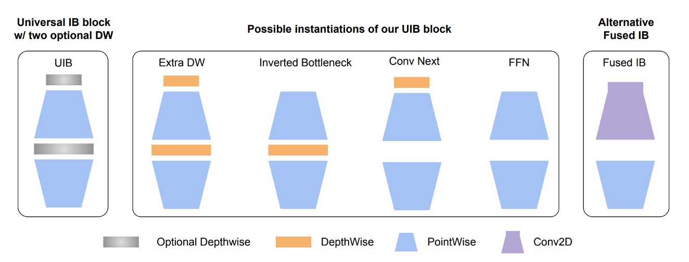

# モデル設計

天下本無事，庸人自擾之。

そう、私たちは自分で問題を作ってしまいました。面倒だと感じながらも、面白いとも感じています。

## 二段階認識モデル

:::info
テスト段階では、端から端までの一段階モデルを公開しています。

位置決定と認識を分けた二段階モデルは現在公開していませんが、V1.0 の安定版で後日公開予定です。

それでも、具体的なアプローチについてはここで議論しましょう。
:::

二段階モデルは、MRZ 認識を二つの段階に分ける方法です：位置決定と認識。

このアプローチに基づき、関連するモデルを設計し始めることができます。まず、位置決定モデルから見てみましょう。

### 位置決定モデル

MRZ 領域の位置決定はおおむね 2 つのアプローチに分かれます：

1. **MRZ 領域のコーナーを特定する：**

   

   <figure style={{"width": "50%"}}>
   
   <figcaption>画像出典：[**MIDV-2020 合成データセット**](http://l3i-share.univ-lr.fr/MIDV2020/midv2020.html)</figcaption>
   </figure>
   

   これは以前に行った書類位置決定プロジェクトと似ていますが、ここでは書類の代わりに MRZ 領域を使用しています。

   書類の位置決定ではコーナーは「実際に」画像上に存在し、モデルが「想像する」必要はありません。しかし、MRZ 領域ではモデルがそのコーナーを「予測」しなければならず、これは非常に不安定で、パスポートを少しでも動かすと、予測したコーナーが MRZ 領域の周りでランダムに動いてしまいます。

   ***

2. **MRZ 領域の分割：**

    

    <figure style={{"width": "50%"}}>
    
    <figcaption>画像出典：[**MIDV-2020 合成データセット**](http://l3i-share.univ-lr.fr/MIDV2020/midv2020.html)</figcaption>
    </figure>
    

   この方法は安定しており、分割モデルを使用して MRZ 領域を直接予測できます。MRZ 領域上の文字は実際に画像に存在しているため、モデルは「余計な」推測を行う必要はありません。これにより、MRZ 領域を直接分割し、コーナーの問題を心配することなく進めることができます。

---

私たちは分割方法を採用しました。

実際の使用シーンでは、ユーザーが持つパスポートは傾きがあることが多いため、MRZ 領域を正しい矩形に補正する必要があります。

損失関数については、以下のレビュー論文を参考にしました：

- [**[20.06] A survey of loss functions for semantic segmentation**](https://arxiv.org/abs/2006.14822)

この論文では、過去数年間に提案されたさまざまなセマンティックセグメンテーションの損失関数について統一的に比較と紹介を行い、現存する問題に対する解決策として**Log-Cosh Dice Loss**を提案しています。

興味がある方は、この論文を参照してください。ここでは詳細を省略します。

### 認識モデル

認識モデルは比較的シンプルです。すでに MRZ 領域を分割しているため、この領域を文字認識モデルに渡すだけで最終的な結果を得ることができます。

この段階では、いくつかの設計方向があります：

1. **文字列を分割して逐一認識する：**

   一部の MRZ は 2 行の文字列（例えば TD2 と TD3 フォーマット）、または 3 行の文字列（例えば TD1 フォーマット）です。これらの文字を逐一分割して認識できます。

   認識モデルは、文字列画像を文字に変換する処理を行います。この方法には、CRNN+CTC や現在流行している CLIP4STR など、さまざまな手法を使用できます。

2. **MRZ 領域全体の画像を一度に認識する：**

   MRZ 領域のアスペクト比はほとんど変わらないため、MRZ 領域全体を切り取って、一度にその画像を認識することが可能です。この場合、Transformer モデルを使用するのが特に適しています。

   例えば、Transformer Encoder アーキテクチャを使用する場合、モデル設計は以下のようになります：

    

    <figure style={{"width": "50%"}}>
    
    </figure>
    

   自己注意メカニズムにより、複数のトークンが同じ文字に指向する可能性があります。この場合、一般的なデコーディング方法ではモデルが混乱することがあります。なぜなら、明らかに文字の画像であるにもかかわらず、なぜ別の文字として解読されるのかが不明確だからです。

   ここでは、CTC 方式で文字解読を行う方が効果的です。なぜなら、各トークンは「特定の」文字領域の画像から来ているため、最終段階で出力結果を統合することで最終的な文字結果を得ることができます。

   ***

   CTC が面倒だと感じる場合は、Encoder-Decoder 構造を採用し、モデル設計は以下のようにできます：

    <figure>
    
    </figure>

   この方法では、文字列を直接解読することができ、CTC を経由する必要はありません。Decoder への入力トークンは文字のクエリであり、各トークンは順番通りに文字を見つけ出す役割を担います。

   :::tip
   この Decoder は並列に出力でき、自回帰的な方式は必要ありません。自回帰方式は、前回の予測結果を基に次の予測を行う必要がある場合に使用されます。

   ここではそのような操作は必要ないと考えています。

   仮に、最初の位置で予測された文字が何であれ、2 番目の位置の予測結果には影響しません。すべての客観的な結果は Encoder の出力内に既に含まれており、Decoder の仕事はそれらを単にクエリして取り出すことです。
   :::

### 誤差伝播

この時点で、コーナーの問題について再度議論できます。

すべての二段階モデルは共通の問題に直面します：**誤差伝播**。

私たちは、世の中に 100％正確なモデルが存在しないことを理解しています。なぜなら、統計母集団を完全にモデル化することはできず、どんな規則にも例外があるからです。どんなモデルにも誤差があるということです。

- **コーナーの予測が不正確であること**

コーナーの予測が不正確であるため、補正された MRZ 領域も不正確になります。MRZ 領域が不正確であるため、文字認識も不正確になります。これが誤差伝播の典型的な例です。

## 単段階認識モデル

単段階認識の主な課題は、多スケール特徴です。

MRZ 領域は、ユーザーの撮影角度によって変化するため、文字検出を行う前に、画像を多スケールで処理する必要があります。

### モデルアーキテクチャ

### Backbone

最近、Google が新しい論文**MobileNet-V4**を発表しました。このモデルはモバイルデバイス向けに最適化されており、私たちにとって非常に良いニュースです。これをそのまま利用します。

今回は、これをバックボーンとして使用し、timm の事前学習済みの重みを使用し、入力画像サイズは 512 x 512 の RGB 画像に設定します。

- [**[24.04] MobileNet-V4: 時隔五年的傳承**](https://docsaid.org/ja/papers/lightweight/mobilenet-v4/)
- [**huggingface/pytorch-image-models**](https://github.com/huggingface/pytorch-image-models)

:::tip
テスト結果によると、画像解像度が 512 x 512 の場合、各 MRZ の文字サイズはおおよそ 4~8 ピクセルです。解像度を下げすぎると、MRZ 領域の文字がぼやけ、認識精度が低下します。
:::

### Neck

多スケール特徴をより良く融合するために、BiFPN を導入しました。コンテキスト情報が双方向に流れることで、特徴の表現力が強化されます。BiFPN は多尺度で語義が強い特徴マップを生成し、異なるスケールのオブジェクトを捉えるのに非常に効果的です。この特徴マップは最終的な予測精度に良い影響を与えます。

実験では、この部分を取り除いてバックボーンから直接特徴マップを使用しましたが、トレーニングがうまくいきませんでした。

- [**[19.11] EfficientDet: BiFPN 才是本體**](https://docsaid.org/papers/feature-fusion/bifpn/)

### Patchify

ここからは、私たちの独自のアイデアが入ってきます。

---

まず、各ステージの特徴マップを Transformer の入力形式に変換する必要があります。ここでは通常の畳み込み操作を使用し、特徴マップを個別のパッチに変換しています。

以下は私たちの設定のいくつかです：

1. **パッチサイズ：4 x 4。**

   MRZ 領域内の文字サイズを手動で測定した結果、小さい文字は約 4~8 ピクセルです。それより小さくすると文字が読めなくなります。大きい文字は撮影距離に依存するため、サイズが固定されていません。このため、パッチサイズは 4 x 4 に設定しました。

2. **各特徴マップに対応するパッチ埋め込みと位置埋め込みが一組ずつある。**

   各特徴マップのスケールが異なるため、共通の埋め込みを使うことはできません。共通の埋め込みを設計することも考えましたが、実装が難しいため、現在はこのアイデアを放棄しています。

   私たちは共有された重みを用いたパッチ埋め込みを試しましたが、効果が薄かったです。

### Cross-Attention

最後に、文字認識のために Cross-Attention を使用しました。

93 個のトークンをランダムに初期化しました。

- **なぜ 93 個なのか？**

これは、最長の MRZ 形式である TD1 が 90 文字で構成されているためです。さらに、TD1 には 3 行があり、2 つの「区切り」文字が必要です。最後に、「終了」文字が必要で、合計で 93 個です。

接続文字は`&`、終了文字は`[EOS]`としました。余った位置には`[EOS]`を配置し、その後の文字は監視せず、モデルが予測した内容をそのまま受け入れます。

---

Transformer デコーダーの基本設定は以下の通りです：

- 次元数：256
- 層数：6
- 注意力ヘッド数：4
- ドロップアウト：0
- 正規化：Post-LN

このアーキテクチャの主な設計理念は、「多スケール」特徴空間をデコーダーに提供することです。これにより、デコーダーは異なるスケールの特徴を自由に選択して文字認識を行えます。

### さらに続きます

実験中にいくつか記録したことがあり、ここで共有します。これが参考になるかもしれません。

1. **64 次元と 128 次元のモデルは収束しますが、次元を半分にするたびに収束速度が倍増します。**

   私たちのトレーニング機器は RTX4090 で、256 次元モデルのトレーニングに約 50 時間、128 次元のモデルで 100 時間、64 次元のモデルで 200 時間かかりました。

   512 次元は試しませんでした。なぜなら、そうするとモデルが大きすぎて 100MB を超えてしまうからです。

---

2. **追加の分岐（例えばポリゴンや文字の中心位置）を追加すると、モデルの収束速度が向上します。**

   しかし、実際には使いにくいです！データ収集がすでに難しく、MRZ 領域を見つけてそのデータにラベル付けする作業が大変です。

   最終的に収束結果は似ており、全体の貢献度は大きくありません。

---

3. **Neck を取り除く。**

   収束は可能ですが、時間が 3 倍かかります。慎重に考える必要があります。

---

4. **位置エンコーディングを取り除く。**

   収束しません。

---

5. **Weight Decay を$10^{-5}$から$10^{-2}$に調整。**

   収束は早くなりますが、汎化能力が低下します。

   小さなモデルは自然に正則化効果があるため、強い Weight Decay は必要ありません。

---

6. **Pre-LN を使用。**

   収束は早くなりますが、汎化能力が低下します。

   Pre-LN はモデルの深さをある程度制限するため、小さなモデルには向いていません。

---

7. **さらに多くの画像増強を行う。**

   実験を加速するため、MRZ 画像の回転角度を ±45 度に制限しました。

   全方位の回転やその他の画像増強を試しましたが、この規模のモデルではこれほど多くの画像増強には耐えられず、収束しませんでした。

## 結論

現時点では、単一段階モデルの設計にはいくつか重要な要素が欠けており、今後さらに多くの文献を読み、実験を重ねていく必要があります。

モデルの規模を大きくすることが最も効果的な方法であると思われますが、「軽量」なパラメータ規模でこれらすべての要件を満たす方法を考える必要があります。

ただし、先に述べたように、二段階の解決策を使用すれば、ほとんどすべてのシナリオで安定した結果が得られます。実際に取り組みたいのであれば、二段階モデルを開発することをお勧めします。
