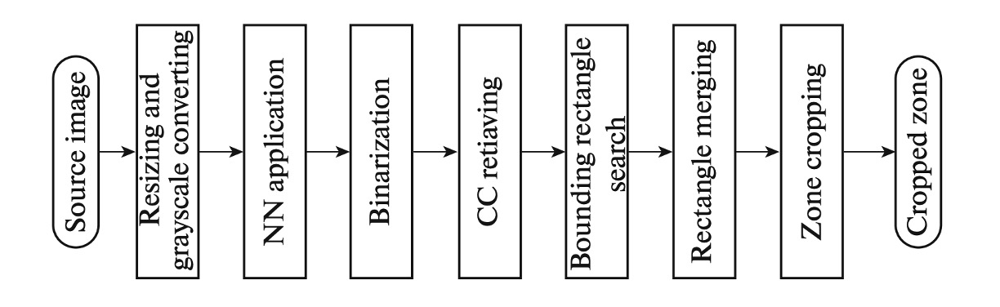

# 参考文献

このテーマに関する論文は少ないですが、研究の基盤となるいくつかの代表的な論文を紹介します。

## 研究論文

- [**[20.03] Machine-Readable Zones Detection in Images Captured by Mobile Devices’ Cameras**](https://www.researchgate.net/publication/344847851_Machine-Readable_Zones_Detection_in_Images_Captured_by_Mobile_Devices'_Cameras)

  - 本論文では、モバイルデバイスのカメラで撮影された画像における機械可読領域（MRZ）の検出方法を提案しています。この方法は、黒い連結領域の中心分布を分析し、文書の方向を取得することで回転不変性を実現します。アルゴリズムは MRZ の特徴に一致するパスを探索し、クラスタリング後に最も一貫性のあるクラスタを選択し、そのクラスタを囲む四角形を結果として出力します。テストの結果、この方法は既存の技術に比べて顕著な向上が見られ、計算複雑度も低いため、モバイルデバイスでリアルタイムで動作します。

- [**[20.09] MRZ code extraction from visa and passport documents using convolutional neural network**](https://arxiv.org/abs/2009.05489)

  - 本論文では、任意の方向やサイズのパスポートのデジタル画像から機械可読領域（MRZ）情報を成功裏に抽出するための畳み込みニューラルネットワーク（CNN）ベースのモデルを提案しています。従来のコンピュータビジョン手法、例えば光学文字認識（OCR）ではパスポート上の MRZ 情報を正確に抽出することが難しいが、このモデルはその問題を克服しています。パスポートとビザのデータセットで、モデルは 100％の MRZ 検出率と 98.36％の文字認識 Macro-F1 スコアを達成し、文書の真正性検証において優れた性能を示しました。

    

- [**[22.12] Hough Encoder for Machine Readable Zone Localization**](https://www.researchgate.net/profile/Vladimir-Arlazarov/publication/366599215_Hough_Encoder_for_Machine_Readable_Zone_Localization/links/64e58a6f0453074fbda7a98c/Hough-Encoder-for-Machine-Readable-Zone-Localization.pdf)

  - 本論文では、神経ネットワークと画像処理を組み合わせた軽量かつ高精度な MRZ 位置決定手法を提案しています。このネットワークは、入力画像を処理し、MRZ 文字のヒートマップを生成し、連結領域解析を通じて文字を行に結合し、MRZ の境界ボックスをさらに評価します。私たちは、投影歪みを処理するために特別に設計された Hough エンコーダの軽量バージョンを採用しました。典型的な自己符号化器と比較して、このネットワークは 100 倍小さく、合成データセットで優れた性能を示し、Unet 解決策よりもパラメータ数が少ないです。

    

- [**[23.06] MobileMRZNet: Efficient and Lightweight MRZ Detection for Mobile Devices**](https://www.researchgate.net/figure/MRZ-region-in-simulated-Turkish-ID-document-and-decomposition-of-the-MRZ-region_fig1_371323943)

  - 本論文では、BlazeFace モデルに基づいた高速かつ軽量な MRZ 検出方法 MobileMRZNet を提案しており、モバイル GPU 向けに設計されています。このモデルは、実際とシミュレーションデータからなるトルコの ID カードデータセットで訓練され、優れた汎化能力を示しました。テストでは、約 81％の IoU 精度を達成し、3 フレーム内で 100％の文字認識精度を実現しました。このモデルは約 400KB のサイズで、モバイルデバイスでの動作時間は 10 ミリ秒未満です。

    

## ICAO 9303

- [**Part 1: Introduction**](https://www.icao.int/publications/Documents/9303_p1_cons_en.pdf)
- [**Part 2: Specifications for the Security of the Design, Manufacture and Issuance of MRTDs**](https://www.icao.int/publications/Documents/9303_p2_cons_en.pdf)
- [**Part 3: Specifications Common to all MRTDs**](https://www.icao.int/publications/Documents/9303_p3_cons_en.pdf)
- [**Part 4: Specifications for Machine Readable Passports (MRPs) and other TD3 Size MRTDs**](https://www.icao.int/publications/Documents/9303_p4_cons_en.pdf)
- [**Part 5: Specifications for TD1 Size Machine Readable Official Travel Documents (MROTDs)**](https://www.icao.int/publications/Documents/9303_p5_cons_en.pdf)
- [**Part 6: Specifications for TD2 Size Machine Readable Official Travel Documents (MROTDs)**](https://www.icao.int/publications/Documents/9303_p6_cons_en.pdf)
- [**Part 7: Machine Readable Visas**](https://www.icao.int/publications/Documents/9303_p7_cons_en.pdf)
- [**Part 8: Emergency Travel Documents**](https://www.icao.int/publications/Documents/9303_p8_cons_en.pdf)
- [**Part 9: Deployment of Biometric Identification and Electronic Storage of Data in MRTDs**](https://www.icao.int/publications/Documents/9303_p9_cons_en.pdf)
- [**Part 10: Logical Data Structure (LDS) for Storage of Biometrics and Other Data in the Contactless Integrated Circuit (IC)**](https://www.icao.int/publications/Documents/9303_p10_cons_en.pdf)
- [**Part 11: Security Mechanisms for MRTDs**](https://www.icao.int/publications/Documents/9303_p11_cons_en.pdf)
- [**Part 12: Public Key Infrastructure for MRTDs**](https://www.icao.int/publications/Documents/9303_p12_cons_en.pdf)
- [**Part 13: Visible Digital Seals**](https://www.icao.int/publications/Documents/9303_p13_cons_en.pdf)

## チェックデジット

機械可読区域（MRZ）は、パスポート、ビザ、およびその他の証明書の一部であり、機械が重要な情報を迅速に読み取るために使用されます。このデータの正確性と完全性を確保するため、MRZ には通常、チェックデジット（Check Digit）が添付されています。チェックデジットは、入力や読み取りプロセスでの誤りを検出するための数字と文字の検証メカニズムです。計算過程は一見複雑ですが、基本的な原理は規則的な手順に分解できます。

### チェックデジット計算のステップ

1. **文字を数値に変換する**
   チェックデジットの計算は、MRZ の文字を数値に変換することから始まります。各文字に対応する数値は以下の通りです：

   - **数字（0-9）**：そのまま数値として使用されます。
   - **アルファベット（A-Z）**：アルファベットはアルファベット順で数値に変換されます。例えば、`A`は数値 10、`B`は 11、`Z`は 35 になります。
   - **特殊記号**：MRZ で一般的に使用される記号である`<`は占位文字として、数値`0`に対応します。

2. **重み付けの適用**
   チェックデジットの計算には、各文字の数値に重みを掛ける必要があります。重みは固定の順序で循環します：

   - 最初の文字には 7 を掛けます。
   - 次の文字には 3 を掛けます。
   - 次の文字には 1 を掛けます。
   - 次の文字には再び 7 を掛け、以下続きます。

3. **全ての積を合計する**
   文字の数値に重みを掛けた結果を全て合計します。

4. **モジュロ演算**
   合計値を 10 で割った余りを求め、その余りがチェックデジットとなります。余りが`0`の場合はチェックデジットは`0`、`1`から`9`の余りの場合はその余りがチェックデジットとなります。

### チェックデジット計算の例

例えば、以下の MRZ 文字列を使って計算してみましょう：`123ABC<`。

1. **文字を数値に変換**：

   - `1` -> 1
   - `2` -> 2
   - `3` -> 3
   - `A` -> 10
   - `B` -> 11
   - `C` -> 12
   - `<` -> 0

2. **重みを適用**：

   - `1 × 7 = 7`
   - `2 × 3 = 6`
   - `3 × 1 = 3`
   - `10 × 7 = 70`
   - `11 × 3 = 33`
   - `12 × 1 = 12`
   - `0 × 7 = 0`

3. **積を合計**：

   - 7 + 6 + 3 + 70 + 33 + 12 + 0 = 131

4. **10 で割った余り**：
   - 131 % 10 = 1

チェックデジットは`1`となります。

チェックデジットは、データ入力エラーや読み取りエラーを検出するために使用されます。パスポート、ビザなどの証明書の MRZ 部分では、各重要なフィールドにチェックデジットが付けられています。
