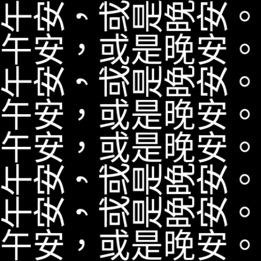

# 高度な使用法

基本的な使用法に加えて、`WordCanvas` では出力される文字画像をさらに柔軟にコントロールできる高度な設定も提供しています。ここでは、主にモデルの訓練に使われるランダム性の設定を紹介します。

## ランダムフォント

`random_font` パラメータを有効にすることで、ランダムフォント機能を使用できます。`random_font` を `True` に設定した場合、`font_bank` パラメータが有効になり、`font_path` は無視されます。

`font_bank` にはフォントのライブラリのパスを指定してください。デフォルトでは `fonts` ディレクトリが設定されており、そこに 2 つのフォントが事前に配置されています。`font_bank` を変更しない場合、この 2 つのフォントからランダムに選ばれます。

```python
import numpy as np
from wordcanvas import WordCanvas

gen = WordCanvas(
    random_font=True,
    output_size=(64, 512),
    font_bank="path/to/your/font/bank"
)

imgs = []
for _ in range(8):
    text = 'Hello, World!'
    img, infos = gen(text)
    imgs.append(img)

# すべての画像を結合して出力
img = np.concatenate(imgs, axis=0)
```


## ランダムな文字列内容

生成する文字列が決まらない場合、`random_text` パラメータを使用できます。

`random_text` を `True` に設定すると、入力した `text` は無視され、ランダムな文字列が生成されます。

```python
import numpy as np
from wordcanvas import WordCanvas

gen = WordCanvas(
    random_text=True,
    output_size=(64, 512),
)

imgs = []
for _ in range(8):
    text = 'Hello!World!'  # この入力は無視されます
    img, infos = gen(text)
    imgs.append(img)

# すべての画像を結合して出力
img = np.concatenate(imgs, axis=0)
```


## 文字列長の指定

`random_text` を有効にした場合、以下のパラメータで文字列の長さを指定できます：

- `min_random_text_length`: 最小文字列長
- `max_random_text_length`: 最大文字列長

```python
import numpy as np
from wordcanvas import WordCanvas

# 文字列長さを固定して5文字に設定
gen = WordCanvas(
    random_text=True,
    min_random_text_length=5,
    max_random_text_length=5,
    output_size=(64, 512),
)

imgs = []
for _ in range(8):
    img, infos = gen()
    imgs.append(img)

# すべての画像を結合して出力
img = np.concatenate(imgs, axis=0)
```


## ランダムな背景色

`random_background_color` パラメータを有効にすることで、ランダムな背景色を使用できます。

```python
import numpy as np
from wordcanvas import WordCanvas

gen = WordCanvas(
    random_background_color=True,
    output_size=(64, 512),
)

imgs = []
for _ in range(8):
    text = 'Hello, World!'
    img, infos = gen(text)
    imgs.append(img)

# すべての画像を結合して出力
img = np.concatenate(imgs, axis=0)
```


## ランダムな文字色

`random_text_color` パラメータを有効にすることで、ランダムな文字色を使用できます。

```python
import numpy as np
from wordcanvas import WordCanvas

gen = WordCanvas(
    random_text_color=True,
    output_size=(64, 512),
)

imgs = []
for _ in range(8):
    text = 'Hello, World!'
    img, infos = gen(text)
    imgs.append(img)

# すべての画像を結合して出力
img = np.concatenate(imgs, axis=0)
```


## ランダムな文字整列

`random_align_mode` パラメータを有効にすることで、ランダムな文字整列を使用できます。

```python
import numpy as np
from wordcanvas import WordCanvas

gen = WordCanvas(
    random_align_mode=True,
    output_size=(64, 512),
)

imgs = []
for _ in range(8):
    text = 'Hello, World!'
    img, infos = gen(text)
    imgs.append(img)

# すべての画像を結合して出力
img = np.concatenate(imgs, axis=0)
```


## ランダムな文字方向

`random_direction` パラメータを有効にすることで、ランダムな文字方向を使用できます。

このパラメータは、`output_direction` と一緒に使用することをお勧めします。

```python
import numpy as np
from wordcanvas import WordCanvas, OutputDirection

gen = WordCanvas(
    random_direction=True,
    output_direction=OutputDirection.Horizontal,
    output_size=(64, 512),
)

imgs = []
for _ in range(8):
    text = '午安，或是晚安。'
    img, infos = gen(text)
    imgs.append(img)

# すべての画像を結合して出力
img = np.concatenate(imgs, axis=0)
```



## 完全ランダム

すべての設定をランダムにしたい場合は、`enable_all_random` パラメータを使用できます。

このパラメータを有効にすると、すべての設定がランダムになります。

```python
import numpy as np
from wordcanvas import WordCanvas

gen = WordCanvas(
    enable_all_random=True,
    output_size=(64, 512),
)

imgs = []
for _ in range(20):
    img, infos = gen()
    imgs.append(img)

# すべての画像を結合して出力
img = np.concatenate(imgs, axis=0)
```


:::warning
このパラメータは、`reinit` シリーズのパラメータ（`random_font`、`random_text` など）には影響しません。これらのパラメータは自分で設定する必要があります。
:::

## ダッシュボード

再度ダッシュボードを紹介します。


ランダム性の関連パラメータが有効な場合、`True` のパラメータは緑色、`False` のパラメータは赤色で表示されます。

この設計を通じて、設定を迅速に確認できるようにしています。

## フォントの重み

:::tip
この機能は 0.2.0 版で追加されました。
:::

フォントによってサポートされる文字数が異なるため、モデルを訓練する際にフォントの重みが不均等になる問題が発生することがあります。

簡単に言うと、フォントをランダムに選択する際の確率は均等であるものの、一部の文字は少数のフォントしかサポートしていないため、それらの文字がほとんど訓練されないという現象です。

この問題を緩和するために、`use_random_font_weight` パラメータを導入しました。

```python
import numpy as np
from wordcanvas import WordCanvas

gen = WordCanvas(
    random_font=True,
    use_random_font_weight=True,
    output_size=(64, 512),
)
```

このパラメータを有効にすると、`WordCanvas` はフォントがサポートする文字数に基づいてフォント選択の確率を調整します。フォントがサポートする文字が少ないほど、選ばれる確率は低くなり、均等な配分が実現されます。

ただし、この方法には改善の余地があります。文字の出現頻度を基に選択の重みを設定する方法がより良いと考えています。この機能は 0.5.0 版で公開予定です。

## ブロックリスト

:::tip
この機能は 0.4.0 版で追加されました。
:::

フォントを使用する際、時々フォントの文字リストに不整合があることが判明しました。

例えば、フォントファイルからそのフォントがサポートする文字リストを読み取っても、実際に使おうとするといくつかの文字が正しく描画されないことがあります。

これに対処するため、私たちは「ブロックリスト」機能を開発しました。これを使うと、これらのフォントを排除することができます。

`block_font_list` パラメータを使ってブロックリストを設定してください：

```python
import numpy as np
from wordcanvas import WordCanvas

gen = WordCanvas(
    random_font=True,
    use_random_font_weight=True,
    block_font_list=['block_font_name']
)
```

## まとめ

ツールを開発する過程で、私たちはさまざまなランダム性を加えることで、実際のシナリオに対応できるようにしています。これにより、モデルの適応性と汎用性が向上し、訓練が効率的に行えるようになります。
